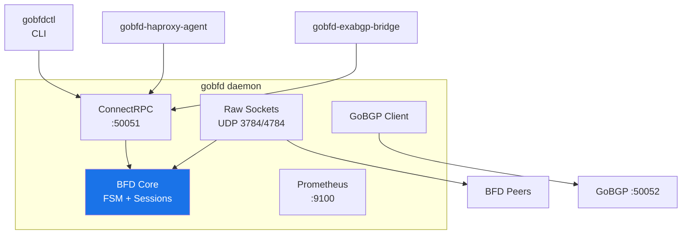

<p align="center">
  <strong>GoBFD</strong><br>
  Production-grade BFD protocol daemon for Go
</p>

<p align="center">
  <a href="https://github.com/dantte-lp/gobfd/actions/workflows/ci.yml"></a>
  <a href="https://goreportcard.com/report/github.com/dantte-lp/gobfd"></a>
  
  
  
  <a href="https://github.com/dantte-lp/gobfd/blob/master/LICENSE"></a>
  <br>
  <a href="https://github.com/dantte-lp/gobfd/actions/workflows/security.yml"></a>
  <a href="https://codecov.io/gh/dantte-lp/gobfd"></a>
  <a href="https://sonarcloud.io/summary/new_code?id=dantte-lp_gobfd"></a>
  <a href="https://scorecard.dev/viewer/?uri=github.com/dantte-lp/gobfd"></a>
</p>

---

GoBFD is a production-grade [Bidirectional Forwarding Detection](https://datatracker.ietf.org/doc/html/rfc5880) (BFD) protocol daemon written in Go 1.26. It detects forwarding path failures between adjacent systems in milliseconds, enabling fast convergence for BGP, OSPF, and other routing protocols.

Four binaries: **gobfd** (daemon), **gobfdctl** (CLI), **gobfd-haproxy-agent** (HAProxy bridge), **gobfd-exabgp-bridge** (ExaBGP bridge).

## Quick Start

```bash
# Build
git clone https://github.com/dantte-lp/gobfd.git && cd gobfd
make build

# Run tests
make test

# Start production stack (gobfd + Prometheus + Grafana)
podman-compose -f deployments/compose/compose.yml up -d
```

> **Requires** Linux with `CAP_NET_RAW` and `CAP_NET_ADMIN` capabilities. See [Deployment](docs/en/06-deployment.md).

## Architecture



## Documentation

Full documentation is available in [`docs/`](docs/README.md):

| # | Document | Description |
|---|---|---|
| 01 | [Architecture](docs/en/01-architecture.md) | System architecture, package diagram, packet flow |
| 02 | [BFD Protocol](docs/en/02-protocol.md) | FSM, timers, jitter, packet format, authentication |
| 03 | [Configuration](docs/en/03-configuration.md) | YAML config, env vars, GoBGP integration, hot reload |
| 04 | [CLI Reference](docs/en/04-cli.md) | gobfdctl commands, interactive shell |
| 05 | [Interop Testing](docs/en/05-interop.md) | 4-peer testing: FRR, BIRD3, aiobfd, Thoro |
| 06 | [Deployment](docs/en/06-deployment.md) | systemd, Podman Compose, packages, production |
| 07 | [Monitoring](docs/en/07-monitoring.md) | Prometheus metrics, Grafana dashboard, alerting |
| 08 | [RFC Compliance](docs/en/08-rfc-compliance.md) | RFC compliance matrix, implementation notes |
| 09 | [Development](docs/en/09-development.md) | Dev workflow, make targets, testing, linting |
| 10 | [Changelog Guide](docs/en/10-changelog.md) | How to maintain CHANGELOG.md, semantic versioning |
| 11 | [Integrations](docs/en/11-integrations.md) | BGP failover, HAProxy, observability, ExaBGP, Kubernetes |

Documentation is also available in Russian at [`docs/ru/`](docs/ru/README.md).

### RFC Source Files

Full RFC texts are available in [`docs/rfc/`](docs/rfc/):
[RFC 5880](docs/rfc/rfc5880.txt) |
[RFC 5881](docs/rfc/rfc5881.txt) |
[RFC 5882](docs/rfc/rfc5882.txt) |
[RFC 5883](docs/rfc/rfc5883.txt) |
[RFC 5884](docs/rfc/rfc5884.txt) |
[RFC 5885](docs/rfc/rfc5885.txt) |
[RFC 7130](docs/rfc/rfc7130.txt)

## RFC Compliance

| RFC | Title | Status |
|---|---|---|
| RFC 5880 | BFD Base Protocol | Implemented |
| RFC 5881 | BFD for IPv4/IPv6 Single-Hop | Implemented |
| RFC 5882 | Generic Application of BFD | Implemented |
| RFC 5883 | BFD for Multihop Paths | Implemented |
| RFC 5884 | BFD for MPLS LSPs | Stub |
| RFC 5885 | BFD for PW VCCV | Stub |
| RFC 7130 | Micro-BFD for LAG | Stub |

Details: [RFC Compliance](docs/en/08-rfc-compliance.md)

## Key Features

- Table-driven FSM matching RFC 5880 Section 6.8.6 (no if-else chains)
- Five authentication modes (Simple Password, Keyed MD5/SHA1, Meticulous MD5/SHA1)
- BFD flap dampening for BGP integration (RFC 5882 Section 3.2)
- Zero-allocation packet codec with pre-built cached packets
- ConnectRPC/gRPC API + CLI with interactive shell
- Prometheus metrics + Grafana dashboard
- systemd integration (Type=notify, watchdog, SIGHUP hot reload)
- 4-peer interop testing (FRR, BIRD3, aiobfd, Thoro/bfd) + 5 integration examples
- Go 1.26 flight recorder for post-mortem debugging

## Contributing

See [Development](docs/en/09-development.md) for the full workflow.

```bash
make up && make all    # Build + test + lint
make interop           # Interoperability tests
```

## License

[Apache License 2.0](LICENSE)
