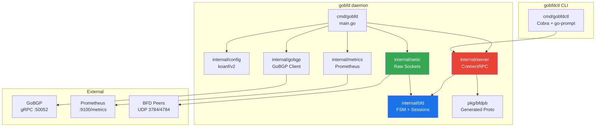
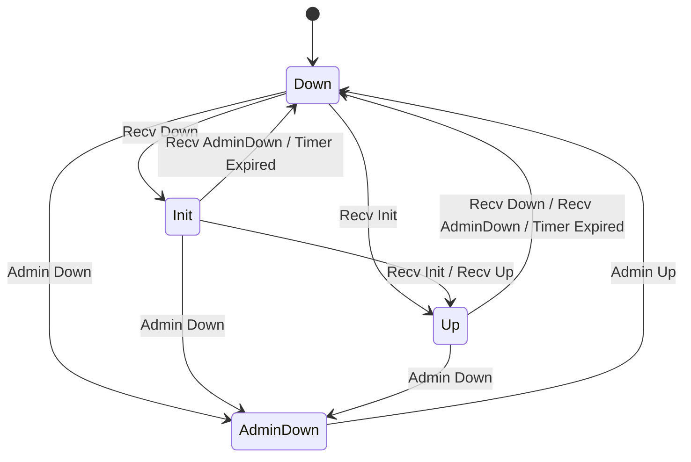
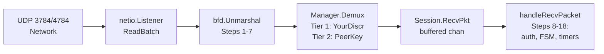
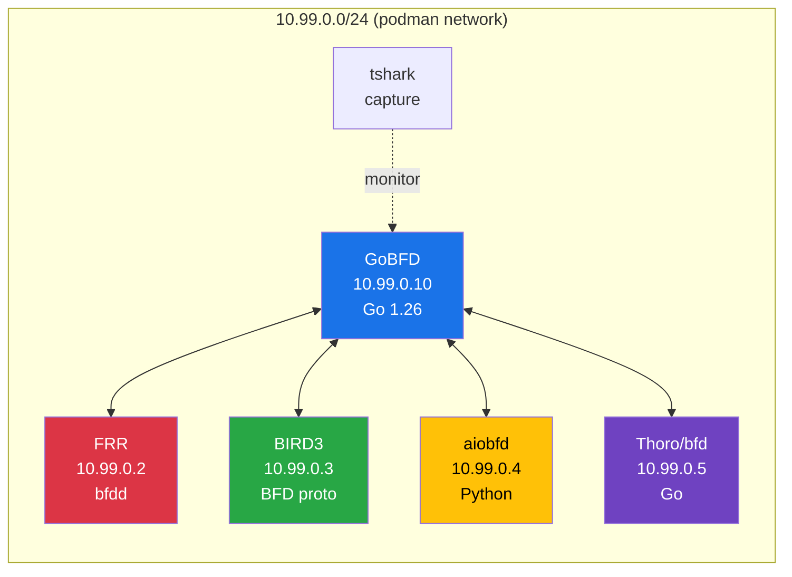

<p align="center">
  <strong>GoBFD</strong><br>
  Production-grade BFD protocol daemon for Go
</p>

<p align="center">
  <a href="https://github.com/dantte-lp/gobfd/actions/workflows/ci.yml"></a>
  <a href="https://goreportcard.com/report/github.com/dantte-lp/gobfd"></a>
  <a href="https://pkg.go.dev/github.com/dantte-lp/gobfd"></a>
  <a href="https://github.com/dantte-lp/gobfd/blob/master/LICENSE"></a>
  
  <a href="https://img.shields.io/badge/RFC-5880-blue"></a>
  <a href="https://img.shields.io/badge/RFC-5881-blue"></a>
</p>

---

GoBFD is a production-grade [Bidirectional Forwarding Detection](https://datatracker.ietf.org/doc/html/rfc5880) (BFD) protocol daemon written in Go. It detects forwarding path failures between adjacent systems in milliseconds, enabling fast convergence for BGP, OSPF, and other routing protocols.

Two binaries: **gobfd** (daemon) and **gobfdctl** (CLI client over ConnectRPC/gRPC).

## Features

- **RFC 5880** compliant BFD state machine with table-driven FSM (no if-else chains)
- **RFC 5881** single-hop for IPv4 and IPv6 (UDP 3784, TTL=255 GTSM)
- **RFC 5883** multihop for IPv4 and IPv6 (UDP 4784)
- **RFC 5882** generic application -- GoBGP integration for BFD-triggered BGP actions
- Five authentication modes: Simple Password, Keyed MD5/SHA1, Meticulous Keyed MD5/SHA1
- BFD flap dampening (RFC 5882 Section 3.2) to prevent BGP route churn
- ConnectRPC/gRPC API for session management and monitoring
- CLI client (`gobfdctl`) with interactive shell and tab completion
- Prometheus metrics with pre-built Grafana dashboard
- systemd integration (Type=notify, watchdog, socket activation)
- Hot reload via SIGHUP for declarative session reconciliation
- Zero-allocation packet codec on the hot path (`sync.Pool`, pre-built cached packets)
- Go 1.26 flight recorder (`runtime/trace.FlightRecorder`) for post-mortem debugging
- Fuzz testing for BFD packet parser (round-trip: parse -> marshal -> parse)
- 4-peer interoperability testing with FRR, BIRD3, aiobfd, and Thoro/bfd

## Architecture



### BFD State Machine (RFC 5880 Section 6.8.6)



### Packet RX Flow



### Interoperability Test Topology



## Quick Start

### Using Podman Compose (recommended for development)

```bash
# Start the development environment
podman-compose -f deployments/compose/compose.dev.yml up -d --build

# Build both binaries
make build

# Run tests with race detector
make test

# Run linter (golangci-lint v2)
make lint

# All at once: build + test + lint
make all
```

### Using Packages (deb/rpm)

```bash
# Install from .deb
sudo dpkg -i gobfd_*.deb

# Edit configuration
sudo vim /etc/gobfd/gobfd.yml

# Start the daemon
sudo systemctl enable --now gobfd

# Check status
sudo systemctl status gobfd
```

### Using the Production Stack

```bash
# Start gobfd with Prometheus and Grafana
podman-compose -f deployments/compose/compose.yml up -d

# Access services:
#   gobfd gRPC API:   localhost:50051
#   Prometheus:       http://localhost:9090
#   Grafana:          http://localhost:3000 (admin/admin)
```

### Building from Source

```bash
git clone https://github.com/dantte-lp/gobfd.git
cd gobfd

# Build binaries
go build -o bin/gobfd ./cmd/gobfd
go build -o bin/gobfdctl ./cmd/gobfdctl

# Build with version info
go build -ldflags="-X github.com/dantte-lp/gobfd/internal/version.Version=v1.0.0" \
  -o bin/gobfd ./cmd/gobfd

# Run tests
go test ./... -race -count=1

# Build container image
podman build -f deployments/docker/Containerfile -t gobfd .
```

> [!IMPORTANT]
> GoBFD requires `CAP_NET_RAW` and `CAP_NET_ADMIN` capabilities for raw socket operations (BFD uses UDP with TTL=255). The systemd unit file and container configurations handle this automatically.

## CLI Usage

`gobfdctl` communicates with the gobfd daemon via ConnectRPC.

```bash
# List all BFD sessions
gobfdctl session list

# Show a specific session
gobfdctl session show 10.0.0.1
gobfdctl session show 42

# Create a single-hop BFD session
gobfdctl session add \
  --peer 10.0.0.1 \
  --local 10.0.0.2 \
  --interface eth0 \
  --type single-hop \
  --tx-interval 100ms \
  --rx-interval 100ms \
  --detect-mult 3

# Create a multihop session
gobfdctl session add \
  --peer 192.168.1.1 \
  --local 192.168.2.1 \
  --type multi-hop \
  --tx-interval 300ms \
  --detect-mult 5

# Delete a session
gobfdctl session delete 42

# Stream live BFD events (state changes)
gobfdctl monitor

# Stream events with initial snapshot
gobfdctl monitor --current

# JSON output
gobfdctl session list --format json

# Connect to remote daemon
gobfdctl --addr 10.0.0.1:50051 session list

# Interactive shell with tab completion
gobfdctl shell
```

## Configuration

GoBFD reads its configuration from a YAML file. All settings can be overridden via environment variables with the `GOBFD_` prefix.

<details>
<summary>Full configuration example</summary>

```yaml
grpc:
  addr: ":50051"

metrics:
  addr: ":9100"
  path: "/metrics"

log:
  level: "info"       # debug, info, warn, error
  format: "json"      # json, text

bfd:
  default_desired_min_tx: "1s"
  default_required_min_rx: "1s"
  default_detect_multiplier: 3

# GoBGP integration (RFC 5882 Section 4.3)
gobgp:
  enabled: true
  addr: "127.0.0.1:50052"
  strategy: "disable-peer"   # or "withdraw-routes"
  dampening:
    enabled: true
    suppress_threshold: 3
    reuse_threshold: 2
    max_suppress_time: "60s"
    half_life: "15s"

# Declarative sessions (reconciled on SIGHUP reload)
sessions:
  - peer: "10.0.0.1"
    local: "10.0.0.2"
    interface: "eth0"
    type: single_hop
    desired_min_tx: "100ms"
    required_min_rx: "100ms"
    detect_mult: 3
  - peer: "10.0.1.1"
    local: "10.0.1.2"
    type: multi_hop
    desired_min_tx: "300ms"
    required_min_rx: "300ms"
    detect_mult: 5
```

</details>

Environment variable examples:

```bash
GOBFD_GRPC_ADDR=:50051
GOBFD_METRICS_ADDR=:9100
GOBFD_LOG_LEVEL=debug
GOBFD_LOG_FORMAT=text
```

See [`configs/gobfd.example.yml`](configs/gobfd.example.yml) for the full annotated example.

## RFC Compliance

| RFC | Title | Status | Notes |
|-----|-------|--------|-------|
| [RFC 5880](https://datatracker.ietf.org/doc/html/rfc5880) | BFD Base Protocol | Implemented | FSM, packet codec, auth, timers, jitter, Poll/Final |
| [RFC 5881](https://datatracker.ietf.org/doc/html/rfc5881) | BFD for IPv4/IPv6 Single-Hop | Implemented | UDP 3784, TTL=255, `SO_BINDTODEVICE` |
| [RFC 5882](https://datatracker.ietf.org/doc/html/rfc5882) | Generic Application of BFD | Implemented | GoBGP integration, flap dampening |
| [RFC 5883](https://datatracker.ietf.org/doc/html/rfc5883) | BFD for Multihop Paths | Implemented | UDP 4784, TTL>=254 check |
| [RFC 5884](https://datatracker.ietf.org/doc/html/rfc5884) | BFD for MPLS LSPs | Stub | Interfaces defined, pending LSP Ping |
| [RFC 5885](https://datatracker.ietf.org/doc/html/rfc5885) | BFD for VCCV | Stub | Interfaces defined, pending VCCV/LDP |
| [RFC 7130](https://datatracker.ietf.org/doc/html/rfc7130) | Micro-BFD for LAG | Stub | Per-member-link sessions planned |

> [!NOTE]
> Echo Mode (RFC 5880 Section 6.4) and Demand Mode (RFC 5880 Section 6.6) are intentionally not implemented. Asynchronous mode covers the primary use case of BFD-assisted failover in ISP/DC environments. See [`docs/rfc5880-notes.md`](docs/rfc5880-notes.md) for rationale.

### Key Implementation Details

- **Table-driven FSM**: All state transitions are defined in a `map[stateEvent]transition` table matching RFC 5880 Section 6.8.6. No if-else chains.
- **13-step packet validation**: Incoming packets pass through RFC 5880 Section 6.3 validation split across codec layer (steps 1-7) and session layer (steps 8-18).
- **Timer negotiation**: `ActualTxInterval = max(DesiredMinTxInterval, RemoteMinRxInterval)`. Detection time calculated per Section 6.8.4.
- **Jitter**: 75-100% for DetectMult > 1, 75-90% for DetectMult = 1 (Section 6.8.7).
- **Pre-built cached packets**: Following the FRR bfdd pattern, each session maintains a pre-serialized 24-byte BFD Control Packet rebuilt only on parameter changes.
- **Two-tier demultiplexing**: Tier 1 by YourDiscriminator (O(1) map), Tier 2 by (SrcIP, DstIP, Interface) for initial establishment.

## Interoperability Testing

GoBFD is tested against four independent BFD implementations in a containerized topology:

| Peer | Implementation | Language | BFD Support |
|------|---------------|----------|-------------|
| [FRR](https://frrouting.org/) | bfdd | C | RFC 5880, 5881, 5883 |
| [BIRD3](https://bird.network.cz/) | BFD protocol | C | RFC 5880, 5881 |
| [aiobfd](https://github.com/netedgeplus/aiobfd) | AsyncIO daemon | Python | RFC 5880, 5881 |
| [Thoro/bfd](https://github.com/Thoro/bfd) | gRPC daemon | Go | RFC 5880, 5881 |

Run interop tests:

```bash
# Full cycle: build, start topology, run tests, cleanup
make interop

# Or step by step:
make interop-up        # Start 4-peer topology
make interop-test      # Run Go interop tests
make interop-down      # Stop and cleanup

# Inspect captured packets
make interop-pcap-summary
```

The interop tests verify:
- Session establishment (three-way handshake) with each peer
- Session teardown and AdminDown propagation
- Timer negotiation across implementations
- Packet capture analysis via tshark

## Monitoring

GoBFD exposes Prometheus metrics at the configured endpoint (default `:9100/metrics`).

| Metric | Type | Description |
|--------|------|-------------|
| `gobfd_bfd_sessions_total` | Gauge | Currently active BFD sessions |
| `gobfd_bfd_packets_sent_total` | Counter | BFD Control packets transmitted |
| `gobfd_bfd_packets_received_total` | Counter | BFD Control packets received |
| `gobfd_bfd_packets_dropped_total` | Counter | Packets dropped (validation/buffer) |
| `gobfd_bfd_state_transitions_total` | Counter | FSM state transitions by old/new state |
| `gobfd_bfd_auth_failures_total` | Counter | Authentication failures |

A pre-built Grafana dashboard is included at [`deployments/compose/configs/grafana/dashboards/bfd.json`](deployments/compose/configs/grafana/dashboards/bfd.json).

## Project Structure

```
gobfd/
├── api/bfd/v1/bfd.proto          # Protobuf service definitions (buf managed)
├── cmd/
│   ├── gobfd/main.go             # Daemon entry point
│   └── gobfdctl/                 # CLI client
│       ├── main.go
│       └── commands/             # Cobra commands + go-prompt shell
├── internal/
│   ├── bfd/                      # Core protocol (FSM, session, packet, auth)
│   ├── config/                   # koanf/v2 configuration
│   ├── gobgp/                    # GoBGP gRPC client + flap dampening
│   ├── metrics/                  # Prometheus collectors
│   ├── netio/                    # Raw sockets, UDP listeners (Linux)
│   ├── server/                   # ConnectRPC server + interceptors
│   └── version/                  # Build info
├── pkg/bfdpb/                    # Generated protobuf types (public API)
├── test/interop/                 # 4-peer interop tests
├── configs/                      # Example configuration
├── deployments/
│   ├── compose/                  # Podman Compose (dev + prod stacks)
│   ├── docker/                   # Containerfile + debug image
│   ├── systemd/                  # systemd unit file
│   └── nfpm/                     # deb/rpm install scripts
├── docs/                         # Architecture, RFC notes
├── .github/workflows/            # CI + Release pipelines
├── .golangci.yml                 # golangci-lint v2 configuration
├── .goreleaser.yml               # GoReleaser v2 configuration
├── buf.yaml                      # Protobuf lint + breaking detection
├── buf.gen.yaml                  # Protobuf code generation
├── Makefile                      # Build, test, lint, interop targets
└── go.mod                        # Go 1.26 module
```

## Technology Stack

| Component | Technology | Purpose |
|-----------|-----------|---------|
| Language | Go 1.26 | Green Tea GC, `testing/synctest`, flight recorder |
| Network I/O | `x/net/ipv4`, `x/net/ipv6`, `x/sys/unix` | Raw sockets, TTL control, `SO_BINDTODEVICE` |
| RPC Server | ConnectRPC | gRPC + Connect + gRPC-Web from one handler |
| RPC Client | `google.golang.org/grpc` | GoBGP integration (gRPC client) |
| CLI | Cobra + go-prompt | Non-interactive + interactive shell |
| Configuration | koanf/v2 | YAML + env vars + flags, hot reload |
| Metrics | Prometheus `client_golang` | Counters, gauges, histograms |
| Logging | `log/slog` (stdlib) | Structured JSON/text logging |
| Protobuf | buf CLI | Lint, breaking detection, code generation |
| Lint | golangci-lint v2 | 35+ linters, strict configuration |
| Release | GoReleaser v2 | Binaries + deb/rpm + container images |
| Containers | Podman + Podman Compose | Development and testing |
| systemd | Type=notify, watchdog | Production daemon lifecycle |

## Requirements

- **Go 1.26** or later
- **Linux** (raw sockets with `CAP_NET_RAW` require Linux kernel)
- **buf CLI** (for protobuf generation)
- **golangci-lint v2** (for linting)
- **Podman** (for containerized development and testing)

## Contributing

Contributions are welcome. Please:

1. Open an issue to discuss the change before submitting a PR
2. Follow the existing code style (see [CLAUDE.md](CLAUDE.md) for conventions)
3. Add tests for new functionality (`go test ./... -race -count=1`)
4. Ensure `golangci-lint run ./...` passes
5. Run `buf lint` if proto files are modified
6. Keep commit messages descriptive and concise

### Development Workflow

```bash
# Start dev environment
make up

# Make changes, then:
make all              # build + test + lint

# For protocol changes, verify interop:
make interop

# For proto changes:
make proto-gen        # regenerate Go code
make proto-lint       # lint proto definitions
```

## License

[Apache License 2.0](LICENSE)

---

<sub>GoBFD is not affiliated with or endorsed by the IETF. BFD is defined in RFC 5880 and related RFCs.</sub>
