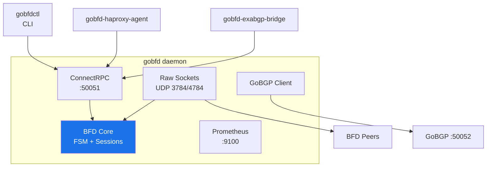

<p align="center">
  <strong>GoBFD</strong><br>
  Production-oriented pre-1.0 BFD protocol daemon for Go
</p>

<p align="center">
  <a href="https://github.com/dantte-lp/gobfd/actions/workflows/ci.yml"></a>
  <a href="https://pkg.go.dev/github.com/dantte-lp/gobfd"></a>
  <a href="https://goreportcard.com/report/github.com/dantte-lp/gobfd"></a>
  
  
  
  <a href="https://github.com/dantte-lp/gobfd/blob/master/LICENSE"></a>
  <br>
  <a href="https://github.com/dantte-lp/gobfd/actions/workflows/security.yml"></a>
  <a href="https://codecov.io/gh/dantte-lp/gobfd"></a>
  <a href="https://sonarcloud.io/summary/new_code?id=dantte-lp_gobfd"></a>
  <a href="https://scorecard.dev/viewer/?uri=github.com/dantte-lp/gobfd"></a>
</p>

---

GoBFD is a production-oriented [Bidirectional Forwarding Detection](https://datatracker.ietf.org/doc/html/rfc5880) (BFD) protocol daemon written in Go 1.27. It detects forwarding path failures between adjacent systems in milliseconds, enabling fast convergence for BGP, OSPF, and other routing protocols.

Four binaries: **gobfd** (daemon), **gobfdctl** (CLI), **gobfd-haproxy-agent** (HAProxy bridge), **gobfd-exabgp-bridge** (ExaBGP bridge).

## Why GoBFD

- **Standalone daemon, decoupled from any control plane.** GoBFD watches BFD state and drives external actuators (GoBGP `DisablePeer/EnablePeer`, HAProxy agent-check, ExaBGP route announcements) over a typed gRPC API. A daemon restart does not flap the routing control plane.
- **Measured allocation boundaries.** Micro-benchmarks report zero allocations
  for selected codec, FSM, timer, lookup, and caller-buffer paths. Allocating
  compatibility and authenticated receive paths are documented explicitly;
  benchmark results are not an end-to-end latency or GC guarantee.
- **Documented RFC coverage.** The asynchronous RFC 5880 core and several
  extensions are available with explicit partial or preview boundaries. RFC
  9384 wire subcode 10 is not emitted by the current GoBGP v3 API. See
  [RFC Compliance](docs/en/08-rfc-compliance.md) for the exact matrix.
- **Operational surfaces.** ConnectRPC/gRPC API, Prometheus metrics,
  structured `slog` logging, systemd integration, and a runtime flight
  recorder are available. The current control and metrics defaults are
  plaintext all-interface listeners; production deployments must isolate or
  override them and must not expose the debug endpoint publicly.
- **Verified interop.** The base suite covers FRR 10.7.0, BIRD 3.3.2,
  immutable Holo 0.9.0, and Thoro/bfd. Separate BGP+BFD coupling tests cover
  GoBGP, FRR, BIRD3, and ExaBGP. Containerlab profiles cover Arista cEOS,
  Nokia SR Linux, SONiC-VS, and VyOS.

Background and benchmarks: [Competitive Analysis](docs/en/13-competitive-analysis.md) and [Performance Analysis](docs/en/14-performance-analysis.md).

## Quick Start

```bash
git clone https://github.com/dantte-lp/gobfd.git && cd gobfd
make build                       # builds all 4 binaries with version ldflags
sudo ./gobfd -config configs/gobfd.example.yml
```

Local Podman stack with Prometheus + Grafana:

```bash
make test
podman compose -f deployments/compose/compose.yml up -d
```

> **Requires** Linux with `CAP_NET_RAW` and `CAP_NET_ADMIN` capabilities. See [Deployment](docs/en/06-deployment.md).

## Architecture


```mermaid
graph TB
    subgraph "gobfd daemon"
        SRV["ConnectRPC<br/>:50051"]
        BFD["BFD Core<br/>FSM + Sessions"]
        NET["Raw Sockets<br/>UDP 3784/4784"]
        BGP["GoBGP Client"]
        MET["Prometheus<br/>:9100"]
    end

    CLI["gobfdctl<br/>CLI"] --> SRV
    HAP["gobfd-haproxy-agent"] --> SRV
    EXA["gobfd-exabgp-bridge"] --> SRV
    SRV --> BFD
    NET --> BFD
    BGP --> GOBGP["GoBGP :50052"]
    NET --> PEER["BFD Peers"]

    style BFD fill:#1a73e8,color:#fff
```

## Documentation

Full documentation is available in [`docs/`](docs/README.md):

| # | Document | Description |
|---|---|---|
| 01 | [Architecture](docs/en/01-architecture.md) | System architecture, package diagram, packet flow |
| 02 | [BFD Protocol](docs/en/02-protocol.md) | FSM, timers, jitter, packet format, authentication |
| 03 | [Configuration](docs/en/03-configuration.md) | YAML config, env vars, GoBGP integration, hot reload |
| 04 | [CLI Reference](docs/en/04-cli.md) | gobfdctl commands, interactive shell |
| 05 | [Interop Testing](docs/en/05-interop.md) | 4-peer testing: FRR, BIRD3, Holo, Thoro/bfd |
| 06 | [Deployment](docs/en/06-deployment.md) | systemd, Podman Compose, packages, production |
| 07 | [Monitoring](docs/en/07-monitoring.md) | Prometheus metrics, Grafana dashboard, alerting |
| 08 | [RFC Compliance](docs/en/08-rfc-compliance.md) | RFC compliance matrix, implementation notes |
| 09 | [Development](docs/en/09-development.md) | Dev workflow, make targets, testing, linting |
| 10 | [Changelog Guide](docs/en/10-changelog.md) | How to maintain CHANGELOG.md, semantic versioning |
| 11 | [Integrations](docs/en/11-integrations.md) | BGP failover, HAProxy, observability, ExaBGP, Kubernetes |
| 16 | [Production Runbooks](docs/en/16-production-runbooks.md) | Kubernetes, BGP, Prometheus, packet verification, failure drills |

Documentation is also available in Russian at [`docs/ru/`](docs/ru/README.md).

### RFC Source Files

Full RFC texts are available in [`docs/rfc/`](docs/rfc/):
[RFC 5880](docs/rfc/rfc5880.txt) |
[RFC 5881](docs/rfc/rfc5881.txt) |
[RFC 5882](docs/rfc/rfc5882.txt) |
[RFC 5883](docs/rfc/rfc5883.txt) |
[RFC 5884](docs/rfc/rfc5884.txt) |
[RFC 5885](docs/rfc/rfc5885.txt) |
[RFC 7130](docs/rfc/rfc7130.txt) |
[RFC 7419](docs/rfc/rfc7419.txt) |
[RFC 9384](docs/rfc/rfc9384.txt) |
[RFC 9468](docs/rfc/rfc9468.txt) |
[RFC 9747](docs/rfc/rfc9747.txt) |
[RFC 8971](docs/rfc/rfc8971.txt) |
[RFC 9521](docs/rfc/rfc9521.txt) |
[RFC 9764](docs/rfc/rfc9764.txt) |
[RFC 9985](docs/rfc/rfc9985.txt) |
[RFC 9986](docs/rfc/rfc9986.txt)

## RFC Compliance

| RFC | Title | Status |
|---|---|---|
| RFC 5880 | BFD Base Protocol | Asynchronous core; partial |
| RFC 5881 | BFD for IPv4/IPv6 Single-Hop | Implemented |
| RFC 5882 | Generic Application of BFD | Application integration partial |
| RFC 5883 | BFD for Multihop Paths | Constrained GTSM profile; arbitrary-hop qualification pending |
| RFC 7419 | Common Interval Support | Implemented |
| RFC 9384 | BGP Cease NOTIFICATION for BFD | Not implemented; GoBGP v3 emits Cease/2 |
| RFC 9468 | Unsolicited BFD | Preview |
| RFC 9747 | Unaffiliated BFD Echo | Preview |
| RFC 7130 | Micro-BFD for LAG | Preview; owner integration partial |
| RFC 8971 | BFD for VXLAN | Preview userspace backend |
| RFC 9521 | BFD for Geneve | Preview userspace backend |
| RFC 9764 | BFD Large Packets | Partial; authenticated padding incomplete |
| RFC 5884 | BFD for MPLS LSPs | Stub |
| RFC 5885 | BFD for PW VCCV | Stub |

Details: [RFC Compliance](docs/en/08-rfc-compliance.md)

## Performance

GoBFD maintains 34 micro-benchmarks for specific pipeline stages. In
particular, `RecvDecodeLookupEnqueue` measures wire decode, discriminator
lookup, and attempted enqueue to the session's buffered channel. It does not
measure UDP receive, session processing, FSM commit, timer reset, or state
notification, so no end-to-end packet rate or supported session scale is
inferred from it.

The micro-benchmarks cover packet codec, FSM transitions, timer operations,
overlay encapsulation (VXLAN/Geneve), session management, and the documented
allocation boundaries. See [BENCHMARKS.md](BENCHMARKS.md) for detailed results.

## Key Features

- Table-driven FSM matching RFC 5880 Section 6.8.6 (no if-else chains)
- Five authentication modes (Simple Password, Keyed MD5/SHA1, Meticulous MD5/SHA1)
- RFC 9747 Echo, RFC 7130 Micro-BFD protocol, RFC 8971 VXLAN userspace backend, and RFC 9521 Geneve userspace backend support
- BFD flap dampening for BGP integration (implementation policy informed by RFC 5882 Section 3.1)
- Zero-allocation packet codec with pre-built cached packets
- ConnectRPC/gRPC API + CLI with interactive shell
- Prometheus metrics + Grafana dashboard
- systemd integration (Type=notify, watchdog, SIGHUP hot reload)
- 4-peer interop testing (FRR, BIRD3, Holo, Thoro/bfd) + 5 integration examples
- Runtime flight recorder for post-mortem debugging

Advanced Linux modes are explicit about dataplane ownership: Micro-BFD detects
per-member LAG state but needs a bond/team/OVS actuator for enforcement, while
VXLAN/Geneve BFD defaults to an explicit `userspace-udp` backend. Reserved
kernel, OVS/OVN, Cilium, Calico, and NSX backend names fail closed until
owner-specific integrations are implemented.

## Contributing

See [Development](docs/en/09-development.md) for the full workflow.
Repository participation is governed by [CONTRIBUTING.md](CONTRIBUTING.md),
[CODE_OF_CONDUCT.md](CODE_OF_CONDUCT.md), [SECURITY.md](SECURITY.md),
[SUPPORT.md](SUPPORT.md), and [GOVERNANCE.md](GOVERNANCE.md).

```bash
make up && make all    # Build + test + lint
make interop           # Interoperability tests
```

## License

[Apache License 2.0](LICENSE)
