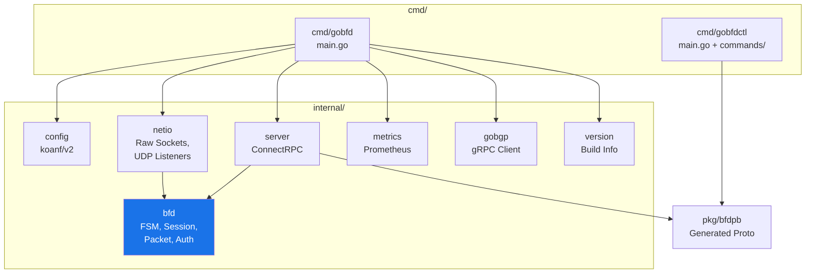
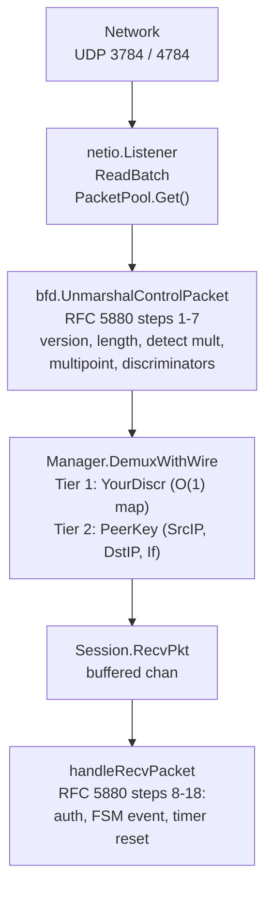
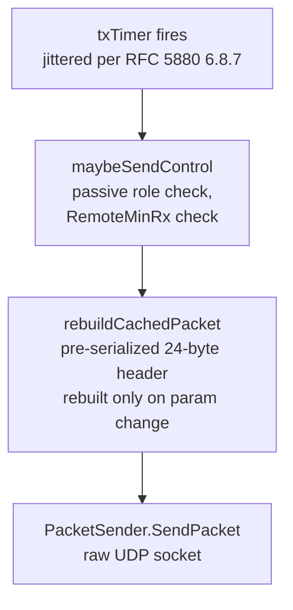
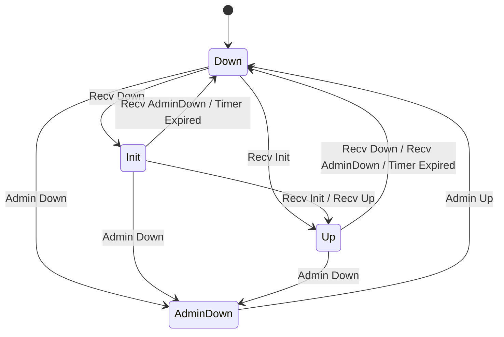
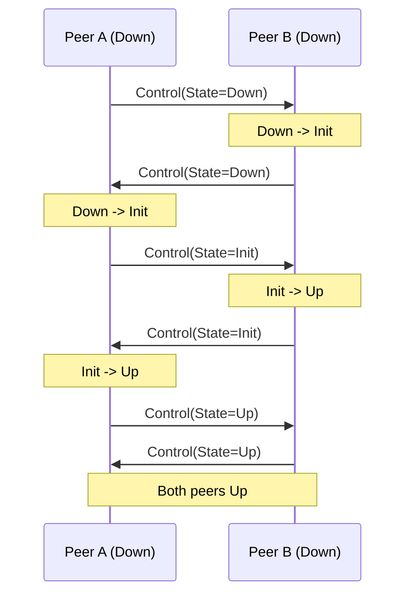
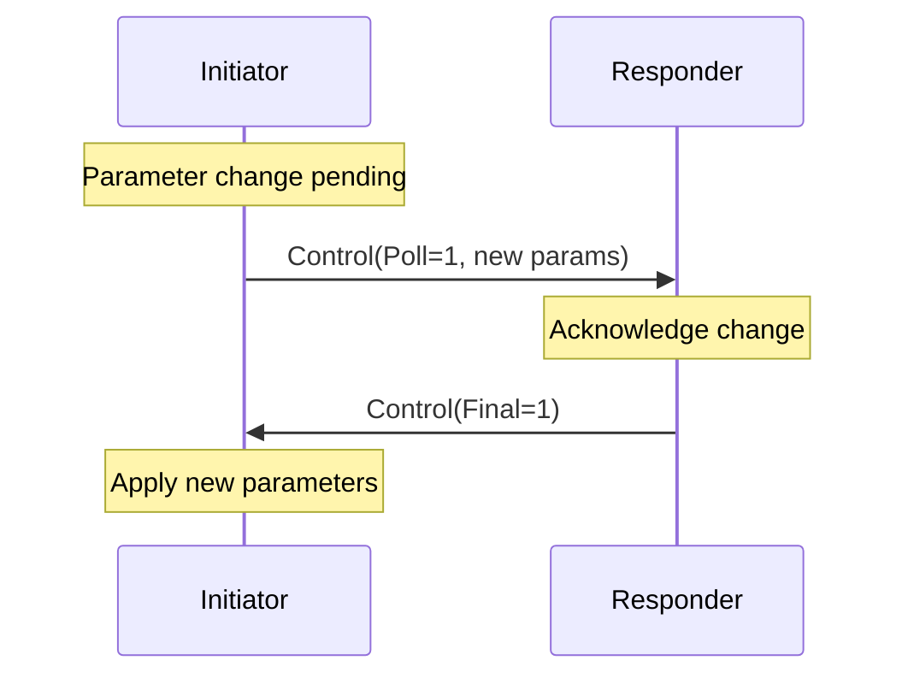

# GoBFD Architecture

This document describes the internal architecture of GoBFD: package dependencies, packet flow, FSM design, and timer negotiation.

## Package Dependency Diagram



### Dependency Rules

- `internal/bfd` has **zero** dependency on `internal/server`, `internal/netio`, or `internal/config`
- `internal/server` depends on `internal/bfd` (Manager, Session, types) and `pkg/bfdpb`
- `internal/netio` depends on `internal/bfd` only for the `PacketSender` interface and `ControlPacket`
- `pkg/bfdpb` is generated code -- never edited manually

## Packet RX Flow



### Demultiplexing (RFC 5880 Section 6.8.6)

Two-tier lookup:

1. **Tier 1** -- Your Discriminator is nonzero: O(1) map lookup by discriminator.
   This is the fast path for established sessions.

2. **Tier 2** -- Your Discriminator is zero AND state is Down/AdminDown:
   Lookup by composite key (SrcIP, DstIP, Interface). Used only during
   initial session establishment.

## Packet TX Flow



### Cached Packet Pattern (FRR bfdd)

The session maintains a pre-serialized `cachedPacket []byte` that is rebuilt
only when parameters change (state transition, Poll/Final, timer negotiation).
On each TX interval, the cached bytes are sent directly without re-encoding.
This eliminates per-packet allocation on the hot path.

For authenticated sessions, the auth sequence number is updated in the cached
packet on each transmission without full re-serialization.

## FSM State Diagram (RFC 5880 Section 6.8.6)



### State Transition Table

The FSM is implemented as a pure function over a `map[stateEvent]transition`
table. No side effects -- the caller (Session) executes returned actions.

| Current State | Event          | New State | Actions                            |
|---------------|----------------|-----------|------------------------------------|
| AdminDown     | AdminUp        | Down      | (none)                             |
| Down          | RecvDown       | Init      | SendControl                        |
| Down          | RecvInit       | Up        | SendControl, NotifyUp              |
| Down          | AdminDown      | AdminDown | SetDiagAdminDown                   |
| Init          | RecvAdminDown  | Down      | SetDiagNeighborDown, NotifyDown    |
| Init          | RecvDown       | Init      | (self-loop)                        |
| Init          | RecvInit       | Up        | SendControl, NotifyUp              |
| Init          | RecvUp         | Up        | SendControl, NotifyUp              |
| Init          | TimerExpired   | Down      | SetDiagTimeExpired, NotifyDown     |
| Init          | AdminDown      | AdminDown | SetDiagAdminDown                   |
| Up            | RecvAdminDown  | Down      | SetDiagNeighborDown, NotifyDown    |
| Up            | RecvDown       | Down      | SetDiagNeighborDown, NotifyDown    |
| Up            | RecvInit       | Up        | (self-loop)                        |
| Up            | RecvUp         | Up        | (self-loop)                        |
| Up            | TimerExpired   | Down      | SetDiagTimeExpired, NotifyDown     |
| Up            | AdminDown      | AdminDown | SetDiagAdminDown                   |

## Three-Way Handshake

BFD sessions use a three-way handshake to establish bidirectional connectivity
(RFC 5880 Section 6.2). Both peers start in Down state.



Sequence of FSM transitions:

1. A(Down) sends State=Down. B(Down) receives State=Down -> B transitions to Init.
2. B(Init) sends State=Init. A(Down) receives State=Init -> A transitions to Up.
3. A(Up) sends State=Up. B(Init) receives State=Up -> B transitions to Up.

After step 3, both peers are Up and exchanging keepalive packets at the
negotiated TX interval.

## Timer Negotiation (RFC 5880 Sections 6.8.1-6.8.4)

### TX Interval

The actual transmission interval is the larger of the local desired minimum
and the remote required minimum:

```
ActualTxInterval = max(bfd.DesiredMinTxInterval, bfd.RemoteMinRxInterval)
```

When the session is not in Up state, the TX interval is enforced to be at
least 1 second (1,000,000 microseconds) per RFC 5880 Section 6.8.3.

### Detection Time

The detection time is calculated from the remote peer's parameters:

```
DetectionTime = bfd.RemoteDetectMult * max(bfd.RequiredMinRxInterval, bfd.RemoteDesiredMinTxInterval)
```

If no packet is received within the Detection Time, the session transitions
to Down with Diagnostic = Control Detection Time Expired (1).

### Jitter (RFC 5880 Section 6.8.7)

Periodic transmission intervals include random jitter to prevent
synchronization between multiple BFD sessions:

- **Normal** (DetectMult > 1): interval reduced by 0-25% (result: 75-100%)
- **DetectMult == 1**: interval reduced by 10-25% (result: 75-90%)

### Poll Sequence (RFC 5880 Section 6.5)

Parameter changes (TX interval, RX interval) require a Poll Sequence for
confirmation. The initiator sets the Poll (P) bit; the responder replies
with the Final (F) bit. New parameters take effect only after the Final
bit is received.



Only one Poll Sequence may be active at a time (RFC 5880 Section 6.5).

## Graceful Shutdown (RFC 5880 Section 6.8.16)

On shutdown signal (SIGTERM/SIGINT):

1. `Manager.DrainAllSessions()` sets all sessions to AdminDown with
   Diag = Administratively Down (7)
2. Brief pause (2x TX interval) to allow final AdminDown packets to transmit
3. `Manager.Close()` cancels all session goroutines
4. Listener sockets are closed

This ensures remote peers see AdminDown rather than a detection timeout,
preventing unnecessary route withdrawals in BGP.

## BFD Control Packet Format (RFC 5880 Section 4.1)

24-byte mandatory header:

| Offset | Size | Field |
|--------|------|-------|
| 0 | 1 | Version (3 bits) + Diagnostic (5 bits) |
| 1 | 1 | State (2 bits) + P F C A D M (6 bits) |
| 2 | 1 | Detect Multiplier |
| 3 | 1 | Length |
| 4-7 | 4 | My Discriminator |
| 8-11 | 4 | Your Discriminator |
| 12-15 | 4 | Desired Min TX Interval (microseconds) |
| 16-19 | 4 | Required Min RX Interval (microseconds) |
| 20-23 | 4 | Required Min Echo RX Interval (microseconds) |
| 24+ | var | Authentication Section (optional) |

> [!IMPORTANT]
> All interval fields are in **microseconds** on the wire. Conversion to `time.Duration` happens at the boundary: `time.Duration(pkt.DesiredMinTxInterval) * time.Microsecond`.
