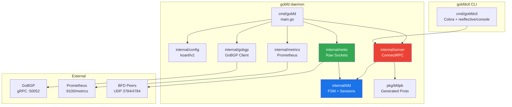
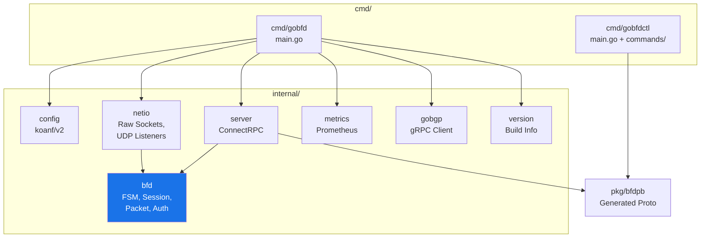
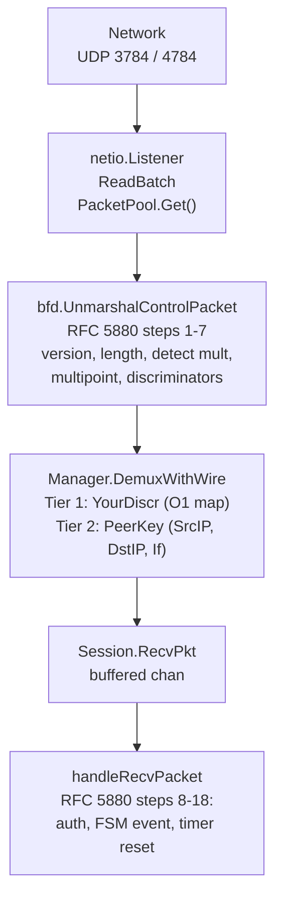
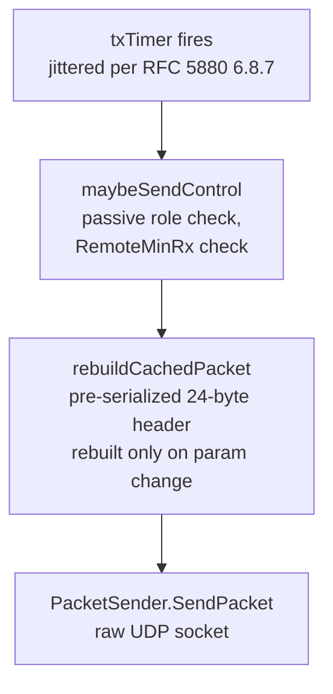
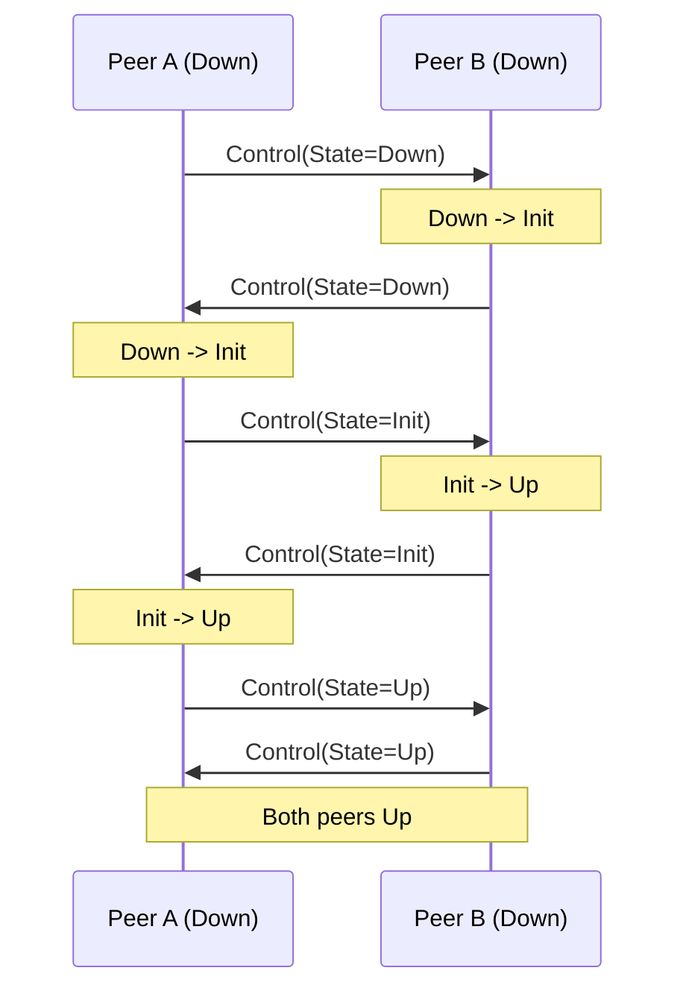
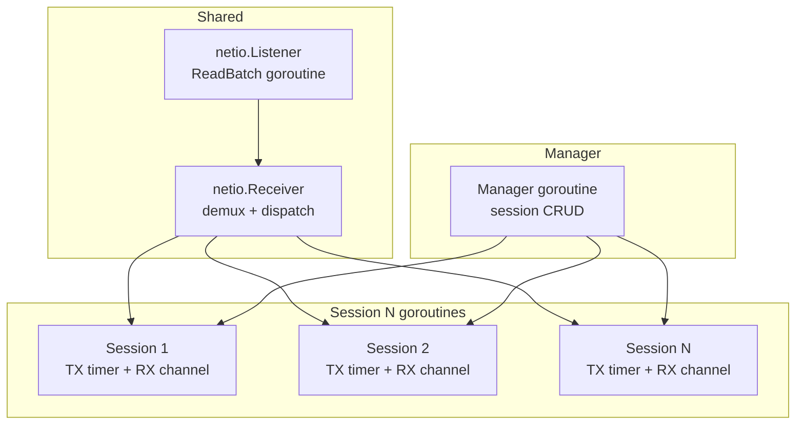

# Architecture


> System architecture of GoBFD: package dependencies, packet flow, session lifecycle, and goroutine model.

---

### Table of Contents

- [System Overview](#system-overview)
- [Package Dependency Diagram](#package-dependency-diagram)
- [Dependency Rules](#dependency-rules)
- [Packet RX Flow](#packet-rx-flow)
- [Packet TX Flow](#packet-tx-flow)
- [Demultiplexing](#demultiplexing)
- [Three-Way Handshake](#three-way-handshake)
- [Goroutine Model](#goroutine-model)
- [Graceful Shutdown](#graceful-shutdown)
- [Project Structure](#project-structure)
- [Technology Stack](#technology-stack)

### System Overview

GoBFD is a production-grade BFD (Bidirectional Forwarding Detection) protocol daemon. It consists of two binaries:

- **gobfd** -- the daemon that manages BFD sessions, sends/receives BFD Control packets, and integrates with GoBGP
- **gobfdctl** -- the CLI client that communicates with gobfd via ConnectRPC



### Package Dependency Diagram



### Dependency Rules

- `internal/bfd` has **zero** dependency on `internal/server`, `internal/netio`, or `internal/config`
- `internal/server` depends on `internal/bfd` (Manager, Session, types) and `pkg/bfdpb`
- `internal/netio` depends on `internal/bfd` only for the `PacketSender` interface and `ControlPacket`
- `pkg/bfdpb` is generated code -- never edited manually

### Packet RX Flow



The 13-step validation from RFC 5880 Section 6.8.6 is split across two layers:

| Layer | Steps | Responsibility |
|---|---|---|
| **Codec** (`packet.go`) | 1-7 | Version, length, detect mult, multipoint, discriminators (stateless) |
| **Session** (`session.go`) | 8-18 | Auth verification, FSM event, timer update, state variable update |

This split allows the listener to discard invalid packets before any session lock is acquired.

### Packet TX Flow



**Cached Packet Pattern** (inspired by FRR bfdd): each session maintains a pre-serialized `cachedPacket []byte` that is rebuilt only when parameters change (state transition, Poll/Final, timer negotiation). On each TX interval, the cached bytes are sent directly without re-encoding. For authenticated sessions, the auth sequence number is updated in the cached packet on each transmission without full re-serialization.

### Demultiplexing

Two-tier lookup per RFC 5880 Section 6.8.6:

1. **Tier 1** -- Your Discriminator is nonzero: O(1) map lookup by discriminator. Fast path for established sessions.
2. **Tier 2** -- Your Discriminator is zero AND state is Down/AdminDown: lookup by composite key (SrcIP, DstIP, Interface). Used only during initial session establishment.

### Three-Way Handshake

BFD sessions use a three-way handshake (RFC 5880 Section 6.2):



FSM transitions in sequence:

1. A(Down) sends State=Down. B(Down) receives State=Down --> B transitions to Init.
2. B(Init) sends State=Init. A(Down) receives State=Init --> A transitions to Up.
3. A(Up) sends State=Up. B(Init) receives State=Up --> B transitions to Up.

### Goroutine Model

Each BFD session runs as an independent goroutine with its own timers and state. The goroutine lifetime is bound to a `context.Context` from the Manager.



### Graceful Shutdown

On SIGTERM/SIGINT (RFC 5880 Section 6.8.16):

1. `Manager.DrainAllSessions()` -- set all sessions to AdminDown with Diag = Administratively Down (7)
2. Wait 2x TX interval for final AdminDown packets to transmit
3. `Manager.Close()` -- cancel all session goroutines
4. Close listener sockets
5. Shut down HTTP servers (gRPC, metrics)

This ensures remote peers see AdminDown rather than a detection timeout, preventing unnecessary BGP route withdrawals.

### Project Structure

```
gobfd/
+-- api/bfd/v1/bfd.proto          # Protobuf service definitions (buf managed)
+-- cmd/
|   +-- gobfd/main.go             # Daemon entry point
|   +-- gobfdctl/                 # CLI client
|       +-- main.go
|       +-- commands/             # Cobra commands + reeflective/console shell
+-- internal/
|   +-- bfd/                      # Core protocol (FSM, session, packet, auth)
|   +-- config/                   # koanf/v2 configuration
|   +-- gobgp/                    # GoBGP gRPC client + flap dampening
|   +-- metrics/                  # Prometheus collectors
|   +-- netio/                    # Raw sockets, UDP listeners (Linux)
|   +-- server/                   # ConnectRPC server + interceptors
|   +-- version/                  # Build info
+-- pkg/bfdpb/                    # Generated protobuf types (public API)
+-- test/interop/                 # 4-peer interop tests
+-- configs/                      # Example configuration
+-- deployments/
|   +-- compose/                  # Podman Compose (dev + prod stacks)
|   +-- docker/                   # Containerfile + debug image
|   +-- systemd/                  # systemd unit file
|   +-- nfpm/                     # deb/rpm install scripts
+-- docs/                         # Documentation + RFC texts
```

### Technology Stack

| Component | Technology | Purpose |
|---|---|---|
| Language | Go 1.26 | Green Tea GC, `testing/synctest`, flight recorder |
| Network I/O | `x/net/ipv4`, `x/net/ipv6`, `x/sys/unix` | Raw sockets, TTL control, `SO_BINDTODEVICE` |
| RPC Server | ConnectRPC | gRPC + Connect + gRPC-Web from one handler |
| RPC Client | `google.golang.org/grpc` | GoBGP integration (gRPC client) |
| CLI | Cobra + reeflective/console | Non-interactive + interactive shell |
| Configuration | koanf/v2 | YAML + env vars + flags, hot reload |
| Metrics | Prometheus `client_golang` | Counters, gauges, histograms |
| Logging | `log/slog` (stdlib) | Structured JSON/text logging |
| Protobuf | buf CLI | Lint, breaking detection, code generation |
| Lint | golangci-lint v2 | 35+ linters, strict configuration |
| Release | GoReleaser v2 | Binaries + deb/rpm + container images |
| Containers | Podman + Podman Compose | Development and testing |
| systemd | Type=notify, watchdog | Production daemon lifecycle |

### Related Documents

- [02-protocol.md](./02-protocol.md) -- BFD protocol details (FSM, timers, packet format)
- [03-configuration.md](./03-configuration.md) -- Configuration reference
- [06-deployment.md](./06-deployment.md) -- Production deployment
- [09-development.md](./09-development.md) -- Development workflow

---

*Last updated: 2026-02-21*
