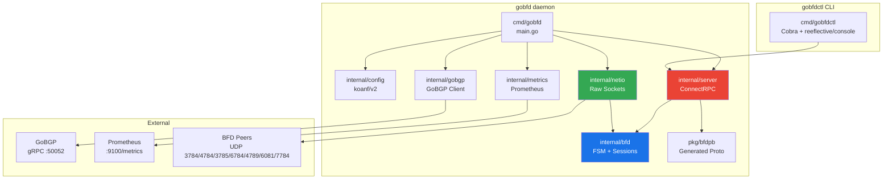
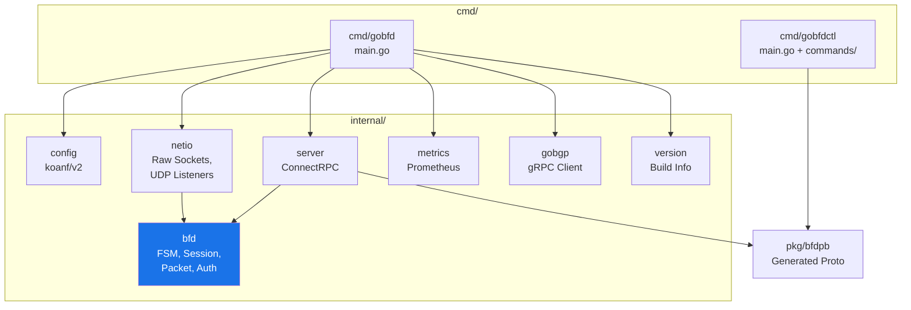
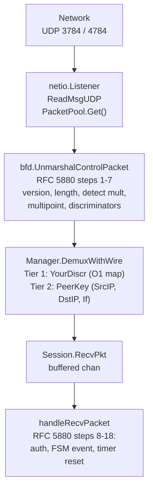
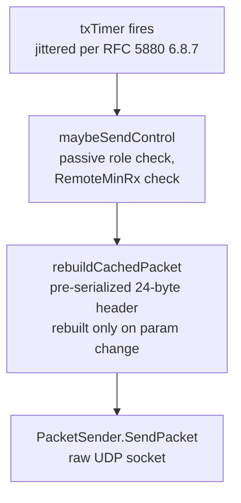
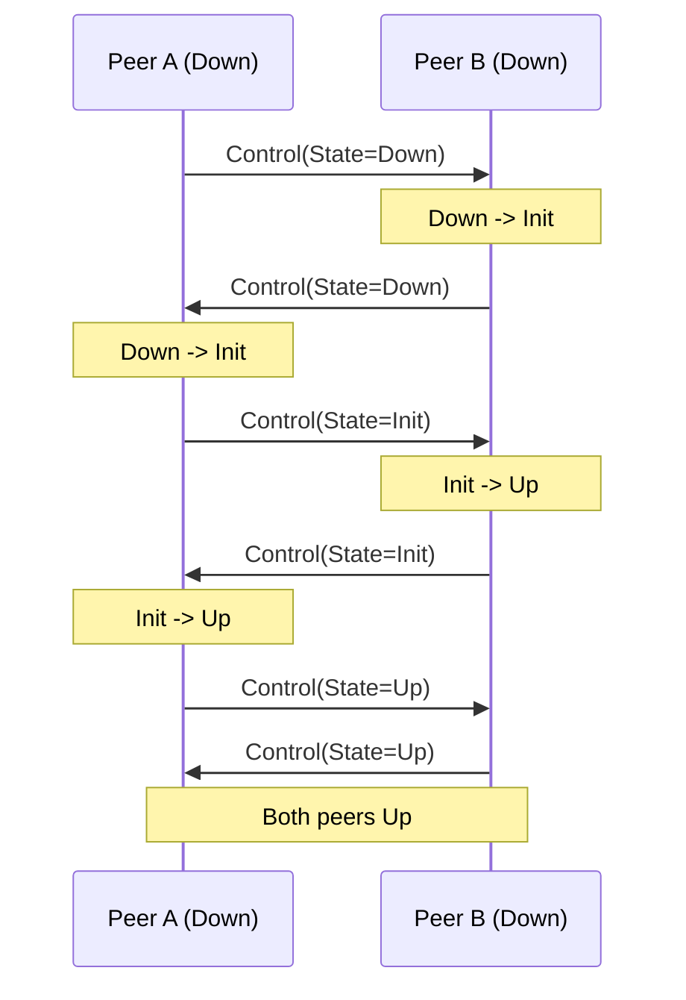
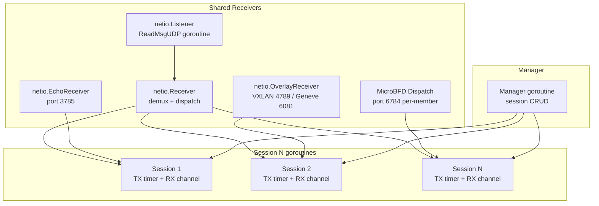

# Architecture


> System architecture of GoBFD: package dependencies, packet flow, session lifecycle, and goroutine model.

---

## Table of Contents

- [System Overview](#system-overview)
- [Package Dependency Diagram](#package-dependency-diagram)
- [Dependency Rules](#dependency-rules)
- [Packet RX Flow](#packet-rx-flow)
- [Packet TX Flow](#packet-tx-flow)
- [Demultiplexing](#demultiplexing)
- [Session Identity and Ownership](#session-identity-and-ownership)
- [Three-Way Handshake](#three-way-handshake)
- [Goroutine Model](#goroutine-model)
- [Graceful Shutdown](#graceful-shutdown)
- [Project Structure](#project-structure)
- [Technology Stack](#technology-stack)

### System Overview

GoBFD is a production-oriented BFD (Bidirectional Forwarding Detection) protocol daemon. It consists of four binaries:

- **gobfd** -- the daemon that manages BFD sessions, sends/receives BFD Control packets, and integrates with GoBGP
- **gobfdctl** -- the CLI client that communicates with gobfd via ConnectRPC
- **gobfd-haproxy-agent** -- HAProxy agent-check bridge (BFD state to TCP agent responses)
- **gobfd-exabgp-bridge** -- ExaBGP process API bridge (BFD state to route announcements)


```mermaid
graph TB
    subgraph "gobfd daemon"
        MAIN["cmd/gobfd<br/>main.go"]
        CFG["internal/config<br/>koanf/v2"]
        SRV["internal/server<br/>ConnectRPC"]
        BFD["internal/bfd<br/>FSM + Sessions"]
        NET["internal/netio<br/>Raw Sockets"]
        MET["internal/metrics<br/>Prometheus"]
        BGP["internal/gobgp<br/>GoBGP Client"]
        PB["pkg/bfdpb<br/>Generated Proto"]
    end

    subgraph "gobfdctl CLI"
        CLI["cmd/gobfdctl<br/>Cobra + reeflective/console"]
    end

    subgraph "External"
        GOBGP["GoBGP<br/>gRPC :50052"]
        PROM["Prometheus<br/>:9100/metrics"]
        PEER["BFD Peers<br/>UDP 3784/4784/3785/6784/4789/6081/7784"]
    end

    MAIN --> CFG
    MAIN --> SRV
    MAIN --> NET
    MAIN --> MET
    MAIN --> BGP
    SRV --> BFD
    SRV --> PB
    NET --> BFD
    CLI --> SRV
    BGP --> GOBGP
    MET --> PROM
    NET --> PEER

    style BFD fill:#1a73e8,color:#fff
    style NET fill:#34a853,color:#fff
    style SRV fill:#ea4335,color:#fff
```

### Package Dependency Diagram


```mermaid
graph TB
    subgraph "cmd/"
        GOBFD["cmd/gobfd<br/>main.go"]
        GOBFDCTL["cmd/gobfdctl<br/>main.go + commands/"]
    end

    subgraph "internal/"
        CFG["config<br/>koanf/v2"]
        SRV["server<br/>ConnectRPC"]
        BFD["bfd<br/>FSM, Session,<br/>Packet, Auth"]
        NET["netio<br/>Raw Sockets,<br/>UDP Listeners"]
        MET["metrics<br/>Prometheus"]
        BGP["gobgp<br/>gRPC Client"]
        VER["version<br/>Build Info"]
    end

    PB["pkg/bfdpb<br/>Generated Proto"]

    GOBFD --> CFG
    GOBFD --> SRV
    GOBFD --> NET
    GOBFD --> MET
    GOBFD --> BGP
    GOBFD --> VER
    SRV --> BFD
    SRV --> PB
    NET --> BFD
    GOBFDCTL --> PB

    style BFD fill:#1a73e8,color:#fff
```

### Dependency Rules

- `internal/bfd` has **zero** dependency on `internal/server`, `internal/netio`, or `internal/config`
- `internal/server` depends on `internal/bfd` (Manager, Session, types) and `pkg/bfdpb`
- `internal/netio` reuses the BFD packet codec, pool, packet metadata, sender
  interface, and Micro-BFD state/event types from `internal/bfd`
- `pkg/bfdpb` is generated code -- never edited manually

### Packet RX Flow


```mermaid
flowchart TD
    NET["Network<br/>UDP 3784 / 4784"] --> LISTEN["netio.Listener<br/>ReadMsgUDP<br/>PacketPool.Get()"]
    LISTEN --> UNMARSHAL["bfd.UnmarshalControlPacket<br/>RFC 5880 steps 1-7<br/>version, length, detect mult,<br/>multipoint, discriminators"]
    UNMARSHAL --> DEMUX["Manager.DemuxWithWire<br/>Tier 1: YourDiscr (O1 map)<br/>Tier 2: PeerKey (SrcIP, DstIP, If)"]
    DEMUX --> RECV["Session.RecvPkt<br/>buffered chan"]
    RECV --> HANDLE["handleRecvPacket<br/>RFC 5880 steps 8-18:<br/>auth, FSM event, timer reset"]
```

The 13-step validation from RFC 5880 Section 6.8.6 is split across two layers:

| Layer | Steps | Responsibility |
|---|---|---|
| **Codec** (`packet.go`) | 1-7 | Version, length, detect mult, multipoint, discriminators (stateless) |
| **Session** (`session.go`) | 8-18 | Auth verification, FSM event, timer update, state variable update |

This split allows the listener to discard invalid packets before any session lock is acquired.

### Packet TX Flow


```mermaid
flowchart TD
    TIMER["txTimer fires<br/>jittered per RFC 5880 6.8.7"] --> CHECK["maybeSendControl<br/>passive role check,<br/>RemoteMinRx check"]
    CHECK --> REBUILD["rebuildCachedPacket<br/>pre-serialized 24-byte header<br/>rebuilt only on param change"]
    REBUILD --> SEND["PacketSender.SendPacket<br/>raw UDP socket"]
```

**Cached Packet Pattern** (inspired by FRR bfdd): each session maintains a pre-serialized `cachedPacket []byte` that is rebuilt only when parameters change (state transition, Poll/Final, timer negotiation). On each TX interval, the cached bytes are sent directly without re-encoding. For authenticated sessions, the auth sequence number is updated in the cached packet on each transmission without full re-serialization.

### Demultiplexing

Two-tier lookup per RFC 5880 Section 6.8.6:

1. **Tier 1** -- Your Discriminator is nonzero: O(1) map lookup by discriminator. Fast path for established sessions.
2. **Tier 2** -- Your Discriminator is zero AND state is Down/AdminDown: lookup by composite key (SrcIP, DstIP, Interface). Used only during initial session establishment.

### Session Identity and Ownership

`SessionKey` is the comparable canonical identity of one desired wire session.
It contains the session type and address family, normalized peer and local
addresses, interface, network scope, and transport scope. IPv4-mapped
addresses are normalized to IPv4. This identity is separate from the smaller
packet demultiplexing key used only for initial packet delivery.

The manager records typed claims from base configuration, Micro-BFD members,
VXLAN, Geneve, the compatibility/API path, and unsolicited BFD. Ownership
mutations are serialized. Each declarative adapter reconciles only its typed
source. Claims with the same canonical key and effective parameters share one
wire session and discriminator; releasing one claim preserves the others, and
releasing the last claim destroys the wire session. Empty declarative sets are
forwarded, so removing the final entry releases only that source's claims.
The daemon validates the complete combined base, Micro-BFD member, VXLAN, and
Geneve control-session candidate before applying any of those sources. Each
source compiler also validates its complete set before that adapter opens
senders or mutates session ownership.

For a newly accepted physical session, the manager opens one lazy sender lease
and stores its idempotent release operation with the session entry. Unchanged
reconciliation and matching claims from another source do not open another
sender. Creation rollback, release of the last claim, and manager shutdown
release the accepted lease once; releasing a non-last claim preserves it. Base
configuration, Micro-BFD, and the compatibility API use owning UDP leases that
also return the allocated source port. Overlay sessions use explicit
non-owning leases because their sender shares the backend connection. RFC 9468
sessions likewise use non-owning per-session leases over one manager-owned
singleton sender, so cleanup of one unsolicited session cannot close the
shared socket.

Echo sessions use the same accepted-session lease boundary with separate API
and declarative sources. The compatibility `CreateEchoSession` path keeps an
explicit non-owning raw-sender wrapper, while the API adapter and declarative
reconciler pass lazy owning factories. Declarative reconciliation validates the
complete canonical candidate before opening senders, ignores adapter-supplied
keys for identity, preserves API-created Echo sessions, and forwards an empty
desired set. A sender acquisition failure rolls back only the newly accepted
declarative Echo sessions from that pass; removal and shutdown release each
accepted lease once after its Echo goroutine exits.

For authenticated sessions, the effective parameters include the built-in
authenticator type and an immutable fingerprint of a `StaticAuthKeyStore`.
The static store clones constructor inputs and returns caller-owned key copies;
unknown key-store implementations fail closed because no stable semantic
identity can be derived.

This is the C01.1 ownership core plus the C01.2 atomic-candidate/source
isolation slice, the C01.3a accepted-control-session sender-lease slice, the
C01.3b Manager lifecycle slice, and the C01.4a Echo sender-lease/source
isolation slice. It is not the complete v1 reconciliation or RFC contract. The
following boundaries remain deferred:

- listener and backend replacement ownership;
- stable per-group and per-tunnel owner identifiers;
- reconciliation generations and receipts;
- Poll/Final parameter negotiation;
- transport-aware packet demultiplexing; and
- authenticated API principal identities instead of one compatibility/API
  owner.

### Three-Way Handshake

BFD sessions use a three-way handshake (RFC 5880 Section 6.2):


```mermaid
sequenceDiagram
    participant A as Peer A (Down)
    participant B as Peer B (Down)

    A->>B: Control(State=Down)
    Note over B: Down -> Init
    B->>A: Control(State=Down)
    Note over A: Down -> Init

    A->>B: Control(State=Init)
    Note over B: Init -> Up
    B->>A: Control(State=Init)
    Note over A: Init -> Up

    A->>B: Control(State=Up)
    B->>A: Control(State=Up)
    Note over A,B: Both peers Up
```

FSM transitions in sequence:

1. A(Down) sends State=Down. B(Down) receives State=Down --> B transitions to Init.
2. B(Init) sends State=Init. A(Down) receives State=Init --> A transitions to Up.
3. A(Up) sends State=Up. B(Init) receives State=Up --> B transitions to Up.

### Goroutine Model

Each BFD session runs as an independent goroutine with its own timers and
state. Its context is detached from the daemon signal context so SIGTERM does
not stop it before the AdminDown drain. `Manager.Close()` cancels the
per-session context explicitly and waits for every registered session and echo
goroutine to exit before releasing its sender lease or discriminator.

The Manager lifecycle is `Open -> Closing -> Closed`. Once `Closing` begins,
new session claims, reconciliation, unsolicited claims, and state-change
subscriptions fail with stable lifecycle errors without mutation. The daemon
still starts `RunDispatch` from its errgroup, but the Manager registers and
owns that run for shutdown. `RunDispatch` is single-run: a second invocation
returns immediately. Cancellation of its caller context or `Manager.Close()`
stops dispatch and closes the legacy `StateChanges()` channel exactly once.
Per-consumer subscription channels are closed exactly once by their registered
subscriber goroutine when either the subscriber context or Manager closes.

After the lifecycle transition, Close detaches registries under `ownershipMu`
and `manager.mu`, then releases both locks before cancellation and waits.
Sender release callbacks run only after the corresponding session goroutine
exits and without either lock; discriminator release and metrics unregister
follow the sender release in that order. Concurrent Close calls wait for the
same shutdown result. The operation releases the lifecycle mutation lock before
detached or unused sender callbacks, so Close can transition to `Closing`, but
keeps its active-operation registration through the callback, discriminator
release, and metrics cleanup. Therefore Close waits for the complete cleanup,
while a release callback may call Manager snapshot APIs and may attempt Manager
mutations, which fail with `ErrManagerClosing`. It must not call the blocking
`Manager.Close()` recursively: a synchronous callback is part of that same
Close completion, so the two calls would wait on each other. An explicit
recursive-safe callback or asynchronous shutdown API is deferred to
`gobfd-qj0.8.2.2.5.1` rather than weakening concurrent Close semantics.

The lifecycle gate covers control and echo session creation/destruction,
control and echo reconciliation, Micro-BFD group creation/destruction and
reconciliation, unsolicited claims, and subscription registration. Each
top-level reconciliation holds one lifecycle operation and calls internal
ungated helpers, avoiding a nested read-lock deadlock when Close has queued the
write-side lifecycle transition.


```mermaid
graph TB
    subgraph "Manager"
        M["Manager goroutine<br/>session CRUD"]
    end

    subgraph "Session N goroutines"
        S1["Session 1<br/>TX timer + RX channel"]
        S2["Session 2<br/>TX timer + RX channel"]
        SN["Session N<br/>TX timer + RX channel"]
    end

    subgraph "Shared Receivers"
        L["netio.Listener<br/>ReadMsgUDP goroutine"]
        R["netio.Receiver<br/>demux + dispatch"]
        ER["netio.EchoReceiver<br/>port 3785"]
        OR["netio.OverlayReceiver<br/>VXLAN 4789 / Geneve 6081"]
        MD["MicroBFD Dispatch<br/>port 6784 per-member"]
    end

    L --> R
    R --> S1
    R --> S2
    R --> SN
    ER --> S1
    OR --> S2
    MD --> SN
    M --> S1
    M --> S2
    M --> SN
```

### Graceful Shutdown

On SIGTERM/SIGINT (RFC 5880 Section 6.8.16):

1. `Manager.DrainAllSessions()` -- set all sessions to AdminDown with Diag = Administratively Down (7)
2. Wait the fixed two-second `drainTimeout` window for an AdminDown transmit
3. `Manager.Close()` -- enter Closing, detach sessions, cancel and wait for
   registered Manager goroutines, close notification channels, and release
   sender resources
4. Close listener sockets
5. Shut down HTTP servers (gRPC, metrics)

This is a best-effort notification window. The current implementation does not
acknowledge transmission or prove that every peer received AdminDown; atomic
AdminDown completion remains part of the v1 contract.

### Project Structure

```
gobfd/
+-- api/bfd/v1/bfd.proto          # Protobuf service definitions (buf managed)
+-- cmd/
|   +-- gobfd/main.go             # Daemon entry point
|   +-- gobfdctl/                 # CLI client
|   |   +-- main.go
|   |   +-- commands/             # Cobra commands + reeflective/console shell
|   +-- gobfd-haproxy-agent/      # HAProxy agent-check bridge
|   +-- gobfd-exabgp-bridge/      # ExaBGP process API bridge
+-- internal/
|   +-- bfd/                      # Core protocol (FSM, session, packet, auth)
|   +-- config/                   # koanf/v2 configuration
|   +-- gobgp/                    # GoBGP gRPC client + flap dampening
|   +-- metrics/                  # Prometheus collectors
|   +-- netio/                    # Raw sockets, UDP listeners, overlay tunnels (Linux)
|   +-- sdnotify/                 # systemd readiness/watchdog notifications
|   +-- server/                   # ConnectRPC server + interceptors
|   +-- version/                  # Build info
+-- pkg/bfdpb/                    # Generated protobuf types (public API)
+-- test/interop/                 # 4-peer interop tests (FRR, BIRD3, Holo, Thoro/bfd)
+-- test/interop-bgp/            # BGP+BFD interop tests (GoBGP, FRR, BIRD3, ExaBGP)
+-- test/interop-rfc/            # RFC-specific interop tests (7419, 9384, 9468)
+-- test/interop-clab/           # Vendor NOS interop tests (Nokia, Arista, Cisco, FRR, SONiC, VyOS)
+-- test/integration/            # Integration tests (datapath, CLI, server)
+-- configs/                      # Example configuration
+-- deployments/
|   +-- compose/                  # Podman Compose (dev + prod stacks)
|   +-- docker/                   # Containerfile + debug image
|   +-- systemd/                  # systemd unit file
|   +-- nfpm/                     # deb/rpm install scripts
|   +-- integrations/            # 5 integration examples (BGP, HAProxy, observability, ExaBGP, k8s)
+-- docs/                         # Documentation + RFC texts
```

### Technology Stack

| Component | Technology | Purpose |
|---|---|---|
| Language | Go 1.27 | Green Tea GC, `testing/synctest`, flight recorder |
| Network I/O | `x/net/ipv4`, `x/net/ipv6`, `x/sys/unix` | Raw sockets, TTL control, `SO_BINDTODEVICE` |
| RPC Server | ConnectRPC | gRPC + Connect + gRPC-Web from one handler |
| RPC Client | `google.golang.org/grpc` | GoBGP integration (gRPC client) |
| CLI | Cobra + reeflective/console | Non-interactive + interactive shell |
| Configuration | koanf/v2 | YAML + env vars + flags, hot reload |
| Metrics | Prometheus `client_golang` | Counters, gauges, histograms |
| Logging | `log/slog` (stdlib) | Structured JSON/text logging |
| Protobuf | buf CLI | Lint, breaking detection, code generation |
| Lint | golangci-lint v2.13.1 | 92 signal-bearing linters, schema and build-tag matrix gates |
| Release | GoReleaser v2 | Binaries + deb/rpm + container images |
| Containers | Podman + Podman Compose | Development and testing |
| systemd | Type=notify, watchdog | Production daemon lifecycle |

### UDP Port Map

| Port | Protocol | RFC | Direction | Status |
|---|---|---|---|---|
| 3784 | BFD Single-Hop | RFC 5881 | TX + RX | Active |
| 4784 | BFD Multi-Hop | RFC 5883 | TX + RX | Active |
| 3785 | BFD Echo | RFC 9747 | TX + RX | Active |
| 6784 | Micro-BFD (LAG) | RFC 7130 | TX + RX | Active |
| 4789 | VXLAN BFD (outer) | RFC 8971 | TX + RX | Active |
| 6081 | Geneve BFD (outer) | RFC 9521 | TX + RX | Active |
| 7784 | S-BFD Reflector | RFC 7881 | RX (reflector) + TX (initiator) | Planned |

### TCP/HTTP Port Map

| Port | Protocol | Purpose | Status |
|---|---|---|---|
| 50051 | ConnectRPC (gRPC) | Session management API | Active |
| 9100 | HTTP | Prometheus metrics (`/metrics`) | Active |

### Related Documents

- [02-protocol.md](./02-protocol.md) -- BFD protocol details (FSM, timers, packet format)
- [03-configuration.md](./03-configuration.md) -- Configuration reference
- [06-deployment.md](./06-deployment.md) -- Production deployment
- [09-development.md](./09-development.md) -- Development workflow

---

*Last updated: 2026-08-28*
