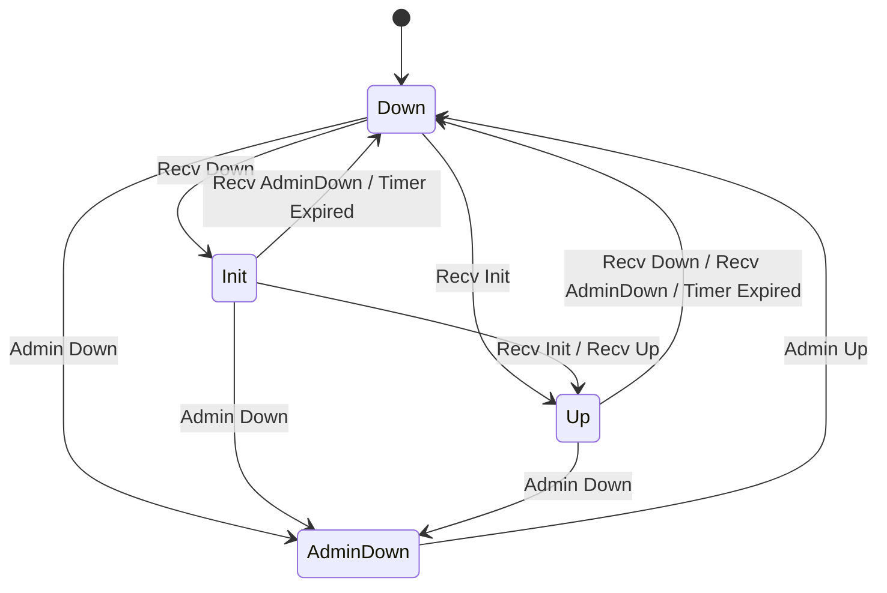
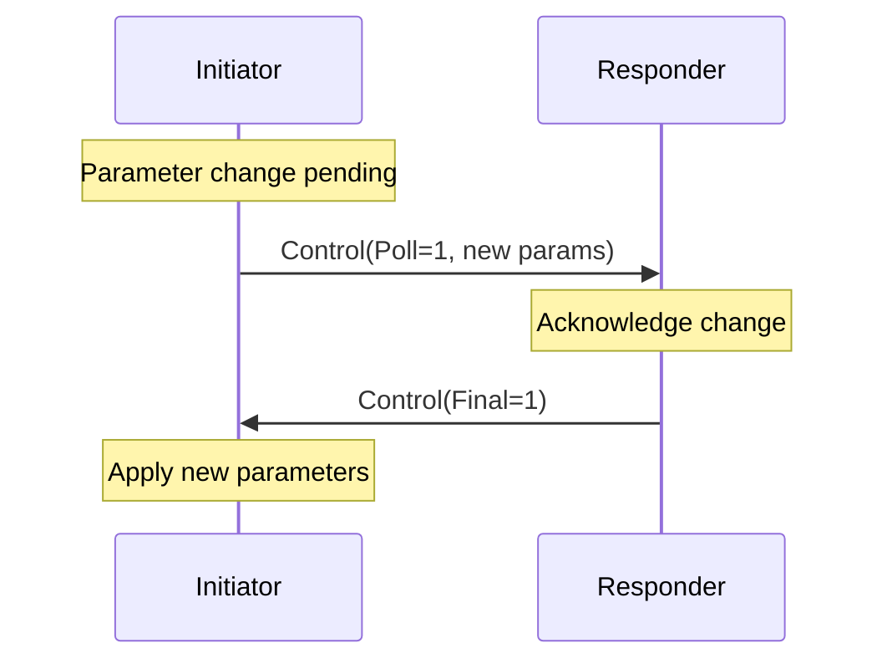

# BFD Protocol


> BFD protocol implementation details: FSM state machine, packet format, timer negotiation, jitter, authentication, and Poll Sequences.

---

### Table of Contents

- [BFD Control Packet Format](#bfd-control-packet-format)
- [FSM State Machine](#fsm-state-machine)
- [State Transition Table](#state-transition-table)
- [State Variables](#state-variables)
- [Timer Negotiation](#timer-negotiation)
- [Jitter](#jitter)
- [Poll Sequence](#poll-sequence)
- [Authentication](#authentication)
- [Not Implemented](#not-implemented)

### BFD Control Packet Format

RFC 5880 Section 4.1 defines a 24-byte mandatory header:

| Offset | Size | Field | Notes |
|---|---|---|---|
| 0 | 1 | Version (3 bits) + Diagnostic (5 bits) | Version MUST be 1 |
| 1 | 1 | State (2 bits) + P F C A D M (6 bits) | P=Poll, F=Final, C=CPI, A=Auth, D=Demand, M=Multipoint |
| 2 | 1 | Detect Multiplier | MUST NOT be zero |
| 3 | 1 | Length | Total packet length in bytes |
| 4-7 | 4 | My Discriminator | MUST NOT be zero |
| 8-11 | 4 | Your Discriminator | Zero until peer discriminator is known |
| 12-15 | 4 | Desired Min TX Interval | **Microseconds** |
| 16-19 | 4 | Required Min RX Interval | **Microseconds** |
| 20-23 | 4 | Required Min Echo RX Interval | **Microseconds** (always 0 -- Echo not implemented) |
| 24+ | var | Authentication Section | Optional, present when A bit is set |

> **IMPORTANT**: All interval fields are in **microseconds** on the wire. Conversion to `time.Duration` happens at the boundary:
> ```go
> interval := time.Duration(pkt.DesiredMinTxInterval) * time.Microsecond
> ```

**Zero-allocation codec**: `MarshalControlPacket` writes into a pre-allocated buffer (typically from `sync.Pool`). `UnmarshalControlPacket` fills a caller-provided `ControlPacket` struct in-place. Auth section digest/password fields reference the original buffer (zero-copy); callers must copy before returning the buffer to the pool.

### FSM State Machine

RFC 5880 Section 6.8.6 defines four states and the transitions between them:



The FSM is implemented as a pure function over a `map[stateEvent]transition` table. No if-else chains. No side effects -- the caller (Session) executes returned actions.

### State Transition Table

Derived from RFC 5880 Section 6.8.6 pseudocode:

| Current State | Event | New State | Actions |
|---|---|---|---|
| AdminDown | AdminUp | Down | (none) |
| Down | RecvDown | Init | SendControl |
| Down | RecvInit | Up | SendControl, NotifyUp |
| Down | AdminDown | AdminDown | SetDiagAdminDown |
| Init | RecvAdminDown | Down | SetDiagNeighborDown, NotifyDown |
| Init | RecvDown | Init | (self-loop) |
| Init | RecvInit | Up | SendControl, NotifyUp |
| Init | RecvUp | Up | SendControl, NotifyUp |
| Init | TimerExpired | Down | SetDiagTimeExpired, NotifyDown |
| Init | AdminDown | AdminDown | SetDiagAdminDown |
| Up | RecvAdminDown | Down | SetDiagNeighborDown, NotifyDown |
| Up | RecvDown | Down | SetDiagNeighborDown, NotifyDown |
| Up | RecvInit | Up | (self-loop) |
| Up | RecvUp | Up | (self-loop) |
| Up | TimerExpired | Down | SetDiagTimeExpired, NotifyDown |
| Up | AdminDown | AdminDown | SetDiagAdminDown |

Unlisted (state, event) pairs are silently ignored.

### State Variables

All mandatory state variables from RFC 5880 Section 6.1:

| RFC Variable | Go Field | Notes |
|---|---|---|
| bfd.SessionState | `session.state` (atomic) | External reads via `atomic.Uint32` |
| bfd.RemoteSessionState | `session.remoteState` (atomic) | From received packets |
| bfd.LocalDiscr | `session.localDiscr` | Immutable after creation |
| bfd.RemoteDiscr | `session.remoteDiscr` | Set from received packets |
| bfd.LocalDiag | `session.localDiag` (atomic) | Set by FSM actions |
| bfd.DesiredMinTxInterval | `session.desiredMinTxInterval` | Configurable |
| bfd.RequiredMinRxInterval | `session.requiredMinRxInterval` | Configurable |
| bfd.RemoteMinRxInterval | `session.remoteMinRxInterval` | From received packets |
| bfd.DemandMode | Not implemented | See [Not Implemented](#not-implemented) |
| bfd.RemoteDemandMode | `session.remoteDemandMode` | Parsed but ignored |
| bfd.DetectMult | `session.detectMult` | Configurable |
| bfd.AuthType | `session.auth` (interface) | Via `Authenticator` interface |
| bfd.RcvAuthSeq | `session.authState` | `AuthState` tracks this |
| bfd.XmitAuthSeq | `session.authState` | `AuthState` tracks this |
| bfd.AuthSeqKnown | `session.authState` | `AuthState` tracks this |

**Thread safety**: `state`, `remoteState`, and `localDiag` use `atomic.Uint32` for lock-free reads from the gRPC server goroutine. All other state is owned exclusively by the session goroutine.

**Initialization** per RFC 5880 Section 6.8.1:
- `bfd.SessionState` = Down
- `bfd.RemoteSessionState` = Down
- `bfd.LocalDiag` = 0 (None)
- `bfd.RemoteDiscr` = 0
- `bfd.RemoteMinRxInterval` = 1 (microsecond)
- `bfd.XmitAuthSeq` = random 32-bit value (via `crypto/rand`)

### Timer Negotiation

RFC 5880 Sections 6.8.1-6.8.4.

#### TX Interval

The actual transmission interval is the larger of the local desired minimum and the remote required minimum:

```
ActualTxInterval = max(bfd.DesiredMinTxInterval, bfd.RemoteMinRxInterval)
```

When the session is not in Up state, the TX interval is enforced to be at least 1 second (1,000,000 microseconds) per RFC 5880 Section 6.8.3.

#### Detection Time

The detection time is calculated from the remote peer's parameters:

```
DetectionTime = bfd.RemoteDetectMult * max(bfd.RequiredMinRxInterval, bfd.RemoteDesiredMinTxInterval)
```

If no packet is received within the Detection Time, the session transitions to Down with Diagnostic = Control Detection Time Expired (1).

### Jitter

RFC 5880 Section 6.8.7. Periodic transmission intervals include random jitter to prevent synchronization:

| Condition | Jitter Range | Effective Interval |
|---|---|---|
| DetectMult > 1 | 0-25% reduction | 75-100% of interval |
| DetectMult == 1 | 10-25% reduction | 75-90% of interval |

Implementation:

```go
func ApplyJitter(interval time.Duration, detectMult uint8) time.Duration {
    if detectMult == 1 {
        jitterPercent = 10 + rand.IntN(16) // 75-90%
    } else {
        jitterPercent = rand.IntN(26)       // 75-100%
    }
    return interval - (interval * jitterPercent / 100)
}
```

Uses `math/rand/v2` for jitter (not security-sensitive, called on hot path).

### Poll Sequence

RFC 5880 Section 6.5. Parameter changes (TX interval, RX interval) require a Poll Sequence for confirmation:



Key rules:
- Only one Poll Sequence may be active at a time (RFC 5880 Section 6.5)
- Pending values stored in `pendingDesiredMinTx` / `pendingRequiredMinRx`
- `pollActive = true` causes the Poll (P) bit to be set in outgoing packets
- When Final (F) bit is received, `terminatePollSequence()` applies pending values

> Parameter changes are deferred until poll completion rather than applied immediately. This matches the RFC intent: "A Poll Sequence MUST be used in order to verify that the change has been received."

### Authentication

RFC 5880 Section 6.7. Five authentication types are supported:

| Type ID | Name | RFC Section | Sequence Behavior |
|---|---|---|---|
| 1 | Simple Password | 4.2 | No sequence number |
| 2 | Keyed MD5 | 4.3 | Increment on state change only |
| 3 | Meticulous Keyed MD5 | 4.3 | Increment on every packet |
| 4 | Keyed SHA1 | 4.4 | Increment on state change only |
| 5 | Meticulous Keyed SHA1 | 4.4 | Increment on every packet |

**Meticulous vs Non-Meticulous**: Meticulous variants increment `bfd.XmitAuthSeq` on every transmitted packet. Non-meticulous variants increment only on session state changes. This distinction is critical for replay protection.

**Sequence number window**: For non-meticulous auth, received sequence numbers are accepted if they fall within `3 * DetectMult` of `bfd.RcvAuthSeq`. Meticulous auth requires strict monotonic increment.

**Key rotation**: `AuthKeyStore` supports multiple simultaneous keys indexed by Key ID, allowing hitless key rotation per RFC 5880 Section 6.7.1.

> **WARNING**: MD5 and SHA1 are retained despite cryptographic weakness because the RFC mandates them as the only defined hash-based auth types. GoBFD logs a warning at startup when MD5 auth is configured.

#### Auth Section Wire Format

| Auth Type | Wire Layout | Auth Len |
|---|---|---|
| Simple Password | Type(1) + Len(1) + KeyID(1) + Password(1-16) | 4-19 |
| Keyed MD5 | Type(1) + Len(1) + KeyID(1) + Reserved(1) + SeqNum(4) + Digest(16) | 24 |
| Meticulous MD5 | Same as Keyed MD5 | 24 |
| Keyed SHA1 | Type(1) + Len(1) + KeyID(1) + Reserved(1) + SeqNum(4) + Hash(20) | 28 |
| Meticulous SHA1 | Same as Keyed SHA1 | 28 |

### Not Implemented

#### Demand Mode (Section 6.6)

Not implemented. The Demand (D) bit is always set to zero on transmit. `bfd.RemoteDemandMode` is parsed from received packets but has no effect.

**Rationale**: Demand Mode is rarely used in production ISP/DC deployments. The primary use case (reducing BFD traffic) is better served by tuning TX/RX intervals. All major implementations (FRR, Junos, IOS-XR) default to Asynchronous mode.

#### Echo Mode (Section 6.4)

Not implemented. `RequiredMinEchoRxInterval` is always set to zero, indicating the local system does not support Echo.

**Rationale**: Echo Mode requires kernel cooperation for reflecting echo packets. It adds complexity with minimal benefit for the typical GoBFD deployment scenario (BFD-assisted BGP failover).

#### Point-to-Multipoint

The Multipoint (M) bit is always zero. Received packets with M=1 are rejected per RFC 5880 Section 6.8.6 step 5.

### Related Documents

- [01-architecture.md](./01-architecture.md) -- System architecture and packet flow
- [08-rfc-compliance.md](./08-rfc-compliance.md) -- Full RFC compliance matrix
- [RFC 5880 full text](../rfc/rfc5880.txt) -- RFC 5880

---

*Last updated: 2026-02-21*
