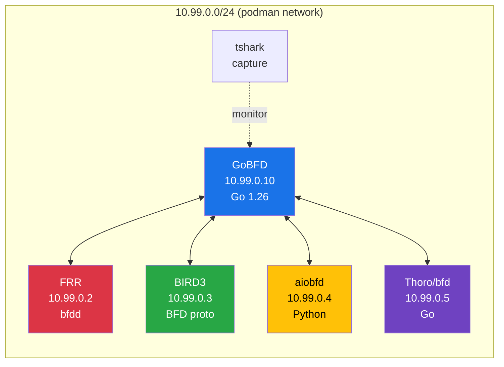
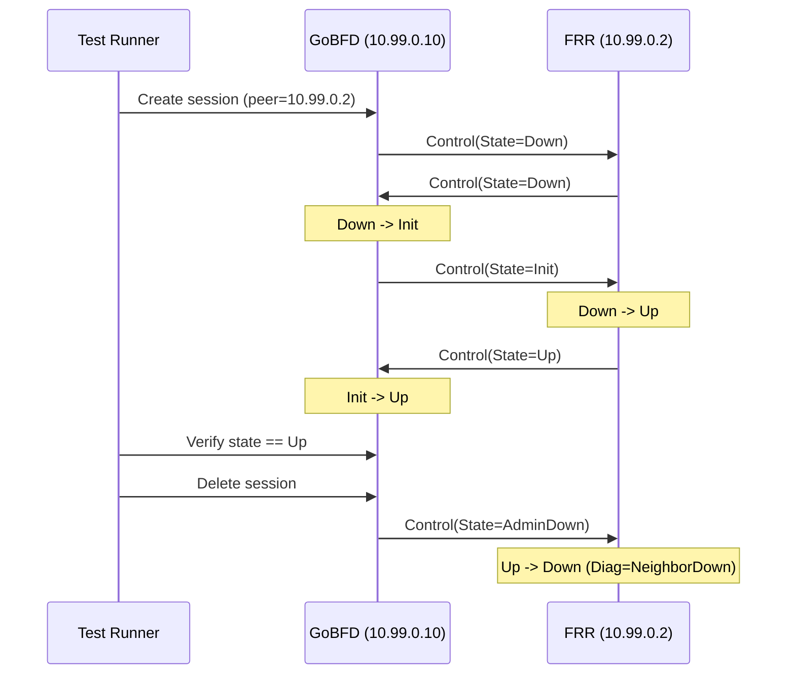
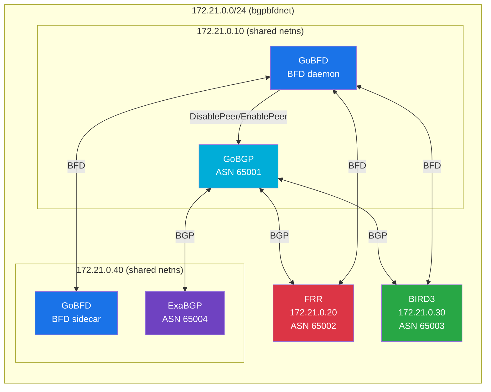
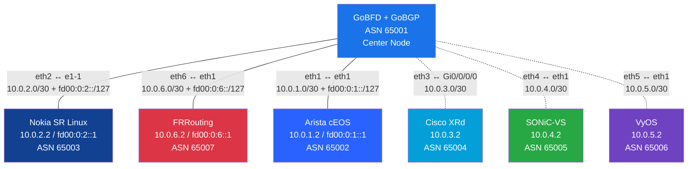

# Interoperability Testing


> 4-peer interoperability testing with FRR, BIRD3, aiobfd, and Thoro/bfd in a containerized Podman topology with packet capture.

---

### Table of Contents

- [Overview](#overview)
- [Test Topology](#test-topology)
- [Peer Implementations](#peer-implementations)
- [Running Interop Tests](#running-interop-tests)
- [What is Tested](#what-is-tested)
- [Packet Capture](#packet-capture)
- [Troubleshooting](#troubleshooting)

### Overview

GoBFD is tested against four independent BFD implementations to verify protocol compliance and interoperability. All peers run in a containerized Podman network, enabling reproducible automated testing.

### Test Topology



### Peer Implementations

| Peer | Implementation | Language | BFD Support | RFC |
|---|---|---|---|---|
| [FRR](https://frrouting.org/) | bfdd | C | Full | 5880, 5881, 5883 |
| [BIRD3](https://bird.network.cz/) | BFD protocol | C | Core | 5880, 5881 |
| [aiobfd](https://github.com/netedgeplus/aiobfd) | AsyncIO daemon | Python | Core | 5880, 5881 |
| [Thoro/bfd](https://github.com/Thoro/bfd) | gRPC daemon | Go | Core | 5880, 5881 |

### Running Interop Tests

#### Full Cycle (Recommended)

```bash
# Build, start topology, run tests, cleanup -- all in one
make interop
```

This runs `test/interop/run.sh` which handles the complete lifecycle.

#### Step by Step

```bash
# Step 1: Start the 4-peer topology
make interop-up

# Step 2: Run Go interop tests
make interop-test

# Step 3: Stop and cleanup
make interop-down
```

#### Inspect Captured Packets

```bash
# Summary view (CSV fields)
make interop-pcap-summary

# Full packet decode
make interop-pcap

# Live capture
make interop-capture
```

### What is Tested

The interop tests (`test/interop/interop_test.go`) verify:

| Test Case | Description |
|---|---|
| Session establishment | Three-way handshake with each peer reaches Up state |
| Session teardown | Graceful AdminDown propagation |
| Timer negotiation | Correct negotiated intervals across implementations |
| Packet capture analysis | tshark validates BFD packet format on the wire |



### Packet Capture

The topology includes a tshark container that captures all BFD traffic on the shared network. Captures are stored as `.pcapng` files.

```bash
# View captured packets with full decode
make interop-pcap

# Summary as CSV
make interop-pcap-summary

# Fields in summary:
#   frame.time_relative, ip.src, ip.dst,
#   bfd.version, bfd.diag, bfd.sta, bfd.flags,
#   bfd.detect_time_multiplier, bfd.my_discriminator,
#   bfd.your_discriminator, bfd.desired_min_tx_interval,
#   bfd.required_min_rx_interval
```

### Troubleshooting

| Issue | Solution |
|---|---|
| Containers fail to start | Check `podman network inspect` for IP conflicts |
| Sessions stuck in Down | Verify `CAP_NET_RAW` is available in containers |
| tshark no data | Ensure the shared network interface is configured |
| Tests timeout | Increase timeout: `make interop-test TIMEOUT=600s` |

```bash
# View all container logs
make interop-logs

# Inspect a specific container
podman logs gobfd-interop
```

---

## BGP+BFD Full-Cycle Testing


> End-to-end testing of the BFD->BGP coupling (RFC 5882): BFD failure detection triggers BGP peer disable, BFD recovery triggers BGP peer re-enable.

### BGP+BFD Topology



### Three Test Scenarios

| # | Scenario | BFD | BGP | Route |
|---|---|---|---|---|
| 1 | GoBFD+GoBGP ↔ FRR | FRR bfdd (native) | FRR bgpd (native) | `10.20.0.0/24` |
| 2 | GoBFD+GoBGP ↔ BIRD3 | BIRD3 BFD (native) | BIRD3 BGP (native) | `10.30.0.0/24` |
| 3 | GoBFD+GoBGP ↔ GoBFD+ExaBGP | GoBFD sidecar | ExaBGP (no BFD) | `10.40.0.0/24` |

### Full Cycle Test Flow

Each scenario tests three phases:

1. **Establish**: BGP session Established, BFD session Up, route received in GoBGP RIB
2. **Failure**: Stop/pause peer → BFD Down detected (~900ms) → GoBGP DisablePeer → route withdrawn
3. **Recovery**: Start/unpause peer → BFD Up → GoBGP EnablePeer → BGP re-established → route restored

### Running BGP+BFD Tests

```bash
# Full cycle (recommended)
make interop-bgp

# Step by step
make interop-bgp-up       # Start the BGP+BFD topology
make interop-bgp-test     # Run Go tests
make interop-bgp-down     # Cleanup

# View logs
make interop-bgp-logs
```

### Key Design: Shared Network Namespaces

GoBFD and GoBGP share a network namespace (both at `172.21.0.10`), so the BFD peer address matches the BGP neighbor address. When GoBFD detects BFD Down for peer `172.21.0.20`, it calls `DisablePeer("172.21.0.20")`, which correctly targets FRR's BGP session.

The same pattern applies to ExaBGP: GoBFD sidecar and ExaBGP share a netns at `172.21.0.40`. The ExaBGP test uses `podman pause` to freeze only the BFD sidecar while keeping ExaBGP's BGP session alive, proving BFD detects failure before BGP's holdtimer expires.

### Related Documents

- [09-development.md](./09-development.md) -- Development workflow and make targets
- [06-deployment.md](./06-deployment.md) -- Container image and Podman Compose
- [08-rfc-compliance.md](./08-rfc-compliance.md) -- RFC compliance matrix

---

## Vendor NOS Interoperability (Containerlab)


> Multi-vendor BFD interoperability testing against commercial/enterprise NOS containers. Validates RFC 5880/5881/5882 compliance against independent, production-grade BFD implementations. Dual-stack: IPv4 (RFC 5881 Section 4) and IPv6 (RFC 5881 Section 5) tested on every available vendor.

### Vendor Topology

Star topology with GoBFD at the center and dual-stack point-to-point links to each vendor NOS: IPv4 /30 (RFC 3021) and IPv6 /127 (RFC 6164) on the same veth pair. Containers and veth links are managed directly via Podman for maximum compatibility.



> Solid lines = available and tested (dual-stack). Dashed lines = defined in topology, skip if image absent (IPv4 only).

### Vendor Availability

| Vendor | Image | IPv4 Subnet | IPv6 Subnet | ASN | Status | License |
|---|---|---|---|---|---|---|
| **Nokia SR Linux** | `ghcr.io/nokia/srlinux:25.10.2` | `10.0.2.0/30` | `fd00:0:2::/127` | 65003 | Available | Free, no registration |
| **FRRouting** | `quay.io/frrouting/frr:10.2.5` | `10.0.6.0/30` | `fd00:0:6::/127` | 65007 | Available | GPL, free |
| **Arista cEOS** | `ceos:4.35.2F` | `10.0.1.0/30` | `fd00:0:1::/127` | 65002 | Available | Free Arista.com account |
| Cisco XRd | `ios-xr/xrd-control-plane:24.3.1` | `10.0.3.0/30` | -- | 65004 | Manual import | Cisco service contract |
| SONiC-VS | `docker-sonic-vs:latest` | `10.0.4.0/30` | -- | 65005 | Manual import | Free |
| VyOS | `vyos:latest` | `10.0.5.0/30` | -- | 65006 | Build from ISO | Free (rolling) |

### Prerequisites

- **Podman** with socket API active (`/run/podman/podman.sock`)
- **containerlab** 0.57+ (for topology reference; direct Podman management used)
- Container capabilities: `NET_ADMIN`, `NET_RAW`
- At least one vendor image available

### Running Vendor Tests

```bash
# Full cycle: build GoBFD image + deploy + test + cleanup
make interop-clab

# Step by step
make interop-clab-up     # Build + deploy topology
make interop-clab-test   # Run Go tests (topology must be up)
make interop-clab-down   # Destroy containers and veth links
```

### RFC Compliance Matrix

| Test | RFC Section | Description |
|---|---|---|
| Session establishment (v4+v6) | 5880 Section 6.8.6 | Three-way handshake reaches Up state |
| Failure detection (v4+v6) | 5880 Section 6.8.4 | Detection within DetectMult x interval |
| Packet format (v4) | 5880 Section 4.1, 5881 Section 4 | Version=1, TTL=255, port 3784 |
| Packet format (v6) | 5880 Section 4.1, 5881 Section 5 | Version=1, Hop Limit=255, port 3784 |
| Timer negotiation (v4+v6) | 5880 Section 6.8.2 | Negotiated TX = max(DesiredMinTx, RemoteMinRx) |
| Detection timing (v4+v6) | 5880 Section 6.8.4 | Detection time ~900ms (3 x 300ms) |
| Session independence | 5880 Section 6.8.1 | Failure of one vendor doesn't affect others (grouped by baseName) |

### Vendor-Specific Notes

**Nokia SR Linux**: BFD sessions are protocol-triggered (requires established BGP session). After config commit, the BFD subinterface is bounced (admin-state disable/enable) to force timer renegotiation from the YANG default of 1000ms to the configured 300ms. The SR Linux container runs the same code as production Nokia hardware.

**FRRouting**: Native `bfdd` daemon implements RFC 5880/5881/5882/5883. BFD timers are configured directly in `frr.conf` (300ms TX/RX, multiplier 3). FRR integrates BFD with BGP via `neighbor X bfd` directive. The container is ~188MB and starts in seconds.

**Arista cEOS**: BFD sessions are protocol-triggered (requires established BGP session via `neighbor X bfd`). cEOS 4.35.2F runs with `service routing protocols model multi-agent` and requires 8 mandatory environment variables for containerized operation (`CEOS=1`, `EOS_PLATFORM=ceoslab`, `INTFTYPE=eth`, etc.). Boot time is 60-120s; the test runner waits for `Cli -p 15 -c "show version"` to succeed. BFD state is checked via `Cli -p 15 -c "show bfd peers"`.

**GoBGP integration**: GoBFD runs alongside GoBGP (ASN 65001) inside the GoBFD container. Vendor NOS like Nokia require BGP for protocol-triggered BFD. When a vendor container is paused/unpaused, GoBGP's BGP neighbor transitions to `Idle(Admin)` and must be explicitly re-enabled via `gobgp neighbor <ip> enable`.

### IPv6 Dual-Stack BFD Testing

RFC 5881 defines BFD for both IPv4 (Section 4) and IPv6 (Section 5). The vendor interop suite tests both address families on every available vendor using dual-stack links.

**Key differences (RFC 5881 Section 5 vs Section 4)**:
- IPv6 uses Hop Limit=255 instead of TTL=255 for GTSM
- BFD sessions are per address family (separate IPv4 and IPv6 sessions per vendor)
- Same UDP port 3784 and source port range 49152-65535

**Address plan** (RFC 4193 ULA `fd00::/8`, /127 per link per RFC 6164):

| Vendor | GoBFD IPv6 | Vendor IPv6 | Link Prefix | Announced Route |
|---|---|---|---|---|
| Arista | `fd00:0:1::` | `fd00:0:1::1` | `fd00:0:1::/127` | `fd00:20:1::/48` |
| Nokia  | `fd00:0:2::` | `fd00:0:2::1` | `fd00:0:2::/127` | `fd00:20:2::/48` |
| FRR    | `fd00:0:6::` | `fd00:0:6::1` | `fd00:0:6::/127` | `fd00:20:6::/48` |

**Design notes**:
- ULA addresses avoid conflicts with global routing tables in lab environments
- /127 prefixes per RFC 6164 prevent ping-pong issues on inter-router point-to-point links
- IPv4 and IPv6 sessions share the same container but are independent BFD sessions
- The `SessionIndependence` test groups peers by `baseName` to correctly handle container pause affecting both address families

---

## Future: netlab Integration

[netlab](https://github.com/ipspace/netlab) is an orchestration layer on top of containerlab and libvirt/Ansible with a built-in BFD module that supports 16+ network platforms.

### Comparison: Current vs netlab

| Capability | Current (Podman + containerlab) | netlab |
|---|---|---|
| Topology management | Manual veth + Podman API | Automated (YAML declarative) |
| IP addressing | Static in run.sh | Auto-assigned |
| BFD configuration | Per-vendor config files | `module: [bgp, bfd]` directive |
| BGP configuration | Per-vendor + GoBGP TOML | Auto-generated per platform |
| Vendor support | 6 (native containers) | 29 (native + vrnetlab VMs) |
| Runtime | Podman (direct) | Docker (recommended) or Podman (experimental) |
| Prerequisites | Podman, containerlab | Python 3.8+, Ansible 2.9+, Docker/libvirt |

### Example netlab Topology

```yaml
provider: clab
module: [bgp, bfd]

nodes:
  gobfd:
    device: linux
    image: gobfd-clab:latest
  frr1:
    device: frr
  srlinux1:
    device: srlinux

links:
  - gobfd-frr1
  - gobfd-srlinux1
```

netlab automatically handles IP addressing, BGP AS assignment, and BFD session configuration on vendor nodes.

### Migration Path

1. Install Python 3.8+ and Ansible on the test host
2. Install netlab: `pip install networklab`
3. Install Docker (netlab's primary runtime)
4. Convert topology from manual run.sh to netlab YAML
5. For VM-based vendors (Cisco IOS-XR, Juniper vMX), enable nested KVM on the host

> **Note**: netlab requires dependencies not available on the current CI host (no Python pip, no Ansible, no KVM). It is documented as a future direction for expanding vendor coverage beyond native container platforms.

### Three-Tier Testing Strategy

Based on the analysis in `docs/tmp/bfd-interoperability-testing.md`:

| Tier | Vendor | Purpose | RFC Coverage |
|---|---|---|---|
| 1 (immediate) | FRRouting | Full open-source RFC coverage | 5880, 5881, 5882, 5883 |
| 2 (commercial) | Nokia SR Linux | Production-grade commercial NOS | 5880 (async mode) |
| 3 (breadth) | Arista cEOS | Independent enterprise implementation | 5880, 5881, S-BFD |

**Native containers** (FRR, SR Linux, cEOS) consume ~0.5 vCPU and 0.5-1.5 GB RAM each. A 3-node topology fits comfortably in a VM with 4 vCPU and 8 GB RAM.

**vrnetlab VM-in-container** platforms (Cisco IOL/IOSv/CSR, Juniper vMX/vPTX) require nested KVM and 2-8 GB RAM per node.

---

*Last updated: 2026-02-22*
