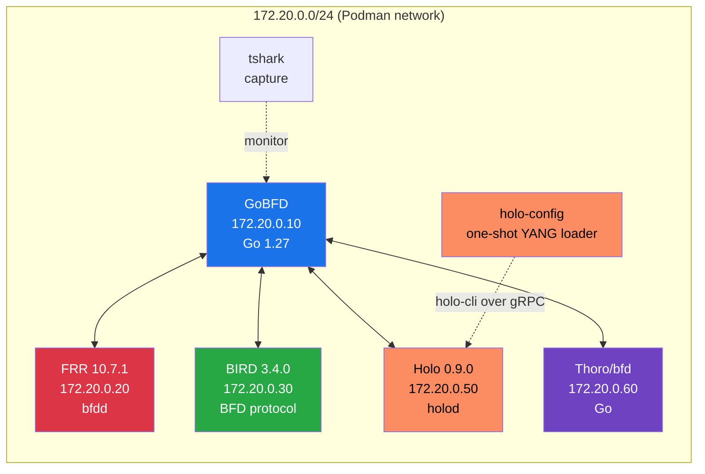
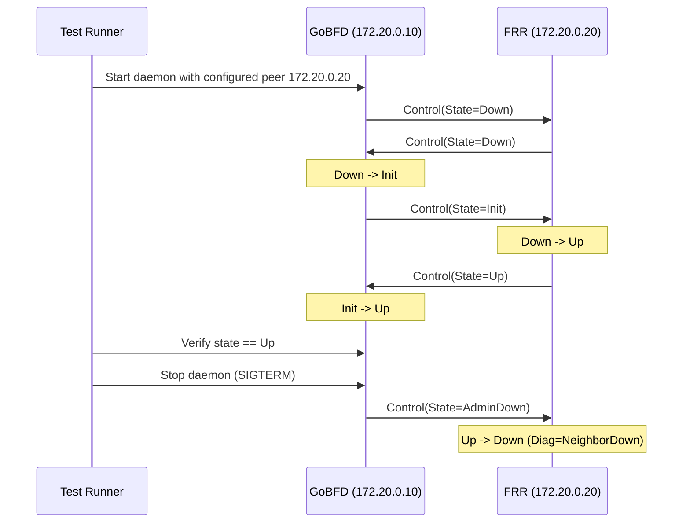
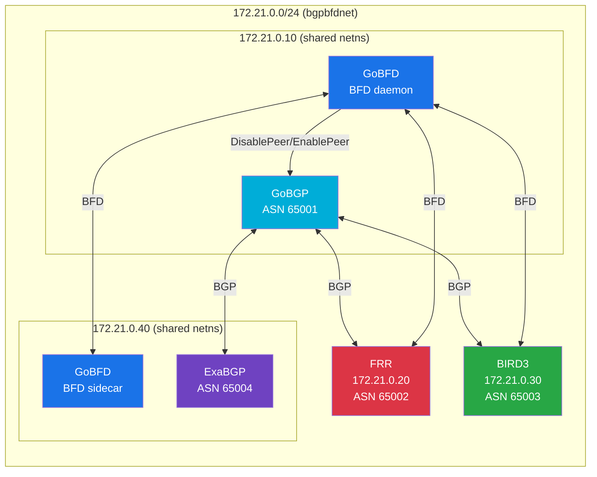
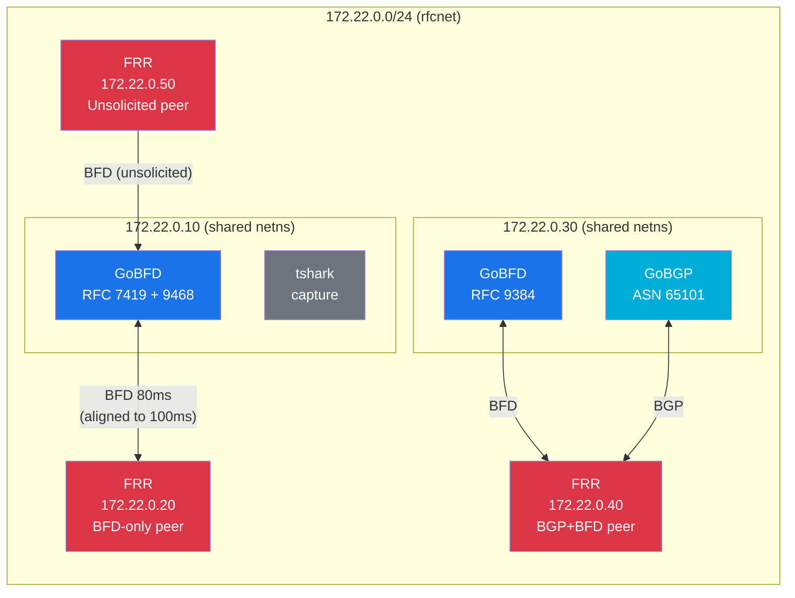
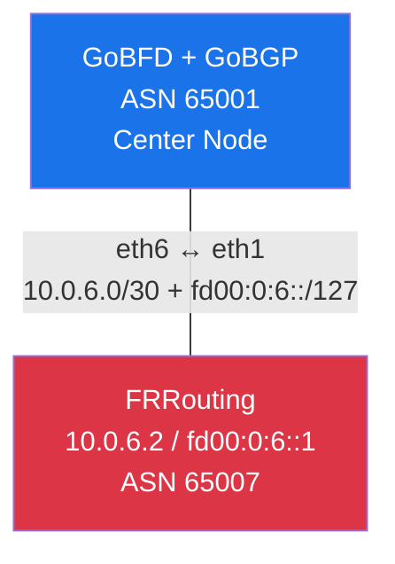

# Interoperability Testing


> Mandatory four-peer interoperability testing with Debian FRR 10.7.1, BIRD 3.4.0,
> Holo 0.9.0, and Thoro/bfd in a Podman topology with packet capture.
>
> **Remaining live-run blocker (2026-09-08):** the old pinned FRR `10.7.0`
> image uses Alpine 3.22.5. BASE now uses qualified Debian FRR `10.7.1`;
> E2E and Containerlab targets still using the old image must not run
> until their migration in Beads `gobfd-qj0.8.2.8.5.2.4` is accepted.
> A vendor image name is not an Alpine-policy exception.

This page describes the current `dev` harness and dated local results.
Historical receipts qualify only their recorded source, images and scenarios;
they are not a fresh run or stable-release acceptance. Publication remains on
hold until the separately tracked final candidate and release gates pass.
Use the pinned Compose provider from [Deployment](06-deployment.md#podman-compose)
and render the selected tracked Compose inputs before starting a topology.

The 2026-09-08 base consumer migration was locally accepted in Beads `.8.5.2.4.2.1`:
`test/interop/compose.yml` and its testcontainers harness use the shared
Debian FRR 10.7.1 recipe. Manual Compose and testcontainers gates passed on
linux/amd64 on 2026-09-08; the latter completed in 247.71 seconds with owned
container, network and image cleanup verified. Each ran the existing nine
functional tests. Both explicitly skipped BIRD3's source-port deviation and
capture-dependent detection precision; the manual run also skipped initial
diagnostic capture. These skips do not prove full RFC compliance.
Logs, PCAPs and a structured receipt are retained locally under
`reports/e2e/frr-base-caps-20260908/`. Check shared-host disk headroom before
each run. BGP and RFC are also locally qualified below; E2E and Containerlab
migration remain open.
The historical 10.7.0 baseline below is not relabeled.
The testcontainers and invalid-vector builds enforce CPU/RAM limits.
For manual BASE startup, `interopctl` renders `compose config --format json`
and builds each active image sequentially with two CPUs, 2 GiB RAM, no swap
and one build job. Both startup phases use `--no-build`; service limits apply
separately at runtime. Unsupported build options and `COMPOSE_COMPATIBILITY`
are rejected before building. Do not use `compose build --print` as a dry run:
Compose 5.5.0 with `DOCKER_BUILDKIT=0` can start actual builds.
`make interop-testcontainers` passes the full host checkout revision through
`GOBFD_BUILD_REVISION`, so an isolated worktree mount does not need access to
the host Git directory. Direct container invocations must supply the same value
when Git metadata is unavailable; malformed revisions are rejected.

The current BASE fixtures use Simple Password for FRR and Keyed SHA1 for
BIRD, with the public test-only key `gobfd-interop` and key ID 7. GoBFD sends
128-byte UDP payloads to both; Holo and Thoro remain unauthenticated with
24-byte payloads. FRR uses Simple Password because its pinned
[SHA1 implementation uses HMAC](https://github.com/FRRouting/frr/blob/frr-10.7.1/bfdd/bfd_packet.c#L532),
while [BIRD hashes the declared BFD PDU](https://github.com/CZ-NIC/bird/blob/e66773c42f115d80aaaef3b7246953b276a88065/proto/bfd/packets.c#L268).
GoBFD authentication is not weakened to accommodate either peer.

On 2026-10-15, `task/rfc9764-interop` at
`e71afa118ae10cac8e8a53e3672f7f7b6cc83afa` passed the critical race-enabled
manual Compose gate on linux/amd64: all four handshakes, Version, packet
length/authentication/padding, TTL 255, destination port and source-port range.
Capture checked 293 FRR-bound and 296 BIRD-bound GoBFD packets with BFD
Length 40/52, UDP Length 136, zero padding and IPv4 DF; 300 Holo-bound and
296 Thoro-bound packets retained BFD Length 24 and UDP Length 32. The GoBFD
API reported local and remote Up for all four peers. Evidence is retained
locally under `reports/rfc9764-interop/`. This is padded GoBFD TX and ordinary
authenticated peer RX qualification; peers do not send padding. The full
functional suite, timer reload and path MTU qualification did not run.
The invocation used the existing command-scoped container DNS override;
host resolver remediation remains open. Owned containers, network and images
are retained after stopping the exact verified container IDs.

The replacement recipe is `test/interop/frr/Containerfile`, built with
`test/interop/frr` as its context. It pins the shared Debian trixie base by
digest and official FRR `10.7.1-0~deb13u1` / libyang
`3.13.6-1~deb13u1` packages by architecture-specific SHA-256. The amd64
startup smoke passes; arm64 runtime and the remaining consumer migrations remain
unqualified. Historical `10.7.0` results below do not qualify this artifact.

Builds supply the full checkout commit as `VCS_REF` and an RFC 3339
`BUILD_DATE`, with `--cpu-period 100000 --cpu-quota 200000 --memory 2g
--memory-swap 2g --jobs 1`. Native foreground `watchfrr` supervises `mgmtd`,
`zebra`, `bfdd` and `staticd`; packaged startup applies `/etc/frr/frr.conf`.
BGP consumers must supply their daemon configuration and include `bgpd` in
the command. FRR requires `NET_ADMIN`, `NET_RAW` and `SYS_ADMIN`; no host
network or runtime socket is needed for the isolated startup smoke.
Python and `frr-pythontools` are not installed. Package-owned startup scripts
remain external FRR internals; no repository-owned shell launcher is added.

The smoke uses one CPU, 256 MiB, 64 PIDs and `--network none`: the configured
BFD peer remains Down, with TX/RX 300 ms, while all four daemons are Up.
Stopping within ten seconds exits with code 0 and removes their host PIDs.
This is PID-namespace teardown, **not graceful per-daemon shutdown**:
[watchfrr exits on SIGTERM](https://github.com/FRRouting/frr/blob/frr-10.7.1/watchfrr/watchfrr.c#L1027).
CycloneDX and SPDX reports are retained locally under
`reports/frr-debian-20260908/`. Debian dependency resolution is not snapshot
pinned, so this recipe does not claim bit-reproducible final images.
Beads `.8.5.2.4.1` covers this artifact slice; `.8.5.2.4.2` owns consumer
migration and live qualification. The remaining-consumer blocker above stays active.

---

## Table of Contents

- [Overview](#overview)
- [Test Topology](#test-topology)
- [Peer Implementations](#peer-implementations)
- [Running Interop Tests](#running-interop-tests)
- [What is Tested](#what-is-tested)
- [Packet Capture](#packet-capture)
- [Troubleshooting](#troubleshooting)
- [RFC-Specific Interop Testing](#rfc-specific-interop-testing)

### Overview

GoBFD is tested against four independent BFD implementations. The mandatory
base gate runs on `linux/amd64` because Holo publishes an official amd64 image
but no multi-architecture manifest. GoBGP and ExaBGP belong to the separate
BGP+BFD suite and are not counted as base peers.

### Test Topology


```mermaid
graph LR
    subgraph "172.20.0.0/24 (Podman network)"
        GOBFD["GoBFD<br/>172.20.0.10<br/>Go 1.27"]
        FRR["FRR 10.7.1<br/>172.20.0.20<br/>bfdd"]
        BIRD["BIRD 3.4.0<br/>172.20.0.30<br/>BFD protocol"]
        HOLO["Holo 0.9.0<br/>172.20.0.50<br/>holod"]
        LOADER["holo-config<br/>one-shot YANG loader"]
        THORO["Thoro/bfd<br/>172.20.0.60<br/>Go"]
        TSHARK["tshark<br/>capture"]
    end

    GOBFD <--> FRR
    GOBFD <--> BIRD
    GOBFD <--> HOLO
    GOBFD <--> THORO
    LOADER -.->|holo-cli over gRPC| HOLO
    TSHARK -.->|monitor| GOBFD

    style GOBFD fill:#1a73e8,color:#fff
    style FRR fill:#dc3545,color:#fff
    style BIRD fill:#28a745,color:#fff
    style HOLO fill:#fc8d62,color:#000
    style LOADER fill:#fc8d62,color:#000
    style THORO fill:#6f42c1,color:#fff
```

### Peer Implementations

| Peer | Version | Implementation | Language | Documented RFC coverage |
|---|---:|---|---|---|
| [FRR](https://frrouting.org/) | 10.7.1 | bfdd | C | 5880, 5881, 5882, 5883 |
| [BIRD3](https://bird.network.cz/) | 3.4.0 + fix | BFD protocol | C | 5880, 5881, 5882, 5883 |
| [Holo](https://github.com/holo-routing/holo/releases/tag/v0.9.0) | 0.9.0 | holod | Rust | 5880, 5881, 5882, 5883 |
| [Thoro/bfd](https://github.com/Thoro/bfd) | repository build | gRPC daemon | Go | 5880, 5881 |

The BIRD recipe builds tag commit `c3669497e3949b942d86d07e343092cc439b4659`
and applies the checksum-pinned upstream fix
[`7cf75587`](https://gitlab.nic.cz/labs/bird/-/commit/7cf75587b6f38b87849fe192bf5dfd124b7702bc)
for CVE-2026-112112. The image records both hashes in
`/usr/share/doc/bird/gobfd-source.txt`. `TestBIRDFlowSpecValidation`
(`interop_testcontainers` tag) checks that BIRD marks an IPv6 FlowSpec
destination with a nonzero offset invalid; `make interop-testcontainers` runs
it. BIRD is built from source, so image SBOMs and package scanners do not list
it.

Holo uses the immutable official image digest recorded in `compose.yml`. The
daemon starts with `holo/holod.toml`; a healthy-gated, one-shot `holo-config`
service then applies `holo/holo.startup` through `holo-cli`. The YANG values are
microseconds: `300000` for both transmit and receive intervals with multiplier
`3`, producing the negotiated 300 ms interval and 900 ms detection time. The
loader has no fixed address and is not a fifth peer.

### Crafted Go Peer

The pinned FRR/BIRD profiles do not exercise every zero-RX and remote-Demand
input. BIRD zero-RX behavior is not a general proven limitation.
`TestCraftedPeerTestcontainers` (`interop_testcontainers` tag)
therefore runs a separate topology: GoBFD with one session from
`gobfd/crafted-peer.yml`, tshark in the GoBFD network namespace, and the
repository-owned Go tool from `scapy/Containerfile` started with the `peer`
argument at `172.20.0.40`. Without an argument the same binary still sends the
invalid-vector corpus. The peer uses the in-repository codec, TTL 255, source
port 49152, Poll/Final, the slow rate outside Up and no authentication. Each
`SIGUSR1` from the test moves it to the next phase:

| Phase | Peer action | Capture assertion |
|---|---|---|
| `rx0`, `poll` | Required Min RX 0 with a Poll, then a second Poll | Only Finals from GoBFD, one per Poll, for at least 10 negotiated intervals (RFC 5880 Section 6.8.7) |
| `silent` | No transmission | The daemon logs Down with diag 1 one Detection Time (from `gobfdctl`, cross-checked with the wire) after the last peer frame, within `[DT-1 ms, DT+max(2 ms, DT/50)]`; the first GoBFD frame (Down, diag 1, Your Discriminator 0) follows within `DT+50 ms+max(2 ms, DT/50)` of the last peer frame, then at least 3 slow-rate intervals within the jitter bounds (Sections 6.8.4, 6.8.7 and 6.8.18) |
| `recover` | New three-way handshake | Up with 300 ms timers in both directions |
| `demand` | D=1 with a Poll | GoBFD answers with Final and then sends only Poll or Final frames; a SIGHUP to 500 ms produces a GoBFD Poll with the new timers, a peer Final, and a converged reload receipt after that Final (Sections 6.5 and 6.6) |
| `demand-clear` | D=0 with a Poll | GoBFD answers with Final and resumes periodic TX within `T+slack`, then at least 12 intervals pass the jitter bound and the 3-standard-error mean check for T=500 ms |
| `final-loss`, `poll`, `final-restore` | Drops its Final replies (simulated loss), then crosses the outstanding GoBFD Poll with its own Poll, then answers again | SIGHUP to 400 ms and, while the Final is lost, to 800 ms: GoBFD repeats P=1 with the active 400 ms tuple, answers the crossing Poll with F only and the same tuple, resumes P=1, and sends the 800 ms Poll only after the peer Final plus at least the measured exchange time; that Poll gets its own Final and receipt (Sections 6.5 and 6.8.3); no captured frame sets both P and F |

`make interop-testcontainers` runs the pure evaluator tests
(`TestCraftedPeerEvidence*`) and the live topology. The test stores the daemon
and peer logs, the frame TSV, the summary JSON and the PCAP with SHA-256 files
under `INTEROP_TESTCONTAINERS_ARTIFACT_DIR`.

The existing reload scenarios also exercise Detect Multiplier changes:
authenticated FRR/BIRD3 Async sessions use 1→5→3 without a GoBFD Poll;
the crafted remote-Demand session uses 5→3, each with its own Poll, peer Final,
applied receipt and quiet window. DetectMult 1 uses 75–90% jitter with mean
0.825T; other tested multipliers use 75–100% with mean 0.875T. Capture checks
preserve UDP source port/length, authentication type/key/sequence, discriminators
and timers. Before mutations, runtime tshark registry queries are restricted to
`frame.`, `ip.`, `bfd.` and `udp.`; the retained rows use first-column field
matching. This avoids buffering the full registry in the bounded race runner.
Local receive Detection Time uses the peer's multiplier. Derived peer Async
and local Demand Poll bounds are labelled separately from measured timing;
the crafted peer does not implement a detection timer. Source contracts alone
do not close P0 `gobfd-qj0.8.2.2.7.5.2`; actual candidate captures are required.

Local qualification on `d9e67064e51012c0d25a1a22dc9bd469600d8469` passes both
topologies with those captures; receipts are in `reports/detect-wire-20261024/`.
This does not close prepared-padding, TTL or final five-field qualification.

Prepared-padding scenarios extend the same timer lifecycle with authenticated
128→192→128 targets, rejected auth+padding changes, padding enable/disable,
and combined-candidate rejection. The meticulous SHA1 startup profile uses
`TestFourPeerMeticulousTopologyTestcontainers`; the default keyed SHA1 profile
remains `TestFourPeerTopologyTestcontainers`. Each loads and restores its own
selected immutable baseline. The independent peer keeps its own packet size.
Capture verification retains replay state across phases and retries, and
checks DF, raw UDP payload, declared PDU length, zero padding and MAC domain.
Aggregate and named BFD readiness are probed inside the owned daemon container
through the existing Unix socket, using the same compiled interop executable
copied through container files; TCP remains loopback-only. The crafted peer accepts
SIGUSR2 as a current-state Poll probe without advancing its phase or clearing
Demand, allowing old-size Final evidence after a rejected Demand resize.
Actual capture acceptance is tracked separately in
`gobfd-qj0.8.2.2.7.5.3.3`; source-only results do not close it.

Local qualification at `b97729458a696aee21023ba147af51417ed9ff7b` passes both
FourPeer profiles and crafted Demand with these captures. The three runtime
receipts and 675 verified sidecars are in `reports/padding-wire-20261024/`.
This qualifies the padding reload slice only; actual TTL, unified final-candidate
and stable-release gates remain separate. Baseline initial-Down and
DetectionPrecision skips require final-gate disposition alongside the known
BIRD Linux source-port range deviation.

Final-candidate qualification limits decoded TShark rows after display filtering;
`-c` limits packets read and can hide later matching frames. Missing initial
Down(diag=0) or detection-expiry evidence fails these mandatory assertions.
The remaining BIRD source-port exception is source-backed: its pinned
[BFD TX socket](https://github.com/CZ-NIC/bird/blob/c3669497e3949b942d86d07e343092cc439b4659/proto/bfd/packets.c#L496)
requests `SKF_HIGH_PORT`, but
[the platform helper](https://github.com/CZ-NIC/bird/blob/c3669497e3949b942d86d07e343092cc439b4659/sysdep/unix/io.c#L796)
does not enforce the RFC 5881 range on Linux. The retained padding capture has
938 BIRD packets from port 43990; this is a peer deviation, not GoBFD compliance
coverage. The shared builder retains immutable image IDs and required OCI
source/base annotations before cleanup. Evidence: `reports/final-wire-20261024/`;
actual final-candidate qualification remains with `gobfd-qj0.8.2.2.7.5.5`.
The default FourPeer gate passes on
`e4e79a8eee8e7c38bfc78321bdc5e9030909c214` in 429.47 s with all ten scenarios,
initial Down and DetectionPrecision executed (0.901 s gap), one explicit BIRD
RFC skip, six retained image identities, 867 matching source hashes and 310
matching artifact sidecars. Fourteen readiness probes return both services
SERVING. The 512 MiB runner has zero max/OOM events and swap; exact image
absence is verified after cleanup. Repeat all four final profiles after the
remaining production thread/scale changes.

The same crafted lifecycle also provides `TestCraftedMultihopTTLTestcontainers`
with the closed `peer-multihop` startup command: UDP/4784, meticulous SHA1,
local RX 3 s and unchanged TX 300 ms. `SIGUSR1` enters remote Demand;
three `SIGUSR2` steps pause peer periodic TX before reload, replay its last
accepted payload at admissible TTL, then send a fresh below-floor Poll and
its byte-identical at-floor retry at successive 200 ms slots, then resume
after authenticated Final and counter snapshots. Max-hops 1→5→1 is exercised
in Async and remote Demand, followed by rejected auth+hop-policy input.
Capture/authentication checkpoints persist across phases. Accepted RX increases
by one; exactly one auth failure accounts for the deliberate replay, and
state transitions remain unchanged. A persistent initial baseline checks
reload and Demand transitions as well as each probe. This
checks GoBFD's local `255 - N` policy; routed/cloud acceptance remains separate.
Actual qualification belongs to `gobfd-qj0.8.2.2.7.5.4.3`.

Local qualification on `491b2214994f07e017eb93ab67a29a95378c619e` passes the
default crafted profile in 162.94 s and authenticated multihop in 81.98 s.
All seven boundary/replay windows pass; 863 source hashes and 212 artifact
sidecars match. Evidence: `reports/ttl-wire-20261024/`. Both profiles repeat
on the corrected source after a duplicated session-log attribute was removed;
strict JSON receipt parsing remains enforced. This does not close unified
five-field or stable-release qualification.

### Running Interop Tests

#### Full Cycle (Recommended)

```bash
# Build, start topology, run tests, cleanup -- all in one
make interop
```

This runs the Go-owned testcontainers lifecycle. It validates fixed-name
availability, requires the Holo loader to exit with status zero, runs the Go
assertions, persists the packet capture, and verifies cleanup of every
test-owned container, network, and image.

#### Explicit Go testcontainers Target

```bash
make interop-testcontainers
```

This is the explicit form of the default full-cycle target. Its four-peer
profiles create the static-IP network, GoBFD, FRR, BIRD3, Holo,
Thoro/bfd, and tshark directly through the Podman testcontainers provider. It
runs the same Go assertions, retains the packet capture under
`reports/e2e/interop-testcontainers`, and verifies removal of every test-owned
container, network, and image.

The target also selects the meticulous SHA1 four-peer profile, the BIRD
FlowSpec regression, the crafted peer and authenticated multihop TTL profiles.
Their artifacts and acceptance scopes remain distinct; a four-peer result
does not substitute for all selected profiles. See the exact selection in
[`Makefile`](../../Makefile) and the harnesses under `test/interop/`.

#### Step by Step

```bash
# Step 1: Start the 4-peer topology
make interop-up

# Step 2: Run Go interop tests
make interop-test

# Step 3: Stop and cleanup
make interop-down
```

The manual `interop-test` target does not currently add `-race`; it is not
equivalent to the full-cycle race-enabled gate. Prefer `make interop` for
candidate qualification; retain this difference in any manual-run receipt.

#### Inspect Captured Packets

```bash
# Summary view (CSV fields)
make interop-pcap-summary

# Full packet decode
make interop-pcap

# Live capture
make interop-capture
```

### What is Tested

The interop tests (`test/interop/interop_test.go`) verify:

| Test Case | Description |
|---|---|
| Session establishment | Three-way handshake with each peer reaches Up state |
| Session teardown | Graceful AdminDown propagation |
| Timer negotiation | Correct negotiated intervals across implementations |
| Packet capture analysis | tshark validates BFD packet format on the wire |


```mermaid
sequenceDiagram
    participant T as Test Runner
    participant G as GoBFD (172.20.0.10)
    participant F as FRR (172.20.0.20)

    T->>G: Start daemon with configured peer 172.20.0.20
    G->>F: Control(State=Down)
    F->>G: Control(State=Down)
    Note over G: Down -> Init
    G->>F: Control(State=Init)
    Note over F: Down -> Up
    F->>G: Control(State=Up)
    Note over G: Init -> Up
    T->>G: Verify state == Up
    T->>G: Stop daemon (SIGTERM)
    G->>F: Control(State=AdminDown)
    Note over F: Up -> Down (Diag=NeighborDown)
```

The testcontainers BASE harness runs `TestTimerReload` between the RFC baseline
analysis and destructive lifecycle tests, in three ordered subprocess batches. It
changes only test-owned FRR/BIRD configurations: peer RX floor 100 ms, local
`300→100→500→300 ms`, then separate explicit RX0 phases with baseline
restoration. Every phase requires generation-qualified JSON receipts, a closed
packet window with Poll and Final, and applied receipt publication after the
completing Final. Nonzero phases also require unchanged discriminators, Up state
and text CLI counters. RX0 phases require the zero advertisement, receipts and
restoration; a Down after Final is permitted because the peer may stop
transmitting: BIRD 3.4.0 does, FRR 10.7.1 continues. Exact JSON/PCAP timestamps
assume the testcontainers daemon and capture share one host realtime clock; no
rounding or clock-skew allowance is applied.

Timing requires at least 12 consecutive post-Final periodic intervals sent by
GoBFD. RFC 5880 section 6.8.7 bounds each interval to 75–100% of the negotiated
TX when DetectMult exceeds 1. The check widens these bounds by max(2 ms, 2% of
TX) for timer wakeup and capture latency. It requires the sample mean within
three standard errors of 87.5%, the mean of the uniform 0–25% reduction that
GoBFD draws; the upper side adds the same latency allowance because the timer
rearms after each send. Logs,
configurations, frame summaries, subprocess statuses, checksums and a
readback-validated PCAP are retained in `INTEROP_TESTCONTAINERS_ARTIFACT_DIR`
before owned cleanup on success and failure; without an explicit directory the
harness prints a retained temporary path. The testcontainers topology runs the
daemon with JSON logs; log assertions accept both the text and JSON forms.

On 2026-10-21 the gate-compiled binary of `af7c907` passed all eight phases
against FRR 10.7.1 and BIRD 3.4.0 with fix `7cf75587`. Pooled GoBFD intervals at
100, 300 and 500 ms (n = 37, 26, 25) had means of 88.3%, 89.1% and 86.2% of the
negotiated TX. Kolmogorov–Smirnov and χ² tests at α = 0.05 did not reject the
uniform 75–100% model; the largest excess over 100% was 0.97 ms. Authenticated selective-Final loss, deterministic crossed
Poll and remote Demand remain open under `gobfd-qj0.8.2.1.1.1.4.3`; H-05 remains
partial.

### Packet Capture

The topology includes a tshark container that captures all BFD traffic on the shared network. Captures are stored as `.pcapng` files.

```bash
# View captured packets with full decode
make interop-pcap

# Summary as CSV
make interop-pcap-summary

# Fields in summary:
#   frame.time_relative, ip.src, ip.dst,
#   bfd.version, bfd.diag, bfd.sta, bfd.flags,
#   bfd.detect_time_multiplier, bfd.my_discriminator,
#   bfd.your_discriminator, bfd.desired_min_tx_interval,
#   bfd.required_min_rx_interval
```

### Troubleshooting

| Issue | Solution |
|---|---|
| Containers fail to start | Check `podman network inspect` for IP conflicts |
| Sessions stuck in Down | Verify `CAP_NET_RAW` is available in containers |
| tshark no data | Ensure the shared network interface is configured |

```bash
# View project-owned container logs through the guarded target
make interop-logs
```

---

## BGP+BFD Full-Cycle Testing


> End-to-end testing of the BFD->BGP coupling (RFC 5882): BFD failure detection triggers BGP peer disable, BFD recovery triggers BGP peer re-enable.

### BGP+BFD Topology


```mermaid
graph LR
    subgraph "172.21.0.0/24 (bgpbfdnet)"
        subgraph "172.21.0.10 (shared netns)"
            GOBFD["GoBFD<br/>BFD daemon"]
            GOBGP["GoBGP<br/>ASN 65001"]
        end
        FRR["FRR<br/>172.21.0.20<br/>ASN 65002"]
        BIRD["BIRD3<br/>172.21.0.30<br/>ASN 65003"]
        subgraph "172.21.0.40 (shared netns)"
            GOBFD2["GoBFD<br/>BFD sidecar"]
            EXABGP["ExaBGP<br/>ASN 65004"]
        end
    end

    GOBFD <-->|BFD| FRR
    GOBGP <-->|BGP| FRR
    GOBFD <-->|BFD| BIRD
    GOBGP <-->|BGP| BIRD
    GOBFD <-->|BFD| GOBFD2
    GOBGP <-->|BGP| EXABGP
    GOBFD -->|DisablePeer/EnablePeer| GOBGP

    style GOBFD fill:#1a73e8,color:#fff
    style GOBGP fill:#00ADD8,color:#fff
    style FRR fill:#dc3545,color:#fff
    style BIRD fill:#28a745,color:#fff
    style GOBFD2 fill:#1a73e8,color:#fff
    style EXABGP fill:#6f42c1,color:#fff
```

### Three Test Scenarios

| # | Scenario | BFD | BGP | Route |
|---|---|---|---|---|
| 1 | GoBFD+GoBGP ↔ FRR | FRR bfdd (native) | FRR bgpd (native) | `10.20.0.0/24` |
| 2 | GoBFD+GoBGP ↔ BIRD3 | BIRD3 BFD (native) | BIRD3 BGP (native) | `10.30.0.0/24` |
| 3 | GoBFD+GoBGP ↔ GoBFD+ExaBGP | GoBFD sidecar | ExaBGP (no BFD) | `10.40.0.0/24` |

### Full Cycle Test Flow

Each scenario tests three phases:

1. **Establish**: BGP session Established, BFD session Up, route received in GoBGP RIB
2. **Failure**: Stop/pause peer → BFD Down detected (~900ms) → GoBGP DisablePeer → route withdrawn
3. **Recovery**: Start/unpause peer → BFD Up → GoBGP EnablePeer → BGP re-established → route restored

### Running BGP+BFD Tests

**BGP trixie qualification passed locally** (Beads `gobfd-qj0.8.2.8.5.2.4.2.2`).
The approved replacement uses shared recipes under `test/interop/` for FRR,
GoBGP and ExaBGP. GoBGP v4.10.0 is built from upstream commit
`da824d99912e02124b53741245ee4186c381adcc` on trixie; the recipe pins Go 1.27.3,
while the recorded qualification used the Go 1.27.2 builder and is repeated under
`gobfd-bjr`. GoBGP v3
serves `/apipb.GobgpApi` and v4 serves `/api.GoBgpService`; the two are
wire-incompatible, so `dev` GoBFD requires a GoBGP v4 daemon. GoBGP v4 native
BFD is disabled by default, and no repository GoBGP configuration enables it.
External ExaBGP 5.0.13 uses trixie's system
Python and its native `python3 -m exabgp` entrypoint, without pip, uv, a custom
launcher or repository-owned Python source. Its
[pinned upstream manifest](https://github.com/Exa-Networks/exabgp/blob/edf249571174449f80c72d75eb6933dcabd67f92/pyproject.toml)
declares no runtime package dependencies. Both source archives are SHA-256
pinned. This narrowly scoped ExaBGP runtime exception does not permit Python
development tooling.

With GoBGP v3.37.0 on linux/amd64, manual Compose and the complete
testcontainers gate passed on 2026-09-08; the latter took 200.07 seconds.
Both ran all four existing race-enabled BGP tests: peer establishment and
FRR/BIRD3/ExaBGP failure, route withdrawal and recovery, with no skipped
tests. Seven containers per topology were limited to one CPU, 256 MiB RAM,
no swap and 128 PIDs; inspection found no OOM kills. Sequential builds were
limited to two CPUs and 2 GiB. Owned containers, networks and image tags were
removed. Logs, PCAPs, CycloneDX/SPDX peer SBOMs and the acceptance receipt
are retained locally in `reports/e2e/bgp-trixie-20260908/`. This does not
qualify arm64, remaining image consumers, timer reloads or full RFC
compliance. Debian package resolution is not snapshot-pinned; final images are
not claimed to be bit-reproducible.
The recorded v0.6 risk acceptance covers GoBGP v3.37.0. On `dev`, the
`GO-2026-4736` exception permits only module-level findings for the pinned
GoBGP v4 module; the final candidate still requires fresh runtime and tool
scans. The acceptance rationale and removal trigger are described in
[SECURITY.md](../../SECURITY.md) and the
[dependency risk register](reference/dependency-risk.md).
Keep these peers isolated from untrusted networks; BGP functionality and SBOMs
are not a security qualification.

On 2026-10-13, at commit `f85ca09` on linux/amd64, the testcontainers gate
`TestBGPBFDTopologyTestcontainers` passed with GoBGP v4.10.0 in 359.25
seconds: all four race-enabled subtests (`AllPeersUp`, FRR, BIRD3, ExaBGP)
ran without skips, the GoBGP version assertion reported 4.10.0, and no
containers remained. The manual Compose path was not rerun on GoBGP v4.

```bash
# Authoritative routing aggregate with owned artifacts and cleanup
make e2e-routing

# Default full cycle: Go owns the Podman lifecycle through testcontainers
make interop-bgp
```

The Go lifecycle creates the static network, both GoBFD instances, GoBGP
v4.10.0, FRR 10.7.1, BIRD 3.4.0, ExaBGP 5.0.13, and tshark directly through
the Podman provider. It runs the same establish, failure, route-withdrawal, and
recovery assertions, saves a non-empty packet capture, and proves removal of
all test-owned containers, network, and locally built images.

Both BGP paths select `mgmtd`, `zebra`, `bgpd`, `bfdd` and `staticd` for native
`watchfrr`. The tracked FRR configuration remains read-only in Compose; these
tests stop/start peers but do not save configuration. All seven services have
one CPU, 256 MiB RAM, no additional swap and 128 PIDs. Image builds use the
two-CPU / 2 GiB limits above. Manual `make interop-bgp-up/down/logs` uses the
existing ownership-checked controller, with `up --no-build` after capped builds.
`INTEROP_BGP_PROJECT_NAME` defaults to `${INTEROP_PROJECT_NAME}-bgp`, matching
the routing aggregate; manual tests use that same project. Shared `dev-exec`
allows ten minutes for compilation and the five-minute suite, while ordinary
control commands retain their two-minute bound. The testcontainers
target passes the host revision and registers image cleanup before building.

### Key Design: Shared Network Namespaces

GoBFD and GoBGP share a network namespace (both at `172.21.0.10`), so the BFD peer address matches the BGP neighbor address. When GoBFD detects BFD Down for peer `172.21.0.20`, it calls `DisablePeer("172.21.0.20")`, which correctly targets FRR's BGP session.

The same pattern applies to ExaBGP: GoBFD sidecar and ExaBGP share a netns at `172.21.0.40`. The ExaBGP test uses `podman pause` to freeze only the BFD sidecar while keeping ExaBGP's BGP session alive, proving BFD detects failure before BGP's holdtimer expires.

### Related Documents

- [09-development.md](./09-development.md) -- Development workflow and make targets
- [06-deployment.md](./06-deployment.md) -- Container image and Podman Compose
- [08-rfc-compliance.md](./08-rfc-compliance.md) -- RFC compliance matrix

---

## RFC-Specific Interop Testing


> Targeted interoperability tests for RFC extensions beyond the base protocol
> in an eight-container topology with packet capture (tshark).

### RFC Interop Topology


```mermaid
graph LR
    subgraph "172.22.0.0/24 (rfcnet)"
        subgraph "172.22.0.10 (shared netns)"
            GOBFD["GoBFD<br/>RFC 7419 + 9468"]
            TSHARK["tshark<br/>capture"]
        end
        FRR_BFD["FRR<br/>172.22.0.20<br/>BFD-only peer"]
        subgraph "172.22.0.30 (shared netns)"
            GOBFD2["GoBFD<br/>RFC 9384"]
            GOBGP["GoBGP<br/>ASN 65101"]
        end
        FRR_BGP["FRR<br/>172.22.0.40<br/>BGP+BFD peer"]
        FRR_UNSOL["FRR<br/>172.22.0.50<br/>Unsolicited peer"]
    end

    GOBFD <-->|"BFD 80ms<br/>(aligned to 100ms)"| FRR_BFD
    GOBFD2 <-->|"BFD"| FRR_BGP
    GOBGP <-->|"BGP"| FRR_BGP
    FRR_UNSOL -->|"BFD (unsolicited)"| GOBFD

    style GOBFD fill:#1a73e8,color:#fff
    style GOBFD2 fill:#1a73e8,color:#fff
    style GOBGP fill:#00ADD8,color:#fff
    style FRR_BFD fill:#dc3545,color:#fff
    style FRR_BGP fill:#dc3545,color:#fff
    style FRR_UNSOL fill:#dc3545,color:#fff
    style TSHARK fill:#6c757d,color:#fff
```

### Containers (8)

| Container | IP | Role |
|---|---|---|
| `gobfd-rfc` | 172.22.0.10 | GoBFD with align_intervals + unsolicited enabled |
| `tshark-rfc` | (shared netns) | Packet capture on gobfd-rfc's interfaces |
| `frr-rfc` | 172.22.0.20 | FRR BFD-only peer for RFC 7419 timer alignment |
| `gobfd-rfc9384` | 172.22.0.30 | GoBFD with GoBGP integration for RFC 9384 |
| `gobgp-rfc` | (shared netns) | GoBGP ASN 65101 for BGP Cease testing |
| `frr-rfc-bgp` | 172.22.0.40 | FRR BGP+BFD peer for RFC 9384 |
| `frr-rfc-unsolicited` | 172.22.0.50 | FRR BFD peer with no pre-configured session on GoBFD |
| `echo-reflector` | 172.22.0.60 | Independent UDP echo reflector for RFC 9747 |

### Recorded Test Results

The results below summarize the dated local runs described under
[Running RFC Interop Tests](#running-rfc-interop-tests). The current candidate
must rerun the gate; these labels are not current execution results.

| Test | RFC | Description | Result |
|---|---|---|---|
| `TestRFC7419_CommonIntervalAlignment` | 7419 | GoBFD configures 80ms timers; with `align_intervals: true`, negotiated interval should be aligned to 100ms. Verified via tshark capture of `DesiredMinTxInterval` field on the wire. | **PASS** |
| `TestRFC9384_BGPCeaseBFDDown` | 9384 | Pause frr-rfc-bgp → BFD Down → GoBFD calls DisablePeer → verify BGP session torn down. Unpause → BFD Up → EnablePeer → BGP re-established. The annotation mentions Cease/10, but `DisablePeer` sends Administrative Shutdown (Cease/2): GoBGP v3 emits it, and the GoBGP v4 `DisablePeerRequest` still has only `address` and `communication` fields. The action path passed on GoBGP v3.37.0 and on v4.10.0 (2026-10-13). | **Action path passes; RFC 9384 wire subcode not implemented** |
| `TestRFC9468_UnsolicitedBFD` | 9468 | frr-rfc-unsolicited (172.22.0.50) initiates BFD with no configured GoBFD session. The test verifies Up packets and five seconds of stability; it does not test unsolicited-session expiry or cleanup. | **PASS** |
| `TestRFC9747_EchoSession` | 9747 | GoBFD echo reaches Up through the independent reflector; pause and recovery prove echo failure detection and restoration. | **PASS** |

The RFC 9384 test proves BFD-to-BGP teardown and recovery coupling. It does
not inspect or prove Cease subcode 10 on the wire.

### Running RFC Interop Tests

P0 migration `.8.5.2.4.2.3` passed the complete local linux/amd64
testcontainers gate on 2026-09-08 in 117.50 seconds: all four existing
race-enabled scenarios passed without skips. FRR 10.7.1 and GoBGP v3.37.0
used the shared trixie recipes. Five sequential builds have two-CPU / 2 GiB
limits; all eight containers have one CPU, 256 MiB, no swap and 128 PIDs.
Inspection found no OOM kills, and exact container/network/image cleanup
passed. Logs, PCAP, peer CycloneDX/SPDX SBOMs and a JSON acceptance receipt
are retained in `reports/e2e/rfc-trixie-20260908/`.
Raw fixed-name Compose lifecycle remains unsupported. This targeted
acceptance does not qualify arm64, full RFC 9384 wire behavior, unsolicited
session expiry or timer reloads, and it is not a security gate. The shared
recipe now builds GoBGP v4.10.0. On 2026-10-13 the same testcontainers gate
passed on GoBGP v4.10.0 in 162.12 seconds at `7559c05`: all four race
scenarios passed without skips and no test-owned containers remained.

Use the Go-owned Podman lifecycle for live validation. It resolves every
runtime operation to an immutable container ID:

```bash
make interop-rfc
```

---

## Vendor NOS Interoperability (Containerlab)


> The executable Containerlab baseline contains owned GoBFD/GoBGP and FRR
> applications only. Arista cEOS, Nokia SR Linux, Cisco XRd, SONiC-VS and VyOS
> retain `retained-unavailable` qualification under
> `gobfd-qj0.8.2.8.5.2.7.4`; cached images do not permit their execution.
> No vendor OCI exception is accepted. Native FRR acceptance remains separate.

### Vendor Topology

The tracked renderer input contains two `ext-container` nodes and one FRR
link: IPv4 `10.0.6.0/30` and IPv6 `fd00:0:6::/127` share the veth pair.
The Go lifecycle starts both applications through Podman by their recorded
image IDs, then invokes `containerlab deploy --runtime podman` to wire them.
The generated topology uses the actual FRR container name. Retained NOS
profiles and their configured endpoints are metadata, not active nodes.


```mermaid
graph TD
    GOBFD["GoBFD + GoBGP<br/>ASN 65001<br/>Center Node"]

    FRR["FRRouting<br/>10.0.6.2 / fd00:0:6::1<br/>ASN 65007"]
    GOBFD ---|"eth6 ↔ eth1<br/>10.0.6.0/30 + fd00:0:6::/127"| FRR

    style GOBFD fill:#1a73e8,color:#fff
    style FRR fill:#dc3545,color:#fff
```

`test/e2e/vendor/profiles.json` is the shared contract. Its exact-checkout
loader rejects missing, malformed or unknown policy metadata without ancestor
or cache fallback. Historical `primary`/`deferred` classes do not grant v1
support or execution permission. FRR uses `owned-receipt-required` under
`gobfd-qj0.8.2.8.5.2.7.3`.

### Vendor Availability

The following five records preserve source provenance and unavailable native
qualification under `gobfd-qj0.8.2.8.5.2.7.4`. References and registry metadata
observed on 2026-10-25 are not approved executable pins. Source access or a
repository license does not establish aggregate binary terms, actual image
OS, source-to-image correspondence, or native interoperability.

| Profile / historical role | Retained artifact identity | Owning source and remaining evidence | Execution disposition |
|---|---|---|---|
| Arista cEOS / primary | Operator reference `ceos:4.36.0.1F`; archive checksum and image digest unavailable | [Official portal workflow](https://aclabs.arista.com/codespaces-quickstart/#how-to-download-ceos-lab-image-to-the-codespace), [Arista terms](https://www.arista.com/assets/data/pdf/software-agreement/EndUserLicenseAgreement.pdf); exact supplied archive, actual OS and applicable terms unverified | `retained-unavailable`; no archive import or NOS execution |
| Nokia SR Linux / primary | `ghcr.io/nokia/srlinux:25.10.2`; observed digest `sha256:52a0fd5afde0999a2a8a2171958c5813426fd0bd50f8b7fba91ef2f74a1b9896` | [Official image channel](https://github.com/nokia/srlinux-container-image/blob/c4eb228ad962f81368eabc7ed380d24da5a16986/README.md), [repository license](https://github.com/nokia/srlinux-container-image/blob/c4eb228ad962f81368eabc7ed380d24da5a16986/LICENSE); `linux/amd64` metadata does not identify the rootfs distro or aggregate NOS terms | `retained-unavailable`; registry metadata availability does not authorize a pull or run |
| SONiC-VS / primary | Third-party `docker.io/netreplica/docker-sonic-vs:latest`; observed digest `sha256:1142d9e4f763cfb0341f0a324f00bc4fad9cf3b40cc130accdc11c40967d0e85` | [Official source/build routes](https://github.com/sonic-net/SONiC/wiki/FAQ), [source license](https://github.com/sonic-net/sonic-buildimage/blob/1d5f39629cee09da9bce363044e2034a01b963db/LICENSE); mirror source revision, actual OS and aggregate terms unverified | `retained-unavailable`; former FRR process setup does not qualify native SONiC |
| VyOS / primary | Third-party `docker.io/muruu1/vyos:latest`; observed digest `sha256:cea5d96293a63e23bd5625ea31d9c4e16e61dbd6dc169fcaa815c98aafa89ca5` | [Official ISO-to-OCI route](https://docs.vyos.io/en/rolling/installation/virtual/docker.html#deploy-container-from-iso), [source access](https://docs.vyos.io/en/rolling/contributing/build-vyos.html); mirror ISO/revision, actual OS and aggregate terms unverified | `retained-unavailable`; no ISO download/conversion, image tagging or verification run |
| Cisco XRd Control Plane / deferred | Operator reference `ios-xr/xrd-control-plane:25.4.1`; archive signature/checksum and image digest unavailable | [Cisco acquisition guidance](https://github.com/CiscoLearning/cml-docker-containers#ios-xrd), [vendor signature workflow](https://www.cisco.com/c/en/us/td/docs/routers/virtual-routers/general/install-and-upgrade/b-xrd-deploy-aws.pdf); exact entitled archive, actual OS and applicable terms unverified | `retained-unavailable`; historical deferral retained, no archive load or NOS execution |

The executable baseline is the shared Debian FRR 10.7.1 recipe at
`test/interop/frr/Containerfile`, built as
`localhost/gobfd-clab-frr:<run-id>` and consumed only by the receipt's exact
image ID. It has separate native acceptance under
`gobfd-qj0.8.2.8.5.2.7.3`. All first-party application images remain on
digest-pinned Debian trixie; retained NOS metadata is not an OS-policy waiver.

### Prerequisites

The source workflow below is FRR-only. Its native lifecycle acceptance and
the compiler/engine/socket gate `gobfd-qj0.8.2.8.5.2.7.3.4` remain separate;
source commands and contract tests do not establish a passed native run.
Use the pinned compiler and intended engine/socket. The source checks below
do not establish native compiler/runtime or FRR acceptance.

Before preparing a test run, bootstrap loads the private topology receipt and
selects its API client once. It requires both full container IDs and owner/run
labels to match the original receipt through the CLI and selected API. The
runtime entry repeats these checks after compilation, using the same receipt
and client. A changed environment or on-disk receipt does not select another
API client or ownership baseline. Each check phase uses a 30-second context;
malformed, duplicate or invalid-UTF-8 JSON, missing fields and API failures
reject the phase before its compiler/runtime container is created. Source
regressions cover these guards under `gobfd-qj0.8.2.8.5.2.7.3.4.4`; native FRR
acceptance remains open.
A read-only socket mount still grants engine authority. These checks do not
make later external Podman operations atomic.

- Linux on native amd64 or arm64, GNU Make/coreutils and util-linux `flock`;
  host Go and a running development container are not required
- **Podman** with socket API active (`/run/podman/podman.sock`)
- **containerlab** exactly 0.82.0 (enforced by `test/internal/clabbootstrap/orchestration.go`)
- Application container capabilities: `NET_ADMIN`, `NET_RAW`; this FRR fixture
  also uses `SYS_ADMIN`
- Both application images are built by bootstrap; five retained NOS profiles
  remain unavailable even when images are cached
- Preload the exact SDK and Debian runtime image references declared in
  [`test_compiler_source.go`](../../test/internal/clabbootstrap/test_compiler_source.go).
  Controller and test containers use `--pull=never`; the cold controller
  compiler additionally needs Go module downloads over its
  bridge network. It receives no engine socket.

Use the [official v0.82.0 archives](https://github.com/srl-labs/containerlab/releases/tag/v0.82.0)
and verify their SHA256 against the [published checksums](https://github.com/srl-labs/containerlab/releases/download/v0.82.0/checksums.txt):

| Archive | SHA256 |
|---|---|
| `containerlab_0.82.0_linux_amd64.tar.gz` | `87a6415803848878c2c886bd79e89a4d0ee34091ebf889488ea1029cef7e2d78` |
| `containerlab_0.82.0_linux_arm64.tar.gz` | `f04ac8c1f2f6a04c344585cb6a36177c446fce18cb6073b4a0dbd517f3512210` |

The upgrade includes [destroy error and management-network fixes in 0.81](https://containerlab.dev/rn/0.81/)
and [cleanup directory protection in 0.82](https://containerlab.dev/rn/0.82/).
These fixes do not establish vendor runtime acceptance; resource ownership and
post-destroy absence checks remain required.

### Lab Preparation (Go Bootstrap)

The Go controller reads the shared policy before application-image or topology
commands. Make first compiles that controller in the pinned SDK, then runs
the verified native binary. It prepares
only the owned GoBFD/GoBGP and FRR images, using bounded application-base pulls
and builds. The former vendor archive/ISO preparation implementation is removed;
its historical source remains in Git.

```bash
# Prepare owned GoBFD/GoBGP and FRR only
make interop-clab-bootstrap ARGS=-v

# Prepare and deploy the FRR-only topology
make interop-clab-up

# Prepare, run the FRR suite, and clean owned resources
make interop-clab

# Show controller actions after a real isolated controller build
make interop-clab-bootstrap ARGS=--dry-run
```

The command handles:

- **Policy checks**: exact-checkout manifest validation and rejection of NOS
  archive/ISO inputs or a nondefault VyOS version before application commands
- **Preflight checks**: exact Containerlab version and Podman availability
- **Parallel image pulls**: pinned application build dependencies only
- **GoBFD image build**: multi-stage Containerfile with GoBGP sidecar, using a
  run-owned `localhost/gobfd-clab:<run-id>` reference and exact image ID. The
  sidecar is GoBGP v4.10.0 built from the same source pin as
  `test/interop/gobgp`; a contract test keeps both pins identical
- **FRR image build**: the shared `test/interop/frr/Containerfile` recipe builds
  Debian FRR 10.7.1 as `localhost/gobfd-clab-frr:<run-id>`; its exact ID is
  checkpointed separately from GoBFD. Both builds have CPU, memory and job limits
- **Inventory report**: retained NOS policy and tracking, plus the owned
  application-image state; a dry run does not prove image availability

Legacy vendor tag/archive/ISO flags remain parseable for compatibility.
They cannot enable NOS preparation. No vendor pulls, imports, ISO downloads,
rootfs conversions, tagging or verification runs occur. Cached references
cannot change this disposition. `--down` bypasses the new execution policy so
historical exact-owned cleanup remains possible.

Deployment dry runs require a readable, valid topology whose logical `frr`
node is `ext-container` without an image. The runtime renderer uses the actual
FRR container name in both the node and link endpoints; Containerlab only wires
the already-started applications. Invalid input stops topology commands.
Down and test-only paths keep their own receipt rules.

Run `make interop-clab-bootstrap ARGS=--help` for all options. The bootstrap
runner retains its fixed command allowlist; there is no vendor preparation
fallback.

All five Make entrypoints build a fresh controller; `--help`, `--dry-run` and
`--down` also perform this build. Compilation has no engine socket, uses a
private source snapshot and checks native Linux ABI/build metadata before
execution. Compiler failure, OOM or unexpected process state prevents execution;
an older binary is never a fallback. If cleanup after an interruption cannot
complete, private intent/identity state remains for the next entrypoint to
recover. The empty private
`controller-build.lock` remains in `test/interop-clab/gobfd/.runtime/` to keep
one lock inode across invocations; it is not an abandoned build directory.

### Running Vendor Tests

```bash
# FRR-only source workflow: build, deploy, test and clean owned applications
make interop-clab

# Step by step
make interop-clab-up     # Build + deploy topology
make interop-clab-test   # Revalidate identities, then run the race-enabled payload
make interop-clab-down   # Destroy owned containers, links, network and both images

# Prepare only, then either consume or remove both staged owned images
make interop-clab-bootstrap
make interop-clab-bootstrap ARGS="--deploy --skip-build"
# or: make interop-clab-down
```

`make interop-clab` selects only the owned FRR baseline. Neither cached NOS
images nor running NOS containers enter suite discovery. E2E profile artifacts
retain all five `retained-unavailable` records, their reasons and issue tracking
without querying NOS image availability. The Go lifecycle records exact
container identities in a mode-0600 receipt and records both run-owned
application image references, IDs and ownership
labels in a schema-3 receipt. Updates replace a synced temporary file in the
private runtime directory. Cleanup validates all recorded identities before
its first mutation, removes both images by exact ID without `--force` or parent
pruning, and deletes the receipt last. A standalone bootstrap leaves both staged images
and receipt for a later `--skip-build` deployment or exact `--down` cleanup;
`--skip-build` never trusts a shared `latest` tag. A UID-scoped host-global lock
serializes the fixed Containerlab lab namespace across repository worktrees.
Before `--test-only` emits evidence, it rejects a recorded retained-NOS roster,
revalidates every recorded live container ID and ownership label, and rejects
any unrecorded fixed-name container. The full NOS collision inventory remains
in use even though execution discovery contains FRR IPv4/IPv6 peers only.

The FRR-only topology uses no management network. Historical receipts can
still describe an owned management network. Containerlab destroy always
retains that network; the Go lifecycle separately removes only its own empty
network. A failed destroy preserves the discovery containers and receipt for
retry. `CLAB_LABDIR_BASE` must be unset.
Before deploy, network identity is rechecked after application startup; this
does not make external Podman/Containerlab operations atomic. A later `--down`
recovers only intended names with matching owner/run labels after interrupted
checkpoints, and rejects foreign containers before destroy or removal.
Legacy schema-1/2 receipts and historical NOS names remain cleanup inputs,
not execution permission or two-image readiness evidence. Native FRR lifecycle
qualification remains open under `gobfd-qj0.8.2.8.5.2.7.3`, including the
compiler/engine/socket gate `gobfd-qj0.8.2.8.5.2.7.3.4`. The five unavailable
NOS qualifications remain separately visible under
`gobfd-qj0.8.2.8.5.2.7.4`; none is reported as passing or granted an exception.

Topology cleanup also rejects unrecorded containers in that fixed lab namespace
before any destroy or image removal and retains the receipt for recovery.
Image-only staged cleanup does not select or destroy a topology.

`make interop-clab-test` selects the same guarded `--test-only` path. It checks
the deployed identities before and after compilation. A socket-free,
network-disabled SDK compiles the frozen suite with `CGO_ENABLED=1` and
`go test -c -race`, plus a static `test2json` converter. The SDK stops before
the Debian runtime starts; that runtime receives the exact hashed artifacts
and the selected Unix engine socket, with no Go compiler. The socket grants
engine authority even when mounted read-only; it is not a read-only API.
See [Podman API security](https://docs.podman.io/en/latest/markdown/podman-system-service.1.html#security).

The test journal binds source, build metadata, hashes and exact owned container
IDs. Failed cleanup retains it for `--down`; successful cleanup removes the
test containers, private snapshot and journal. A private
`test-result-<run-id>.json` retains stdout, stderr and the result in
`test/interop-clab/gobfd/.runtime/`. Neither path removes shared SDK/runtime images.
Container limits are 2 CPUs, 2 GiB, no additional swap and 512 PIDs; the native
host controller has a timeout but no corresponding hard memory cap.

Success requires package PASS and ten named PASS results: IPv4/IPv6
establishment, failure detection, timer negotiation and detection timing, plus
packet format and all-available checks. Any failure or unexpected skip fails
the run; only `TestVendorBFD_SessionIndependence` may skip for the FRR-only
profile. Verdict completeness does not prove the underlying assertions or
native qualification.

### FRR Scenario Contract

These are implemented scenario assertions, not a recorded native qualification.
The packet-format check captures twenty complete Ethernet PCAP records on
the central GoBFD container's FRR link. Every record must match an expected
IPv4/IPv6 tuple, BFD version 1, TTL/Hop Limit 255, UDP destination 3784 and a
stable source port in 49152–65535; both families must occur. Capture, framing
or command failure fails the test. Successful output retains `FRR_PCAP_HEX`
for recovery of the bounded raw capture from the private result receipt.

Timer checks parse exact GoBFD and FRR JSON fields and require unique matching
peers, Up states, nominal 300 ms intervals, multipliers 3 and a 900 ms detection
time. FRR's jittered actual transmit interval is not a nominal timer. These
independent parser fixtures pass locally; real command execution and the full
native FRR run remain open under `gobfd-qj0.8.2.8.5.2.7.3.5`. The
cross-vendor independence test requires two vendor groups and skips in the
FRR-only baseline.

| Test | RFC Section | Description |
|---|---|---|
| Session establishment (v4+v6) | 5880 Section 6.8.6 | Three-way handshake reaches Up state |
| Failure detection (v4+v6) | 5880 Section 6.8.4 | Down after pausing the peer, followed by recovery; no exact detection-time assertion |
| Packet capture | 5880 Section 4.1, 5881 Sections 4-5 | Twenty complete dual-stack frames; required tuple, version, hop limit and port assertions |
| Timer negotiation (v4+v6) | 5880 Section 6.8.2 | Typed JSON verifies nominal/negotiated 300 ms intervals and 900 ms detection |
| Detection timing (v4+v6) | 5880 Section 6.8.4 | Nominal 900ms (3 x 300ms); the test accepts up to 5s |
| Session independence | 5880 Section 6.8.1 | Retained multi-group scenario; skipped with FRR alone |

### Vendor-Specific Notes

The retained repository profiles describe single-hop BGP+BFD. They do not qualify
all NOS features, hardware offload or owner-specific overlay backends.
Boot/readiness polling belongs to the Go lifecycle; retain its actual outcome
rather than inferring a fixed startup time from a vendor name.

### Vendor Configuration Validation

| Profile | Repository input | Scope |
|---|---|---|
| Arista cEOS | `arista/startup-config.cfg` | Retained BGP neighbors/interface BFD input; execution unavailable |
| Nokia SR Linux | `nokia/config.cli` | Retained subinterface BFD/BGP input; execution unavailable |
| SONiC-VS | Profile manifest and lifecycle policy | Historical FRR process setup is not an active native SONiC configuration path |
| VyOS | `vyos/config.boot` | Retained interface/BGP/BFD input; execution unavailable |
| FRRouting | `frr/frr.conf` | IPv4/IPv6 single-hop BGP+BFD |
| Cisco XRd | `cisco/xrd.cfg` | Historical deferred input; execution unavailable |

Consult the exact upstream release documentation before adapting these lab
inputs. Configured vendor syntax alone is not a measured passing deployment.

### IPv6 Dual-Stack BFD Testing

RFC 5881 defines single-hop encapsulation for both address families in §4 and
TTL/Hop Limit handling in §5. Only FRR IPv4/IPv6 endpoints are active in the
current source workflow. Retained Arista, Nokia and Cisco metadata includes
IPv6 endpoints; retained SONiC/VyOS metadata is IPv4-only. This metadata does
not permit NOS execution or establish native family-specific acceptance.

**Address-family differences**:
- IPv6 uses Hop Limit=255 instead of TTL=255 for GTSM
- BFD sessions are per address family (separate IPv4 and IPv6 sessions per vendor)
- Same UDP port 3784 and source port range 49152-65535

**Address plan** (RFC 4193 ULA `fd00::/8`, /127 per link per RFC 6164):

| Profile | GoBFD IPv6 | Peer IPv6 | Link Prefix | Announced Route | Disposition |
|---|---|---|---|---|---|
| Arista | `fd00:0:1::` | `fd00:0:1::1` | `fd00:0:1::/127` | `fd00:20:1::/48` | Retained unavailable |
| Nokia | `fd00:0:2::` | `fd00:0:2::1` | `fd00:0:2::/127` | `fd00:20:2::/48` | Retained unavailable |
| Cisco | `fd00:0:3::` | `fd00:0:3::1` | `fd00:0:3::/127` | `fd00:20:3::/48` | Retained unavailable |
| FRR | `fd00:0:6::` | `fd00:0:6::1` | `fd00:0:6::/127` | `fd00:20:6::/48` | Owned receipt required; native acceptance pending |

**Design notes**:
- ULA addresses avoid conflicts with global routing tables in lab environments
- /127 prefixes per RFC 6164 prevent ping-pong issues on inter-router point-to-point links
- IPv4 and IPv6 sessions share the same container but are independent BFD sessions
- The `SessionIndependence` test groups peers by `baseName` to correctly handle container pause affecting both address families

---

## Optional lab tooling

netlab and VM-based vendor orchestration are outside the supported repository
toolchain. There is no repository Python environment, dependency group or
Python lock file to extend. Current topology lifecycle remains Go-owned and
Podman-based. Any external lab evaluation needs separate ownership and recorded
image, privilege and resource admission; this page introduces no migration plan.

A vendor image or configured topology is not full RFC coverage. For the
permitted FRR baseline, retain exact source/image identities, captures,
assertion results, skips and cleanup evidence. The five retained NOS profiles
cannot execute or be reported as passing; no external lab evaluation changes
their recorded policy.
