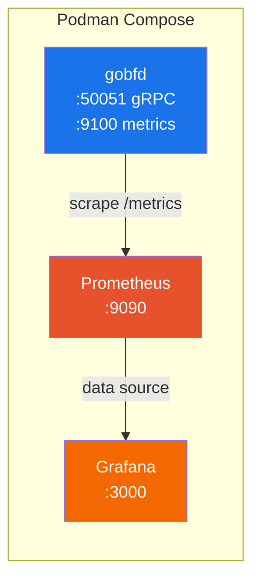

# Deployment


> Production deployment guide: systemd service, Podman Compose stacks, container images, deb/rpm packages, and security hardening.

---

### Table of Contents

- [Requirements](#requirements)
- [Installation Methods](#installation-methods)
- [systemd Service](#systemd-service)
- [Podman Compose](#podman-compose)
- [Container Image](#container-image)
- [Security Hardening](#security-hardening)
- [Production Checklist](#production-checklist)

### Requirements

- **Linux** kernel (raw sockets require Linux-specific APIs)
- **CAP_NET_RAW** and **CAP_NET_ADMIN** capabilities (for raw UDP sockets with TTL=255)
- Go 1.26+ (for building from source only)

### Installation Methods

#### From deb/rpm Packages

```bash
# Install .deb package
sudo dpkg -i gobfd_*.deb

# Install .rpm package
sudo rpm -i gobfd_*.rpm

# Edit configuration
sudo vim /etc/gobfd/gobfd.yml

# Start the daemon
sudo systemctl enable --now gobfd

# Verify
sudo systemctl status gobfd
gobfdctl session list
```

Packages are built by GoReleaser v2 and include:
- `/usr/local/bin/gobfd`, `/usr/local/bin/gobfdctl`, `/usr/local/bin/gobfd-haproxy-agent`, `/usr/local/bin/gobfd-exabgp-bridge` binaries
- `/etc/gobfd/gobfd.yml` example configuration
- `/usr/lib/systemd/system/gobfd.service` systemd unit
- `gobfd` system user and group

#### From Source

```bash
git clone https://github.com/dantte-lp/gobfd.git
cd gobfd

# Build all 4 binaries with version info (recommended)
make build

# Or build manually with ldflags
VERSION=$(git describe --tags --always --dirty)
GIT_COMMIT=$(git rev-parse --short HEAD)
BUILD_DATE=$(date -u +%Y-%m-%dT%H:%M:%SZ)
LDFLAGS="-s -w \
  -X github.com/dantte-lp/gobfd/internal/version.Version=${VERSION} \
  -X github.com/dantte-lp/gobfd/internal/version.GitCommit=${GIT_COMMIT} \
  -X github.com/dantte-lp/gobfd/internal/version.BuildDate=${BUILD_DATE}"

go build -ldflags="${LDFLAGS}" -o bin/gobfd ./cmd/gobfd
go build -ldflags="${LDFLAGS}" -o bin/gobfdctl ./cmd/gobfdctl
go build -ldflags="${LDFLAGS}" -o bin/gobfd-haproxy-agent ./cmd/gobfd-haproxy-agent
go build -ldflags="${LDFLAGS}" -o bin/gobfd-exabgp-bridge ./cmd/gobfd-exabgp-bridge

# Install
sudo install -m 755 bin/gobfd bin/gobfdctl bin/gobfd-haproxy-agent bin/gobfd-exabgp-bridge /usr/local/bin/
```

### systemd Service

The systemd unit file at `deployments/systemd/gobfd.service`:

```ini
[Unit]
Description=GoBFD -- BFD Protocol Daemon
Documentation=https://github.com/dantte-lp/gobfd
After=network-online.target
Wants=network-online.target

[Service]
Type=notify
ExecStart=/usr/local/bin/gobfd -config /etc/gobfd/gobfd.yml
ExecReload=/bin/kill -HUP $MAINPID
Restart=on-failure
RestartSec=5s
WatchdogSec=30s

# Security hardening
User=gobfd
Group=gobfd
AmbientCapabilities=CAP_NET_RAW CAP_NET_ADMIN
CapabilityBoundingSet=CAP_NET_RAW CAP_NET_ADMIN
NoNewPrivileges=true
ProtectSystem=strict
ProtectHome=true
ReadOnlyPaths=/etc/gobfd
PrivateTmp=true
ProtectKernelModules=true
ProtectKernelTunables=true
ProtectControlGroups=true
RestrictRealtime=true
RestrictSUIDSGID=true
SystemCallArchitectures=native

[Install]
WantedBy=multi-user.target
```

Key features:

| Feature | Description |
|---|---|
| `Type=notify` | Uses `sd_notify(READY)` for accurate readiness reporting |
| `WatchdogSec=30s` | systemd watchdog -- daemon sends keepalives at 15s intervals |
| `ExecReload` | SIGHUP triggers hot reload (log level + session reconciliation) |
| `Restart=on-failure` | Auto-restart on crash with 5s delay |
| Security directives | Least-privilege with only `CAP_NET_RAW` and `CAP_NET_ADMIN` |

#### Managing the Service

```bash
# Start/stop
sudo systemctl start gobfd
sudo systemctl stop gobfd

# Reload configuration (hot reload via SIGHUP)
sudo systemctl reload gobfd

# View logs
sudo journalctl -u gobfd -f

# Check status
sudo systemctl status gobfd
```

### Podman Compose

#### Development Stack

`deployments/compose/compose.dev.yml` -- development environment with hot reload:

```bash
# Start development environment
podman-compose -f deployments/compose/compose.dev.yml up -d --build

# Access the dev container
podman-compose -f deployments/compose/compose.dev.yml exec dev bash

# Build and test inside container
make build && make test
```

#### Production Stack

`deployments/compose/compose.yml` -- production stack with Prometheus and Grafana:

```bash
# Start production stack
podman-compose -f deployments/compose/compose.yml up -d

# Services:
#   gobfd gRPC API:   localhost:50051
#   Prometheus:       http://localhost:9090
#   Grafana:          http://localhost:3000 (admin/admin)
```



### Container Image

Build the container image:

```bash
# Standard build
podman build -f deployments/docker/Containerfile -t gobfd .

# Multi-arch build (via GoReleaser)
goreleaser release --snapshot --clean
```

The Containerfile uses multi-stage builds for minimal image size. The final image includes only the gobfd binary with `CAP_NET_RAW` capability.

Running the container requires:
- `CAP_NET_RAW` and `CAP_NET_ADMIN` capabilities
- `network_mode: host` (recommended) or proper port mapping for UDP 3784/4784

### Security Hardening

GoBFD follows the principle of least privilege:

| Layer | Mechanism |
|---|---|
| **Capabilities** | Only `CAP_NET_RAW` + `CAP_NET_ADMIN` (no root) |
| **systemd** | `ProtectSystem=strict`, `NoNewPrivileges`, `PrivateTmp` |
| **Code** | No `unsafe` package, all socket errors handled |
| **TTL** | GTSM (RFC 5082): TTL=255 on transmit, TTL=255 check on receive |
| **Auth** | Optional BFD authentication (5 types per RFC 5880 Section 6.7) |

### Production Checklist

- [ ] Configure `gobfd.yml` with appropriate session parameters
- [ ] Set `log.format: json` for structured logging
- [ ] Enable GoBGP integration if using BFD for BGP failover
- [ ] Enable flap dampening to prevent route churn
- [ ] Set up Prometheus scraping of `:9100/metrics`
- [ ] Import Grafana dashboard from `deployments/compose/configs/grafana/dashboards/bfd.json`
- [ ] Configure alerting on `gobfd_bfd_state_transitions_total{from_state="Up",to_state="Down"}`
- [ ] Verify `CAP_NET_RAW` is available (test with `gobfdctl session list`)
- [ ] Test SIGHUP reload: `systemctl reload gobfd`
- [ ] Verify graceful shutdown sends AdminDown (check peer logs)

### Related Documents

- [03-configuration.md](./03-configuration.md) -- Configuration reference
- [07-monitoring.md](./07-monitoring.md) -- Prometheus metrics and Grafana
- [09-development.md](./09-development.md) -- Development environment setup

---

*Last updated: 2026-02-21*
