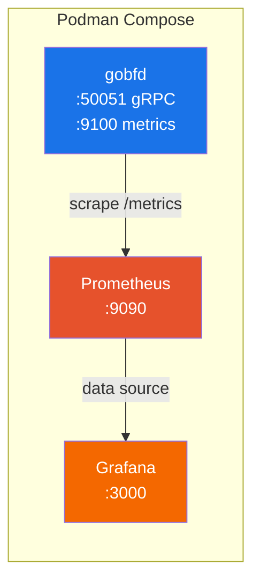

# Deployment


> Production deployment guide: systemd service, Podman Compose stacks, container images, deb/rpm packages, and security hardening.

---

## Table of Contents

- [Requirements](#requirements)
- [Release Artifact Matrix](#release-artifact-matrix)
- [Installation Methods](#installation-methods)
- [systemd Service](#systemd-service)
- [Podman Compose](#podman-compose)
- [Container Image](#container-image)
- [Security Hardening](#security-hardening)
- [Production Checklist](#production-checklist)

### Requirements

- **Linux** kernel (raw sockets require Linux-specific APIs)
- **CAP_NET_RAW** and **CAP_NET_ADMIN** capabilities (for raw UDP sockets with TTL=255)
- Go 1.27+ (for building from source only)

Non-Linux targets are compile-only compatibility surfaces. The `internal/netio`
transport constructors return `ErrUnsupportedPlatform`; GoBFD does not publish
or support a non-Linux dataplane runtime.

### Release Artifact Matrix

| Artifact | Target systems | Architectures | Base image / package format |
|---|---|---|---|
| Static binaries | Linux distributions with glibc or musl user space | `amd64`, `arm64` | `tar.gz` archive |
| Debian package | Debian 13 `trixie`, Ubuntu-compatible systems | `amd64`, `arm64` | `.deb`, systemd unit |
| RPM package | Oracle Linux 10, RHEL-compatible systems, Fedora-compatible systems | `amd64`, `arm64` | `.rpm`, systemd unit |
| Default OCI image | Docker, Podman, Kubernetes CRI runtimes | `linux/amd64`, `linux/arm64` | `docker.io/library/debian:trixie-slim` |
| Oracle Linux OCI image | Docker, Podman, Kubernetes CRI runtimes requiring Oracle Linux user space | `linux/amd64`, `linux/arm64` | `docker.io/library/oraclelinux:10-slim` |

| Image tag | Base |
|---|---|
| `ghcr.io/dantte-lp/gobfd:<version>` | Debian `trixie-slim` |
| `ghcr.io/dantte-lp/gobfd:latest` | Debian `trixie-slim` |
| `ghcr.io/dantte-lp/gobfd:<version>-debian-trixie` | Debian `trixie-slim` |
| `ghcr.io/dantte-lp/gobfd:debian-trixie` | Debian `trixie-slim` |
| `ghcr.io/dantte-lp/gobfd:<version>-oraclelinux10` | Oracle Linux `10-slim` |
| `ghcr.io/dantte-lp/gobfd:oraclelinux10` | Oracle Linux `10-slim` |

### Installation Methods

#### From deb/rpm Packages

```bash
# Install .deb package
sudo dpkg -i gobfd_*.deb

# Install .rpm package
sudo rpm -i gobfd_*.rpm

# Edit configuration
sudo vim /etc/gobfd/gobfd.yml

# Start the daemon
sudo systemctl enable --now gobfd

# Verify
sudo systemctl status gobfd
gobfdctl session list
```

Packages are built by GoReleaser v2 and include:
- `/usr/local/bin/gobfd`, `/usr/local/bin/gobfdctl`, `/usr/local/bin/gobfd-haproxy-agent`, `/usr/local/bin/gobfd-exabgp-bridge` binaries
- `/etc/gobfd/gobfd.yml` example configuration
- `/usr/lib/systemd/system/gobfd.service` systemd unit
- `gobfd` system user and group

#### From Source

```bash
git clone https://github.com/dantte-lp/gobfd.git
cd gobfd

# Build all 4 binaries with version info (recommended)
make build

# Or build manually with ldflags
VERSION=$(git describe --tags --always --dirty)
GIT_COMMIT=$(git rev-parse --short HEAD)
BUILD_DATE=$(date -u +%Y-%m-%dT%H:%M:%SZ)
LDFLAGS="-s -w \
  -X github.com/dantte-lp/gobfd/internal/version.Version=${VERSION} \
  -X github.com/dantte-lp/gobfd/internal/version.GitCommit=${GIT_COMMIT} \
  -X github.com/dantte-lp/gobfd/internal/version.BuildDate=${BUILD_DATE}"

go build -ldflags="${LDFLAGS}" -o bin/gobfd ./cmd/gobfd
go build -ldflags="${LDFLAGS}" -o bin/gobfdctl ./cmd/gobfdctl
go build -ldflags="${LDFLAGS}" -o bin/gobfd-haproxy-agent ./cmd/gobfd-haproxy-agent
go build -ldflags="${LDFLAGS}" -o bin/gobfd-exabgp-bridge ./cmd/gobfd-exabgp-bridge

# Install
sudo install -m 755 bin/gobfd bin/gobfdctl bin/gobfd-haproxy-agent bin/gobfd-exabgp-bridge /usr/local/bin/
```

### systemd Service

The systemd unit file at `deployments/systemd/gobfd.service`:

```ini
[Unit]
Description=GoBFD -- BFD Protocol Daemon
Documentation=https://github.com/dantte-lp/gobfd
After=network-online.target
Wants=network-online.target

[Service]
Type=notify
ExecStart=/usr/local/bin/gobfd -config /etc/gobfd/gobfd.yml
ExecReload=/bin/kill -HUP $MAINPID
Restart=on-failure
RestartSec=5s
WatchdogSec=30s

# Security hardening
User=gobfd
Group=gobfd
AmbientCapabilities=CAP_NET_RAW CAP_NET_ADMIN
CapabilityBoundingSet=CAP_NET_RAW CAP_NET_ADMIN
NoNewPrivileges=true
ProtectSystem=strict
ProtectHome=true
ReadOnlyPaths=/etc/gobfd
PrivateTmp=true
ProtectKernelModules=true
ProtectKernelTunables=true
ProtectControlGroups=true
RestrictRealtime=true
RestrictSUIDSGID=true
SystemCallArchitectures=native

[Install]
WantedBy=multi-user.target
```

Key features:

| Feature | Description |
|---|---|
| `Type=notify` | Uses `sd_notify(READY)` for accurate readiness reporting |
| `WatchdogSec=30s` | systemd watchdog -- daemon sends keepalives at 15s intervals |
| `ExecReload` | SIGHUP reloads log level and reconciles session membership within startup-open transport bindings; startup-owned changes are rejected and require restart |
| `Restart=on-failure` | Auto-restart on crash with 5s delay |
| Security directives | Least-privilege with only `CAP_NET_RAW` and `CAP_NET_ADMIN` |

#### Managing the Service

```bash
# Start/stop
sudo systemctl start gobfd
sudo systemctl stop gobfd

# Reload configuration (hot reload via SIGHUP)
sudo systemctl reload gobfd

# View logs
sudo journalctl -u gobfd -f

# Check status
sudo systemctl status gobfd
```

### Podman Compose

GoBFD uses Podman's external Compose-provider wrapper with the official Docker
Compose v5.5.0 Go binary. Install the checksum-pinned provider and select it
explicitly; Python `podman-compose` is unsupported:

```bash
go run ./test/cmd/toolbootstrap compose --install-dir "$HOME/.local/bin"
export PODMAN_COMPOSE_PROVIDER="$HOME/.local/bin/docker-compose"
export PODMAN_COMPOSE_WARNING_LOGS=false
export DOCKER_BUILDKIT=0
podman compose version
```

`DOCKER_BUILDKIT=0` keeps builds on the Podman-compatible classic Docker API;
Docker Buildx/Bake is not part of the repository's Podman runtime.

#### Development Stack

`deployments/compose/compose.dev.yml` -- development environment with hot reload:

```bash
# Start development environment
podman compose -f deployments/compose/compose.dev.yml up -d --build

# Run a targeted command in the dev container
podman compose -f deployments/compose/compose.dev.yml exec -T dev go test ./internal/bfd -race -count=1

# Build and test through the repository targets
make build && make test
```

Four report-producing testcontainers gates use the Go-owned `e2ectl` binary,
which Make builds inside the development container before execution:

| Target | Report directory |
|---|---|
| `make e2e-core-testcontainers` | `reports/e2e/core/run.*` |
| `make int-bgp-failover-testcontainers` | `reports/e2e/bgp-fast-failover/run.*` |
| `make int-haproxy-testcontainers` | `reports/e2e/haproxy-health/run.*` |
| `make int-observability-testcontainers` | `reports/e2e/observability/run.*` |

#### Production Stack

`deployments/compose/compose.yml` -- production stack with Prometheus and Grafana:

```bash
# Start production stack
podman compose -f deployments/compose/compose.yml up -d

# Services:
#   gobfd gRPC API:   localhost:50051
#   Prometheus:       http://localhost:9090
#   Grafana:          http://localhost:3000 (admin/admin)
```


```mermaid
graph LR
    subgraph "Podman Compose"
        G["gobfd<br/>:50051 gRPC<br/>:9100 metrics"]
        P["Prometheus<br/>:9090"]
        GR["Grafana<br/>:3000"]
    end

    G -->|scrape /metrics| P
    P -->|data source| GR

    style G fill:#1a73e8,color:#fff
    style P fill:#E6522C,color:#fff
    style GR fill:#F46800,color:#fff
```

### Container Image

Build the container image:

```bash
# Standard build
podman build -f deployments/docker/Containerfile -t gobfd .

# Multi-arch build (via GoReleaser)
goreleaser release --snapshot --clean
```

Release images contain the four GoBFD binaries and no development toolchain:
`gobfd`, `gobfdctl`, `gobfd-haproxy-agent`, and
`gobfd-exabgp-bridge`.

Running the container requires:
- `CAP_NET_RAW` and `CAP_NET_ADMIN` capabilities
- `network_mode: host` (recommended) or proper port mapping for UDP 3784/4784

### Security Hardening

GoBFD follows the principle of least privilege:

| Layer | Mechanism |
|---|---|
| **Capabilities** | Only `CAP_NET_RAW` + `CAP_NET_ADMIN` (no root) |
| **systemd** | `ProtectSystem=strict`, `NoNewPrivileges`, `PrivateTmp` |
| **Code** | No `unsafe` in handwritten first-party code; generated protobuf runtime code is excluded; all socket errors handled |
| **TTL** | GTSM (RFC 5082): TTL=255 on transmit, TTL=255 check on receive |
| **Auth** | Optional BFD authentication (5 types per RFC 5880 Section 6.7) |

### Memory Tuning (`GOMEMLIMIT` and `GOGC`)

Go 1.27 treats `GOMEMLIMIT` as a soft limit for memory managed by the Go
runtime. It excludes the binary mapping, kernel memory, and memory managed
outside Go. The runtime may increase garbage-collection frequency to respect
the limit even when `GOGC=off`; this setting does not eliminate GC pauses. A
limit below the working set can make GC run nearly continuously.

GoBFD does not publish session-count-to-memory sizing tiers. Select a limit
below the service or container memory limit with headroom for the binary,
kernel socket buffers, and other non-Go memory, then qualify it with the target
session count, authentication mode, telemetry, and failure workload. Keep the
default `GOGC` unless deployment measurements justify an override.

#### systemd Configuration

Add a deployment-qualified byte value to the `[Service]` section of
`gobfd.service`:

```ini
# Example only; replace with a deployment-qualified value.
Environment=GOMEMLIMIT=512MiB
```

#### Container Configuration

```dockerfile
# Example only; replace with a deployment-qualified value.
ENV GOMEMLIMIT=512MiB
```

#### Monitoring

Monitor process RSS, the container or service memory limit, GC frequency, and
GC pause time together. RSS is not the same quantity as `GOMEMLIMIT`. Sustained
GC growth or memory-limit thrashing requires a larger qualified limit or a
smaller workload; the soft limit is not an OOM guarantee.

### Production Checklist

- [ ] Qualify `GOMEMLIMIT` with deployment headroom and representative load
- [ ] Keep the default `GOGC` unless measurements justify an override
- [ ] Monitor RSS, the service memory limit, GC frequency, and GC pauses
- [ ] Configure `gobfd.yml` with appropriate session parameters
- [ ] Set `log.format: json` for structured logging
- [ ] Enable GoBGP integration if using BFD for BGP failover
- [ ] Enable flap dampening to prevent route churn
- [ ] Set up Prometheus scraping of `:9100/metrics`
- [ ] Import Grafana dashboard from `deployments/compose/configs/grafana/dashboards/bfd.json`
- [ ] Configure alerting on `gobfd_bfd_state_transitions_total{from_state="Up",to_state="Down"}`
- [ ] Verify `CAP_NET_RAW` is available (test with `gobfdctl session list`)
- [ ] Test SIGHUP reload: `systemctl reload gobfd`
- [ ] Verify graceful shutdown sends AdminDown (check peer logs)

### Related Documents

- [03-configuration.md](./03-configuration.md) -- Configuration reference
- [07-monitoring.md](./07-monitoring.md) -- Prometheus metrics and Grafana
- [09-development.md](./09-development.md) -- Development environment setup

---

*Last updated: 2026-02-21*
