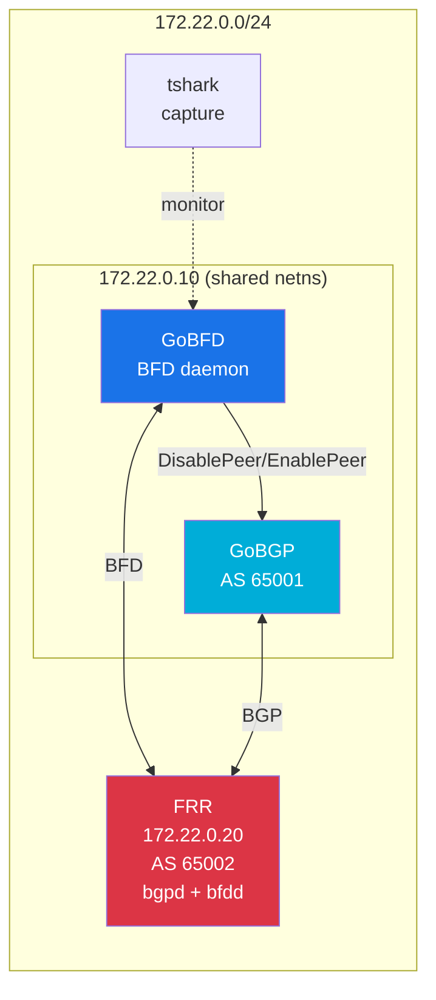
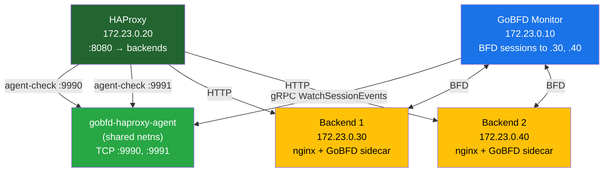
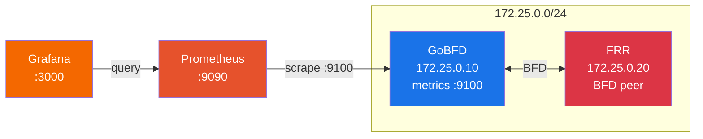
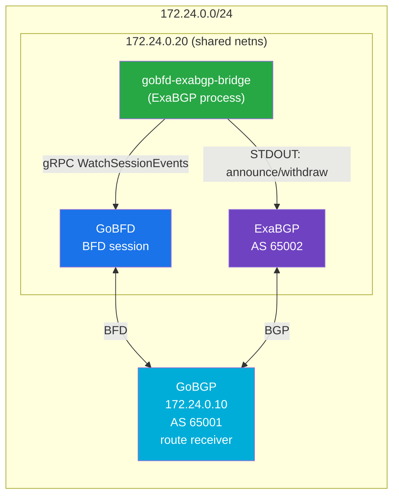
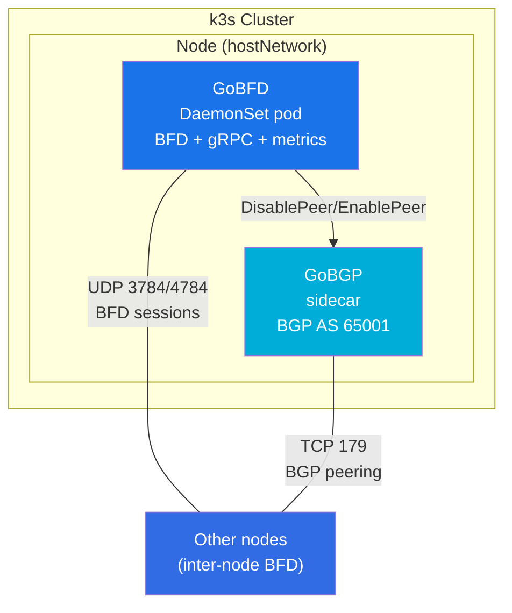

# Integration Examples


> Ready-to-run integration stacks demonstrating GoBFD with production systems. Each example includes compose files, configuration, demo scripts, and tshark packet verification.

---

### Table of Contents

- [Overview](#overview)
- [BGP Fast Failover](#bgp-fast-failover)
- [HAProxy Backend Health](#haproxy-backend-health)
- [Observability](#observability)
- [ExaBGP Anycast](#exabgp-anycast)
- [Kubernetes DaemonSet](#kubernetes-daemonset)
- [Packet Verification with tshark](#packet-verification-with-tshark)
- [Integration Architecture](#integration-architecture)
- [Related Documents](#related-documents)

---

## Overview

GoBFD integrates with routing, load balancing, monitoring, and orchestration systems to provide sub-second failure detection. Each integration example is a self-contained, runnable stack under `deployments/integrations/`.

All stacks use **podman-compose** with OCI containers and include a **tshark** sidecar for BFD packet capture and RFC compliance verification.

| # | Integration | Components | Subnet | New Code |
|---|------------|-----------|--------|----------|
| 1 | BGP Fast Failover | GoBFD + GoBGP + FRR | 172.22.0.0/24 | Configs only |
| 2 | HAProxy Backend Health | GoBFD + HAProxy + nginx | 172.23.0.0/24 | `gobfd-haproxy-agent` |
| 3 | Observability | GoBFD + Prometheus + Grafana | 172.25.0.0/24 | Alert rules |
| 4 | ExaBGP Anycast | GoBFD + ExaBGP + GoBGP | 172.24.0.0/24 | `gobfd-exabgp-bridge` |
| 5 | Kubernetes DaemonSet | GoBFD + GoBGP + k3s | Host network | K8s manifests |

---

## BGP Fast Failover

**Directory:** `deployments/integrations/bgp-fast-failover/`

BFD Down triggers BGP peer disable, causing immediate route withdrawal instead of waiting for the 90-second BGP holdtimer.

### Topology



### Quick Start

```bash
# Full demo (build, start, test failover, cleanup)
make int-bgp-failover

# Step by step
make int-bgp-failover-up     # Start topology
make int-bgp-failover-logs   # View logs
make int-bgp-failover-down   # Cleanup
```

### Demo Flow

1. GoBFD establishes BFD session with FRR at 172.22.0.20
2. GoBGP establishes BGP session, receives route 10.20.0.0/24
3. **Failure:** FRR is paused → BFD detects failure (~900ms) → GoBGP disables peer → route withdrawn
4. **Recovery:** FRR is unpaused → BFD Up → GoBGP re-enables peer → route restored

---

## HAProxy Backend Health

**Directory:** `deployments/integrations/haproxy-health/`

Sub-second backend failure detection via BFD, integrated with HAProxy's agent-check protocol.

### Architecture



### Agent-Check Protocol

The `gobfd-haproxy-agent` binary bridges BFD state to HAProxy's agent-check protocol:

- HAProxy connects TCP to agent port, reads ASCII response until newline
- BFD Up → responds `"up ready\n"` → HAProxy marks server operational
- BFD Down → responds `"down\n"` → HAProxy removes server from rotation

### Quick Start

```bash
make int-haproxy              # Full demo
make int-haproxy-up           # Start topology
curl http://localhost:8080    # Verify load balancing
make int-haproxy-down         # Cleanup
```

---

## Observability

**Directory:** `deployments/integrations/observability/`

Production monitoring with Prometheus alerting rules and pre-provisioned Grafana dashboard.

### Topology



### Metrics

| Metric | Type | Description |
|--------|------|-------------|
| `gobfd_bfd_sessions` | Gauge | Active BFD sessions per peer |
| `gobfd_bfd_packets_sent_total` | Counter | TX packets per peer |
| `gobfd_bfd_packets_received_total` | Counter | RX packets per peer |
| `gobfd_bfd_packets_dropped_total` | Counter | Dropped packets per peer |
| `gobfd_bfd_state_transitions_total` | Counter | FSM transitions (from/to labels) |
| `gobfd_bfd_auth_failures_total` | Counter | Authentication failures per peer |

### Alert Rules

| Alert | Expression | Severity |
|-------|-----------|----------|
| BFDSessionDown | `gobfd_bfd_sessions == 0` for 10s | Critical |
| BFDSessionFlapping | `rate(state_transitions[5m]) > 2` for 1m | Warning |
| BFDAuthFailures | `rate(auth_failures[5m]) > 0` for 30s | Warning |
| BFDPacketDrops | `rate(packets_dropped[5m]) > 0` for 1m | Warning |

### Quick Start

```bash
make int-observability        # Full demo
make int-observability-up     # Start topology

# Open in browser:
# Grafana:    http://localhost:3000 (admin/admin)
# Prometheus: http://localhost:9090

make int-observability-down   # Cleanup
```

---

## ExaBGP Anycast

**Directory:** `deployments/integrations/exabgp-anycast/`

Anycast IP announcement controlled by BFD link health via ExaBGP's process API.

### Architecture



### Pipe Protocol

The `gobfd-exabgp-bridge` runs as an ExaBGP process:

- **BFD Up** → writes `announce route 198.51.100.1/32 next-hop self` to STDOUT
- **BFD Down** → writes `withdraw route 198.51.100.1/32 next-hop self` to STDOUT
- Logs to STDERR (ExaBGP convention)
- Reconnects to GoBFD with exponential backoff

### Quick Start

```bash
make int-exabgp-anycast        # Full demo
make int-exabgp-anycast-up     # Start topology
make int-exabgp-anycast-down   # Cleanup
```

---

## Kubernetes DaemonSet

**Directory:** `deployments/integrations/kubernetes/`

Deploy GoBFD as a DaemonSet in a k3s cluster with GoBGP sidecar and host networking.

### Architecture



### Prerequisites

- Root or sudo access
- `curl`, `podman`, `kubectl`
- k3s is installed automatically by `setup-cluster.sh`

### Key Design Decisions

- **hostNetwork: true** — BFD uses raw sockets, needs direct access to host network
- **CAP_NET_RAW + CAP_NET_ADMIN** — required for BFD packet operations
- **DaemonSet** — one GoBFD instance per node for consistent BFD coverage
- **Dynamic sessions** — BFD sessions added via `gobfdctl` after discovering node IPs

### Quick Start

```bash
# Full demo (install k3s, deploy, verify, cleanup)
sudo make int-k8s

# Step by step
sudo ./deployments/integrations/kubernetes/setup-cluster.sh
kubectl apply -f deployments/integrations/kubernetes/manifests/
kubectl -n gobfd rollout status daemonset/gobfd

# Cleanup
sudo make int-k8s-down
```

### Manifests

| File | Resource | Description |
|------|----------|-------------|
| `namespace.yml` | Namespace | `gobfd` namespace |
| `configmap-gobfd.yml` | ConfigMap | GoBFD daemon configuration |
| `configmap-gobgp.yml` | ConfigMap | GoBGP configuration |
| `daemonset.yml` | DaemonSet | GoBFD + GoBGP sidecar (hostNetwork) |
| `service.yml` | Service | Headless service for DNS discovery |

---

## Packet Verification with tshark

All integration stacks include a **tshark** sidecar container for BFD packet capture and RFC compliance verification.

### Capture Setup

The tshark container captures all BFD traffic on the shared network namespace:

- **Filter:** `udp port 3784 or udp port 4784`
- **Format:** pcapng written to `/captures/bfd.pcapng`
- **Autostop:** 100MB file size limit

### Offline Analysis

```bash
# Full packet decode
podman exec <tshark-container> tshark -r /captures/bfd.pcapng -V -Y bfd

# CSV summary of BFD fields
podman exec <tshark-container> tshark -r /captures/bfd.pcapng -Y bfd \
    -T fields -e frame.time_relative -e ip.src -e ip.dst \
    -e bfd.version -e bfd.diag -e bfd.sta -e bfd.flags \
    -e bfd.detect_time_multiplier -e bfd.desired_min_tx_interval \
    -e bfd.required_min_rx_interval -E header=y -E separator=,
```

### Verification Checklist

| Field | Expected Value | RFC Reference |
|-------|---------------|---------------|
| Version | 1 | RFC 5880 Section 4.1 |
| TTL | 255 | RFC 5881 Section 5 (GTSM) |
| Dest Port | 3784 (single-hop) / 4784 (multihop) | RFC 5881 Section 4 |
| Source Port | 49152-65535 | RFC 5881 Section 4 |
| State transitions | Down → Init → Up (three-way) | RFC 5880 Section 6.8.6 |

Reference: [tshark.dev](https://tshark.dev/) — tshark documentation and tutorials.

---

## Integration Architecture

| Stack | Subnet | Services | Host Ports |
|-------|--------|----------|------------|
| BGP Fast Failover | 172.22.0.0/24 | gobfd, gobgp, frr, tshark | — |
| HAProxy Health | 172.23.0.0/24 | gobfd-monitor, haproxy-agent, haproxy, backend1/2, backend1/2-bfd, tshark | 8080 |
| Observability | 172.25.0.0/24 | gobfd, frr, prometheus, grafana, tshark | 9090, 3000 |
| ExaBGP Anycast | 172.24.0.0/24 | gobgp, gobfd, exabgp, tshark | — |
| Kubernetes | Host network | DaemonSet (gobfd + gobgp sidecar) | — |
| **Interop: Base** | 10.99.0.0/24 | gobfd, frr, bird3, aiobfd, thoro, tshark | — |
| **Interop: BGP+BFD** | 172.21.0.0/24 | gobfd, gobgp, frr, bird3, exabgp, gobfd-sidecar | — |
| **Interop: RFC** | 172.22.0.0/24 | gobfd-rfc, gobfd-rfc9384, gobgp-rfc, frr-rfc, frr-rfc-bgp, frr-rfc-unsolicited, tshark-rfc | — |
| **Interop: Vendor** | 10.0.x.0/30 | gobfd, gobgp, nokia, arista, cisco, frr, sonic, vyos | — |

### New Binaries

| Binary | Purpose | Dependencies |
|--------|---------|-------------|
| `gobfd-haproxy-agent` | HAProxy agent-check bridge | connectrpc, bfdv1connect |
| `gobfd-exabgp-bridge` | ExaBGP process API bridge | connectrpc, bfdv1connect |

---

## Related Documents

- [03-configuration.md](./03-configuration.md) — GoBFD configuration reference
- [05-interop.md](./05-interop.md) — Interoperability testing (FRR, BIRD3, vendor NOS)
- [06-deployment.md](./06-deployment.md) — Container image, Podman Compose, systemd
- [07-monitoring.md](./07-monitoring.md) — Prometheus metrics and Grafana dashboard

---

*Last updated: 2026-02-24*
