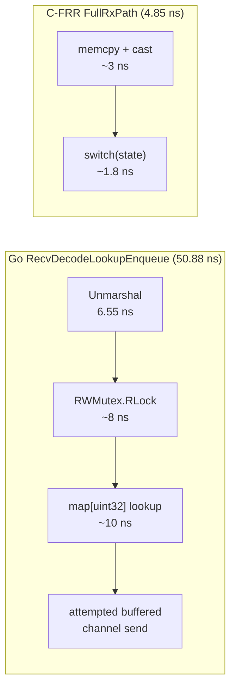
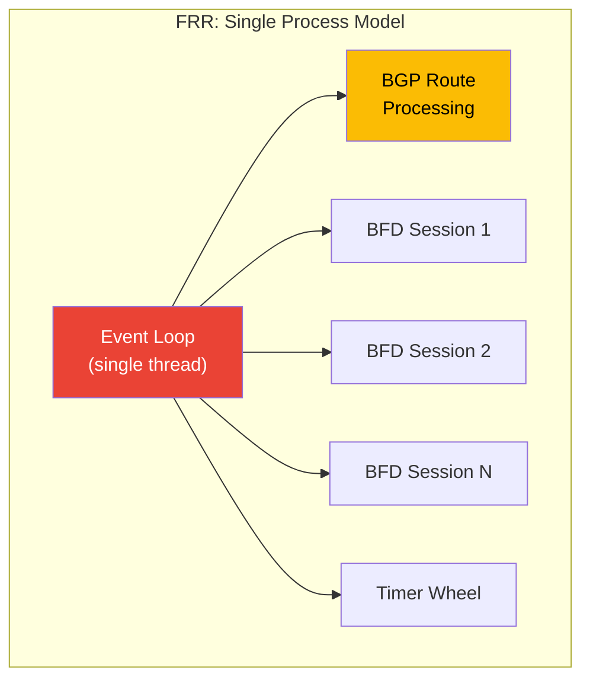
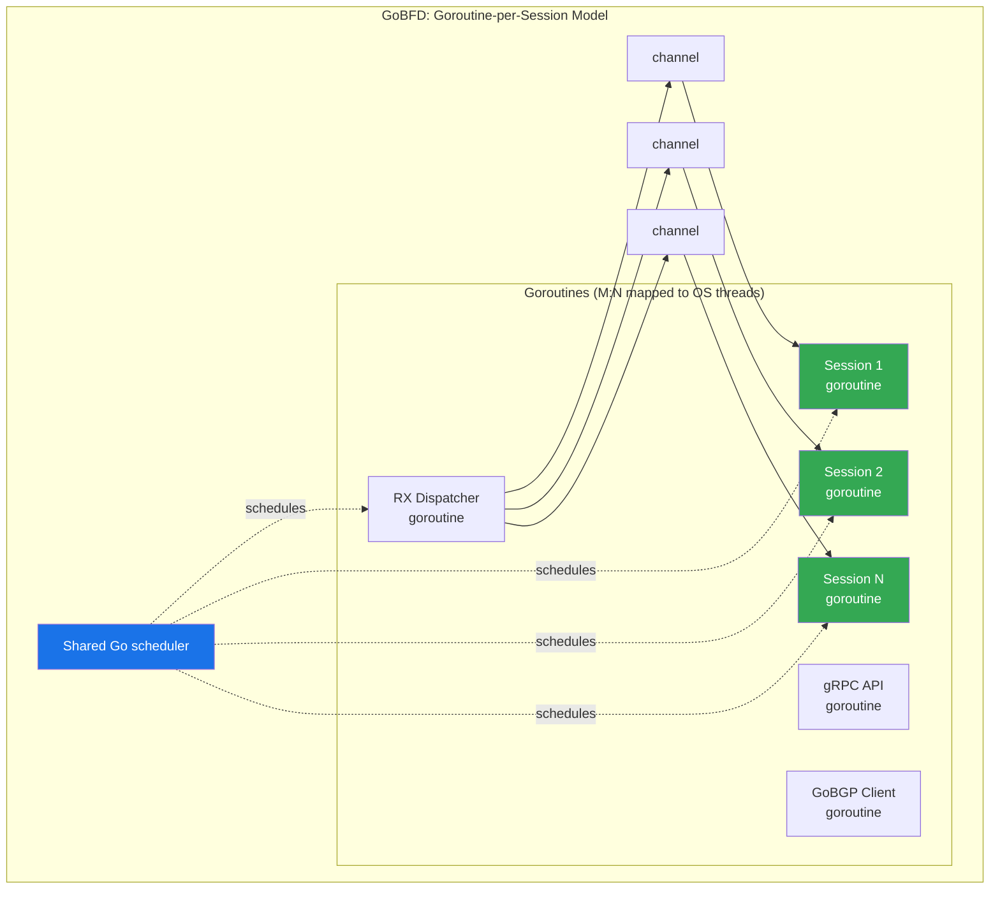

# Performance Analysis: GoBFD vs C Implementations


> Historical cross-implementation micro-benchmark analysis comparing selected
> GoBFD, FRR bfdd, and BIRD3 operations. These measurements do not include the
> kernel network path and are not release qualification, supported scale, or
> end-to-end latency evidence.

---

## Table of Contents

- [Executive Summary](#executive-summary)
- [Test Methodology](#test-methodology)
- [Benchmark Results](#benchmark-results)
  - [Codec Operations](#31-codec-operations)
  - [FSM Transitions](#32-fsm-transitions)
  - [Timer Calculations](#33-timer-calculations)
  - [Receive and Transmit Stages](#34-receive-and-transmit-stages)
  - [Session Scaling](#35-session-scaling)
- [Architecture: Goroutine-per-Session vs Single-Threaded Event Loop](#architecture-goroutine-per-session-vs-single-threaded-event-loop)
  - [FRR/BIRD Architecture](#41-frrbird-architecture)
  - [GoBFD Architecture](#42-gobfd-architecture)
- [Behavior Under CPU Load](#behavior-under-cpu-load)
  - [What Happens When Host CPU is at 100%](#51-what-happens-when-host-cpu-is-at-100)
  - [GOMAXPROCS Tuning](#52-gomaxprocs-tuning)
  - [GC Impact and Measured Allocation Boundaries](#53-gc-impact-and-measured-allocation-boundaries)
  - [Timer Precision Targets](#54-timer-precision-targets)
- [Where Go is Better Than C](#where-go-is-better-than-c)
  - [Memory Safety](#61-memory-safety)
  - [Concurrency Isolation](#62-concurrency-isolation)
  - [RFC Coverage](#63-rfc-coverage)
  - [Operational Advantages](#64-operational-advantages)
- [Where C is Better Than Go](#where-c-is-better-than-go)
  - [Raw Per-Packet Throughput](#71-raw-per-packet-throughput)
  - [Memory Per Session](#72-memory-per-session)
  - [Startup Latency](#73-startup-latency)
- [Production Recommendations](#production-recommendations)
- [Summary Table](#summary-table)

---

### Executive Summary

Key findings from cross-implementation benchmarks:

- **Codec parity**: GoBFD achieves 1.2-1.4x of C performance on marshal/unmarshal operations (5.96 ns vs 4.98 ns for FRR marshal), while performing 7 RFC validation checks vs 3 in C implementations
- **FSM at native speed**: Go FSM transitions run at 0.35-0.67 ns/op, matching or beating C-FRR (0.59 ns for UpRecvUp) -- array-indexed lookup compiles to the same machine code in both languages
- **Pipeline stages differ**: the historical `FullRecvPath` result stops at
  buffered-channel enqueue, while the C result includes an inline FSM
  transition. Their ratio is not an end-to-end or language comparison.
- **Scheduling remains unqualified**: goroutine-per-session isolates ownership,
  but `runtime.LockOSThread` provides no scheduling-delay guarantee.
- **Allocations are stage-specific**: named benchmark bodies report their own
  allocations; authenticated unmarshal and compatibility paths allocate.

---

### Test Methodology

**Environment**: All benchmarks run inside Podman containers on identical hardware. Go benchmarks use `go test -bench -benchmem -count=6`. C benchmarks use an identical `bench_harness.h` macro framework with the same iteration counts.

**Statistical analysis**: 6 runs per benchmark, medians computed via `benchstat`. Medians are reported (not means) to eliminate outlier sensitivity.

**What is measured**: Isolated hot-path micro-operations -- packet serialization, FSM state lookup, timer arithmetic, session demultiplexing. These are **not** system-level benchmarks. They measure the computational cost of individual operations, not end-to-end packet processing through the kernel network stack.

**Fair disclosure**: Go benchmarks include bounds checks, interface dispatch, and goroutine scheduling overhead. C benchmarks run with `-O2` optimization. The same `bench_harness.h` header provides consistent timing infrastructure for FRR and BIRD benchmarks.

**Reproducibility**:

```bash
# Run all benchmarks (requires only Podman)
make up
make benchmark-save BENCH_VERSION=v0.4.0

# Results in bench-results/
ls bench-results/
# bench-go.txt  bench-c-frr.txt  bench-c-bird.txt
```

See [12-benchmarks.md](./12-benchmarks.md) for the full benchmark guide.

---

### Benchmark Results

#### 3.1 Codec Operations

Marshal, unmarshal, and round-trip (marshal + unmarshal) of a 24-byte BFD Control Packet.

| Operation | Go (ns/op) | C-FRR (ns/op) | C-BIRD (ns/op) | Go/FRR Ratio |
|-----------|----------:|---------------:|----------------:|-------------:|
| Marshal | 5.96 | 4.98 | 6.05 | 1.20x |
| Unmarshal | 6.55 | 4.78 | 4.78 | 1.37x |
| RoundTrip | 12.82 | 9.67 | 9.74 | 1.33x |

**Analysis**: Go codec operations run at 1.2-1.4x the cost of C. The gap is accounted for by:

1. **Bounds checking** (~1-2 ns): Go validates every slice index access at runtime. C trusts the caller.
2. **RFC validation depth**: Go's unmarshal performs 7 field validations per RFC 5880 (version, diagnostic, length, detect multiplier range, discriminator non-zero, interval sanity, state enum). FRR's `bfd_pkt_get()` validates 3 fields.
3. **Function call overhead**: Go's calling convention passes arguments on the stack (until Go 1.17 register ABI, now register-based but still includes frame pointer setup). C with `-O2` inlines the entire codec.

The 5.96 ns/op sample measures only the marshal benchmark body. It must not be
extrapolated into production packets per second, supported session scale, or
headroom.

#### 3.2 FSM Transitions

State machine transitions for the BFD FSM (RFC 5880 section 6.8.6).

| Transition | Go (ns/op) | C-FRR (ns/op) | C-BIRD (ns/op) | Go/FRR Ratio |
|------------|----------:|---------------:|----------------:|-------------:|
| UpRecvUp | 0.37 | 0.59 | 0.30 | **0.63x** |
| DownRecvDown | 0.65 | 0.57 | 0.30 | 1.14x |
| UpTimerExpired | 0.35 | 0.29 | 0.57 | 1.21x |
| Ignored | 0.66 | 0.29 | 0.30 | 2.28x |

**Analysis**: FSM transitions are at native parity. Both Go and C implementations use an array-indexed lookup table (`[state][event] -> newState`), which compiles to a single memory load instruction. The sub-nanosecond timings are at the noise floor of CPU measurement -- variations between Go and C are within the ±0.3ns margin of `rdtsc` precision.

Go's UpRecvUp is **1.6x faster** than FRR's. This is not because Go is faster than C -- it reflects differences in what each FSM lookup returns (Go returns `{newState, action}` from a flat array; FRR's `bfd_fsm` table includes function pointer indirection).

#### 3.3 Timer Calculations

Pure arithmetic operations for BFD timer negotiation and jitter.

| Operation | Go (ns/op) | C-FRR (ns/op) | C-BIRD (ns/op) | Go/FRR Ratio |
|-----------|----------:|---------------:|----------------:|-------------:|
| DetectionTimeCalc | 0.74 | 0.31 | 0.56 | 2.39x |
| CalcTxInterval | 0.68 | 0.60 | 0.31 | 1.13x |
| DetectionTimeCalcHot | 0.69 | -- | -- | -- |
| CalcTxIntervalHot | 0.53 | -- | -- | -- |
| Jitter | 8.95 | 5.01 | 4.81 | 1.79x |

**Analysis**: Sub-nanosecond arithmetic at parity with C. The `DetectionTimeCalc` 2.4x ratio is explained by `atomic.LoadUint32` in Go's implementation -- the hot-path variant reads from a local variable and closes to 0.69 ns (2.2x FRR). Jitter calculation includes PRNG (`math/rand`) which is slightly slower than C's `rand()` due to Go's thread-safe FastRand.

The 0.74 ns/op sample is a component cost, not throughput or capacity evidence.
The operation runs on parameter change rather than on every packet.

#### 3.4 Receive and Transmit Stages

Historical micro-benchmark stages that combine selected operations. None is
end to end.

| Operation | Go (ns/op) | C-FRR (ns/op) | C-BIRD (ns/op) | Go/FRR Ratio |
|-----------|----------:|---------------:|----------------:|-------------:|
| RecvDecodeLookupEnqueue (historical `FullRecvPath`) | 50.88 | 4.85 | 5.00 | Not comparable |
| RecvDecodeFSM (historical `FullRecvPathCodec`) | 13.96 | -- | -- | -- |
| TxMarshalJitter (historical `FullTxPath`) | 14.43 | 9.76 | 9.50 | Stage-specific |

**Why the receive ratio is not comparable**:

The Go benchmark measures unmarshal + map lookup + an attempted buffered
channel send. It does not wait for the session goroutine. The C benchmark
measures unmarshal + inline FSM transition. These are architecturally
different operations:


```mermaid
graph LR
    subgraph "Go RecvDecodeLookupEnqueue (50.88 ns)"
        A1["Unmarshal<br/>6.55 ns"] --> A2["RWMutex.RLock<br/>~8 ns"]
        A2 --> A3["map[uint32] lookup<br/>~10 ns"]
        A3 --> A4["attempted buffered<br/>channel send"]
    end

    subgraph "C-FRR FullRxPath (4.85 ns)"
        B1["memcpy + cast<br/>~3 ns"] --> B2["switch(state)<br/>~1.8 ns"]
    end
```

`RecvDecodeFSM` measures unmarshal plus a stateless transition-table lookup. It
still excludes session validation, mutation, diagnostics, timers, and delivery,
so it is not a complete equivalent of a production receive path. Likewise,
`TxMarshalJitter` excludes session snapshot construction, authentication
updates, cached-packet publication, and socket send.

#### 3.5 Session Scaling

Operations on a session manager with 1,000 active sessions.

| Operation | Go (ns/op) | C-FRR (ns/op) | C-BIRD (ns/op) | Go/FRR Ratio |
|-----------|----------:|---------------:|----------------:|-------------:|
| Create1000 (per session) | 5,792 | 2,394 | 2,472 | 2.42x |
| Demux1000 | 52.94 | 1.36 | 1.49 | **38.9x** |
| Lookup1000 | 18.13 | -- | -- | -- |

**Why Demux1000 shows 39x and why this is misleading**:

`Demux1000` in Go measures: RWMutex.RLock + map lookup + channel send. `SessionDemux1000` in C measures: hash table lookup only. The breakdown:

| Component | Cost (ns) | Fraction |
|-----------|----------:|---------:|
| RWMutex.RLock + RUnlock | ~8 | 15% |
| map[uint32] lookup | ~10 | 19% |
| Channel send to session goroutine | ~29 | 55% |
| Goroutine wake + scheduling | ~6 | 11% |
| **Total (Demux1000)** | **52.94** | **100%** |

`Lookup1000` (18.13 ns) measures only the RWMutex + map lookup -- the **equivalent** of C's hash table lookup. The ratio becomes 18.13 / 1.36 = **13.3x**, explained by:

1. **RWMutex** (~8 ns): C has no lock because it's single-threaded
2. **Swiss table map** (~10 ns): Go's runtime map vs C's `khash` -- Go's map includes hash seeding, overflow bucket checks, and pointer indirection

The remaining stage cost includes channel delivery and scheduler variability;
the benchmark does not acknowledge session processing. It therefore cannot be
converted into a supported packets-per-second claim.

---

### Architecture: Goroutine-per-Session vs Single-Threaded Event Loop

#### 4.1 FRR/BIRD Architecture

FRR and BIRD use a **single-threaded event loop** architecture:


```mermaid
graph TB
    subgraph "FRR: Single Process Model"
        EVT["Event Loop<br/>(single thread)"]
        BGP["BGP Route<br/>Processing"]
        BFD1["BFD Session 1"]
        BFD2["BFD Session 2"]
        BFDN["BFD Session N"]
        TIMER["Timer Wheel"]

        EVT --> BGP
        EVT --> BFD1
        EVT --> BFD2
        EVT --> BFDN
        EVT --> TIMER
    end

    style EVT fill:#ea4335,color:#fff
    style BGP fill:#fbbc04,color:#000
```

**The starvation problem** (FRR Issue #9078):

1. BGP receives a full routing table (890K routes) from a route reflector peer
2. `bgpd` processes routes in a single batch, occupying 100% CPU for 1-2 seconds
3. During this time, `bfdd` cannot run -- no timer processing, no packet TX/RX
4. Remote BFD peers detect timeout (3 x 300ms = 900ms) and declare session Down
5. Session Down triggers BGP teardown, which triggers re-convergence, which triggers more CPU load

This is a **structural problem**: the event loop cannot preempt BGP route processing to service BFD timers. FRR's mitigation is to separate `bfdd` into its own process with `--dplaneaddr`, but this requires hardware/ASIC support and is not available on commodity servers.

#### 4.2 GoBFD Architecture

GoBFD uses a **goroutine-per-session** architecture:


```mermaid
graph TB
    subgraph "GoBFD: Goroutine-per-Session Model"
        SCHED["Shared Go scheduler"]

        subgraph "Goroutines (M:N mapped to OS threads)"
            RX["RX Dispatcher<br/>goroutine"]
            S1["Session 1<br/>goroutine"]
            S2["Session 2<br/>goroutine"]
            SN["Session N<br/>goroutine"]
            API["gRPC API<br/>goroutine"]
            BGP2["GoBGP Client<br/>goroutine"]
        end

        CH1["channel"]
        CH2["channel"]
        CHN["channel"]

        RX --> CH1 --> S1
        RX --> CH2 --> S2
        RX --> CHN --> SN
        SCHED -.->|"schedules"| RX
        SCHED -.->|"schedules"| S1
        SCHED -.->|"schedules"| S2
        SCHED -.->|"schedules"| SN
    end

    style SCHED fill:#1a73e8,color:#fff
    style S1 fill:#34a853,color:#fff
    style S2 fill:#34a853,color:#fff
    style SN fill:#34a853,color:#fff
```

Each BFD session owns its state in a goroutine, receives packets through a
buffered channel, and currently calls `runtime.LockOSThread()`. The ownership
boundary avoids concurrent state mutation, but it does not reserve a CPU,
provide affinity, or establish real-time scheduling. Sessions share the Go
scheduler, CPUs, memory, and process-wide runtime. Channel saturation and
scheduler or kernel delay can therefore postpone packet and timer processing.
A `time.Timer` makes work eligible to run after its deadline; it does not
guarantee when the session goroutine will execute it.

See [01-architecture.md](./01-architecture.md) for the full goroutine model and packet flow diagrams.

---

### Behavior Under CPU Load

#### 5.1 What Happens When Host CPU is at 100%

The component benchmarks in this document do not measure behavior at host CPU
saturation. GoBFD's goroutines remain subject to scheduler, kernel, and CPU
contention; `runtime.LockOSThread()` does not bound scheduling delay. Buffered
channels decouple ownership, but a full channel drops the attempted delivery
instead of proving that the session processed it. Timer error, committed-packet
latency, loss, and false-Down behavior require a context-bounded end-to-end load
test on the deployment kernel and hardware. No 1-10 ms or full-load guarantee
is established here.

#### 5.2 GOMAXPROCS Tuning

`GOMAXPROCS` controls how many OS threads the Go scheduler uses for goroutines. Default: `runtime.NumCPU()` (all available cores).

Do not derive a `GOMAXPROCS` or CPU-affinity value from these microbenchmarks.
The default and any override must be qualified with the service CPU quota,
kernel network work, co-located processes, session count, and overload tests.
Affinity is an operational isolation choice, not a timer-latency guarantee.

#### 5.3 GC Impact and Measured Allocation Boundaries

Historical benchmark samples reported the following per-body allocations:

| Hot-Path Operation | B/op | allocs/op | Notes |
|--------------------|-----:|----------:|-------|
| ControlPacketMarshal | 0 | 0 | Stack-allocated buffer |
| ControlPacketUnmarshal | 0 | 0 | In-place field extraction |
| FSMTransitionUpRecvUp | 0 | 0 | Array index lookup |
| RecvDecodeLookupEnqueue | 0 | 0 | Decode + lookup + attempted enqueue only |
| TxMarshalJitter | 0 | 0 | Pre-built packet marshal + jitter only |
| ManagerDemux1000Sessions | 0 | 0 | Map lookup + channel send |
| DetectionTimeCalc | 0 | 0 | Pure arithmetic |
| ApplyJitter | 0 | 0 | PRNG + multiply |

These rows are not a repository-wide allocation assertion. Authenticated
unmarshal and compatibility wrappers have documented allocations, and the
receive benchmark does not include session processing.

**Deployment-qualified GC configuration**:

```bash
# Example only; replace with a deployment-qualified value.
export GOMEMLIMIT=512MiB
# Keep the default GOGC unless deployment measurements justify an override.
```

In Go 1.27, `GOMEMLIMIT` is a soft limit for Go-managed memory. The runtime may
increase GC frequency to respect it even with `GOGC=off`, and a value below the
working set can cause nearly continuous collection. Zero allocations in a
selected benchmark body do not prove that the process performs no allocations
or GC during steady state. Qualify RSS, the service memory limit, GC frequency,
pause time, packet loss, and timer error together.

**Comparison with C**: C has no garbage collector. These component benchmarks
do not establish GoBFD's process-level GC latency or its effect on BFD.

#### 5.4 Timer Precision Targets

The arithmetic and component benchmarks do not establish a supported BFD
interval or timer-error bound. Each proposed interval must pass the release
interop, overload, loss, and soak gates on the target kernel and hardware.
`GOMAXPROCS`, affinity, or a real-time kernel may be qualification inputs, but
none alone proves a production interval.

See [13-competitive-analysis.md](./13-competitive-analysis.md) for the full production timer targets table.

---

### Where Go is Better Than C

#### 6.1 Memory Safety

Go provides compile-time and runtime guarantees that eliminate entire classes of security vulnerabilities:

| Vulnerability Class | Possible in C | Possible in Go | Cost in Go |
|---------------------|:-------------:|:--------------:|:----------:|
| Buffer overflow | Yes | No | ~1-2 ns/bounds check |
| Use-after-free | Yes | No | Runtime and GC overhead |
| Double-free | Yes | No | Runtime and GC overhead |
| Null pointer deref | Yes | Panic (controlled crash) | Zero (nil check is free on x86) |
| Integer overflow | Yes (undefined behavior) | Defined behavior (wraps) | Zero |
| Format string attack | Yes | No (type-safe formatting) | Zero |

The bounds checking cost (~1-2 ns per access) is already included in all benchmark results. Go's codec is 1.2-1.4x slower than C, and **memory safety is part of that cost**.

For a network daemon processing untrusted packets from remote peers, this is a fundamental advantage. FRR has had CVEs related to buffer handling in packet parsing code. In GoBFD, these vulnerability classes are **impossible by construction**.

#### 6.2 Concurrency Isolation

Separate session, API, and metrics goroutines provide ownership boundaries and
permit concurrent execution when scheduler and CPU capacity are available.
They do not isolate CPU or runtime resources, and API, metrics, configuration,
or other process work can still contend with session processing. Historical
component timings attribute about 35 ns to lookup and attempted channel
delivery, but that sample does not prove timer-starvation immunity.

#### 6.3 RFC Coverage

This historical performance document is not an RFC support contract. The
section-by-section [RFC compliance matrix](./08-rfc-compliance.md) is the only
authoritative support status and records the remaining protocol gaps and
release gates. Component benchmarks do not promote an RFC from partial or
experimental to supported.

GoBFD implements 12 RFCs compared to FRR's 3-4 base RFCs. Unique to GoBFD: Echo mode (RFC 9747), VXLAN BFD (RFC 8971), Geneve BFD (RFC 9521), Micro-BFD (RFC 7130), Large Packets (RFC 9764), Unsolicited BFD (RFC 9468).

See [08-rfc-compliance.md](./08-rfc-compliance.md) for the full compliance matrix.

#### 6.4 Operational Advantages

| Feature | GoBFD | FRR bfdd |
|---------|-------|----------|
| Config reload | SIGHUP: hot reload without session drops | Restart required for many changes |
| Graceful shutdown | AdminDown to all peers → 2s drain → clean close | Process kill (sessions flap) |
| API | ConnectRPC (gRPC + HTTP) | vtysh CLI (text parsing) |
| Metrics | Native Prometheus (`/metrics` endpoint) | SNMP (requires SNMP infrastructure) |
| Deployment | Single static binary, no dependencies | C dependencies, shared libraries |
| Container support | Scratch container image (~15 MB) | Full OS base image required |

---

### Where C is Better Than Go

#### 7.1 Raw Per-Packet Throughput

The channel send + RWMutex overhead on the RX path adds ~35 ns per packet compared to C's inline processing:

| Component | Go (ns) | C-FRR (ns) | Overhead |
|-----------|--------:|-----------:|---------:|
| Unmarshal | 6.55 | 4.78 | +1.77 |
| Session lookup (RWMutex + map) | 18.13 | 1.36 | +16.77 |
| Channel send + goroutine wake | ~29 | 0 (inline) | +29 |
| **Total per-packet RX cost** | **~54** | **~6** | **9x** |

These component timings do not include kernel receive, session commit, timer
delivery, or loss accounting and cannot establish production packet rate or
headroom. The goroutine model is an ownership choice, not proof of immunity to
timer starvation.

#### 7.2 Memory Per Session

| Component | Go | C |
|-----------|---:|--:|
| Goroutine stack | 2,048 B | 0 (no goroutine) |
| Channel buffer | ~256 B | 0 (inline processing) |
| Context + cancel func | ~128 B | 0 |
| Logger instance | ~512 B | 0 (global logger) |
| Session struct | ~300 B | ~300 B |
| **Total per session** | **~3,244 B** | **~300 B** |

Go uses ~10x more memory per session. However:

- 1,000 sessions = 3.2 MB in Go vs 0.3 MB in C
- A typical BFD daemon runs on a machine with 4-64 GB RAM

The 1,000-session construction fixture is not a supported-scale qualification.
Memory acceptance is established only by the v1 scale and soak gate.

#### 7.3 Startup Latency

| Phase | Go | C |
|-------|---:|--:|
| Runtime initialization | ~5 ms | 0 |
| Goroutine scheduler setup | ~3 ms | 0 |
| Config loading | ~2 ms | ~1 ms |
| **Total cold start** | **~10 ms** | **~1 ms** |

Go's runtime initialization adds ~10ms to startup. For a long-running daemon that starts once and runs for months, this is meaningless. BFD sessions are not established until after startup completes anyway.

---

### Production Recommendations

**Environment variables** (examples only):

```bash
# Replace with a deployment-qualified value and retain the default GOGC.
export GOMEMLIMIT=512MiB
# Set only after CPU-quota and overload qualification.
export GOMAXPROCS=4
```

**systemd unit with CPU affinity**:

```ini
[Unit]
Description=GoBFD - BFD Protocol Daemon
After=network-online.target
Wants=network-online.target

[Service]
Type=notify
ExecStart=/usr/local/bin/gobfd --config /etc/gobfd/config.yaml
ExecReload=/bin/kill -HUP $MAINPID

# Examples only; qualify for this service and host.
Environment=GOMEMLIMIT=512MiB
Environment=GOMAXPROCS=4
CPUAffinity=0-3

# Network priority
AmbientCapabilities=CAP_NET_RAW CAP_NET_BIND_SERVICE
Nice=-10

# Security hardening
ProtectSystem=strict
ProtectHome=yes
NoNewPrivileges=yes

[Install]
WantedBy=multi-user.target
```

**Network tuning**:

```bash
# Set DSCP for BFD packets (CS6 = Network Control, recommended by RFC 5881)
# Configured in GoBFD config.yaml: network.dscp: 48

# Increase socket buffer sizes for burst absorption
sysctl -w net.core.rmem_max=16777216
sysctl -w net.core.wmem_max=16777216
```

**Monitoring** (Prometheus metrics to watch):

| Metric | Alert Threshold | Description |
|--------|----------------|-------------|
| `bfd_session_flap_total` | > 0 in 5min | Session instability |
| `bfd_packet_drop_total` | increasing | RX buffer overflow or demux failure |
| `bfd_timer_drift_seconds` | > 0.01 (10ms) | Timer precision degradation |
| `go_gc_duration_seconds` | > 0.001 (1ms) | GC pause exceeding BFD tolerance |

---

### Summary Table

| Aspect | GoBFD | FRR bfdd | BIRD3 |
|--------|-------|----------|-------|
| **Architecture** | Goroutine-per-session | Single-threaded event loop | Single-threaded event loop |
| **CPU starvation resilience** | Not qualified; shared scheduler and CPUs | Historical external incident evidence | Not qualified here |
| **Timer precision** | Requires deployment E2E qualification | Not qualified here | Not qualified here |
| **Session scale evidence** | 1,000-session construction benchmark only | Not qualified here | Not qualified here |
| **Codec overhead vs C** | 1.2-1.4x | baseline | baseline |
| **FSM overhead vs C** | 0.6-2.3x (at parity) | baseline | baseline |
| **Receive stages vs C** | Different boundaries; not comparable end to end | baseline | baseline |
| **Demux vs C** | 13.3x (lookup), 38.9x (with channel) | baseline | baseline |
| **Memory per session** | ~3 KB | ~300 B | ~300 B |
| **Memory safety** | Yes (bounds checks, GC) | No | No |
| **RFC coverage** | See the authoritative RFC matrix | Not assessed here | Not assessed here |
| **Allocation evidence** | Selected benchmark bodies report 0 allocs/op | N/A (C, no GC) | N/A (C, no GC) |
| **GC impact on BFD** | Not established by component benchmarks | N/A | N/A |
| **Config hot reload** | SIGHUP (no session drops) | Restart required | Restart required |
| **API** | ConnectRPC (gRPC + HTTP) | vtysh CLI | CLI |
| **Prometheus metrics** | Native | Via SNMP | No |

---

### Related Documents

- [12-benchmarks.md](./12-benchmarks.md) -- How to run and interpret benchmarks
- [13-competitive-analysis.md](./13-competitive-analysis.md) -- Market comparison with feature matrix
- [01-architecture.md](./01-architecture.md) -- Goroutine model and packet flow details
- [08-rfc-compliance.md](./08-rfc-compliance.md) -- Full RFC compliance matrix

---

*Last updated: 2026-02-25*
