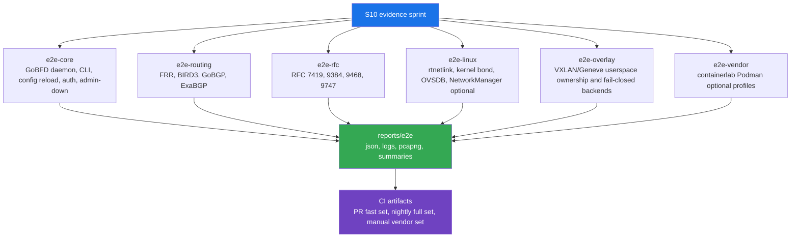

# S10 Extended E2E and Interoperability Plan

Canonical plan for the S10 evidence sprint.

---

## 1. Decision

| Field | Value |
|---|---|
| Sprint | S10 |
| Primary objective | Extended end-to-end and interoperability evidence for the existing GoBFD feature set. |
| Preferred direction | Extend E2E/interop coverage before adding new protocol backends. |
| Release impact | No release for this planning-only change; a later test-harness implementation may ship as a patch or minor prerelease only when user-facing behavior changes. |
| Required runtime | Podman. |
| Required evidence | Go test JSON, container logs, BFD packet captures, control-plane snapshots, and CI artifacts. |
| Non-goal | No default enablement of kernel, OVS, OVN, Cilium, Calico, NSX, VXLAN, or Geneve owner-specific backends. |

## 2. Source Validation

| Source | Relevance | S10 Constraint |
|---|---|---|
| [RFC 5880](https://datatracker.ietf.org/doc/html/rfc5880) | Base BFD state machine, timers, control packets, authentication. | Core E2E assertions must map packet/state behavior to RFC 5880 semantics. |
| [RFC 7130](https://www.rfc-editor.org/rfc/rfc7130) | Micro-BFD for LAG member links. | Micro-BFD tests must model independent per-member sessions and must not claim echo coverage for RFC 7130. |
| [RFC 8971](https://www.rfc-editor.org/rfc/rfc8971.html) | BFD for VXLAN. | VXLAN tests must verify overlay packet ownership and avoid kernel/OVS/CNI overclaim. |
| [RFC 9521](https://www.ietf.org/rfc/rfc9521.html) | BFD for Geneve. | Geneve tests must stay explicit to Geneve tunnel ownership. |
| [RFC 9747](https://www.rfc-editor.org/rfc/rfc9747) | Unaffiliated BFD Echo. | Echo tests must retain UDP 3785 packet evidence and failure/recovery checks. |
| [FRRouting BFD documentation](https://docs.frrouting.org/en/latest/bfd.html) | `bfdd` configuration, peer model, JSON show commands, echo constraints. | FRR remains the primary standards-oriented interop peer for routing and RFC checks. |
| [containerlab node runtime documentation](https://containerlab.dev/manual/nodes/) | Docker default, Podman runtime support, per-node/global runtime selection. | Vendor NOS interop remains optional/manual because Podman support is documented as experimental. |
| [containerlab deploy documentation](https://containerlab.dev/cmd/deploy/) | Runtime selection through `--runtime`. | `containerlab --runtime podman` remains the only documented S10 vendor-lab path. |
| [netlab module reference](https://netlab.tools/module-reference/) | BFD module availability in topology-generated labs. | Netlab is a future topology generator candidate, not an S10 dependency. |
| [Open vSwitch OVSDB documentation](https://docs.openvswitch.org/en/stable/ref/ovsdb.7/) | JSON-RPC state/config database for OVS and OVN integration. | OVS checks must prefer OVSDB API evidence over shell-only assumptions. |
| [Linux rtnetlink manual](https://man7.org/linux/man-pages/man7/rtnetlink.7.html) | NETLINK_ROUTE link/address/route notification API. | Linux link-state E2E must validate rtnetlink behavior through namespace/interface events. |
| [Linux bonding documentation](https://www.kernel.org/doc/html/v6.7/networking/bonding.html) | Kernel bond monitoring and member behavior. | Kernel-bond tests require explicit ownership and must not run destructive host operations. |
| [NetworkManager D-Bus settings](https://networkmanager.pages.freedesktop.org/NetworkManager/NetworkManager/nm-settings-dbus.html) | NetworkManager profile API surface. | NetworkManager backend tests stay isolated and optional unless an NM test container is available. |
| [cilium/ebpf README](https://github.com/cilium/ebpf/blob/main/README.md) | Go eBPF library platform requirements. | eBPF remains optional future work; S10 may add capability checks only if no privileged default is introduced. |
| [Arista EOS BFD documentation](https://www.arista.com/en/um-eos/eos-bidirectional-forwarding-detection) | EOS BFD operational model. | Arista vendor validation is optional/manual and must record EOS image/version constraints. |
| [Arista EOS `bfd vtep evpn` command](https://www.arista.com/en/um-eos/eos-evpn-and-vcs-commands) | VXLAN VTEP BFD command surface. | Arista VXLAN BFD coverage is a vendor profile, not generic Linux proof. |

## 3. Current Baseline

| Area | Existing Target | Current Role |
|---|---|---|
| Unit and race tests | `make test` | Routine package evidence. |
| Integration tests | `make test-integration` | Local daemon, CLI, and server behavior. |
| Four-peer BFD interop | `make interop` | GoBFD against FRR, BIRD3, aiobfd, and Thoro/bfd. |
| BGP+BFD interop | `make interop-bgp` | GoBFD and GoBGP failover against FRR, BIRD3, and ExaBGP scenarios. |
| RFC-specific interop | `make interop-rfc` | RFC 7419, RFC 9384, RFC 9468, and RFC 9747 behavior. |
| Vendor NOS lab | `make interop-clab` | Optional containerlab profile for Arista cEOS, Nokia SR Linux, Cisco XRd, SONiC-VS, VyOS, and FRR. |
| Example integrations | `make int-bgp-failover`, `make int-haproxy`, `make int-observability`, `make int-exabgp-anycast`, `make int-k8s` | Scenario-level deployment evidence. |
| Benchmark comparison | GitHub Actions `Benchmark comparison` | Hot-path regression guard; no expansion needed for docs-only changes. |

## 4. Target Evidence Architecture

## 5. Sprint Breakdown

### S10.1 -- Harness Inventory and Contract

| Field | Value |
|---|---|
| Output | Unified E2E contract and artifact layout. |
| Files | `Makefile`, `test/e2e/README.md`, `docs/en/18-s10-extended-e2e-interop.md`, `docs/ru/18-s10-extended-e2e-interop.md`. |
| Required target | `make e2e-help`. |
| Acceptance | All existing interop targets are documented with owner, runtime, inputs, outputs, cleanup, and artifact paths. |
| Commit | `test(interop): define extended evidence harness` |

### S10.2 -- Core Daemon E2E

| Field | Value |
|---|---|
| Output | Deterministic GoBFD-to-GoBFD E2E suite. |
| Files | `test/e2e/core/`, `test/e2e/core/compose.yml`, `test/e2e/core/core_test.go`. |
| Scenarios | Session `Up`, graceful `AdminDown`, config reload, static auth, CLI list/show/events, metrics availability, packet capture. |
| Required target | `make e2e-core`. |
| Acceptance | The suite passes from clean Podman state and writes Go test JSON, daemon logs, CLI output, and BFD pcapng artifacts. |
| Commit | `test(interop): add core daemon scenarios` |

### S10.3 -- Routing Interop Aggregate

| Field | Value |
|---|---|
| Output | Single routing interop aggregate over current FRR, BIRD3, GoBGP, and ExaBGP stacks. |
| Files | `test/e2e/routing/`, existing `test/interop/`, `test/interop-bgp/`. |
| Scenarios | Session establishment, BGP route withdrawal, BGP route recovery, peer-specific state snapshots. |
| Required target | `make e2e-routing`. |
| Acceptance | Existing `make interop` and `make interop-bgp` evidence is normalized into one artifact directory without weakening current targets. |
| Commit | `test(interop): aggregate routing interop evidence` |

### S10.4 -- RFC and Overlay Ownership

| Field | Value |
|---|---|
| Output | RFC-specific checks and overlay backend boundary checks. |
| Files | `test/e2e/rfc/`, `test/e2e/overlay/`, existing `test/interop-rfc/`. |
| Scenarios | RFC 9747 Echo failure/recovery, RFC 7130 Micro-BFD session modeling, RFC 8971 VXLAN userspace ownership, RFC 9521 Geneve userspace ownership, reserved backend fail-closed behavior. |
| Required targets | `make e2e-rfc`, `make e2e-overlay`. |
| Acceptance | Packet captures prove UDP 3784/3785 and overlay-port behavior; reserved `kernel`, `ovs`, `ovn`, `cilium`, `calico`, and `nsx` backend names fail closed. |
| Commit | `test(interop): verify rfc and overlay boundaries` |

### S10.5 -- Linux Dataplane Ownership

| Field | Value |
|---|---|
| Output | Linux netns/veth and owned-backend dataplane checks. |
| Files | `test/e2e/linux/`, `internal/netio` tests as needed. |
| Scenarios | rtnetlink link-down event, link-up recovery, kernel-bond dry-run/enforce in isolated namespace, OVSDB bonded-port update in OVS container, NetworkManager D-Bus optional profile test. |
| Required target | `make e2e-linux`. |
| Acceptance | No host interface is modified; destructive operations are constrained to disposable namespaces or containers. |
| Commit | `test(netio): add linux dataplane ownership checks` |

### S10.6 -- Vendor Optional Profiles

| Field | Value |
|---|---|
| Output | Optional vendor NOS test profiles with explicit skip rules. |
| Files | `test/interop-clab/`, `test/e2e/vendor/`. |
| Scenarios | Arista cEOS VXLAN BFD profile, Nokia SR Linux BFD profile, Cisco XRd profile, SONiC-VS profile, VyOS/FRR baseline profile. |
| Required target | `make e2e-vendor`. |
| Acceptance | Missing licensed/vendor images cause documented skips, not false failures; Podman runtime is explicit. |
| Commit | `test(interop): document vendor interop profiles` |

### S10.7 -- CI, Reports, and Benchmark Policy

| Field | Value |
|---|---|
| Output | CI split between PR-safe, nightly, and manual evidence gates. |
| Files | `.github/workflows/ci.yml`, `.github/workflows/e2e.yml`, `docs/en/12-benchmarks.md`, `docs/ru/12-benchmarks.md`. |
| PR gate | `make e2e-core` plus fast overlay fail-closed checks. |
| Nightly gate | `make e2e-routing`, `make e2e-rfc`, `make e2e-linux`, benchmark comparison. |
| Manual gate | `make e2e-vendor`. |
| Benchmark rule | Existing hot-path benchmark comparison remains stable; S10 adds E2E artifacts, not noisy interop microbenchmarks. |
| Commit | `ci(interop): publish extended evidence artifacts` |

## 6. Acceptance Matrix

| Gate | Required Before S10 Close | Notes |
|---|---|---|
| `make lint-docs` | Yes | Documentation changes. |
| `make test` | Yes | Code changes only; still preferred before implementation commits. |
| `make lint` | Yes | Code changes only. |
| `make gopls-check` | Yes | Code changes only. |
| `make e2e-core` | Yes | Required S10 implementation gate. |
| `make e2e-routing` | Yes | Required S10 implementation gate or documented environment blocker. |
| `make e2e-rfc` | Yes | Required S10 implementation gate. |
| `make e2e-overlay` | Yes | Required S10 implementation gate. |
| `make e2e-linux` | Yes | Required when Podman and kernel capabilities are available; skipped only with recorded host capability gap. |
| `make e2e-vendor` | Optional | Manual/vendor-image profile. |

## 7. Feature Decision After S10

| Candidate | S10 Decision | Reason |
|---|---|---|
| Native kernel overlay backend | Defer until E2E proves current userspace boundaries. | Kernel/OVS/CNI ownership requires explicit actuator contracts. |
| OVS/OVN backend expansion | Candidate after S10. | OVSDB is the correct API path; existing OVSDB Micro-BFD backend can be extended only with interop evidence. |
| Cilium backend | Candidate after S10. | `cilium/ebpf` is useful for optional eBPF telemetry/fast-path work, but it adds kernel, capability, and architecture constraints. |
| Calico backend | Candidate after S10. | Calico should be modeled as a separate CNI owner, not as a generic Linux backend. |
| NSX backend | Defer. | NSX requires product API ownership and external lab access. |
| Expanded vendor profiles | Candidate after S10. | Vendor profile value depends on repeatable containerlab Podman evidence. |

## 8. Risk Register

| ID | Risk | Impact | Mitigation |
|---|---|---|---|
| S10-R1 | Podman networking capability gap on CI runner. | False red E2E gate. | Split PR-safe and nightly/manual gates; record capability diagnostics. |
| S10-R2 | Vendor images unavailable. | Vendor profile cannot run in public CI. | Treat vendor NOS as manual optional profile with skip records. |
| S10-R3 | Timer-based BFD tests are flaky under load. | Non-deterministic CI. | Use bounded intervals, explicit retry windows, packet evidence, and per-scenario timeouts. |
| S10-R4 | OVSDB and NetworkManager tests modify host state. | Host disruption. | Run only inside disposable containers or namespaces; fail if isolation is absent. |
| S10-R5 | Benchmark comparison becomes noisy. | False performance regression signal. | Keep hot-path benchmarks stable; collect E2E timing as artifacts, not gating microbenchmarks. |
| S10-R6 | Documentation overclaims feature readiness. | Incorrect pkg.go.dev and README expectations. | Keep backend status as implemented, partial, optional, or future in every S10 artifact. |

## 9. Close Criteria

1. S10 plan exists in `docs/en/` and `docs/ru/`.
2. `docs/en/README.md`, `docs/ru/README.md`, and `docs/README.md` list the S10 plan.
3. `docs/en/implementation-plan.md` and `docs/ru/implementation-plan.md` include S10.
4. `CHANGELOG.md` and `CHANGELOG.ru.md` record the planning update under Unreleased.
5. Documentation lint passes in Podman.
6. The S10 implementation starts only after this evidence matrix is accepted.

---

*Last updated: 2026-05-01*
