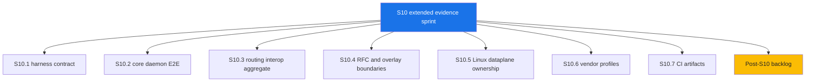

# S10 Closeout Analysis

Canonical closeout record for the S10 extended E2E and interoperability sprint.

---

## 1. Status

| Item | Value |
|---|---|
| Sprint | S10 |
| Result | Closed |
| Completion | 100% of planned S10 evidence targets |
| Product readiness impact | Test and evidence readiness improved; advanced backend productization remains incomplete |
| Release requirement | No code release required for documentation-only closeout |
| Required runtime | Podman |

## 2. Delivered Scope

| Area | Status | Evidence |
|---|---|---|
| Harness contract | Implemented | `make e2e-help`, `test/e2e/README.md`, `test/e2e/targets.md` |
| Core daemon E2E | Implemented | `make e2e-core`, GoBFD-to-GoBFD artifacts |
| Routing interop aggregate | Implemented | `make e2e-routing`, FRR/BIRD3 and GoBGP/ExaBGP evidence |
| RFC behavior evidence | Implemented | `make e2e-rfc`, RFC 7419/9384/9468/9747 artifacts |
| Overlay boundary evidence | Implemented | `make e2e-overlay`, VXLAN/Geneve packet-shape checks and fail-closed reserved backend checks |
| Linux dataplane ownership evidence | Implemented | `make e2e-linux`, isolated rtnetlink/kernel-bond/OVSDB/NetworkManager checks |
| Vendor profile evidence | Implemented | `make e2e-vendor`, optional Arista cEOS, Nokia SR Linux, SONiC-VS, VyOS, FRR, deferred Cisco XRd |
| CI artifact workflow | Implemented | `.github/workflows/e2e.yml` PR-safe, nightly, and manual vendor profiles |

## 3. Remaining Work

| Priority | Item | Status | Reason |
|---|---|---|---|
| P1 | Shared Podman API helper | Implemented in S11.1 | `test/internal/podmanapi` is used by routing, RFC, and vendor interop tests |
| P1 | Styled HTML E2E reports | Backlog | Standard JSON/CSV/log artifacts exist; shared JavaScript renderer is not implemented |
| P1 | Full local E2E execution evidence | Implemented in S11.2 | Core, overlay, routing, RFC, and Linux local evidence is recorded; remote CI evidence still pending |
| P2 | Owner-specific VXLAN/Geneve backends | Planned | `userspace-udp` backend exists; kernel/OVS/OVN/Cilium/Calico/NSX owner integrations fail closed |
| P2 | Broader vendor NOS execution | Manual | Licensed or local images are required for cEOS, SR Linux, SONiC-VS, VyOS, and XRd |
| P2 | Micro-BFD production hardening | Partial | Protocol, daemon wiring, and selected enforcement paths exist; wider LAG owner interop remains needed |
| P3 | S-BFD RFC 7880/7881 | Planned | No S-BFD reflector or initiator implementation |

## 4. Source Validation

| Source | Validated Fact | Repository Impact |
|---|---|---|
| RFC 7130 | Micro-BFD requires per-member sessions and LAG member load-balancing control. | Status remains protocol implemented with partial production integration. |
| RFC 8971 | VXLAN BFD is scoped to a Management VNI; non-Management VNI use is outside RFC scope. | `userspace-udp` VXLAN support remains valid; owner-specific integrations stay planned. |
| RFC 9521 | Geneve BFD is asynchronous and Echo BFD is outside the RFC scope. | Geneve status remains userspace backend implemented; rate and owner integration remain future work. |
| RFC 9747 | Unaffiliated Echo uses UDP destination port 3785 and is separate from affiliated control-session Echo. | Protocol docs distinguish RFC 9747 Echo from RFC 5880 affiliated Echo. |
| RFC 9764 | Large packets test path MTU by padded BFD packets and DF behavior. | RFC 9764 remains implemented. |
| Arista EOS documentation via Arista MCP | EOS VXLAN BFD is configured with `bfd vtep evpn` under the VXLAN Tunnel Interface. | Vendor VXLAN BFD remains a profile-specific interop item, not proof of generic Linux owner backend support. |

## 5. S11 Candidate Sprint

| Sprint | Objective | Exit Criteria |
|---|---|---|
| S11.1 | Extract shared Podman API helper | Implemented |
| S11.2 | Record full local E2E evidence | Implemented |
| S11.3 | Vendor NOS execution matrix | Pending |
| S11.4 | Generate styled HTML E2E reports | Pending |
| S11.5 | Execute remote CI evidence | Pending |
| S11.6 | Select first owner-specific backend | Pending |

---

*Last updated: 2026-05-01*
