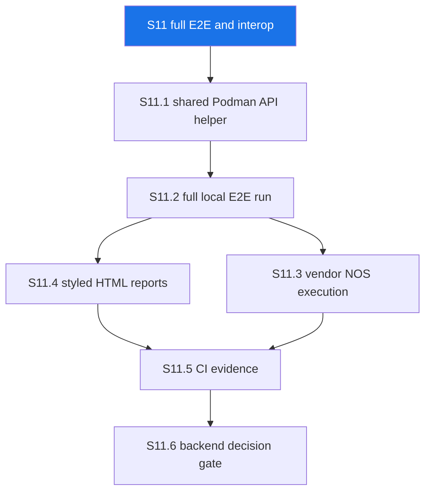

# S11 Full E2E and Interoperability Execution Plan

> **For agentic workers:** REQUIRED: Use superpowers:subagent-driven-development if subagents are explicitly authorized, or superpowers:executing-plans to implement this plan. Steps use checkbox (`- [ ]`) syntax for tracking.

**Goal:** Execute and harden full GoBFD E2E and interoperability evidence beyond the S10 harness foundation.

**Architecture:** S11 keeps the S10 Podman-only harness, adds shared Go helpers for repeatable container control, runs every E2E profile with recorded artifacts, and turns vendor/NOS coverage into explicit pass/skip evidence. Protocol feature expansion is gated until the E2E evidence is reproducible.

**Tech Stack:** Go 1.26, Podman, Podman Compose, Go test build tags, containerlab for manual vendor profiles, GitHub Actions, RFC 7130/8971/9521/9747/9764.

---

## 1. Scope

| Item | Decision |
|---|---|
| Sprint | S11 |
| Primary objective | Full local and CI E2E/interoperability execution evidence. |
| Required runtime | Podman. |
| Host Go | Invalid as evidence. |
| Release impact | No code release until behavior, CLI, API, packaging, or published artifacts change. |
| Non-goal | No kernel/OVS/OVN/Cilium/Calico/NSX backend implementation in S11. |

## 1.1. Progress

| Sprint Item | Status | Evidence |
|---|---|---|
| S11.1 shared Podman API helper | Implemented | `test/internal/podmanapi`, interop wrappers, Podman-only test/lint/gopls/doc gates |
| S11.2 full local E2E run | Pending | Not started |
| S11.3 vendor NOS execution | Pending | Not started |
| S11.4 styled HTML reports | Pending | Not started |
| S11.5 remote CI evidence | Pending | Not started |
| S11.6 backend decision gate | Pending | Not started |

## 2. Source Validation

| Source | Constraint |
|---|---|
| RFC 7130 | Micro-BFD requires independent per-member sessions and LAG member forwarding control. |
| RFC 8971 | VXLAN BFD is scoped to Management VNI; non-Management VNI use is outside RFC scope. |
| RFC 9521 | Geneve BFD uses asynchronous BFD; Echo BFD is outside RFC scope. |
| RFC 9747 | Unaffiliated Echo uses UDP destination port 3785 and is separate from affiliated control-session Echo. |
| RFC 9764 | Large Packet BFD requires padded packets and DF behavior for path MTU verification. |
| Arista MCP | EOS VXLAN BFD is configured as `bfd vtep evpn` under the VXLAN Tunnel Interface. |
| Context7 GitHub Actions | `workflow_dispatch` typed inputs, `github.event_name` job conditions, `always()` artifact upload, and least-privilege `contents: read` are valid workflow patterns. |

## 3. Sprint Map



## 4. Target Definition

| Target | Required by S11 | Evidence |
|---|---|---|
| `make e2e-core` | Yes | GoBFD-to-GoBFD protocol behavior, auth, reload, metrics, packet capture. |
| `make e2e-routing` | Yes | FRR/BIRD3 BFD interop and GoBGP/ExaBGP BGP+BFD coupling. |
| `make e2e-rfc` | Yes | RFC 7419/9384/9468/9747 suite with packet capture. |
| `make e2e-overlay` | Yes | VXLAN/Geneve packet shape and reserved backend fail-closed behavior. |
| `make e2e-linux` | Yes | Isolated rtnetlink, kernel-bond, OVSDB, and NetworkManager ownership boundaries. |
| `make e2e-vendor` | Yes | Pass/skip profile evidence for Arista cEOS, Nokia SR Linux, SONiC-VS, VyOS, FRR, and deferred Cisco XRd. |

## 5. Tasks

### Task 1: Shared Podman API Helper

**Files:**
- Create: `test/internal/podmanapi/client.go`
- Create: `test/internal/podmanapi/client_test.go`
- Modify: `test/interop-bgp/podman_api_test.go`
- Modify: `test/interop-rfc/podman_api_test.go`
- Modify: `test/interop-clab/podman_api_test.go`

- [x] **Step 1: Add failing helper tests**

Run:

```bash
make up
COMPOSE_PROJECT_NAME=s11-full-e2e podman-compose -p s11-full-e2e -f deployments/compose/compose.dev.yml exec -T dev \
  go test ./test/internal/podmanapi -run TestClient -count=1 -v
```

Expected: package does not exist.

- [x] **Step 2: Implement helper API**

Required exported functions:

| Function | Requirement |
|---|---|
| `NewClientFromEnvironment()` | Detect `/run/podman/podman.sock` and rootless `${XDG_RUNTIME_DIR}/podman/podman.sock`. |
| `Exec(ctx, container, argv)` | Return stdout, stderr, exit code, and error. |
| `Logs(ctx, container)` | Return bounded logs for artifact capture. |
| `Inspect(ctx, container)` | Return JSON container state and network data. |
| `Pause(ctx, container)` / `Unpause(ctx, container)` | Drive failure/recovery scenarios. |

- [x] **Step 3: Replace duplicated test helpers**

Replace duplicated Podman REST helper logic in routing, RFC, and vendor test packages without changing scenario assertions.

- [x] **Step 4: Verify**

Run:

```bash
make test
make gopls-check
make lint
```

Expected: all pass in Podman.

- [x] **Step 5: Commit**

```bash
git add .cspell.json CHANGELOG.md CHANGELOG.ru.md docs/en/21-s11-full-e2e-interop-plan.md docs/ru/21-s11-full-e2e-interop-plan.md test/internal/podmanapi test/interop-bgp test/interop-rfc test/interop-clab
git commit -m "test(interop): share podman api helper"
```

Current S11.1 verification:

```bash
make up
COMPOSE_PROJECT_NAME=s10-s1-e2e-harness podman-compose -p s10-s1-e2e-harness -f deployments/compose/compose.dev.yml exec -T dev \
  go test ./test/internal/podmanapi -count=1 -v
COMPOSE_PROJECT_NAME=s10-s1-e2e-harness podman-compose -p s10-s1-e2e-harness -f deployments/compose/compose.dev.yml exec -T dev \
  go test -tags 'interop_bgp interop_rfc interop_clab' ./test/interop-bgp ./test/interop-rfc ./test/interop-clab -run '^$' -count=1
make test
make gopls-check
make lint
make lint-docs
make lint-commit MSG='test(interop): share podman api helper'
git diff --check
```

Result: pass.

### Task 2: Full Local E2E Execution Evidence

**Files:**
- Create: `reports/e2e/.gitkeep` if needed for directory documentation only.
- Modify: `docs/en/21-s11-full-e2e-interop-plan.md`
- Modify: `docs/ru/21-s11-full-e2e-interop-plan.md`

- [ ] **Step 1: Run PR-safe profile locally**

Run:

```bash
make up
make e2e-core
make e2e-overlay
```

Expected: `reports/e2e/core/<timestamp>/` and `reports/e2e/overlay/<timestamp>/`.

- [ ] **Step 2: Run nightly profile locally**

Run:

```bash
make e2e-routing
make e2e-rfc
make e2e-linux
```

Expected: routing, RFC, and Linux report directories with `go-test.json`, `go-test.log`, `containers.json`, `containers.log`, `environment.json`, and `summary.md`.

- [ ] **Step 3: Validate packet evidence**

Run:

```bash
find reports/e2e -name packets.csv -o -name packets.pcapng
```

Expected: packet artifacts for core, routing, RFC, and overlay targets.

- [ ] **Step 4: Record evidence digest**

Update S11 plan status tables with target, timestamp, result, and artifact directory. Do not commit generated report payloads unless explicitly required.

- [ ] **Step 5: Commit**

```bash
git add docs/en/21-s11-full-e2e-interop-plan.md docs/ru/21-s11-full-e2e-interop-plan.md
git commit -m "test(interop): record full local e2e evidence"
```

### Task 3: Vendor NOS Execution Matrix

**Files:**
- Modify: `test/e2e/vendor/profiles.json`
- Modify: `test/e2e/vendor/vendor_test.go`
- Modify: `test/interop-clab/gobfd-vendors.clab.yml`
- Modify: `docs/en/05-interop.md`
- Modify: `docs/ru/05-interop.md`

- [ ] **Step 1: Verify local image inventory**

Run:

```bash
podman image ls --format json > /tmp/gobfd-vendor-images.json
make e2e-vendor
```

Expected: `vendor-images.json` and `skip-summary.json`.

- [ ] **Step 2: Execute available vendor profiles**

Run profiles where images exist:

```bash
make interop-clab
```

Expected: pass for available images; documented skip for unavailable or licensed images.

- [ ] **Step 3: Record profile status**

Required profile states:

| Vendor | State |
|---|---|
| Arista cEOS | pass or missing-image |
| Nokia SR Linux | pass or missing-image |
| SONiC-VS | pass or missing-image |
| VyOS | pass or missing-image |
| FRR | pass |
| Cisco XRd | deferred unless image exists |

- [ ] **Step 4: Verify RFC/vendor claims**

Arista VXLAN BFD must remain documented as EOS-specific `bfd vtep evpn`; it must not be used to claim generic Linux VXLAN backend support.

- [ ] **Step 5: Commit**

```bash
git add test/e2e/vendor test/interop-clab docs/en/05-interop.md docs/ru/05-interop.md
git commit -m "test(interop): record vendor nos evidence"
```

### Task 4: Styled HTML E2E Reports

**Files:**
- Create: `scripts/e2e-report/render.go`
- Create: `scripts/e2e-report/render_test.go`
- Create: `scripts/e2e-report/static/report.js`
- Create: `scripts/e2e-report/static/report.css`
- Modify: `test/e2e/*/run.sh`
- Modify: `test/e2e/README.md`

- [ ] **Step 1: Add renderer tests**

Run:

```bash
make up
COMPOSE_PROJECT_NAME=s11-full-e2e podman-compose -p s11-full-e2e -f deployments/compose/compose.dev.yml exec -T dev \
  go test ./scripts/e2e-report -run TestRender -count=1 -v
```

Expected: fail until renderer exists.

- [ ] **Step 2: Implement report renderer**

Required output:

| Artifact | Requirement |
|---|---|
| `index.html` | Standalone report file per target run. |
| `report.js` | Collapsible logs, artifact navigation, table filtering. |
| `report.css` | Repository-styled layout without external network dependencies. |

- [ ] **Step 3: Wire all E2E runners**

Each `test/e2e/*/run.sh` must call the renderer after writing JSON/CSV/log artifacts.

- [ ] **Step 4: Verify**

Run:

```bash
make e2e-overlay
find reports/e2e/overlay -name index.html
make lint-docs
make test
```

Expected: report file exists and checks pass.

- [ ] **Step 5: Commit**

```bash
git add scripts/e2e-report test/e2e
git commit -m "test(interop): render styled e2e reports"
```

### Task 5: Remote CI Evidence

**Files:**
- Modify: `.github/workflows/e2e.yml`
- Modify: `docs/en/21-s11-full-e2e-interop-plan.md`
- Modify: `docs/ru/21-s11-full-e2e-interop-plan.md`

- [ ] **Step 1: Validate workflow syntax**

Run:

```bash
make up
COMPOSE_PROJECT_NAME=s11-full-e2e podman-compose -p s11-full-e2e -f deployments/compose/compose.dev.yml exec -T dev actionlint .github/workflows/e2e.yml
```

Expected: no diagnostics.

- [ ] **Step 2: Push branch and open PR**

Run:

```bash
git push -u origin s10/s1-e2e-harness
gh pr create --fill
```

Expected: PR created or updated.

- [ ] **Step 3: Verify PR-safe workflow**

Run:

```bash
gh run list --workflow "E2E Evidence" --limit 5
gh run view <run-id> --log
```

Expected: PR-safe profile green and artifact `e2e-pr-safe` uploaded.

- [ ] **Step 4: Trigger manual profiles**

Run:

```bash
gh workflow run e2e.yml -f profile=nightly
gh workflow run e2e.yml -f profile=vendor
```

Expected: nightly green or documented host capability blocker; vendor pass/skip matrix uploaded.

- [ ] **Step 5: Commit evidence status**

```bash
git add docs/en/21-s11-full-e2e-interop-plan.md docs/ru/21-s11-full-e2e-interop-plan.md
git commit -m "ci(interop): record remote e2e evidence"
```

### Task 6: Backend Readiness Decision

**Files:**
- Create: `docs/en/22-owner-backend-decision.md`
- Create: `docs/ru/22-owner-backend-decision.md`
- Modify: `docs/en/implementation-plan.md`
- Modify: `docs/ru/implementation-plan.md`

- [ ] **Step 1: Score backend candidates**

Evaluate:

| Backend | Evidence Required |
|---|---|
| kernel VXLAN/Geneve | Linux namespace test and owner conflict policy. |
| OVS/OVN | OVSDB schema and containerized OVS interop evidence. |
| Cilium | eBPF capability, kernel version, and CNI ownership constraints. |
| Calico | CNI owner model and Linux dataplane mode constraints. |
| NSX | Geneve owner model and available lab endpoint. |

- [ ] **Step 2: Select one implementation candidate**

Selection requires available local/CI interop environment and non-destructive isolation.

- [ ] **Step 3: Commit decision**

```bash
git add docs/en/22-owner-backend-decision.md docs/ru/22-owner-backend-decision.md docs/en/implementation-plan.md docs/ru/implementation-plan.md
git commit -m "docs(netio): choose next owner backend"
```

## 6. Final Verification

Run:

```bash
make up
make lint-docs
make test
make lint
make gopls-check
make e2e-core
make e2e-overlay
make e2e-routing
make e2e-rfc
make e2e-linux
make e2e-vendor
git diff --check
make down
```

Expected:

| Check | Required Result |
|---|---|
| Unit/integration tests | Pass |
| golangci-lint | 0 issues |
| gopls | No diagnostics |
| Documentation lint | Pass |
| E2E core/routing/RFC/overlay/Linux | Pass or documented host capability blocker |
| Vendor profile | Pass/skip matrix with no false failures |
| Worktree | Clean after commit |

---

*Last updated: 2026-05-01*
