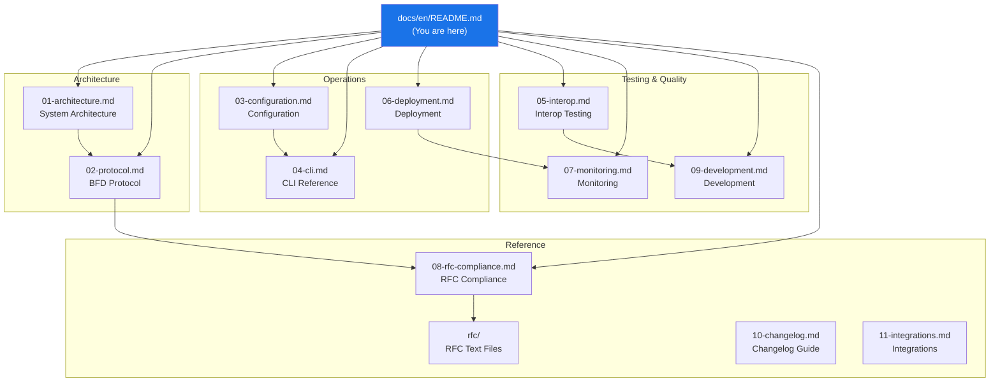

# GoBFD Documentation


> Comprehensive technical documentation for **GoBFD** -- a production-grade BFD protocol daemon (RFC 5880/5881) written in Go 1.26.

---

## Documentation Map



---

## Table of Contents

### Architecture

| # | Document | Description |
|---|---|---|
| 01 | [**Architecture**](./01-architecture.md) | System architecture, package diagram, packet flow, FSM design |
| 02 | [**BFD Protocol**](./02-protocol.md) | FSM, timers, jitter, packet format, authentication (RFC 5880) |

### Operations

| # | Document | Description |
|---|---|---|
| 03 | [**Configuration**](./03-configuration.md) | YAML config reference, environment variables, hot reload |
| 04 | [**CLI Reference**](./04-cli.md) | gobfdctl commands, interactive shell, output formats |
| 05 | [**Interop Testing**](./05-interop.md) | Interop suites: 4-peer, BGP+BFD, RFC-specific, vendor NOS |
| 06 | [**Deployment**](./06-deployment.md) | systemd, Podman Compose, container image, production |
| 07 | [**Monitoring**](./07-monitoring.md) | Prometheus metrics, Grafana dashboard, alerting |

### Reference

| # | Document | Description |
|---|---|---|
| 08 | [**RFC Compliance**](./08-rfc-compliance.md) | RFC compliance matrix, implementation notes, links to RFCs |
| 09 | [**Development**](./09-development.md) | Dev workflow, Make targets, testing, linting, proto generation |
| 10 | [**Changelog Guide**](./10-changelog.md) | How to maintain CHANGELOG.md, release process, semantic versioning |
| 11 | [**Integrations**](./11-integrations.md) | BGP failover, HAProxy, observability, ExaBGP, Kubernetes examples |

### RFC Source Files

| File | RFC | Title |
|---|---|---|
| [rfc5880.txt](../rfc/rfc5880.txt) | RFC 5880 | Bidirectional Forwarding Detection (BFD) |
| [rfc5881.txt](../rfc/rfc5881.txt) | RFC 5881 | BFD for IPv4 and IPv6 (Single Hop) |
| [rfc5882.txt](../rfc/rfc5882.txt) | RFC 5882 | Generic Application of BFD |
| [rfc5883.txt](../rfc/rfc5883.txt) | RFC 5883 | BFD for Multihop Paths |
| [rfc5884.txt](../rfc/rfc5884.txt) | RFC 5884 | BFD for MPLS Label Switched Paths |
| [rfc5885.txt](../rfc/rfc5885.txt) | RFC 5885 | BFD for PW VCCV |
| [rfc7130.txt](../rfc/rfc7130.txt) | RFC 7130 | Bidirectional Forwarding Detection (BFD) on LAG |

---

## Quick Start

```bash
# Clone and build
git clone https://github.com/dantte-lp/gobfd.git && cd gobfd
make build

# Run tests
make test

# Start dev environment
make up
```

See [06-deployment.md](./06-deployment.md) for production deployment and [09-development.md](./09-development.md) for the full dev workflow.

---

*Last updated: 2026-02-24*
