# GoBFD Roadmap

> Living roadmap from `v0.5.2` through `v1.0.0`. Each sprint produces a
> reviewable commit set, runs the full quality and interop matrix, and
> gates the next sprint.

---

## Method

- **Waterfall.** Each sprint has a hard gate. The next sprint MUST NOT
  start before the previous one closes with `make verify` green and
  evidence captured under `reports/e2e/`.
- **Conventional Commits 1.0.0.** Every commit follows the
  `type(scope): subject` form. Subject is sentence-case or lower-case,
  ≤ 100 characters.
- **Keep a Changelog 1.1.0.** User-facing changes land in `CHANGELOG.md`
  and `CHANGELOG.ru.md` in the same commit they ship.
- **Source-backed.** Every protocol claim references the relevant RFC
  in `docs/rfc/`. Every external behavior claim references the primary
  vendor or library doc (Arista MCP, OVS docs, NetworkManager D-Bus).

## Quality Gate (every sprint)

| Gate | Tool | Outcome |
|---|---|---|
| Build | `go build ./...` | 0 errors |
| Vet | `go vet ./...` | 0 issues |
| Race tests | `go test -race -count=1 ./...` | all PASS |
| Lint | `golangci-lint run` | 0 issues |
| Coverage | `go test -cover ./...` | per-package not lower than baseline |
| Proto lint | `buf lint` | 0 issues |
| Proto break | `buf breaking --against '.git#branch=master'` | none unless explicit major bump |
| Docs lint | `make lint-md`, `make lint-yaml`, `make lint-spell` | 0 issues |
| Vulnerability | `govulncheck ./...` | 0 unfixed criticals |
| RFC E2E | `make e2e-rfc` | packet evidence per RFC |
| Routing interop | `make e2e-routing` | FRR + BIRD3 + GoBGP + ExaBGP green |
| Vendor interop | `make e2e-vendor` (when image available) | profile-by-profile pass/skip |

## Naming and Style Anchors

- **Packages.** Lowercase, no stutter (`bfd.Session`, not `BFDSession`).
- **Errors.** Wrapped with `%w`. Sentinels prefixed `Err`. `errors.Is`/`errors.As`,
  never string match.
- **Context.** First parameter, never stored in struct.
- **Concurrency.** Sender closes channels. Goroutine lifetime tied to
  `context.Context`.
- **Logging.** `log/slog` only, structured fields. No `fmt.Println`,
  no `log` package.
- **FSM.** Every transition matches RFC 5880 §6.8.6 exactly.
- **Hot path.** 0 allocs/op enforced by micro-benchmark.
- **Generated code.** `pkg/bfdpb/` is regenerated via `buf generate`,
  never edited.
- **Doc files.** Every package has a `doc.go`. Every `cmd/` binary has
  a `Command <name>` block comment in `doc.go`.

## Risk Register (active)

| ID | Risk | L | I | Mitigation |
|---|---|---|---|---|
| R8 | Talos / Cilium API drift breaks integrations. | M | M | Integrations live in `deployments/integrations/`, not `internal/`. CI matrix targets stable upstream tags. |
| R9 | Podman-only CI forces Docker users to docker compatibility shim. | L | L | Document `docker compose -f deployments/...` as community-supported alternative; do not ship as primary. |
| R10 | Go 1.26 too fresh for downstream distros. | M | M | Re-evaluate before `v1.0.0`. Possible relax to Go 1.24 LTS. |
| R11 | mTLS adds onboarding friction. | L | M | Ship in optional mode; default loopback bind preserves current UX. |
| R12 | New RPCs break early API consumers. | M | H | Old `AddSession` keeps current semantics with a `Deprecated:` comment; new RPCs ship alongside, removable in v2. |

---

## Phases

```mermaid
graph LR
    subgraph "Phase 6 (S12) — API completeness"
      S12["S12<br/>Typed CRUD per session"]
    end

    subgraph "Phase 7 (S13-S15) — Production hardening"
      S13["S13<br/>mTLS + key rotation"]
      S14["S14<br/>HTML E2E reports"]
      S15["S15<br/>OpenTelemetry"]
    end

    subgraph "Phase 8 (S16) — Distribution"
      S16["S16<br/>Talos extension"]
    end

    subgraph "Phase 9 (S17) — Owner backend"
      S17["S17<br/>Linux kernel VXLAN backend"]
    end

    subgraph "Phase 10 (S18-S19) — Protocol expansion"
      S18["S18<br/>S-BFD RFC 7880/7881"]
      S19["S19<br/>AF_XDP echo R&D"]
    end

    subgraph "Phase 11 (S20) — v1.0.0"
      S20["S20<br/>Stabilization"]
    end

    S12 --> S13 --> S14 --> S15
    S15 --> S16 --> S17
    S17 --> S18 --> S19
    S19 --> S20

    style S12 fill:#1a73e8,color:#fff
    style S20 fill:#34a853,color:#fff
```

---

## S12 — Typed CRUD API per session type

| Field | Value |
|---|---|
| Phase | 6 — API completeness |
| Target version | `v0.6.0-rc.1` |
| RFC sources | RFC 5880 §6.8.1 (timer/discriminator init), RFC 7130 (Micro-BFD), RFC 8971 (VXLAN BFD), RFC 9521 (Geneve BFD), RFC 9747 (unaffiliated Echo) |
| Internal sources | `api/v1/bfd.proto`, `internal/server/server.go`, `internal/bfd/manager_*.go`, `cmd/gobfdctl/commands/` |
| External sources | ConnectRPC service patterns (context7), Cobra subcommand patterns (context7), Buf v2 lint rules |

### Goal

Replace the current single-typed `AddSession` (which rejects advanced
session types) with dedicated RPC services per transport family. Each
service surfaces the parameters required by its own RFC.

### Deliverables

1. `api/v1/bfd.proto` — three new services: `EchoService`,
   `MicroBFDService`, `OverlayService` (with `Vxlan` and `Geneve`
   methods).
2. `pkg/bfdpb/` — regenerated via `buf generate`.
3. `internal/server/` — handlers for new services. Each handler
   validates RFC-mandated invariants before calling `bfd.Manager`.
4. `cmd/gobfdctl/commands/` — `echo add|list|delete`, `micro create|list|delete`,
   `overlay vxlan add|...`, `overlay geneve add|...`.
5. `internal/bfd/manager_*.go` — accept new typed `EchoSessionConfig`,
   `MicroBFDConfig`, overlay configs without intermediate generic shape.
6. Tests:
   - `internal/server/*_test.go` — RPC happy path, validation errors,
     RFC field bounds.
   - `cmd/gobfdctl/commands/*_test.go` — CLI parser tests for new flags.
   - `test/e2e/` — RPC + packet evidence for at least one of
     {Echo, Micro-BFD, VXLAN, Geneve}.
7. Documentation:
   - `docs/en/04-cli.md` — new commands.
   - `docs/en/03-configuration.md` — equivalent YAML keys (already
     existed; cross-reference RPC equivalents).
   - `CHANGELOG.md` `### Added` and EN/RU mirror.

### Tasks

| # | Task | Output |
|---|---|---|
| S12.1 | Audit proto surface and reject logic. | Sprint notes; baseline understanding. |
| S12.2 | Design `EchoService.AddEchoSession` etc. | Updated `api/v1/bfd.proto`. |
| S12.3 | `buf generate`. | Regenerated `pkg/bfdpb/`. |
| S12.4 | Server handlers. | `internal/server/echo.go`, `internal/server/micro.go`, `internal/server/overlay.go`. |
| S12.5 | CLI commands. | `cmd/gobfdctl/commands/echo.go`, `micro.go`, `overlay.go`. |
| S12.6 | Tests. | server + CLI + E2E coverage. |
| S12.7 | Docs sync. | EN + RU. |
| S12.8 | Conventional Commits sequence. | One commit per sub-task scope. |

### Acceptance

- [ ] `buf lint`: 0 issues; `buf breaking --against '.git#branch=master'`: only intentional additions.
- [ ] All RPC methods defined have at least one happy-path test and one validation test.
- [ ] `gobfdctl echo add ... && gobfdctl echo list` end-to-end against `make up` daemon.
- [ ] `make e2e-rfc` still green (Echo path uses new API where applicable).
- [ ] CHANGELOG entries describe the new commands and the new RPCs.

### Risks

- Proto breaking change rules: adding services and methods is non-breaking;
  deprecating fields requires `[deprecated = true]` comment.
- CLI naming: `echo` collides with shell `echo`. Cobra-level subcommand
  resolution avoids this when invoked as `gobfdctl echo`.

---

## S13 — mTLS on gRPC API + dynamic auth-key rotation

| Field | Value |
|---|---|
| Phase | 7 — Production hardening |
| Target version | `v0.6.0` |
| RFC sources | RFC 5246/8446 (TLS), RFC 5280 (X.509), RFC 5880 §6.7 (BFD authentication) |
| Internal sources | `internal/server/`, `internal/config/`, `internal/bfd/auth.go`, `cmd/gobfdctl/commands/` |
| External sources | ConnectRPC TLS docs, Go `crypto/tls` docs |

### Goal

1. Make the ConnectRPC API mutually-authenticated with X.509 client
   certs, optional but production-required.
2. Add an RPC + CLI surface for hot-rotating BFD auth keys without
   re-creating the session, preserving sequence number invariants.

### Deliverables

- `internal/config/`: `grpc.tls.{cert_file,key_file,client_ca_file,client_auth}` block.
- `internal/server/`: TLS config builder; `BfdService.RotateAuthKey` RPC;
  `BfdService.ListAuthKeys` for read-back.
- `internal/bfd/auth.go`: `AuthKeyStore.Rotate(keyID, secret)` with sequence
  preservation and detection-time guard.
- `cmd/gobfdctl/commands/`: `--tls-cert`, `--tls-key`, `--tls-ca`, `--tls-server-name`
  flags. `gobfdctl auth rotate <peer> --key-id N --secret <hex>`.
- `docs/en/15-security.md`: TLS profile reference (mode `none`/`tls`/`mtls`).
- `docs/en/04-cli.md`: auth rotation walkthrough.
- Tests: TLS happy/failure, RPC rotation across detection-time boundary.

### Acceptance

- [ ] Loopback default behavior unchanged (`grpc.tls.mode: none`).
- [ ] `mtls` mode rejects unauthenticated client with TLS handshake error.
- [ ] Rotation under live BFD does not flap session.
- [ ] `make e2e-core` includes a rotation scenario.

---

## S14 — Styled HTML E2E reports

| Field | Value |
|---|---|
| Phase | 7 — Production hardening |
| Target version | `v0.6.0` |
| Internal sources | `test/e2e/*`, `reports/e2e/*` |

### Goal

Standalone single-file HTML reports per E2E run with shared themed
JavaScript renderer.

### Deliverables

- `test/e2e/internal/htmlreport/` — Go package with `Render(out io.Writer, run RunMetadata)`.
- `reports/e2e/<target>/<timestamp>/index.html` — generated alongside JSON/CSV.
- `make e2e-report` — re-render from existing JSON without rerunning E2E.
- Repository-themed CSS, target status summary, packet evidence tables,
  collapsible logs.

### Acceptance

- [ ] Every existing target (`e2e-core`, `e2e-routing`, `e2e-rfc`,
      `e2e-overlay`, `e2e-linux`, `e2e-vendor`) produces an `index.html`.
- [ ] HTML lint via `htmlhint` passes.
- [ ] Report opens offline (no CDN dependencies).

---

## S15 — OpenTelemetry tracing

| Field | Value |
|---|---|
| Phase | 7 — Production hardening |
| Target version | `v0.6.0` |
| External sources | OpenTelemetry Go SDK |

### Goal

OTLP traces for session lifecycle, FSM transitions, and RPC paths.
Exporter optional via config.

### Deliverables

- `internal/bfd/tracer.go` — span helpers wrapping FSM, packet codec, send/recv.
- `internal/server/interceptors.go` — extend with tracing interceptor.
- `internal/config/`: `tracing.{exporter,endpoint,sample_ratio}` block.
- Default off; loopback OTLP gRPC ready-to-go.

### Acceptance

- [ ] `bench` shows < 1% overhead at sample_ratio 0.0 (default off).
- [ ] At sample_ratio 1.0 each session lifecycle produces spans for
      `Create`, `FSMTransition`, `Destroy`.

---

## S16 — Talos system extension

| Field | Value |
|---|---|
| Phase | 8 — Distribution |
| Target version | `v0.6.1` |
| External sources | siderolabs/extensions repo, Talos extension contract docs |

### Goal

Publish GoBFD as a Talos system extension so Talos hosts can install
it through a MachineConfig directive without custom container images.

### Deliverables

- New repo or directory `deployments/talos-extension/` with
  `manifest.yaml`, `Pkgfile`, `Containerfile`.
- GitHub Actions workflow that builds `linux/amd64` and `linux/arm64`
  extension archives, publishes to `ghcr.io/dantte-lp/gobfd-talos-ext`.
- `docs/en/11-integrations.md` adds Talos integration runbook.
- Reference Talos `MachineConfig` snippet that wires GoBFD as a
  sibling to GoBGP for BFD detection.

### Acceptance

- [ ] Extension passes `talosctl --image ... validate`.
- [ ] Boot-test in containerlab Talos VM: BFD session up between two
      Talos nodes via the extension.

---

## S17 — Linux kernel VXLAN owner-specific backend

| Field | Value |
|---|---|
| Phase | 9 — Owner backend |
| Target version | `v0.7.0` |
| RFC sources | RFC 7348 (VXLAN), RFC 8971 (BFD for VXLAN) |
| Internal sources | `internal/netio/vxlan.go`, `internal/netio/lag_*.go` (pattern reference) |
| External sources | Linux netlink VXLAN spec, `iproute2` source for VXLAN |

### Goal

Replace `userspace-udp` VXLAN backend default with a Linux
kernel-VXLAN-aware backend that asks the kernel netlink VXLAN driver
to act as the local NVE, and only injects BFD packets through the
kernel-owned VTEP.

### Deliverables

- `internal/netio/vxlan_kernel_linux.go` with netlink RTNL_VXLAN
  attribute parsing and NVE socket binding via `BPF_F_REUSEPORT_LB`.
- `vxlan.backend: kernel` selectable in config.
- Coexistence test: kernel backend + userspace fallback in one daemon.
- `make e2e-overlay` adds kernel backend track.

### Acceptance

- [ ] When kernel VXLAN is active, GoBFD does not bind UDP 4789;
      it injects via VTEP.
- [ ] When kernel VXLAN is absent, daemon refuses kernel backend with
      explicit error rather than silently falling back.

---

## S18 — S-BFD (RFC 7880 / 7881)

| Field | Value |
|---|---|
| Phase | 10 — Protocol expansion |
| Target version | `v0.7.0` |
| RFC sources | RFC 7880 (S-BFD framework), RFC 7881 (S-BFD for IPv4/IPv6/MPLS), RFC 7882 (Section 5 use cases), RFC 7883 (S-BFD demand mode) |
| Internal sources | `internal/bfd/`, `internal/netio/sender.go`, `internal/netio/listener.go` |

### Goal

Implement Seamless BFD initiator and reflector for IPv4 and IPv6.

### Deliverables

- `internal/bfd/sbfd.go` — Seamless session type.
- `internal/bfd/sbfd_reflector.go` — stateless reflector.
- `internal/bfd/sbfd_initiator.go` — initiator FSM.
- Discriminator pool reserved for S-BFD per RFC 7881 §3.
- Listener on UDP/IPv4 and UDP/IPv6 well-known port.
- `gobfdctl sbfd` and proto service (extends Phase 6 surface).
- E2E suite: initiator hits reflector through container topology.

### Acceptance

- [ ] Two-node S-BFD up at 50 ms detection time over loopback.
- [ ] tshark capture shows S-BFD packets with correct discriminators.

---

## S19 — AF_XDP Echo path R&D

| Field | Value |
|---|---|
| Phase | 10 — Protocol expansion |
| Target version | `v0.8.0-rc.1` |
| RFC sources | RFC 9747 (Unaffiliated Echo) |
| External sources | Linux AF_XDP, `cilium/ebpf` |

### Goal

Move the unaffiliated Echo TX/RX off the kernel `recvmsg`/`sendmsg`
syscall path onto AF_XDP for ~10x throughput headroom.

### Deliverables

- `internal/netio/echo_xdp_linux.go` (build-tagged).
- `internal/bfd/echo.go` keeps userspace fallback.
- `bench/echo_xdp_test.go` measuring before/after.
- Documentation: kernel and capability requirements.

### Acceptance

- [ ] Per-packet cost in `BenchmarkEchoXDPSend` ≤ 25 % of userspace
      `BenchmarkEchoSend`.
- [ ] Functional parity with userspace Echo across `make e2e-rfc`.

---

## S20 — `v1.0.0` stabilization

| Field | Value |
|---|---|
| Phase | 11 — v1 |
| Target version | `v1.0.0` |

### Goal

Freeze public API. All `internal/` ↔ `pkg/bfdpb/` boundaries documented.
Performance baseline captured. Security audit pass.

### Deliverables

- `docs/en/api-stability.md` — explicit stable surfaces.
- `BENCHMARKS.md` — frozen baseline at tag `v1.0.0`.
- Third-party security review (or self-review with checklist).
- pkg.go.dev examples for every public service.
- Release notes covering migration from `v0.x`.

### Acceptance

- [ ] No `// Deprecated:` API in `pkg/bfdpb/` at the time of tagging.
- [ ] CHANGELOG `## [1.0.0]` lists every backward-incompatible change.
- [ ] All sprints S12-S19 closed with archived sprint notes under
      `.archive/sprints/`.
