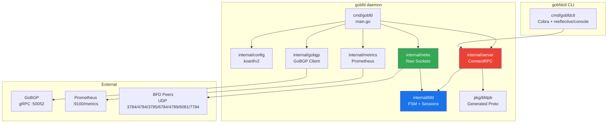
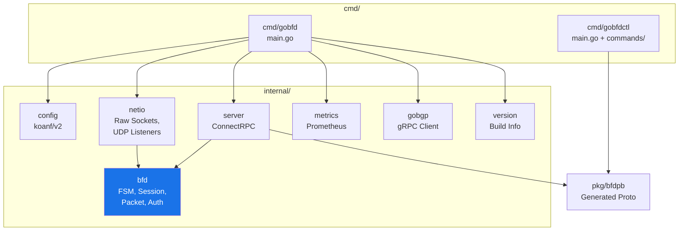
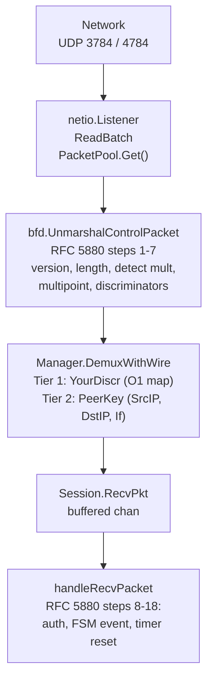
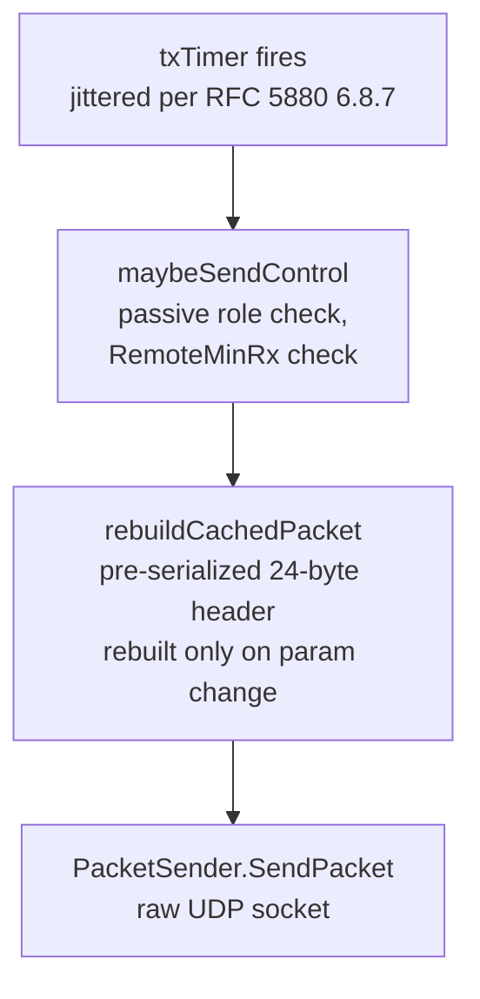
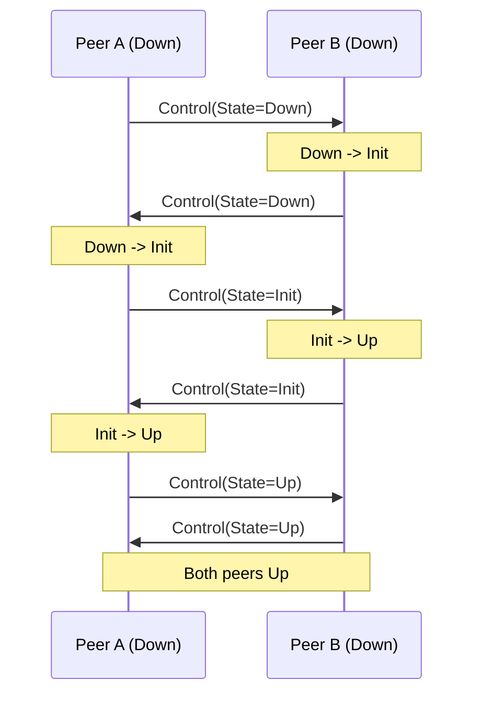
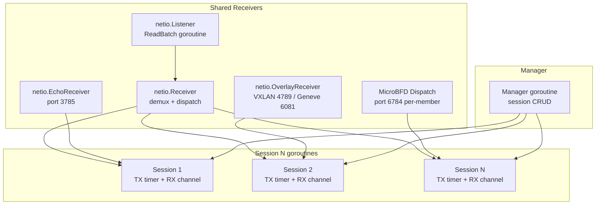

# Архитектура


> Архитектура GoBFD: зависимости пакетов, путь пакета, жизненный цикл сессии и модель горутин.

---

### Содержание

- [Обзор системы](#обзор-системы)
- [Диаграмма зависимостей пакетов](#диаграмма-зависимостей-пакетов)
- [Правила зависимостей](#правила-зависимостей)
- [Путь приёма пакета (RX)](#путь-приёма-пакета-rx)
- [Путь отправки пакета (TX)](#путь-отправки-пакета-tx)
- [Демультиплексирование](#демультиплексирование)
- [Трёхстороннее рукопожатие](#трёхстороннее-рукопожатие)
- [Модель горутин](#модель-горутин)
- [Корректное завершение](#корректное-завершение)
- [Структура проекта](#структура-проекта)
- [Технологический стек](#технологический-стек)

### Обзор системы

GoBFD -- production-ready демон протокола BFD (Bidirectional Forwarding Detection). Состоит из четырёх бинарных файлов:

- **gobfd** -- демон, управляющий BFD-сессиями, отправляющий/принимающий BFD Control пакеты и интегрированный с GoBGP
- **gobfdctl** -- CLI-клиент, взаимодействующий с gobfd через ConnectRPC
- **gobfd-haproxy-agent** -- мост для HAProxy agent-check (состояние BFD в TCP-ответы агента)
- **gobfd-exabgp-bridge** -- мост для ExaBGP process API (состояние BFD в анонсы маршрутов)



### Диаграмма зависимостей пакетов



Ключевые пакеты:

| Пакет | Ответственность |
|---|---|
| `internal/bfd` | Ядро протокола: FSM, сессии, кодек пакетов, аутентификация |
| `internal/netio` | Абстракция сырых сокетов, UDP-слушатели, overlay-туннели (Linux) |
| `internal/server` | ConnectRPC-сервер с перехватчиками (логирование, recovery) |
| `internal/config` | Конфигурация через koanf/v2: YAML + env + флаги |
| `internal/metrics` | Prometheus-коллекторы для BFD-сессий |
| `internal/gobgp` | gRPC-клиент к GoBGP + демпфирование flap-ов (RFC 5882) |
| `pkg/bfdpb` | Сгенерированные protobuf-типы (публичный API) |

### Правила зависимостей

- `internal/bfd` **не зависит** от `internal/server`, `internal/netio` или `internal/config`
- `internal/server` зависит от `internal/bfd` (Manager, Session, типы) и `pkg/bfdpb`
- `internal/netio` зависит от `internal/bfd` только через интерфейс `PacketSender` и `ControlPacket`
- `pkg/bfdpb` -- сгенерированный код, никогда не редактируется вручную

### Путь приёма пакета (RX)



Валидация из 13 шагов RFC 5880 Section 6.8.6 разделена на два уровня:

| Уровень | Шаги | Ответственность |
|---|---|---|
| **Кодек** (`packet.go`) | 1-7 | Версия, длина, detect mult, multipoint, дискриминаторы (без состояния) |
| **Сессия** (`session.go`) | 8-18 | Проверка auth, событие FSM, обновление таймеров, обновление переменных |

Это разделение позволяет слушателю отбрасывать невалидные пакеты до захвата блокировки сессии.

### Путь отправки пакета (TX)



**Паттерн кэшированного пакета** (по образцу FRR bfdd): каждая сессия хранит предварительно сериализованный `cachedPacket []byte`, который пересобирается только при изменении параметров (переход состояния, Poll/Final, согласование таймеров). На каждом TX-интервале кэшированные байты отправляются напрямую без повторной сериализации.

### Демультиплексирование

Двухуровневый поиск по RFC 5880 Section 6.8.6:

1. **Уровень 1** -- Your Discriminator ненулевой: O(1) поиск по дискриминатору. Быстрый путь для установленных сессий.
2. **Уровень 2** -- Your Discriminator нулевой И состояние Down/AdminDown: поиск по составному ключу (SrcIP, DstIP, Interface). Используется только при первоначальном установлении сессии.

### Трёхстороннее рукопожатие

BFD-сессии используют трёхстороннее рукопожатие (RFC 5880 Section 6.2):



Последовательность переходов FSM:

1. A(Down) отправляет State=Down. B(Down) получает State=Down --> B переходит в Init.
2. B(Init) отправляет State=Init. A(Down) получает State=Init --> A переходит в Up.
3. A(Up) отправляет State=Up. B(Init) получает State=Up --> B переходит в Up.

### Модель горутин

Каждая BFD-сессия работает как независимая горутина с собственными таймерами и состоянием. Время жизни горутины привязано к `context.Context` от Manager-а.



Ключевые принципы:
- Отправитель закрывает каналы
- Время жизни горутины = время жизни контекста
- Каждая горутина обязана иметь механизм завершения

### Корректное завершение

При SIGTERM/SIGINT (RFC 5880 Section 6.8.16):

1. `Manager.DrainAllSessions()` -- все сессии переводятся в AdminDown с Diag = Administratively Down (7)
2. Пауза 2x TX-интервала для отправки финальных AdminDown-пакетов
3. `Manager.Close()` -- отмена всех горутин сессий
4. Закрытие сокетов слушателей
5. Остановка HTTP-серверов (gRPC, метрики)

Это гарантирует, что удалённые пиры увидят AdminDown, а не таймаут обнаружения, предотвращая ненужный отзыв маршрутов BGP.

### Структура проекта

```
gobfd/
+-- api/bfd/v1/bfd.proto          # Protobuf service definitions (buf managed)
+-- cmd/
|   +-- gobfd/main.go             # Daemon entry point
|   +-- gobfdctl/                 # CLI client
|   |   +-- main.go
|   |   +-- commands/             # Cobra commands + reeflective/console shell
|   +-- gobfd-haproxy-agent/      # HAProxy agent-check bridge
|   +-- gobfd-exabgp-bridge/      # ExaBGP process API bridge
+-- internal/
|   +-- bfd/                      # Core protocol (FSM, session, packet, auth)
|   +-- config/                   # koanf/v2 configuration
|   +-- gobgp/                    # GoBGP gRPC client + flap dampening
|   +-- metrics/                  # Prometheus collectors
|   +-- netio/                    # Raw sockets, UDP listeners, overlay tunnels (Linux)
|   +-- server/                   # ConnectRPC server + interceptors
|   +-- version/                  # Build info
+-- pkg/bfdpb/                    # Generated protobuf types (public API)
+-- test/interop/                 # 4-peer interop tests (FRR, BIRD3, aiobfd, Thoro)
+-- test/interop-bgp/            # BGP+BFD interop tests (GoBGP, FRR, BIRD3, ExaBGP)
+-- test/interop-rfc/            # RFC-specific interop tests (7419, 9384, 9468)
+-- test/interop-clab/           # Vendor NOS interop tests (Nokia, Arista, Cisco, FRR, SONiC, VyOS)
+-- test/integration/            # Integration tests (datapath, CLI, server)
+-- configs/                      # Example configuration
+-- deployments/
|   +-- compose/                  # Podman Compose (dev + prod stacks)
|   +-- docker/                   # Containerfile + debug image
|   +-- systemd/                  # systemd unit file
|   +-- nfpm/                     # deb/rpm install scripts
|   +-- integrations/            # 5 integration examples (BGP, HAProxy, observability, ExaBGP, k8s)
+-- docs/                         # Documentation + RFC texts
```

### Технологический стек

| Компонент | Технология | Назначение |
|---|---|---|
| Язык | Go 1.26 | Green Tea GC, `testing/synctest`, flight recorder |
| Сетевой I/O | `x/net/ipv4`, `x/net/ipv6`, `x/sys/unix` | Сырые сокеты, управление TTL, `SO_BINDTODEVICE` |
| RPC-сервер | ConnectRPC | gRPC + Connect + gRPC-Web из одного обработчика |
| RPC-клиент | `google.golang.org/grpc` | Интеграция с GoBGP (gRPC-клиент) |
| CLI | Cobra + reeflective/console | Неинтерактивный + интерактивная оболочка |
| Конфигурация | koanf/v2 | YAML + env vars + flags, горячая перезагрузка |
| Метрики | Prometheus `client_golang` | Счётчики, gauge, гистограммы |
| Логирование | `log/slog` (stdlib) | Структурированное JSON/text логирование |
| Protobuf | buf CLI | Линтинг, проверка совместимости, генерация кода |
| Линтинг | golangci-lint v2 | 35+ линтеров, строгая конфигурация |
| Релизы | GoReleaser v2 | Бинарники + deb/rpm + контейнерные образы |
| Контейнеры | Podman + Podman Compose | Разработка и тестирование |
| systemd | Type=notify, watchdog | Жизненный цикл production-демона |

### Карта UDP-портов

| Порт | Протокол | RFC | Направление | Статус |
|---|---|---|---|---|
| 3784 | BFD Single-Hop | RFC 5881 | TX + RX | Активен |
| 4784 | BFD Multi-Hop | RFC 5883 | TX + RX | Активен |
| 3785 | BFD Echo | RFC 9747 | TX + RX | Активен |
| 6784 | Micro-BFD (LAG) | RFC 7130 | TX + RX | Активен |
| 4789 | VXLAN BFD (outer) | RFC 8971 | TX + RX | Активен |
| 6081 | Geneve BFD (outer) | RFC 9521 | TX + RX | Активен |
| 7784 | S-BFD Reflector | RFC 7881 | RX (рефлектор) + TX (инициатор) | Планируется |

### Карта TCP/HTTP-портов

| Порт | Протокол | Назначение | Статус |
|---|---|---|---|
| 50051 | ConnectRPC (gRPC) | API управления сессиями | Активен |
| 9100 | HTTP | Метрики Prometheus (`/metrics`) | Активен |

### Связанные документы

- [02-protocol.md](./02-protocol.md) -- Детали протокола BFD (FSM, таймеры, формат пакета)
- [03-configuration.md](./03-configuration.md) -- Справочник конфигурации
- [06-deployment.md](./06-deployment.md) -- Развёртывание в production
- [09-development.md](./09-development.md) -- Рабочий процесс разработки

---

*Последнее обновление: 2026-02-24*
