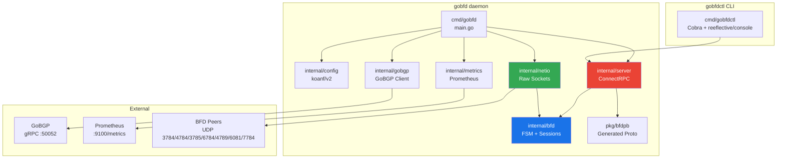
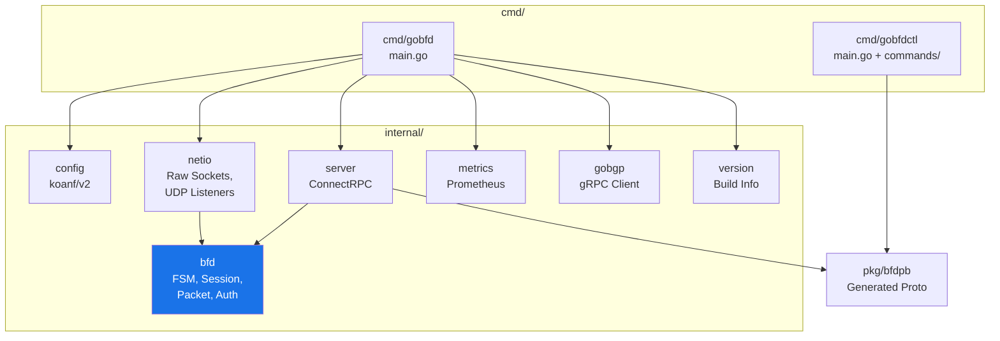
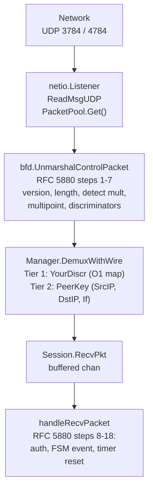
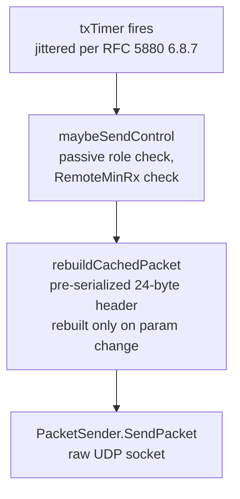
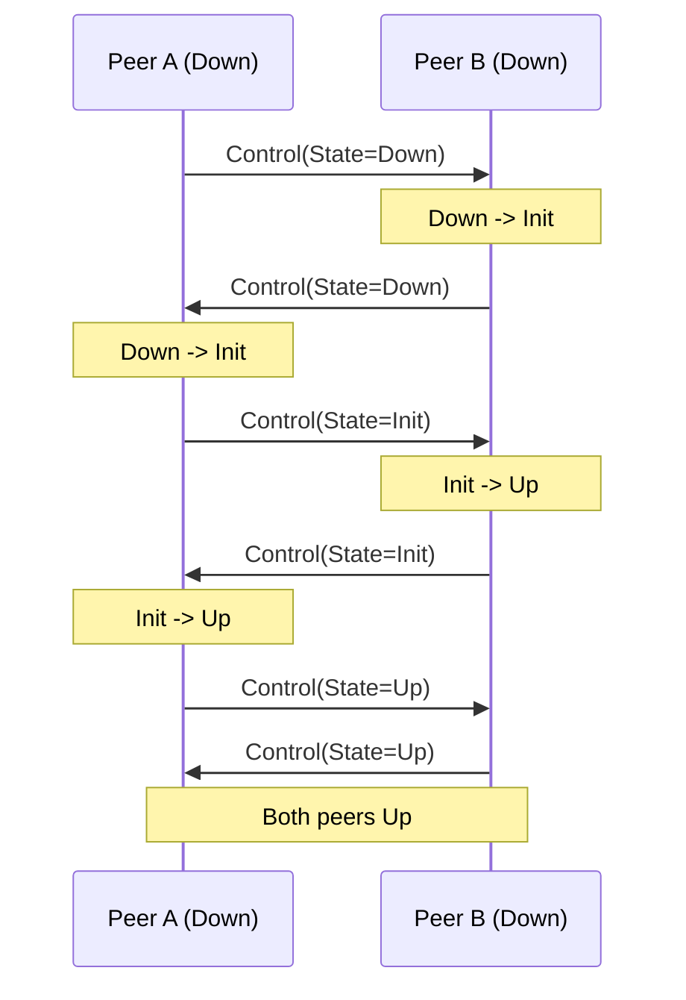
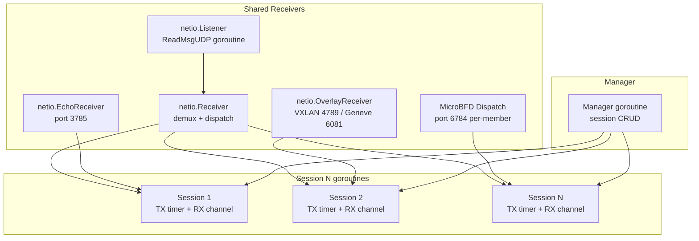

# Архитектура


> Архитектура GoBFD: зависимости пакетов, путь пакета, жизненный цикл сессии и модель горутин.

---

## Содержание

- [Обзор системы](#обзор-системы)
- [Диаграмма зависимостей пакетов](#диаграмма-зависимостей-пакетов)
- [Правила зависимостей](#правила-зависимостей)
- [Путь приёма пакета (RX)](#путь-приёма-пакета-rx)
- [Путь отправки пакета (TX)](#путь-отправки-пакета-tx)
- [Демультиплексирование](#демультиплексирование)
- [Идентичность и ownership сессий](#идентичность-и-ownership-сессий)
- [Трёхстороннее рукопожатие](#трёхстороннее-рукопожатие)
- [Модель горутин](#модель-горутин)
- [Корректное завершение](#корректное-завершение)
- [Структура проекта](#структура-проекта)
- [Технологический стек](#технологический-стек)

### Обзор системы

GoBFD -- production-oriented демон протокола BFD (Bidirectional Forwarding Detection). Состоит из четырёх бинарных файлов:

- **gobfd** -- демон, управляющий BFD-сессиями, отправляющий/принимающий BFD Control пакеты и интегрированный с GoBGP
- **gobfdctl** -- CLI-клиент, взаимодействующий с gobfd через ConnectRPC
- **gobfd-haproxy-agent** -- мост для HAProxy agent-check (состояние BFD в TCP-ответы агента)
- **gobfd-exabgp-bridge** -- мост для ExaBGP process API (состояние BFD в анонсы маршрутов)


```mermaid
graph TB
    subgraph "gobfd daemon"
        MAIN["cmd/gobfd<br/>main.go"]
        CFG["internal/config<br/>koanf/v2"]
        SRV["internal/server<br/>ConnectRPC"]
        BFD["internal/bfd<br/>FSM + Sessions"]
        NET["internal/netio<br/>Raw Sockets"]
        MET["internal/metrics<br/>Prometheus"]
        BGP["internal/gobgp<br/>GoBGP Client"]
        PB["pkg/bfdpb<br/>Generated Proto"]
    end

    subgraph "gobfdctl CLI"
        CLI["cmd/gobfdctl<br/>Cobra + reeflective/console"]
    end

    subgraph "External"
        GOBGP["GoBGP<br/>gRPC :50052"]
        PROM["Prometheus<br/>:9100/metrics"]
        PEER["BFD Peers<br/>UDP 3784/4784/3785/6784/4789/6081/7784"]
    end

    MAIN --> CFG
    MAIN --> SRV
    MAIN --> NET
    MAIN --> MET
    MAIN --> BGP
    SRV --> BFD
    SRV --> PB
    NET --> BFD
    CLI --> SRV
    BGP --> GOBGP
    MET --> PROM
    NET --> PEER

    style BFD fill:#1a73e8,color:#fff
    style NET fill:#34a853,color:#fff
    style SRV fill:#ea4335,color:#fff
```

### Диаграмма зависимостей пакетов


```mermaid
graph TB
    subgraph "cmd/"
        GOBFD["cmd/gobfd<br/>main.go"]
        GOBFDCTL["cmd/gobfdctl<br/>main.go + commands/"]
    end

    subgraph "internal/"
        CFG["config<br/>koanf/v2"]
        SRV["server<br/>ConnectRPC"]
        BFD["bfd<br/>FSM, Session,<br/>Packet, Auth"]
        NET["netio<br/>Raw Sockets,<br/>UDP Listeners"]
        MET["metrics<br/>Prometheus"]
        BGP["gobgp<br/>gRPC Client"]
        VER["version<br/>Build Info"]
    end

    PB["pkg/bfdpb<br/>Generated Proto"]

    GOBFD --> CFG
    GOBFD --> SRV
    GOBFD --> NET
    GOBFD --> MET
    GOBFD --> BGP
    GOBFD --> VER
    SRV --> BFD
    SRV --> PB
    NET --> BFD
    GOBFDCTL --> PB

    style BFD fill:#1a73e8,color:#fff
```

Ключевые пакеты:

| Пакет | Ответственность |
|---|---|
| `internal/bfd` | Ядро протокола: FSM, сессии, кодек пакетов, аутентификация |
| `internal/netio` | Абстракция сырых сокетов, UDP-слушатели, overlay-туннели (Linux) |
| `internal/server` | ConnectRPC-сервер с перехватчиками (логирование, recovery) |
| `internal/config` | Конфигурация через koanf/v2: YAML + env + флаги |
| `internal/metrics` | Prometheus-коллекторы для BFD-сессий |
| `internal/gobgp` | gRPC-клиент к GoBGP + демпфирование flap-ов (RFC 5882) |
| `pkg/bfdpb` | Сгенерированные protobuf-типы (публичный API) |

### Правила зависимостей

- `internal/bfd` **не зависит** от `internal/server`, `internal/netio` или `internal/config`
- `internal/server` зависит от `internal/bfd` (Manager, Session, типы) и `pkg/bfdpb`
- `internal/netio` переиспользует кодек и пул пакетов, метаданные пакетов,
  интерфейс отправки и типы состояния/событий Micro-BFD из `internal/bfd`
- `pkg/bfdpb` -- сгенерированный код, никогда не редактируется вручную

### Путь приёма пакета (RX)


```mermaid
flowchart TD
    NET["Network<br/>UDP 3784 / 4784"] --> LISTEN["netio.Listener<br/>ReadMsgUDP<br/>PacketPool.Get()"]
    LISTEN --> UNMARSHAL["bfd.UnmarshalControlPacket<br/>RFC 5880 steps 1-7<br/>version, length, detect mult,<br/>multipoint, discriminators"]
    UNMARSHAL --> DEMUX["Manager.DemuxWithWire<br/>Tier 1: YourDiscr (O1 map)<br/>Tier 2: PeerKey (SrcIP, DstIP, If)"]
    DEMUX --> RECV["Session.RecvPkt<br/>buffered chan"]
    RECV --> HANDLE["handleRecvPacket<br/>RFC 5880 steps 8-18:<br/>auth, FSM event, timer reset"]
```

Валидация из 13 шагов RFC 5880 Section 6.8.6 разделена на два уровня:

| Уровень | Шаги | Ответственность |
|---|---|---|
| **Кодек** (`packet.go`) | 1-7 | Версия, длина, detect mult, multipoint, дискриминаторы (без состояния) |
| **Сессия** (`session.go`) | 8-18 | Проверка auth, событие FSM, обновление таймеров, обновление переменных |

Это разделение позволяет слушателю отбрасывать невалидные пакеты до захвата блокировки сессии.

### Путь отправки пакета (TX)


```mermaid
flowchart TD
    TIMER["txTimer fires<br/>jittered per RFC 5880 6.8.7"] --> CHECK["maybeSendControl<br/>passive role check,<br/>RemoteMinRx check"]
    CHECK --> REBUILD["rebuildCachedPacket<br/>pre-serialized 24-byte header<br/>rebuilt only on param change"]
    REBUILD --> SEND["PacketSender.SendPacket<br/>raw UDP socket"]
```

**Паттерн кэшированного пакета** (по образцу FRR bfdd): каждая сессия хранит предварительно сериализованный `cachedPacket []byte`, который пересобирается только при изменении параметров (переход состояния, Poll/Final, согласование таймеров). На каждом TX-интервале кэшированные байты отправляются напрямую без повторной сериализации.

### Демультиплексирование

Двухуровневый поиск по RFC 5880 Section 6.8.6:

1. **Уровень 1** -- Your Discriminator ненулевой: O(1) поиск по дискриминатору. Быстрый путь для установленных сессий.
2. **Уровень 2** -- Your Discriminator нулевой И состояние Down/AdminDown: поиск по составному ключу (SrcIP, DstIP, Interface). Используется только при первоначальном установлении сессии.

### Идентичность и ownership сессий

`SessionKey` -- сравнимый канонический идентификатор одной желаемой wire
session. Он содержит тип сессии и семейство адресов, нормализованные адреса
peer и local, interface, network scope и transport scope. IPv4-mapped адреса
нормализуются в IPv4. Этот идентификатор отделён от более узкого ключа packet
demultiplexing, который используется только для доставки начального пакета.

Manager хранит типизированные claims базовой конфигурации, Micro-BFD members,
VXLAN, Geneve, compatibility/API-пути и unsolicited BFD. Изменения ownership
сериализованы. Каждый декларативный adapter реконсилирует только свой
типизированный source. Claims с одинаковым каноническим ключом и эффективными
параметрами разделяют одну wire session и discriminator; освобождение одного
claim сохраняет остальные, а освобождение последнего уничтожает wire session.
Пустые декларативные наборы передаются в Manager, поэтому удаление последней
записи освобождает только claims этого source. Демон проверяет полный
объединённый candidate control sessions base, Micro-BFD members, VXLAN и
Geneve до применения любого из этих sources. Compiler каждого source также
проверяет полный набор до открытия sender adapter или изменения session
ownership.

Daemon-level coordinator сериализует компиляцию и применение startup и SIGHUP.
Он хранит deep-copied контракт startup-runtime. Каждый SIGHUP candidate
сверяется с этим контрактом до компиляции candidate и до изменения generation,
health, log level, sessions или ресурсов. Startup-owned поля servers, listeners,
sockets, policy, actuator, GoBGP и overlays отклоняются с ограниченными
идентификаторами полей; значения конфигурации и secrets в ошибке не сохраняются.
Изменения desired-set membership могут повторно использовать открытые при
startup listener/overlay capabilities, но не могут потребовать новый binding;
изменения effective parameters same-key identity остаются reconciliation
conflicts, а не in-place updates. Coordinator публикует монотонное desired generation только после этой проверки
и компиляции полного неизменяемого session candidate. Один receipt затем хранит claim-level счётчики
`created`, `released`, `pending` и `failed`, а также ограниченную гистограмму
кодов ошибок ровно для шести sources: base, Echo, Micro-BFD group, Micro-BFD
member, VXLAN и Geneve. Applied generation продвигается только при convergence
всех sources. Частичный проход сохраняет последнее applied generation,
помечает snapshot как stale и не откатывает изменения, уже принятые другим
source. Следующий SIGHUP создаёт явное новое generation и может привести runtime
к convergence. Pending остаётся нулём, пока будущий owner не предоставит
типизированные retryable errors и автоматический retry; текущие runtime failures,
включая отсутствие backend для непустого overlay, учитываются как failed без
классификации по строкам или errno.

Проверка gRPC health с пустым service возвращает `NOT_SERVING` до первого
converged generation и пока desired отличается от applied; после convergence
она возвращает `SERVING`. Named health для health, BFD, Echo и Micro-BFD services
остаётся `SERVING`. SIGHUP регистрируется в bounded channel до startup apply, но
handler запускается только после startup reconciliation, поэтому ранний reload
не может примениться раньше startup candidate. systemd `READY=1` остаётся
сигналом готовности процесса/listeners и отправляется даже при stale
configuration health.

Для новой принятой physical session Manager лениво открывает один sender lease
и хранит его идемпотентную release-операцию в session entry. Неизменившаяся
reconciliation и совпадающий claim другого source не открывают новый sender.
Creation rollback, освобождение последнего claim и закрытие Manager освобождают
принятый lease один раз; освобождение не последнего claim сохраняет его. Base
configuration, Micro-BFD и compatibility API используют owning UDP leases,
которые также возвращают выделенный source port. Overlay sessions используют
явные non-owning leases, потому что их sender разделяет backend connection.
RFC 9468 sessions аналогично используют non-owning per-session leases поверх
одного singleton sender, принадлежащего Manager, поэтому cleanup одной
unsolicited session не закрывает общий socket.

Echo sessions используют ту же границу lease принятой session с отдельными API
и declarative sources. Compatibility-путь `CreateEchoSession` сохраняет явный
non-owning wrapper для raw sender, а API adapter и declarative reconciler
передают ленивые owning factories. Declarative reconciliation проверяет полный
canonical candidate до открытия senders, не доверяет adapter-supplied keys как
identity, сохраняет API-created Echo sessions и передаёт пустой desired set.
Ошибка получения sender откатывает только новые принятые declarative Echo
sessions текущего прохода; removal и shutdown ровно один раз освобождают каждый
принятый lease после завершения Echo goroutine.

Для сессий с аутентификацией эффективные параметры включают тип встроенного
authenticator и неизменяемый fingerprint `StaticAuthKeyStore`. Static store
клонирует входные данные конструктора и возвращает caller-owned копии ключей;
неизвестные реализации key store отклоняются, потому что для них нельзя
получить стабильную семантическую идентичность.

Это ownership core C01.1 вместе со slice C01.2 для atomic candidate/изоляции
sources, slice C01.3a для sender lease принятой control session, slice C01.3b
для lifecycle Manager, slice C01.4a для sender lease/изоляции source Echo и
slice C01.4b для coordinator generations/receipts, а
не полный контракт v1 reconciliation или RFC. Отложены следующие границы:

- ownership listeners и замены backends;
- стабильные owner identifiers для отдельных groups и tunnels;
- согласование параметров Poll/Final;
- transport-aware packet demultiplexing; и
- идентичности аутентифицированных API principals вместо одного
  compatibility/API owner.

### Трёхстороннее рукопожатие

BFD-сессии используют трёхстороннее рукопожатие (RFC 5880 Section 6.2):


```mermaid
sequenceDiagram
    participant A as Peer A (Down)
    participant B as Peer B (Down)

    A->>B: Control(State=Down)
    Note over B: Down -> Init
    B->>A: Control(State=Down)
    Note over A: Down -> Init

    A->>B: Control(State=Init)
    Note over B: Init -> Up
    B->>A: Control(State=Init)
    Note over A: Init -> Up

    A->>B: Control(State=Up)
    B->>A: Control(State=Up)
    Note over A,B: Both peers Up
```

Последовательность переходов FSM:

1. A(Down) отправляет State=Down. B(Down) получает State=Down --> B переходит в Init.
2. B(Init) отправляет State=Init. A(Down) получает State=Init --> A переходит в Up.
3. A(Up) отправляет State=Up. B(Init) получает State=Up --> B переходит в Up.

### Модель горутин

Каждая BFD-сессия работает как независимая горутина с собственными таймерами и
состоянием. Её контекст отделён от сигнального контекста демона, чтобы SIGTERM
не остановил сессию до AdminDown drain. `Manager.Close()` явно отменяет
индивидуальный контекст сессии и ожидает завершения каждой зарегистрированной
session- и echo-горутины до освобождения sender lease или discriminator.

Lifecycle Manager имеет состояния `Open -> Closing -> Closed`. После начала
`Closing` новые session claims, reconciliation, unsolicited claims и подписки
на изменения состояния отклоняются стабильными lifecycle errors без мутаций.
Демон по-прежнему запускает `RunDispatch` из своего errgroup, но Manager
регистрирует этот запуск и владеет его остановкой. `RunDispatch` допускает
только один запуск: второй вызов сразу возвращается. Отмена caller context или
`Manager.Close()` останавливает dispatch и ровно один раз закрывает legacy-
канал `StateChanges()`. Канал каждой отдельной подписки ровно один раз закрывает
её зарегистрированная goroutine при отмене subscriber context или закрытии
Manager.

После lifecycle transition Close отделяет registries под `ownershipMu` и
`manager.mu`, а затем освобождает оба lock до cancellation и ожидания
goroutines. Callback освобождения sender выполняется только после завершения
соответствующей session goroutine и без обоих locks; после него по порядку
освобождаются discriminator и регистрация metrics. Конкурентные вызовы Close
ожидают один и тот же результат shutdown. Operation освобождает lifecycle
mutation lock до detached или unused sender callbacks, поэтому Close может
перейти в `Closing`, но сохраняет регистрацию active operation до завершения
callback, освобождения discriminator и cleanup metrics. Поэтому Close ожидает
весь cleanup, а callback освобождения может вызывать snapshot APIs Manager и
пытаться выполнить mutation APIs, которые возвращают `ErrManagerClosing`. Он не
должен рекурсивно вызывать блокирующий `Manager.Close()`: synchronous callback
входит в завершение того же Close, поэтому два вызова будут ожидать друг друга.
Явный recursive-safe callback или асинхронный shutdown API отложен в
`gobfd-qj0.8.2.2.5.1`, чтобы не ослаблять семантику конкурентных Close.

Lifecycle gate охватывает создание и удаление control- и echo-sessions,
reconciliation control- и echo-sessions, создание, удаление и reconciliation
Micro-BFD groups, unsolicited claims и регистрацию subscriptions. Каждая
top-level reconciliation удерживает одну lifecycle operation и вызывает
внутренние helpers без дополнительного gate, предотвращая nested read-lock
deadlock, когда Close уже ожидает write-side lifecycle transition.


```mermaid
graph TB
    subgraph "Manager"
        M["Manager goroutine<br/>session CRUD"]
    end

    subgraph "Session N goroutines"
        S1["Session 1<br/>TX timer + RX channel"]
        S2["Session 2<br/>TX timer + RX channel"]
        SN["Session N<br/>TX timer + RX channel"]
    end

    subgraph "Shared Receivers"
        L["netio.Listener<br/>ReadMsgUDP goroutine"]
        R["netio.Receiver<br/>demux + dispatch"]
        ER["netio.EchoReceiver<br/>port 3785"]
        OR["netio.OverlayReceiver<br/>VXLAN 4789 / Geneve 6081"]
        MD["MicroBFD Dispatch<br/>port 6784 per-member"]
    end

    L --> R
    R --> S1
    R --> S2
    R --> SN
    ER --> S1
    OR --> S2
    MD --> SN
    M --> S1
    M --> S2
    M --> SN
```

Ключевые принципы:
- Отправитель закрывает каналы
- Время жизни горутины = время жизни контекста
- Каждая горутина обязана иметь механизм завершения

### Корректное завершение

При SIGTERM/SIGINT (RFC 5880 Section 6.8.16):

1. `Manager.DrainAllSessions()` -- все сессии переводятся в AdminDown с Diag = Administratively Down (7)
2. Фиксированное двухсекундное окно `drainTimeout` для отправки AdminDown
3. `Manager.Close()` -- переход в Closing, отделение sessions, отмена и
   ожидание зарегистрированных Manager goroutines, закрытие notification
   channels и освобождение sender resources
4. Закрытие сокетов слушателей
5. Остановка HTTP-серверов (gRPC, метрики)

Это best-effort окно уведомления. Текущая реализация не подтверждает отправку и
не доказывает получение AdminDown каждым пиром; атомарное завершение AdminDown
остаётся частью контракта v1.

### Структура проекта

```
gobfd/
+-- api/bfd/v1/bfd.proto          # Protobuf service definitions (buf managed)
+-- cmd/
|   +-- gobfd/main.go             # Daemon entry point
|   +-- gobfdctl/                 # CLI client
|   |   +-- main.go
|   |   +-- commands/             # Cobra commands + reeflective/console shell
|   +-- gobfd-haproxy-agent/      # HAProxy agent-check bridge
|   +-- gobfd-exabgp-bridge/      # ExaBGP process API bridge
+-- internal/
|   +-- bfd/                      # Core protocol (FSM, session, packet, auth)
|   +-- config/                   # koanf/v2 configuration
|   +-- gobgp/                    # GoBGP gRPC client + flap dampening
|   +-- metrics/                  # Prometheus collectors
|   +-- netio/                    # Raw sockets, UDP listeners, overlay tunnels (Linux)
|   +-- sdnotify/                 # уведомления systemd readiness/watchdog
|   +-- server/                   # ConnectRPC server + interceptors
|   +-- version/                  # Build info
+-- pkg/bfdpb/                    # Generated protobuf types (public API)
+-- test/interop/                 # 4-peer interop tests (FRR, BIRD3, Holo, Thoro/bfd)
+-- test/interop-bgp/            # BGP+BFD interop tests (GoBGP, FRR, BIRD3, ExaBGP)
+-- test/interop-rfc/            # RFC-specific interop tests (7419, 9384, 9468)
+-- test/interop-clab/           # Vendor NOS interop tests (Nokia, Arista, Cisco, FRR, SONiC, VyOS)
+-- test/integration/            # Integration tests (datapath, CLI, server)
+-- configs/                      # Example configuration
+-- deployments/
|   +-- compose/                  # Podman Compose (dev + prod stacks)
|   +-- docker/                   # Containerfile + debug image
|   +-- systemd/                  # systemd unit file
|   +-- nfpm/                     # deb/rpm install scripts
|   +-- integrations/            # 5 integration examples (BGP, HAProxy, observability, ExaBGP, k8s)
+-- docs/                         # Documentation + RFC texts
```

### Технологический стек

| Компонент | Технология | Назначение |
|---|---|---|
| Язык | Go 1.27 | Green Tea GC, `testing/synctest`, flight recorder |
| Сетевой I/O | `x/net/ipv4`, `x/net/ipv6`, `x/sys/unix` | Сырые сокеты, управление TTL, `SO_BINDTODEVICE` |
| RPC-сервер | ConnectRPC | gRPC + Connect + gRPC-Web из одного обработчика |
| RPC-клиент | `google.golang.org/grpc` | Интеграция с GoBGP (gRPC-клиент) |
| CLI | Cobra + reeflective/console | Неинтерактивный + интерактивная оболочка |
| Конфигурация | koanf/v2 | YAML + env vars + flags, горячая перезагрузка |
| Метрики | Prometheus `client_golang` | Счётчики, gauge, гистограммы |
| Логирование | `log/slog` (stdlib) | Структурированное JSON/text логирование |
| Protobuf | buf CLI | Линтинг, проверка совместимости, генерация кода |
| Линтинг | golangci-lint v2.13.1 | 92 значимых линтера, проверка схемы и матрицы build tags |
| Релизы | GoReleaser v2 | Бинарники + deb/rpm + контейнерные образы |
| Контейнеры | Podman + Podman Compose | Разработка и тестирование |
| systemd | Type=notify, watchdog | Жизненный цикл production-демона |

### Карта UDP-портов

| Порт | Протокол | RFC | Направление | Статус |
|---|---|---|---|---|
| 3784 | BFD Single-Hop | RFC 5881 | TX + RX | Активен |
| 4784 | BFD Multi-Hop | RFC 5883 | TX + RX | Активен |
| 3785 | BFD Echo | RFC 9747 | TX + RX | Активен |
| 6784 | Micro-BFD (LAG) | RFC 7130 | TX + RX | Активен |
| 4789 | VXLAN BFD (outer) | RFC 8971 | TX + RX | Активен |
| 6081 | Geneve BFD (outer) | RFC 9521 | TX + RX | Активен |
| 7784 | S-BFD Reflector | RFC 7881 | RX (рефлектор) + TX (инициатор) | Планируется |

### Карта TCP/HTTP-портов

| Порт | Протокол | Назначение | Статус |
|---|---|---|---|
| 50051 | ConnectRPC (gRPC) | API управления сессиями | Активен |
| 9100 | HTTP | Метрики Prometheus (`/metrics`) | Активен |

### Связанные документы

- [02-protocol.md](./02-protocol.md) -- Детали протокола BFD (FSM, таймеры, формат пакета)
- [03-configuration.md](./03-configuration.md) -- Справочник конфигурации
- [06-deployment.md](./06-deployment.md) -- Развёртывание в production
- [09-development.md](./09-development.md) -- Рабочий процесс разработки

---

*Последнее обновление: 2026-08-28*
