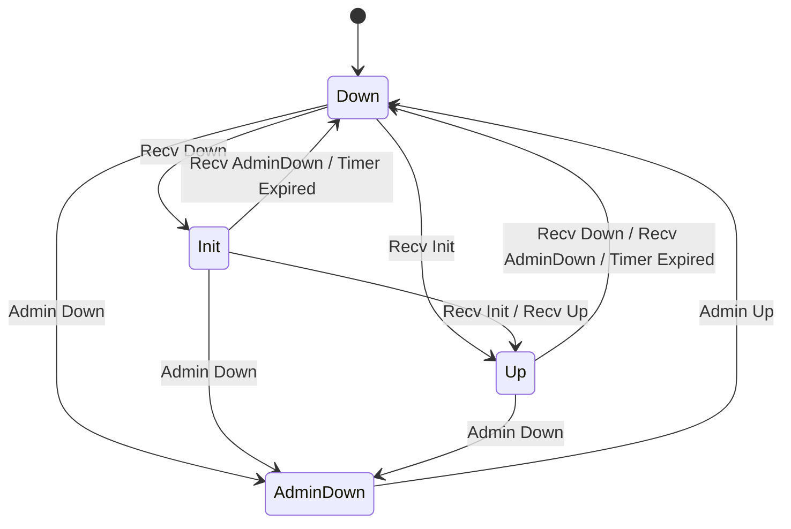
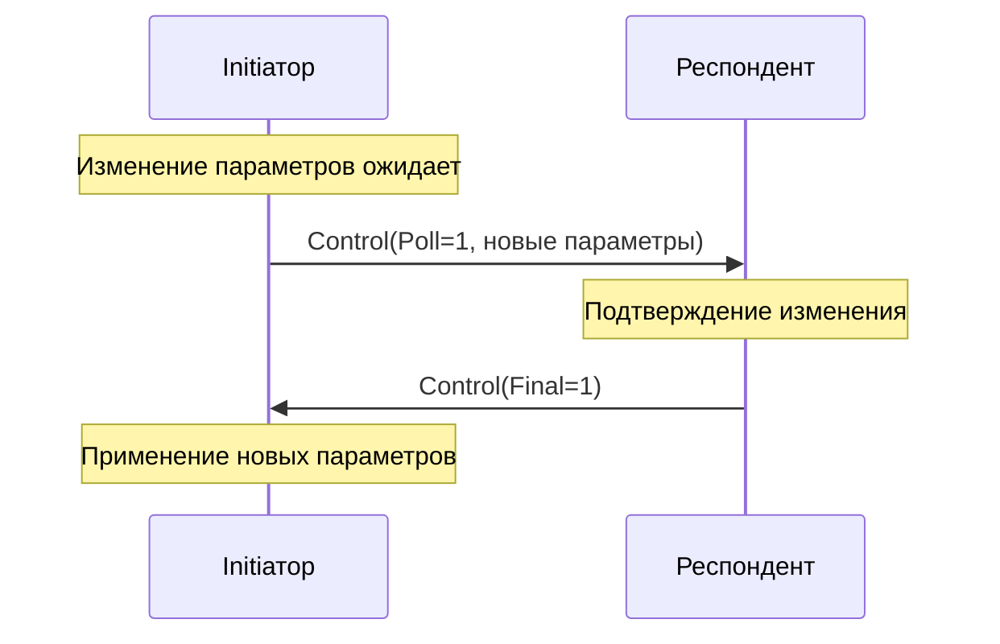

# Протокол BFD


> Детали реализации протокола BFD: конечный автомат (FSM), формат пакетов, согласование таймеров, джиттер, аутентификация и Poll-последовательности.

---

### Содержание

- [Формат BFD Control пакета](#формат-bfd-control-пакета)
- [Конечный автомат (FSM)](#конечный-автомат-fsm)
- [Таблица переходов состояний](#таблица-переходов-состояний)
- [Переменные состояния](#переменные-состояния)
- [Согласование таймеров](#согласование-таймеров)
- [Джиттер](#джиттер)
- [Poll-последовательность](#poll-последовательность)
- [Аутентификация](#аутентификация)
- [Не реализовано](#не-реализовано)

### Формат BFD Control пакета

RFC 5880 Section 4.1 определяет обязательный заголовок длиной 24 байта:

| Смещение | Размер | Поле | Примечания |
|---|---|---|---|
| 0 | 1 | Версия (3 бита) + Диагностика (5 бит) | Версия ОБЯЗАНА быть 1 |
| 1 | 1 | Состояние (2 бита) + P F C A D M (6 бит) | P=Poll, F=Final, C=CPI, A=Auth, D=Demand, M=Multipoint |
| 2 | 1 | Множитель обнаружения | НЕ ДОЛЖЕН быть нулём |
| 3 | 1 | Длина | Полная длина пакета в байтах |
| 4-7 | 4 | My Discriminator | НЕ ДОЛЖЕН быть нулём |
| 8-11 | 4 | Your Discriminator | Ноль, пока дискриминатор пира не известен |
| 12-15 | 4 | Desired Min TX Interval | **Микросекунды** |
| 16-19 | 4 | Required Min RX Interval | **Микросекунды** |
| 20-23 | 4 | Required Min Echo RX Interval | **Микросекунды** (всегда 0 -- Echo не реализован) |
| 24+ | var | Секция аутентификации | Опциональная, присутствует при установленном бите A |

> **ВАЖНО**: Все поля интервалов -- в **микросекундах** на проводе. Конвертация в `time.Duration` происходит на границе:
> ```go
> interval := time.Duration(pkt.DesiredMinTxInterval) * time.Microsecond
> ```

**Zero-allocation кодек**: `MarshalControlPacket` записывает в заранее выделенный буфер (обычно из `sync.Pool`). `UnmarshalControlPacket` заполняет предоставленную вызывающим структуру `ControlPacket` in-place. Поля digest/password секции аутентификации ссылаются на исходный буфер (zero-copy).

### Конечный автомат (FSM)

RFC 5880 Section 6.8.6 определяет четыре состояния:

| Значение | Состояние | Описание |
|---|---|---|
| 0 | AdminDown | Административно отключено |
| 1 | Down | Сессия неактивна или только создана |
| 2 | Init | Удалённая сессия неактивна, но локальная инициализирована |
| 3 | Up | Сессия полностью установлена |



FSM реализован как чистая функция над таблицей `map[stateEvent]transition`. Без if-else цепочек, без побочных эффектов.

### Таблица переходов состояний

Извлечена из псевдокода RFC 5880 Section 6.8.6:

| Текущее состояние | Событие | Новое состояние | Действия |
|---|---|---|---|
| AdminDown | AdminUp | Down | (нет) |
| Down | RecvDown | Init | SendControl |
| Down | RecvInit | Up | SendControl, NotifyUp |
| Down | AdminDown | AdminDown | SetDiagAdminDown |
| Init | RecvAdminDown | Down | SetDiagNeighborDown, NotifyDown |
| Init | RecvDown | Init | (self-loop) |
| Init | RecvInit | Up | SendControl, NotifyUp |
| Init | RecvUp | Up | SendControl, NotifyUp |
| Init | TimerExpired | Down | SetDiagTimeExpired, NotifyDown |
| Init | AdminDown | AdminDown | SetDiagAdminDown |
| Up | RecvAdminDown | Down | SetDiagNeighborDown, NotifyDown |
| Up | RecvDown | Down | SetDiagNeighborDown, NotifyDown |
| Up | RecvInit | Up | (self-loop) |
| Up | RecvUp | Up | (self-loop) |
| Up | TimerExpired | Down | SetDiagTimeExpired, NotifyDown |
| Up | AdminDown | AdminDown | SetDiagAdminDown |

Ключевые переходы:

- **Down + RecvDown --> Init**: начало установления сессии (первый шаг рукопожатия)
- **Down + RecvInit --> Up**: быстрый переход в Up (сервер получает Init от клиента)
- **Up + RecvDown --> Down**: пир упал (Diag = NeighborDown)
- **Up + TimerExpired --> Down**: таймаут обнаружения (Diag = ControlTimeExpired)

### Переменные состояния

Все обязательные переменные из RFC 5880 Section 6.1:

| Переменная RFC | Поле Go | Примечания |
|---|---|---|
| bfd.SessionState | `session.state` (atomic) | Внешнее чтение через `atomic.Uint32` |
| bfd.RemoteSessionState | `session.remoteState` (atomic) | Из полученных пакетов |
| bfd.LocalDiscr | `session.localDiscr` | Неизменяем после создания |
| bfd.RemoteDiscr | `session.remoteDiscr` | Устанавливается из полученных пакетов |
| bfd.LocalDiag | `session.localDiag` (atomic) | Устанавливается действиями FSM |
| bfd.DesiredMinTxInterval | `session.desiredMinTxInterval` | Настраиваемый |
| bfd.RequiredMinRxInterval | `session.requiredMinRxInterval` | Настраиваемый |
| bfd.RemoteMinRxInterval | `session.remoteMinRxInterval` | Из полученных пакетов |
| bfd.DemandMode | Не реализован | См. [Не реализовано](#не-реализовано) |
| bfd.RemoteDemandMode | `session.remoteDemandMode` | Парсится, но игнорируется |
| bfd.DetectMult | `session.detectMult` | Настраиваемый |
| bfd.AuthType | `session.auth` (interface) | Через интерфейс `Authenticator` |
| bfd.RcvAuthSeq | `session.authState` | `AuthState` отслеживает |
| bfd.XmitAuthSeq | `session.authState` | `AuthState` отслеживает |
| bfd.AuthSeqKnown | `session.authState` | `AuthState` отслеживает |

**Потокобезопасность**: `state`, `remoteState` и `localDiag` используют `atomic.Uint32` для неблокирующего чтения из горутины gRPC-сервера. Все остальные состояния принадлежат исключительно горутине сессии.

### Согласование таймеров

RFC 5880 Section 6.8.1-6.8.4.

**TX-интервал**: фактический интервал передачи -- больший из локального желаемого минимума и удалённого требуемого минимума:

```
ActualTxInterval = max(bfd.DesiredMinTxInterval, bfd.RemoteMinRxInterval)
```

Когда сессия не в состоянии Up, TX-интервал принудительно устанавливается не менее 1 секунды (1 000 000 микросекунд) по RFC 5880 Section 6.8.3.

**Время обнаружения**:

```
DetectionTime = bfd.RemoteDetectMult * max(bfd.RequiredMinRxInterval, bfd.RemoteDesiredMinTxInterval)
```

### Джиттер

RFC 5880 Section 6.8.7. Случайный джиттер предотвращает синхронизацию:

| Условие | Диапазон джиттера | Эффективный интервал |
|---|---|---|
| DetectMult > 1 | Уменьшение на 0-25% | 75-100% интервала |
| DetectMult == 1 | Уменьшение на 10-25% | 75-90% интервала |

Реализация:

```go
func ApplyJitter(interval time.Duration, detectMult uint8) time.Duration {
    if detectMult == 1 {
        jitterPercent = 10 + rand.IntN(16) // 75-90%
    } else {
        jitterPercent = rand.IntN(26)       // 75-100%
    }
    return interval - (interval * jitterPercent / 100)
}
```

### Poll-последовательность

RFC 5880 Section 6.5. Изменения параметров (TX/RX интервал) требуют Poll-последовательности для подтверждения:



Ключевые правила:

1. Инициатор устанавливает бит Poll (P) в исходящих пакетах
2. Респондент отвечает битом Final (F)
3. Только после получения Final новые параметры применяются

Только одна Poll-последовательность может быть активна одновременно.

### Аутентификация

RFC 5880 Section 6.7. Поддерживаются пять типов:

| ID | Имя | Поведение последовательности |
|---|---|---|
| 1 | Simple Password | Нет номера последовательности |
| 2 | Keyed MD5 | Инкремент только при смене состояния |
| 3 | Meticulous Keyed MD5 | Инкремент на каждый пакет |
| 4 | Keyed SHA1 | Инкремент только при смене состояния |
| 5 | Meticulous Keyed SHA1 | Инкремент на каждый пакет |

**Окно номера последовательности**: для non-meticulous аутентификации принимаются номера в пределах `3 * DetectMult` от `bfd.RcvAuthSeq`. Meticulous требует строгого монотонного приращения.

**Ротация ключей**: `AuthKeyStore` поддерживает несколько одновременных ключей, индексированных по Key ID, обеспечивая бесшовную ротацию.

> **ПРЕДУПРЕЖДЕНИЕ**: MD5 и SHA1 сохранены несмотря на криптографическую слабость, поскольку RFC определяет их как единственные хэш-основанные типы аутентификации.

#### Формат секции аутентификации на проводе

| Тип Auth | Расположение на проводе | Длина Auth |
|---|---|---|
| Simple Password | Type(1) + Len(1) + KeyID(1) + Password(1-16) | 4-19 |
| Keyed MD5 | Type(1) + Len(1) + KeyID(1) + Reserved(1) + SeqNum(4) + Digest(16) | 24 |
| Meticulous MD5 | Аналогично Keyed MD5 | 24 |
| Keyed SHA1 | Type(1) + Len(1) + KeyID(1) + Reserved(1) + SeqNum(4) + Hash(20) | 28 |
| Meticulous SHA1 | Аналогично Keyed SHA1 | 28 |

### Не реализовано

- **Demand Mode** (Section 6.6): бит Demand (D) всегда 0. Редко используется в production ISP/DC. Лучший результат достигается настройкой TX/RX-интервалов.
- **Echo Mode** (Section 6.4): `RequiredMinEchoRxInterval` всегда 0. Требует поддержки ядра для отражения echo-пакетов.
- **Point-to-Multipoint**: бит Multipoint (M) всегда 0. Пакеты с M=1 отклоняются.

### Связанные документы

- [01-architecture.md](./01-architecture.md) -- Архитектура системы
- [08-rfc-compliance.md](./08-rfc-compliance.md) -- Полная матрица соответствия RFC
- [Полный текст RFC 5880](../rfc/rfc5880.txt) -- RFC 5880

---

*Последнее обновление: 2026-02-21*
