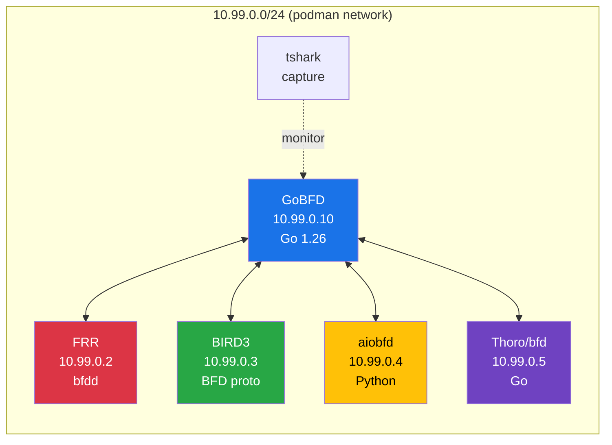
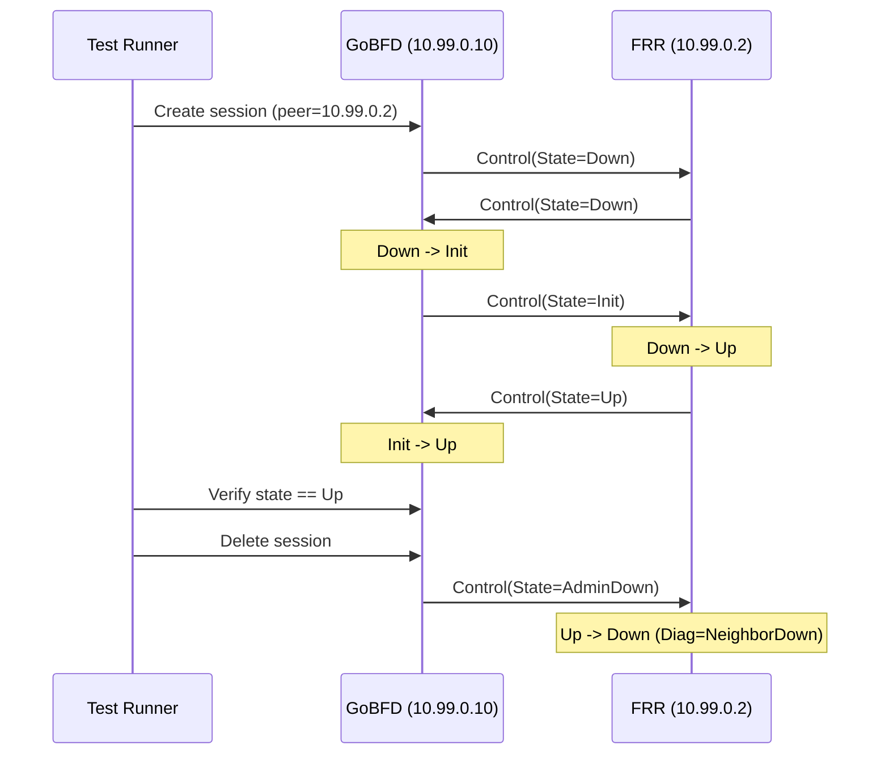
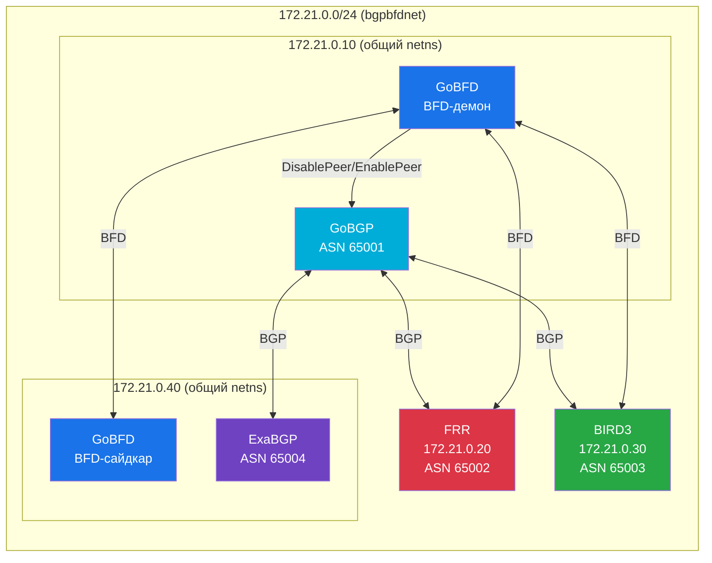
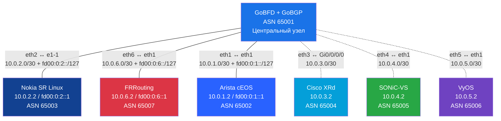

# Тестирование совместимости


> 4-пировое тестирование совместимости с FRR, BIRD3, aiobfd и Thoro/bfd в контейнеризованной топологии Podman с захватом пакетов.

---

### Содержание

- [Обзор](#обзор)
- [Топология тестирования](#топология-тестирования)
- [Реализации пиров](#реализации-пиров)
- [Запуск тестов совместимости](#запуск-тестов-совместимости)
- [Что тестируется](#что-тестируется)
- [Захват пакетов](#захват-пакетов)
- [Устранение проблем](#устранение-проблем)

### Обзор

GoBFD тестируется с четырьмя независимыми реализациями BFD для проверки соответствия протоколу и совместимости. Все пиры работают в контейнеризованной сети Podman, обеспечивая воспроизводимое автоматизированное тестирование.

### Топология тестирования



Все контейнеры находятся в сети `10.99.0.0/24`:

| Контейнер | IP | Реализация | Язык |
|---|---|---|---|
| GoBFD | 10.99.0.10 | gobfd | Go 1.26 |
| FRR | 10.99.0.2 | bfdd | C |
| BIRD3 | 10.99.0.3 | BFD protocol | C |
| aiobfd | 10.99.0.4 | AsyncIO daemon | Python |
| Thoro/bfd | 10.99.0.5 | gRPC daemon | Go |
| tshark | -- | Захват пакетов | -- |

### Реализации пиров

- **FRR** -- полнофункциональный маршрутизатор с поддержкой BFD single-hop и multihop
- **BIRD3** -- облегчённый маршрутизатор с BFD-протоколом
- **aiobfd** -- Python AsyncIO-реализация BFD (легковесная)
- **Thoro/bfd** -- Go-реализация BFD с gRPC API

### Запуск тестов совместимости

#### Полный цикл (рекомендуется)

```bash
# Сборка, запуск топологии, тесты, очистка -- всё в одном
make interop
```

#### Пошагово

```bash
# Шаг 1: Запуск 4-пировой топологии
make interop-up

# Шаг 2: Запуск Go-тестов совместимости
make interop-test

# Шаг 3: Остановка и очистка
make interop-down
```

#### Просмотр захваченных пакетов

```bash
# Сводка в формате CSV
make interop-pcap-summary

# Полная расшифровка пакетов
make interop-pcap

# Живой захват
make interop-capture
```

### Что тестируется

Тесты совместимости (`test/interop/interop_test.go`) проверяют:

| Тест | Описание |
|---|---|
| Установление сессии | Трёхстороннее рукопожатие с каждым пиром до состояния Up |
| Разрыв сессии | Корректная передача AdminDown |
| Согласование таймеров | Правильные согласованные интервалы между реализациями |
| Анализ пакетов | tshark проверяет формат BFD-пакетов на проводе |



### Захват пакетов

Топология включает контейнер tshark для захвата всего BFD-трафика. Захваты сохраняются в формате `.pcapng`.

```bash
# Просмотр захваченных пакетов
make interop-pcap

# Сводка в формате CSV
make interop-pcap-summary

# Живой захват
make interop-capture
```

### Устранение проблем

| Проблема | Решение |
|---|---|
| Контейнеры не запускаются | Проверьте `podman network inspect` на конфликты IP |
| Сессии застряли в Down | Убедитесь, что `CAP_NET_RAW` доступен в контейнерах |
| tshark без данных | Проверьте конфигурацию общего сетевого интерфейса |
| Таймаут тестов | Увеличьте таймаут: `make interop-test TIMEOUT=600s` |

```bash
# Просмотр логов всех контейнеров
make interop-logs

# Просмотр конкретного контейнера
podman logs gobfd-interop
```

---

## Полноцикловое тестирование BGP+BFD


> Сквозное тестирование связки BFD→BGP (RFC 5882): обнаружение отказа через BFD вызывает отключение BGP-пира, восстановление BFD — повторное включение.

### Топология BGP+BFD



### Три тестовых сценария

| # | Сценарий | BFD | BGP | Маршрут |
|---|---|---|---|---|
| 1 | GoBFD+GoBGP ↔ FRR | FRR bfdd (нативный) | FRR bgpd (нативный) | `10.20.0.0/24` |
| 2 | GoBFD+GoBGP ↔ BIRD3 | BIRD3 BFD (нативный) | BIRD3 BGP (нативный) | `10.30.0.0/24` |
| 3 | GoBFD+GoBGP ↔ GoBFD+ExaBGP | GoBFD-сайдкар | ExaBGP (без BFD) | `10.40.0.0/24` |

### Полный цикл тестирования

Каждый сценарий проверяет три фазы:

1. **Установление**: BGP-сессия Established, BFD-сессия Up, маршрут получен в RIB GoBGP
2. **Отказ**: Остановка/пауза пира → BFD Down (~900мс) → GoBGP DisablePeer → маршрут отозван
3. **Восстановление**: Запуск/снятие паузы → BFD Up → GoBGP EnablePeer → BGP восстановлен → маршрут возвращён

### Запуск тестов BGP+BFD

```bash
# Полный цикл (рекомендуется)
make interop-bgp

# Пошагово
make interop-bgp-up       # Запуск топологии BGP+BFD
make interop-bgp-test     # Запуск Go-тестов
make interop-bgp-down     # Очистка

# Просмотр логов
make interop-bgp-logs
```

### Ключевое решение: общие сетевые пространства имён

GoBFD и GoBGP разделяют сетевое пространство имён (оба на `172.21.0.10`), поэтому адрес BFD-пира совпадает с адресом BGP-соседа. Когда GoBFD обнаруживает BFD Down для пира `172.21.0.20`, он вызывает `DisablePeer("172.21.0.20")`, что корректно отключает BGP-сессию с FRR.

Аналогичный подход для ExaBGP: GoBFD-сайдкар и ExaBGP разделяют netns на `172.21.0.40`. Тест ExaBGP использует `podman pause` для заморозки только BFD-сайдкара, сохраняя BGP-сессию ExaBGP, доказывая, что BFD обнаруживает отказ раньше, чем истекает BGP holdtimer.

### Связанные документы

- [09-development.md](./09-development.md) -- Рабочий процесс разработки и make-цели
- [06-deployment.md](./06-deployment.md) -- Контейнерный образ и Podman Compose
- [08-rfc-compliance.md](./08-rfc-compliance.md) -- Матрица соответствия RFC

---

## Совместимость с вендорными NOS (Containerlab)


> Мультивендорное тестирование совместимости BFD с коммерческими/промышленными NOS-контейнерами. Проверка соответствия RFC 5880/5881/5882 на независимых, промышленных реализациях BFD. Двойной стек: IPv4 (RFC 5881 Section 4) и IPv6 (RFC 5881 Section 5) тестируются на каждом доступном вендоре.

### Топология вендоров

Звёздообразная топология с GoBFD в центре и dual-stack point-to-point линками к каждому вендорному NOS: IPv4 /30 (RFC 3021) и IPv6 /127 (RFC 6164) на одной veth-паре. Контейнеры и veth-линки управляются напрямую через Podman для максимальной совместимости.



> Сплошные линии = доступны и протестированы (двойной стек). Пунктирные линии = определены в топологии, пропускаются при отсутствии образа (только IPv4).

### Доступность вендоров

| Вендор | Образ | Подсеть IPv4 | Подсеть IPv6 | ASN | Статус | Лицензия |
|---|---|---|---|---|---|---|
| **Nokia SR Linux** | `ghcr.io/nokia/srlinux:25.10.2` | `10.0.2.0/30` | `fd00:0:2::/127` | 65003 | Доступен | Бесплатно, без регистрации |
| **FRRouting** | `quay.io/frrouting/frr:10.2.5` | `10.0.6.0/30` | `fd00:0:6::/127` | 65007 | Доступен | GPL, бесплатно |
| **Arista cEOS** | `ceos:4.35.2F` | `10.0.1.0/30` | `fd00:0:1::/127` | 65002 | Доступен | Бесплатный аккаунт Arista.com |
| Cisco XRd | `ios-xr/xrd-control-plane:24.3.1` | `10.0.3.0/30` | -- | 65004 | Ручной импорт | Сервисный контракт Cisco |
| SONiC-VS | `docker-sonic-vs:latest` | `10.0.4.0/30` | -- | 65005 | Ручной импорт | Бесплатно |
| VyOS | `vyos:latest` | `10.0.5.0/30` | -- | 65006 | Сборка из ISO | Бесплатно (rolling) |

### Предварительные требования

- **Podman** с активным socket API (`/run/podman/podman.sock`)
- **containerlab** 0.57+ (для справки по топологии; используется прямое управление Podman)
- Capabilities контейнера: `NET_ADMIN`, `NET_RAW`
- Хотя бы один доступный вендорный образ

### Запуск вендорных тестов

```bash
# Полный цикл: сборка образа GoBFD + деплой + тесты + очистка
make interop-clab

# Пошагово
make interop-clab-up     # Сборка + деплой топологии
make interop-clab-test   # Запуск Go-тестов (топология должна работать)
make interop-clab-down   # Уничтожение контейнеров и veth-линков
```

### Матрица соответствия RFC

| Тест | Раздел RFC | Описание |
|---|---|---|
| Установление сессии (v4+v6) | 5880 Section 6.8.6 | Трёхстороннее рукопожатие до состояния Up |
| Обнаружение отказа (v4+v6) | 5880 Section 6.8.4 | Обнаружение за DetectMult x interval |
| Формат пакетов (v4) | 5880 Section 4.1, 5881 Section 4 | Version=1, TTL=255, порт 3784 |
| Формат пакетов (v6) | 5880 Section 4.1, 5881 Section 5 | Version=1, Hop Limit=255, порт 3784 |
| Согласование таймеров (v4+v6) | 5880 Section 6.8.2 | Согласованный TX = max(DesiredMinTx, RemoteMinRx) |
| Точность обнаружения (v4+v6) | 5880 Section 6.8.4 | Время обнаружения ~900мс (3 x 300мс) |
| Независимость сессий | 5880 Section 6.8.1 | Отказ одного вендора не влияет на остальных (группировка по baseName) |

### Особенности вендоров

**Nokia SR Linux**: BFD-сессии создаются по протоколу (требуется установленная BGP-сессия). После коммита конфигурации BFD-подинтерфейс перезапускается (admin-state disable/enable) для принудительного пересогласования таймеров с YANG-значения по умолчанию 1000мс на сконфигурированные 300мс. Контейнер SR Linux выполняет тот же код, что и промышленное оборудование Nokia.

**FRRouting**: Нативный демон `bfdd` реализует RFC 5880/5881/5882/5883. Таймеры BFD настраиваются напрямую в `frr.conf` (300мс TX/RX, множитель 3). FRR интегрирует BFD с BGP через директиву `neighbor X bfd`. Контейнер ~188МБ, запускается за секунды.

**Arista cEOS**: BFD-сессии создаются по протоколу (требуется установленная BGP-сессия через `neighbor X bfd`). cEOS 4.35.2F работает с `service routing protocols model multi-agent` и требует 8 обязательных переменных окружения для контейнеризованного режима (`CEOS=1`, `EOS_PLATFORM=ceoslab`, `INTFTYPE=eth` и др.). Время загрузки 60-120с; тестовый раннер ожидает успешного выполнения `Cli -p 15 -c "show version"`. Состояние BFD проверяется через `Cli -p 15 -c "show bfd peers"`.

**Интеграция с GoBGP**: GoBFD работает совместно с GoBGP (ASN 65001) внутри контейнера GoBFD. Вендорные NOS, такие как Nokia, требуют BGP для BFD, инициируемого протоколом. При паузе/возобновлении контейнера вендора BGP-сосед GoBGP переходит в состояние `Idle(Admin)` и должен быть явно перевключён через `gobgp neighbor <ip> enable`.

### Тестирование BFD с двойным стеком IPv6

RFC 5881 определяет BFD как для IPv4 (Section 4), так и для IPv6 (Section 5). Набор вендорных interop-тестов проверяет обе адресные семьи на каждом доступном вендоре с использованием dual-stack линков.

**Ключевые отличия (RFC 5881 Section 5 vs Section 4)**:
- IPv6 использует Hop Limit=255 вместо TTL=255 для GTSM
- BFD-сессии создаются для каждой адресной семьи отдельно (отдельные IPv4 и IPv6 сессии на вендора)
- Тот же UDP-порт 3784 и диапазон исходных портов 49152-65535

**План адресации** (RFC 4193 ULA `fd00::/8`, /127 на линк по RFC 6164):

| Вендор | GoBFD IPv6 | Вендор IPv6 | Префикс линка | Анонсируемый маршрут |
|---|---|---|---|---|
| Arista | `fd00:0:1::` | `fd00:0:1::1` | `fd00:0:1::/127` | `fd00:20:1::/48` |
| Nokia  | `fd00:0:2::` | `fd00:0:2::1` | `fd00:0:2::/127` | `fd00:20:2::/48` |
| FRR    | `fd00:0:6::` | `fd00:0:6::1` | `fd00:0:6::/127` | `fd00:20:6::/48` |

**Конструктивные решения**:
- ULA-адреса исключают конфликты с глобальными таблицами маршрутизации в лабораторных средах
- Префиксы /127 по RFC 6164 предотвращают проблемы ping-pong на межмаршрутизаторных point-to-point линках
- IPv4 и IPv6 сессии используют один контейнер, но являются независимыми BFD-сессиями
- Тест `SessionIndependence` группирует пиров по `baseName` для корректной обработки паузы контейнера, затрагивающей обе адресные семьи

---

## Перспективы: интеграция с netlab

[netlab](https://github.com/ipspace/netlab) — это уровень оркестрации поверх containerlab и libvirt/Ansible со встроенным BFD-модулем, поддерживающим 16+ сетевых платформ.

### Сравнение: текущее решение vs netlab

| Возможность | Текущее (Podman + containerlab) | netlab |
|---|---|---|
| Управление топологией | Ручное veth + Podman API | Автоматическое (декларативный YAML) |
| IP-адресация | Статическая в run.sh | Автоматическая |
| Конфигурация BFD | Файлы для каждого вендора | Директива `module: [bgp, bfd]` |
| Конфигурация BGP | Для каждого вендора + GoBGP TOML | Автогенерация для платформы |
| Поддержка вендоров | 6 (нативные контейнеры) | 29 (нативные + vrnetlab VM) |
| Runtime | Podman (прямой) | Docker (рекомендуется) или Podman (экспериментально) |
| Зависимости | Podman, containerlab | Python 3.8+, Ansible 2.9+, Docker/libvirt |

### Пример топологии netlab

```yaml
provider: clab
module: [bgp, bfd]

nodes:
  gobfd:
    device: linux
    image: gobfd-clab:latest
  frr1:
    device: frr
  srlinux1:
    device: srlinux

links:
  - gobfd-frr1
  - gobfd-srlinux1
```

netlab автоматически управляет IP-адресацией, назначением BGP AS и конфигурацией BFD-сессий на вендорных узлах.

### План миграции

1. Установить Python 3.8+ и Ansible на тестовый хост
2. Установить netlab: `pip install networklab`
3. Установить Docker (основной runtime netlab)
4. Преобразовать топологию из ручного run.sh в YAML netlab
5. Для VM-вендоров (Cisco IOS-XR, Juniper vMX) включить вложенный KVM на хосте

> **Примечание**: netlab требует зависимости, недоступные на текущем CI-хосте (нет Python pip, нет Ansible, нет KVM). Документируется как перспективное направление для расширения покрытия вендоров за пределы нативных контейнерных платформ.

### Трёхуровневая стратегия тестирования

На основе анализа в `docs/tmp/bfd-interoperability-testing.md`:

| Уровень | Вендор | Назначение | Покрытие RFC |
|---|---|---|---|
| 1 (немедленный) | FRRouting | Полное покрытие RFC с открытым кодом | 5880, 5881, 5882, 5883 |
| 2 (коммерческий) | Nokia SR Linux | Промышленный коммерческий NOS | 5880 (async mode) |
| 3 (широта) | Arista cEOS | Независимая промышленная реализация | 5880, 5881, S-BFD |

**Нативные контейнеры** (FRR, SR Linux, cEOS) потребляют ~0.5 vCPU и 0.5-1.5 ГБ RAM каждый. Топология из 3 узлов комфортно работает в VM с 4 vCPU и 8 ГБ RAM.

**vrnetlab VM-в-контейнере** платформы (Cisco IOL/IOSv/CSR, Juniper vMX/vPTX) требуют вложенного KVM и 2-8 ГБ RAM на узел.

---

*Последнее обновление: 2026-02-22*
