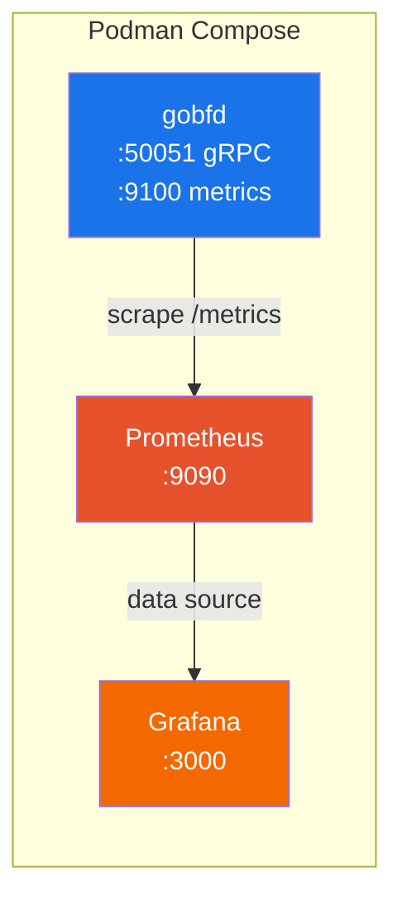

# Развёртывание


> Руководство по развёртыванию в production: systemd-сервис, стеки Podman Compose, контейнерные образы, пакеты deb/rpm и укрепление безопасности.

---

### Содержание

- [Требования](#требования)
- [Способы установки](#способы-установки)
- [systemd-сервис](#systemd-сервис)
- [Podman Compose](#podman-compose)
- [Контейнерный образ](#контейнерный-образ)
- [Укрепление безопасности](#укрепление-безопасности)
- [Чек-лист production](#чек-лист-production)

### Требования

- **Linux** (сырые сокеты требуют Linux-специфичных API)
- Capability **CAP_NET_RAW** и **CAP_NET_ADMIN** (для UDP-сокетов с TTL=255)
- Go 1.26+ (только для сборки из исходников)

### Способы установки

#### Из deb/rpm-пакетов

```bash
# Установка .deb-пакета
sudo dpkg -i gobfd_*.deb

# Установка .rpm-пакета
sudo rpm -i gobfd_*.rpm

# Редактирование конфигурации
sudo vim /etc/gobfd/gobfd.yml

# Запуск демона
sudo systemctl enable --now gobfd

# Проверка
sudo systemctl status gobfd
gobfdctl session list
```

Пакеты собираются GoReleaser v2 и включают:
- Бинарные файлы `/usr/local/bin/gobfd`, `/usr/local/bin/gobfdctl`, `/usr/local/bin/gobfd-haproxy-agent`, `/usr/local/bin/gobfd-exabgp-bridge`
- Пример конфигурации `/etc/gobfd/gobfd.yml`
- systemd-юнит `/usr/lib/systemd/system/gobfd.service`
- Системного пользователя и группу `gobfd`

#### Из исходников

```bash
git clone https://github.com/dantte-lp/gobfd.git && cd gobfd

# Сборка всех 4 бинарников с информацией о версии (рекомендуется)
make build

# Или ручная сборка с ldflags
VERSION=$(git describe --tags --always --dirty)
GIT_COMMIT=$(git rev-parse --short HEAD)
BUILD_DATE=$(date -u +%Y-%m-%dT%H:%M:%SZ)
LDFLAGS="-s -w \
  -X github.com/dantte-lp/gobfd/internal/version.Version=${VERSION} \
  -X github.com/dantte-lp/gobfd/internal/version.GitCommit=${GIT_COMMIT} \
  -X github.com/dantte-lp/gobfd/internal/version.BuildDate=${BUILD_DATE}"

go build -ldflags="${LDFLAGS}" -o bin/gobfd ./cmd/gobfd
go build -ldflags="${LDFLAGS}" -o bin/gobfdctl ./cmd/gobfdctl
go build -ldflags="${LDFLAGS}" -o bin/gobfd-haproxy-agent ./cmd/gobfd-haproxy-agent
go build -ldflags="${LDFLAGS}" -o bin/gobfd-exabgp-bridge ./cmd/gobfd-exabgp-bridge

# Установка
sudo install -m 755 bin/gobfd bin/gobfdctl bin/gobfd-haproxy-agent bin/gobfd-exabgp-bridge /usr/local/bin/
```

### systemd-сервис

Юнит-файл `deployments/systemd/gobfd.service`:

```ini
[Unit]
Description=GoBFD -- BFD Protocol Daemon
Documentation=https://github.com/dantte-lp/gobfd
After=network-online.target
Wants=network-online.target

[Service]
Type=notify
ExecStart=/usr/local/bin/gobfd -config /etc/gobfd/gobfd.yml
ExecReload=/bin/kill -HUP $MAINPID
Restart=on-failure
RestartSec=5s
WatchdogSec=30s

# Укрепление безопасности
User=gobfd
Group=gobfd
AmbientCapabilities=CAP_NET_RAW CAP_NET_ADMIN
CapabilityBoundingSet=CAP_NET_RAW CAP_NET_ADMIN
NoNewPrivileges=true
ProtectSystem=strict
ProtectHome=true
ReadOnlyPaths=/etc/gobfd
PrivateTmp=true
ProtectKernelModules=true
ProtectKernelTunables=true
ProtectControlGroups=true
RestrictRealtime=true
RestrictSUIDSGID=true
SystemCallArchitectures=native

[Install]
WantedBy=multi-user.target
```

Ключевые возможности:

| Возможность | Описание |
|---|---|
| `Type=notify` | Использует `sd_notify(READY)` для точного отчёта о готовности |
| `WatchdogSec=30s` | Watchdog systemd -- демон отправляет keepalive каждые 15 секунд |
| `ExecReload` | SIGHUP запускает горячую перезагрузку (уровень лога + реконсиляция сессий) |
| `Restart=on-failure` | Авто-перезапуск при сбое с задержкой 5 секунд |
| Директивы безопасности | Минимальные привилегии с `CAP_NET_RAW` и `CAP_NET_ADMIN` |

#### Управление сервисом

```bash
sudo systemctl start gobfd       # Запуск
sudo systemctl stop gobfd        # Остановка
sudo systemctl reload gobfd      # Горячая перезагрузка (SIGHUP)
sudo journalctl -u gobfd -f      # Просмотр логов
sudo systemctl status gobfd      # Статус
```

### Podman Compose

#### Стек разработки

```bash
# Запуск среды разработки
podman-compose -f deployments/compose/compose.dev.yml up -d --build

# Доступ к контейнеру разработки
podman-compose -f deployments/compose/compose.dev.yml exec dev bash
```

#### Production-стек

```bash
# Запуск gobfd с Prometheus и Grafana
podman-compose -f deployments/compose/compose.yml up -d

# Сервисы:
#   gobfd gRPC API:   localhost:50051
#   Prometheus:       http://localhost:9090
#   Grafana:          http://localhost:3000 (admin/admin)
```



### Контейнерный образ

```bash
# Стандартная сборка
podman build -f deployments/docker/Containerfile -t gobfd .

# Multi-arch сборка (через GoReleaser)
goreleaser release --snapshot --clean
```

Контейнер требует:
- Capability `CAP_NET_RAW` и `CAP_NET_ADMIN`
- `network_mode: host` (рекомендуется) или проброс UDP-портов 3784/4784

### Укрепление безопасности

| Уровень | Механизм |
|---|---|
| **Capabilities** | Только `CAP_NET_RAW` + `CAP_NET_ADMIN` (без root) |
| **systemd** | `ProtectSystem=strict`, `NoNewPrivileges`, `PrivateTmp` |
| **Код** | Нет пакета `unsafe`, все ошибки сокетов обрабатываются |
| **TTL** | GTSM (RFC 5082): TTL=255 на передачу, проверка TTL=255 на приём |
| **Аутентификация** | Опциональная BFD-аутентификация (5 типов по RFC 5880 Section 6.7) |

### Чек-лист production

- [ ] Настроить `gobfd.yml` с соответствующими параметрами сессий
- [ ] Установить `log.format: json` для структурированного логирования
- [ ] Включить интеграцию с GoBGP при использовании BFD для BGP failover
- [ ] Включить демпфирование flap-ов для предотвращения churn-а маршрутов
- [ ] Настроить скрапинг Prometheus по адресу `:9100/metrics`
- [ ] Импортировать дашборд Grafana
- [ ] Настроить алертинг на переходы `Up -> Down`
- [ ] Проверить доступность `CAP_NET_RAW`
- [ ] Протестировать SIGHUP: `systemctl reload gobfd`
- [ ] Убедиться, что graceful shutdown отправляет AdminDown

### Связанные документы

- [03-configuration.md](./03-configuration.md) -- Справочник конфигурации
- [07-monitoring.md](./07-monitoring.md) -- Метрики Prometheus и Grafana
- [09-development.md](./09-development.md) -- Настройка среды разработки

---

*Последнее обновление: 2026-02-21*
