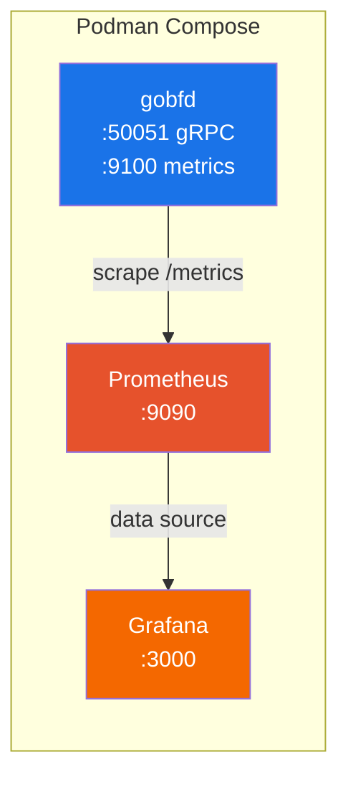

# Развёртывание


> Руководство по развёртыванию в production: systemd-сервис, стеки Podman Compose, контейнерные образы, пакеты deb/rpm и укрепление безопасности.

---

## Содержание

- [Требования](#требования)
- [Матрица release-артефактов](#матрица-release-артефактов)
- [Способы установки](#способы-установки)
- [systemd-сервис](#systemd-сервис)
- [Podman Compose](#podman-compose)
- [Контейнерный образ](#контейнерный-образ)
- [Укрепление безопасности](#укрепление-безопасности)
- [Чек-лист production](#чек-лист-production)

### Требования

- **Linux** (сырые сокеты требуют Linux-специфичных API)
- Capability **CAP_NET_RAW** и **CAP_NET_ADMIN** (для UDP-сокетов с TTL=255)
- Go 1.27+ (только для сборки из исходников)

Для non-Linux целей поддерживается только compile-time совместимость.
Конструкторы транспорта `internal/netio` возвращают `ErrUnsupportedPlatform`;
GoBFD не публикует и не поддерживает dataplane runtime для non-Linux систем.

### Матрица release-артефактов

| Артефакт | Целевые системы | Архитектуры | Базовый образ / формат пакета |
|---|---|---|---|
| Статические бинарные файлы | Linux-дистрибутивы с glibc или musl user space | `amd64`, `arm64` | Архив `tar.gz` |
| Debian-пакет | Debian 13 `trixie`, Ubuntu-compatible системы | `amd64`, `arm64` | `.deb`, systemd-юнит |
| RPM-пакет | Oracle Linux 10, RHEL-compatible системы, Fedora-compatible системы | `amd64`, `arm64` | `.rpm`, systemd-юнит |
| OCI-образ по умолчанию | Docker, Podman, Kubernetes CRI runtimes | `linux/amd64`, `linux/arm64` | `docker.io/library/debian:trixie-slim` |
| Oracle Linux OCI-образ | Docker, Podman, Kubernetes CRI runtimes, требующие Oracle Linux user space | `linux/amd64`, `linux/arm64` | `docker.io/library/oraclelinux:10-slim` |

| Тег образа | База |
|---|---|
| `ghcr.io/dantte-lp/gobfd:<version>` | Debian `trixie-slim` |
| `ghcr.io/dantte-lp/gobfd:latest` | Debian `trixie-slim` |
| `ghcr.io/dantte-lp/gobfd:<version>-debian-trixie` | Debian `trixie-slim` |
| `ghcr.io/dantte-lp/gobfd:debian-trixie` | Debian `trixie-slim` |
| `ghcr.io/dantte-lp/gobfd:<version>-oraclelinux10` | Oracle Linux `10-slim` |
| `ghcr.io/dantte-lp/gobfd:oraclelinux10` | Oracle Linux `10-slim` |

### Способы установки

#### Из deb/rpm-пакетов

```bash
# Установка .deb-пакета
sudo dpkg -i gobfd_*.deb

# Установка .rpm-пакета
sudo rpm -i gobfd_*.rpm

# Редактирование конфигурации
sudo vim /etc/gobfd/gobfd.yml

# Запуск демона
sudo systemctl enable --now gobfd

# Проверка
sudo systemctl status gobfd
gobfdctl session list
```

Пакеты собираются GoReleaser v2 и включают:
- Бинарные файлы `/usr/local/bin/gobfd`, `/usr/local/bin/gobfdctl`, `/usr/local/bin/gobfd-haproxy-agent`, `/usr/local/bin/gobfd-exabgp-bridge`
- Пример конфигурации `/etc/gobfd/gobfd.yml`
- systemd-юнит `/usr/lib/systemd/system/gobfd.service`
- Системного пользователя и группу `gobfd`

#### Из исходников

```bash
git clone https://github.com/dantte-lp/gobfd.git && cd gobfd

# Сборка всех 4 бинарников с информацией о версии (рекомендуется)
make build

# Или ручная сборка с ldflags
VERSION=$(git describe --tags --always --dirty)
GIT_COMMIT=$(git rev-parse --short HEAD)
BUILD_DATE=$(date -u +%Y-%m-%dT%H:%M:%SZ)
LDFLAGS="-s -w \
  -X github.com/dantte-lp/gobfd/internal/version.Version=${VERSION} \
  -X github.com/dantte-lp/gobfd/internal/version.GitCommit=${GIT_COMMIT} \
  -X github.com/dantte-lp/gobfd/internal/version.BuildDate=${BUILD_DATE}"

go build -ldflags="${LDFLAGS}" -o bin/gobfd ./cmd/gobfd
go build -ldflags="${LDFLAGS}" -o bin/gobfdctl ./cmd/gobfdctl
go build -ldflags="${LDFLAGS}" -o bin/gobfd-haproxy-agent ./cmd/gobfd-haproxy-agent
go build -ldflags="${LDFLAGS}" -o bin/gobfd-exabgp-bridge ./cmd/gobfd-exabgp-bridge

# Установка
sudo install -m 755 bin/gobfd bin/gobfdctl bin/gobfd-haproxy-agent bin/gobfd-exabgp-bridge /usr/local/bin/
```

### systemd-сервис

Юнит-файл `deployments/systemd/gobfd.service`:

```ini
[Unit]
Description=GoBFD -- BFD Protocol Daemon
Documentation=https://github.com/dantte-lp/gobfd
After=network-online.target
Wants=network-online.target

[Service]
Type=notify
ExecStart=/usr/local/bin/gobfd -config /etc/gobfd/gobfd.yml
ExecReload=/bin/kill -HUP $MAINPID
Restart=on-failure
RestartSec=5s
WatchdogSec=30s

# Укрепление безопасности
User=gobfd
Group=gobfd
AmbientCapabilities=CAP_NET_RAW CAP_NET_ADMIN
CapabilityBoundingSet=CAP_NET_RAW CAP_NET_ADMIN
NoNewPrivileges=true
ProtectSystem=strict
ProtectHome=true
ReadOnlyPaths=/etc/gobfd
PrivateTmp=true
ProtectKernelModules=true
ProtectKernelTunables=true
ProtectControlGroups=true
RestrictRealtime=true
RestrictSUIDSGID=true
SystemCallArchitectures=native

[Install]
WantedBy=multi-user.target
```

Ключевые возможности:

| Возможность | Описание |
|---|---|
| `Type=notify` | Использует `sd_notify(READY)` для точного отчёта о готовности |
| `WatchdogSec=30s` | Watchdog systemd -- демон отправляет keepalive каждые 15 секунд |
| `ExecReload` | SIGHUP перезагружает уровень лога и реконсилирует membership sessions в пределах открытых при startup transport bindings; startup-owned изменения отклоняются и требуют restart |
| `Restart=on-failure` | Авто-перезапуск при сбое с задержкой 5 секунд |
| Директивы безопасности | Минимальные привилегии с `CAP_NET_RAW` и `CAP_NET_ADMIN` |

#### Управление сервисом

```bash
sudo systemctl start gobfd       # Запуск
sudo systemctl stop gobfd        # Остановка
sudo systemctl reload gobfd      # Горячая перезагрузка (SIGHUP)
sudo journalctl -u gobfd -f      # Просмотр логов
sudo systemctl status gobfd      # Статус
```

### Podman Compose

GoBFD использует внешний Compose provider Podman с официальным Go-бинарником
Docker Compose v5.5.0. Установите checksum-pinned provider и выберите его явно;
Python `podman-compose` не поддерживается:

```bash
go run ./test/cmd/toolbootstrap compose --install-dir "$HOME/.local/bin"
export PODMAN_COMPOSE_PROVIDER="$HOME/.local/bin/docker-compose"
export PODMAN_COMPOSE_WARNING_LOGS=false
export DOCKER_BUILDKIT=0
podman compose version
```

`DOCKER_BUILDKIT=0` оставляет сборку на совместимом с Podman classic Docker API;
Docker Buildx/Bake не входит в runtime-контракт проекта.

#### Стек разработки

```bash
# Запуск среды разработки
podman compose -f deployments/compose/compose.dev.yml up -d --build

# Запуск отдельной команды в контейнере разработки
podman compose -f deployments/compose/compose.dev.yml exec -T dev go test ./internal/bfd -race -count=1
```

Четыре testcontainers gate с отчётами используют Go-owned binary `e2ectl`,
который Make собирает внутри development-контейнера перед запуском:

| Цель | Каталог отчёта |
|---|---|
| `make e2e-core-testcontainers` | `reports/e2e/core/run.*` |
| `make int-bgp-failover-testcontainers` | `reports/e2e/bgp-fast-failover/run.*` |
| `make int-haproxy-testcontainers` | `reports/e2e/haproxy-health/run.*` |
| `make int-observability-testcontainers` | `reports/e2e/observability/run.*` |

#### Production-стек

```bash
# Запуск gobfd с Prometheus и Grafana
podman compose -f deployments/compose/compose.yml up -d

# Сервисы:
#   gobfd gRPC API:   localhost:50051
#   Prometheus:       http://localhost:9090
#   Grafana:          http://localhost:3000 (admin/admin)
```


```mermaid
graph LR
    subgraph "Podman Compose"
        G["gobfd<br/>:50051 gRPC<br/>:9100 metrics"]
        P["Prometheus<br/>:9090"]
        GR["Grafana<br/>:3000"]
    end

    G -->|scrape /metrics| P
    P -->|data source| GR

    style G fill:#1a73e8,color:#fff
    style P fill:#E6522C,color:#fff
    style GR fill:#F46800,color:#fff
```

### Контейнерный образ

```bash
# Стандартная сборка
podman build -f deployments/docker/Containerfile -t gobfd .

# Multi-arch сборка (через GoReleaser)
goreleaser release --snapshot --clean
```

Release-образы содержат четыре бинарных файла GoBFD и не содержат development toolchain:
`gobfd`, `gobfdctl`, `gobfd-haproxy-agent` и
`gobfd-exabgp-bridge`.

Контейнер требует:
- Capability `CAP_NET_RAW` и `CAP_NET_ADMIN`
- `network_mode: host` (рекомендуется) или проброс UDP-портов 3784/4784

### Укрепление безопасности

| Уровень | Механизм |
|---|---|
| **Capabilities** | Только `CAP_NET_RAW` + `CAP_NET_ADMIN` (без root) |
| **systemd** | `ProtectSystem=strict`, `NoNewPrivileges`, `PrivateTmp` |
| **Код** | Нет пакета `unsafe`, все ошибки сокетов обрабатываются |
| **TTL** | GTSM (RFC 5082): TTL=255 на передачу, проверка TTL=255 на приём |
| **Аутентификация** | Опциональная BFD-аутентификация (5 типов по RFC 5880 Section 6.7) |

### Настройка памяти (`GOMEMLIMIT` и `GOGC`)

Go 1.27 рассматривает `GOMEMLIMIT` как мягкий лимит памяти, управляемой
runtime Go. Он не включает отображение бинарного файла, память ядра и память,
управляемую вне Go. Runtime может повышать частоту сборки мусора для соблюдения
лимита даже при `GOGC=off`; эта настройка не устраняет паузы GC. Лимит ниже
рабочего набора может привести к почти непрерывной сборке мусора.

GoBFD не публикует таблицы размеров памяти по количеству сессий. Выбирайте
лимит ниже memory limit сервиса или контейнера с запасом для бинарного файла,
socket buffers ядра и другой памяти вне Go, затем квалифицируйте его с целевым
числом сессий, режимом аутентификации, телеметрией и failure-нагрузкой.
Сохраняйте стандартный `GOGC`, пока измерения deployment не обоснуют override.

#### Конфигурация systemd

Добавьте квалифицированное для deployment значение в байтах в секцию
`[Service]` файла `gobfd.service`:

```ini
# Только пример; замените значением, квалифицированным для deployment.
Environment=GOMEMLIMIT=512MiB
```

#### Конфигурация контейнера

```dockerfile
# Только пример; замените значением, квалифицированным для deployment.
ENV GOMEMLIMIT=512MiB
```

#### Мониторинг

Отслеживайте вместе RSS процесса, memory limit контейнера или сервиса, частоту
GC и длительность пауз GC. RSS и `GOMEMLIMIT` измеряют разные величины.
Устойчивый рост GC или thrashing около лимита требует большего
квалифицированного лимита либо меньшей нагрузки; мягкий лимит не гарантирует
защиту от OOM.

### Чек-лист production

- [ ] Квалифицировать `GOMEMLIMIT` с запасом и репрезентативной нагрузкой
- [ ] Сохранять стандартный `GOGC`, пока измерения не обоснуют override
- [ ] Мониторить RSS, memory limit сервиса, частоту GC и паузы GC
- [ ] Настроить `gobfd.yml` с соответствующими параметрами сессий
- [ ] Установить `log.format: json` для структурированного логирования
- [ ] Включить интеграцию с GoBGP при использовании BFD для BGP failover
- [ ] Включить демпфирование flap-ов для предотвращения churn-а маршрутов
- [ ] Настроить скрапинг Prometheus по адресу `:9100/metrics`
- [ ] Импортировать дашборд Grafana
- [ ] Настроить алертинг на переходы `Up -> Down`
- [ ] Проверить доступность `CAP_NET_RAW`
- [ ] Протестировать SIGHUP: `systemctl reload gobfd`
- [ ] Убедиться, что graceful shutdown отправляет AdminDown

### Связанные документы

- [03-configuration.md](./03-configuration.md) -- Справочник конфигурации
- [07-monitoring.md](./07-monitoring.md) -- Метрики Prometheus и Grafana
- [09-development.md](./09-development.md) -- Настройка среды разработки

---

*Последнее обновление: 2026-02-21*
