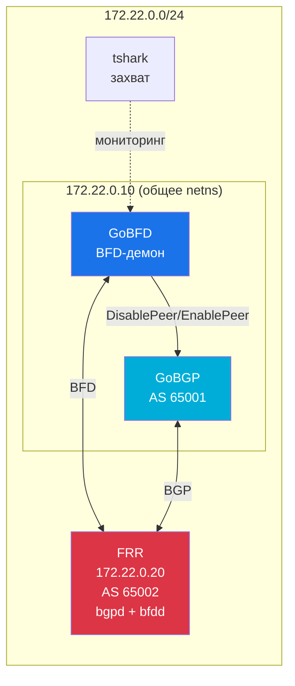
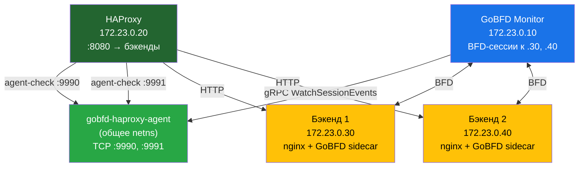
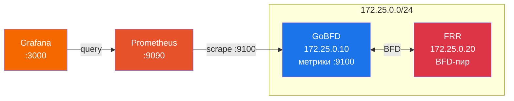
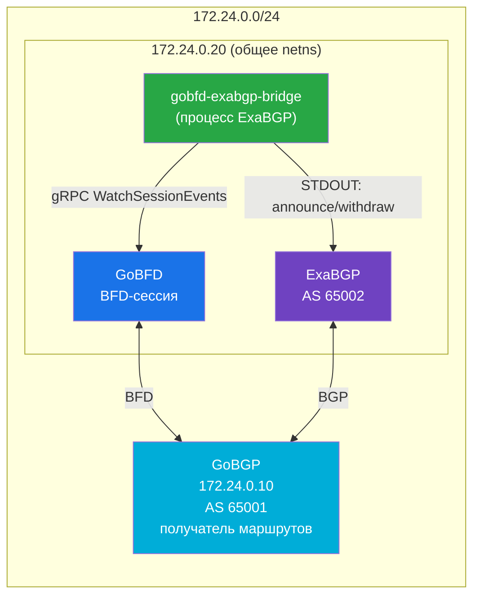
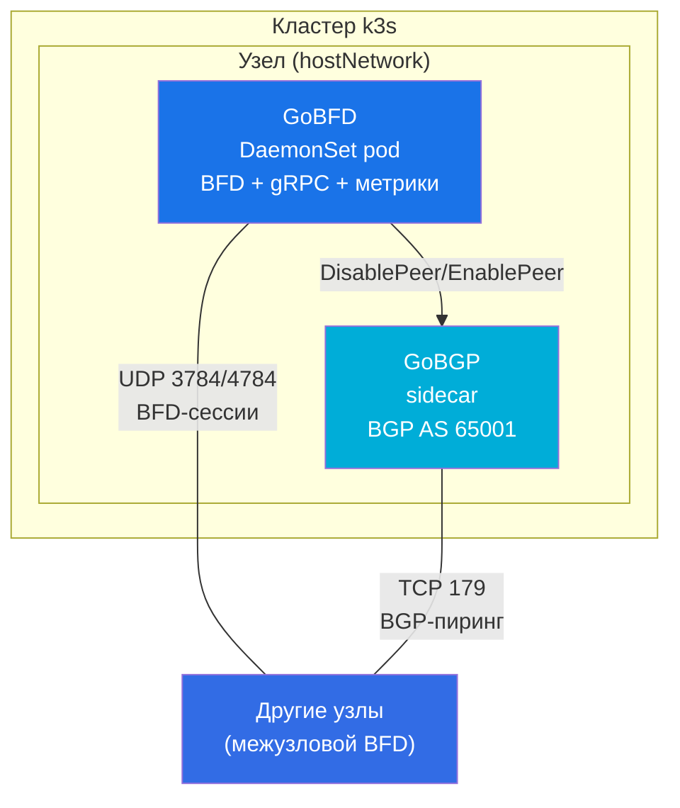

# Примеры интеграций


> Готовые к запуску интеграционные стеки, демонстрирующие работу GoBFD с продакшн-системами. Каждый пример включает compose-файлы, конфигурацию, демо-скрипты и верификацию пакетов через tshark.

---

### Содержание

- [Обзор](#обзор)
- [Быстрое переключение BGP](#быстрое-переключение-bgp)
- [Мониторинг бэкендов HAProxy](#мониторинг-бэкендов-haproxy)
- [Наблюдаемость](#наблюдаемость)
- [Anycast через ExaBGP](#anycast-через-exabgp)
- [DaemonSet в Kubernetes](#daemonset-в-kubernetes)
- [Верификация пакетов через tshark](#верификация-пакетов-через-tshark)
- [Архитектура интеграций](#архитектура-интеграций)
- [Связанные документы](#связанные-документы)

---

## Обзор

GoBFD интегрируется с системами маршрутизации, балансировки нагрузки, мониторинга и оркестрации для обеспечения обнаружения сбоев за доли секунды. Каждый пример интеграции — самодостаточный запускаемый стек в директории `deployments/integrations/`.

Все стеки используют **podman-compose** с OCI-контейнерами и включают sidecar-контейнер **tshark** для захвата BFD-пакетов и проверки соответствия RFC.

| # | Интеграция | Компоненты | Подсеть | Новый код |
|---|-----------|-----------|---------|-----------|
| 1 | Быстрое переключение BGP | GoBFD + GoBGP + FRR | 172.22.0.0/24 | Только конфиги |
| 2 | Мониторинг бэкендов HAProxy | GoBFD + HAProxy + nginx | 172.23.0.0/24 | `gobfd-haproxy-agent` |
| 3 | Наблюдаемость | GoBFD + Prometheus + Grafana | 172.25.0.0/24 | Правила алертинга |
| 4 | Anycast через ExaBGP | GoBFD + ExaBGP + GoBGP | 172.24.0.0/24 | `gobfd-exabgp-bridge` |
| 5 | DaemonSet в Kubernetes | GoBFD + GoBGP + k3s | Host network | K8s-манифесты |

---

## Быстрое переключение BGP

**Директория:** `deployments/integrations/bgp-fast-failover/`

BFD Down инициирует отключение BGP-пира, вызывая немедленный отзыв маршрутов вместо ожидания 90-секундного BGP holdtimer.

### Топология



### Быстрый старт

```bash
# Полное демо (сборка, запуск, тест переключения, очистка)
make int-bgp-failover

# Пошагово
make int-bgp-failover-up     # Запуск топологии
make int-bgp-failover-logs   # Просмотр логов
make int-bgp-failover-down   # Очистка
```

### Сценарий демо

1. GoBFD устанавливает BFD-сессию с FRR на 172.22.0.20
2. GoBGP устанавливает BGP-сессию, получает маршрут 10.20.0.0/24
3. **Сбой:** FRR приостановлен → BFD обнаруживает сбой (~900мс) → GoBGP отключает пир → маршрут отозван
4. **Восстановление:** FRR возобновлён → BFD Up → GoBGP включает пир → маршрут восстановлен

---

## Мониторинг бэкендов HAProxy

**Директория:** `deployments/integrations/haproxy-health/`

Обнаружение сбоя бэкенда за доли секунды через BFD, интегрированное с протоколом agent-check HAProxy.

### Архитектура



### Протокол agent-check

Бинарник `gobfd-haproxy-agent` связывает состояние BFD с протоколом agent-check HAProxy:

- HAProxy подключается по TCP к порту агента, читает ASCII-ответ до перевода строки
- BFD Up → отвечает `"up ready\n"` → HAProxy помечает сервер как рабочий
- BFD Down → отвечает `"down\n"` → HAProxy убирает сервер из ротации

### Быстрый старт

```bash
make int-haproxy              # Полное демо
make int-haproxy-up           # Запуск топологии
curl http://localhost:8080    # Проверка балансировки
make int-haproxy-down         # Очистка
```

---

## Наблюдаемость

**Директория:** `deployments/integrations/observability/`

Продакшн-мониторинг с правилами алертинга Prometheus и преднастроенным дашбордом Grafana.

### Топология



### Метрики

| Метрика | Тип | Описание |
|---------|-----|----------|
| `gobfd_bfd_sessions` | Gauge | Активные BFD-сессии по пирам |
| `gobfd_bfd_packets_sent_total` | Counter | Отправленные пакеты по пирам |
| `gobfd_bfd_packets_received_total` | Counter | Полученные пакеты по пирам |
| `gobfd_bfd_packets_dropped_total` | Counter | Потерянные пакеты по пирам |
| `gobfd_bfd_state_transitions_total` | Counter | Переходы FSM (метки from/to) |
| `gobfd_bfd_auth_failures_total` | Counter | Ошибки аутентификации по пирам |

### Правила алертинга

| Алерт | Выражение | Критичность |
|-------|----------|-------------|
| BFDSessionDown | `gobfd_bfd_sessions == 0` за 10с | Critical |
| BFDSessionFlapping | `rate(state_transitions[5m]) > 2` за 1м | Warning |
| BFDAuthFailures | `rate(auth_failures[5m]) > 0` за 30с | Warning |
| BFDPacketDrops | `rate(packets_dropped[5m]) > 0` за 1м | Warning |

### Быстрый старт

```bash
make int-observability        # Полное демо
make int-observability-up     # Запуск топологии

# Открыть в браузере:
# Grafana:    http://localhost:3000 (admin/admin)
# Prometheus: http://localhost:9090

make int-observability-down   # Очистка
```

---

## Anycast через ExaBGP

**Директория:** `deployments/integrations/exabgp-anycast/`

Объявление anycast-IP, управляемое состоянием BFD-линка через process API ExaBGP.

### Архитектура



### Pipe-протокол

`gobfd-exabgp-bridge` запускается как процесс ExaBGP:

- **BFD Up** → пишет `announce route 198.51.100.1/32 next-hop self` в STDOUT
- **BFD Down** → пишет `withdraw route 198.51.100.1/32 next-hop self` в STDOUT
- Логирование в STDERR (соглашение ExaBGP)
- Переподключение к GoBFD с экспоненциальным backoff

### Быстрый старт

```bash
make int-exabgp-anycast        # Полное демо
make int-exabgp-anycast-up     # Запуск топологии
make int-exabgp-anycast-down   # Очистка
```

---

## DaemonSet в Kubernetes

**Директория:** `deployments/integrations/kubernetes/`

Развёртывание GoBFD как DaemonSet в кластере k3s с sidecar-контейнером GoBGP и host-сетью.

### Архитектура



### Предварительные требования

- Root или sudo-доступ
- `curl`, `podman`, `kubectl`
- k3s устанавливается автоматически скриптом `setup-cluster.sh`

### Ключевые решения

- **hostNetwork: true** — BFD использует raw-сокеты, требуется прямой доступ к сети хоста
- **CAP_NET_RAW + CAP_NET_ADMIN** — необходимы для работы с BFD-пакетами
- **DaemonSet** — один экземпляр GoBFD на каждый узел для полного покрытия BFD
- **Динамические сессии** — BFD-сессии добавляются через `gobfdctl` после обнаружения IP узлов

### Быстрый старт

```bash
# Полное демо (установка k3s, деплой, проверка, очистка)
sudo make int-k8s

# Пошагово
sudo ./deployments/integrations/kubernetes/setup-cluster.sh
kubectl apply -f deployments/integrations/kubernetes/manifests/
kubectl -n gobfd rollout status daemonset/gobfd

# Очистка
sudo make int-k8s-down
```

### Манифесты

| Файл | Ресурс | Описание |
|------|--------|----------|
| `namespace.yml` | Namespace | Пространство имён `gobfd` |
| `configmap-gobfd.yml` | ConfigMap | Конфигурация GoBFD-демона |
| `configmap-gobgp.yml` | ConfigMap | Конфигурация GoBGP |
| `daemonset.yml` | DaemonSet | GoBFD + GoBGP sidecar (hostNetwork) |
| `service.yml` | Service | Headless-сервис для DNS-обнаружения |

---

## Верификация пакетов через tshark

Все интеграционные стеки включают sidecar-контейнер **tshark** для захвата BFD-пакетов и проверки соответствия RFC.

### Настройка захвата

Контейнер tshark захватывает весь BFD-трафик в общем сетевом пространстве имён:

- **Фильтр:** `udp port 3784 or udp port 4784`
- **Формат:** pcapng, записывается в `/captures/bfd.pcapng`
- **Автостоп:** лимит размера файла 100МБ

### Офлайн-анализ

```bash
# Полная расшифровка пакетов
podman exec <tshark-контейнер> tshark -r /captures/bfd.pcapng -V -Y bfd

# CSV-сводка BFD-полей
podman exec <tshark-контейнер> tshark -r /captures/bfd.pcapng -Y bfd \
    -T fields -e frame.time_relative -e ip.src -e ip.dst \
    -e bfd.version -e bfd.diag -e bfd.sta -e bfd.flags \
    -e bfd.detect_time_multiplier -e bfd.desired_min_tx_interval \
    -e bfd.required_min_rx_interval -E header=y -E separator=,
```

### Чек-лист верификации

| Поле | Ожидаемое значение | Ссылка на RFC |
|------|-------------------|---------------|
| Version | 1 | RFC 5880 Section 4.1 |
| TTL | 255 | RFC 5881 Section 5 (GTSM) |
| Dest Port | 3784 (single-hop) / 4784 (multihop) | RFC 5881 Section 4 |
| Source Port | 49152-65535 | RFC 5881 Section 4 |
| Переходы состояний | Down → Init → Up (трёхэтапный) | RFC 5880 Section 6.8.6 |

Справка: [tshark.dev](https://tshark.dev/) — документация и руководства по tshark.

---

## Архитектура интеграций

| Стек | Подсеть | Сервисы | Host-порты |
|------|---------|---------|------------|
| Быстрое переключение BGP | 172.22.0.0/24 | gobfd, gobgp, frr, tshark | — |
| Мониторинг HAProxy | 172.23.0.0/24 | gobfd-monitor, haproxy-agent, haproxy, backend1/2, backend1/2-bfd, tshark | 8080 |
| Наблюдаемость | 172.25.0.0/24 | gobfd, frr, prometheus, grafana, tshark | 9090, 3000 |
| Anycast ExaBGP | 172.24.0.0/24 | gobgp, gobfd, exabgp, tshark | — |
| Kubernetes | Host network | DaemonSet (gobfd + gobgp sidecar) | — |

### Новые бинарники

| Бинарник | Назначение | Зависимости |
|----------|-----------|-------------|
| `gobfd-haproxy-agent` | Мост agent-check для HAProxy | connectrpc, bfdv1connect |
| `gobfd-exabgp-bridge` | Мост process API для ExaBGP | connectrpc, bfdv1connect |

---

## Связанные документы

- [03-configuration.md](./03-configuration.md) — Справочник конфигурации GoBFD
- [05-interop.md](./05-interop.md) — Тестирование совместимости (FRR, BIRD3, вендорные NOS)
- [06-deployment.md](./06-deployment.md) — Контейнерный образ, Podman Compose, systemd
- [07-monitoring.md](./07-monitoring.md) — Метрики Prometheus и дашборд Grafana

---

*Последнее обновление: 22.02.2026*
