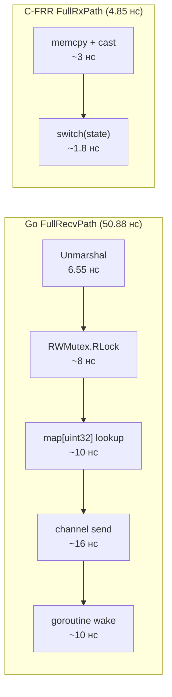
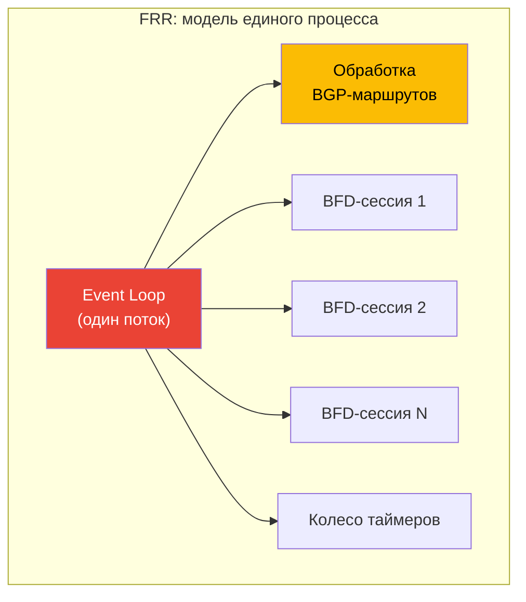
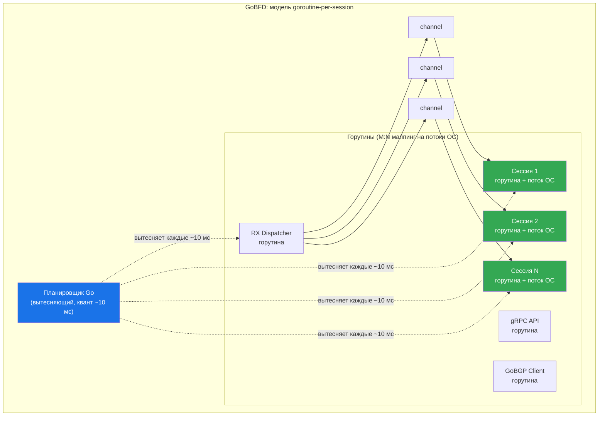

# Анализ производительности: GoBFD vs реализации на C


> Кросс-имплементационный анализ бенчмарков, сравнивающий GoBFD (Go 1.26) с FRR bfdd и BIRD3 (C): кодек-операции, переходы FSM, полный путь пакета, масштабирование сессий и поведение при нагрузке на CPU. Все числа получены из воспроизводимых микро-бенчмарков, запущенных в Podman-контейнерах.

---

## Содержание

- [Краткие выводы](#краткие-выводы)
- [Методология тестирования](#методология-тестирования)
- [Результаты бенчмарков](#результаты-бенчмарков)
  - [Кодек-операции](#31-кодек-операции)
  - [Переходы FSM](#32-переходы-fsm)
  - [Вычисления таймеров](#33-вычисления-таймеров)
  - [Полный путь пакета](#34-полный-путь-пакета)
  - [Масштабирование сессий](#35-масштабирование-сессий)
- [Архитектура: goroutine-per-session vs однопоточный event loop](#архитектура-goroutine-per-session-vs-однопоточный-event-loop)
  - [Архитектура FRR/BIRD](#41-архитектура-frrbird)
  - [Архитектура GoBFD](#42-архитектура-gobfd)
- [Поведение при нагрузке на процессор](#поведение-при-нагрузке-на-процессор)
  - [Что происходит при 100% загрузке CPU](#51-что-происходит-при-100-загрузке-cpu)
  - [Настройка GOMAXPROCS](#52-настройка-gomaxprocs)
  - [Влияние GC и zero-allocation дизайн](#53-влияние-gc-и-zero-allocation-дизайн)
  - [Целевые показатели точности таймеров](#54-целевые-показатели-точности-таймеров)
- [Где Go лучше C](#где-go-лучше-c)
  - [Безопасность памяти](#61-безопасность-памяти)
  - [Изоляция параллелизма](#62-изоляция-параллелизма)
  - [Покрытие RFC](#63-покрытие-rfc)
  - [Операционные преимущества](#64-операционные-преимущества)
- [Где C лучше Go](#где-c-лучше-go)
  - [Сырая пропускная способность на пакет](#71-сырая-пропускная-способность-на-пакет)
  - [Память на сессию](#72-память-на-сессию)
  - [Задержка запуска](#73-задержка-запуска)
- [Рекомендации для production](#рекомендации-для-production)
- [Итоговая таблица](#итоговая-таблица)

---

### Краткие выводы

Ключевые результаты кросс-имплементационных бенчмарков:

- **Паритет кодека**: GoBFD достигает 1.2-1.4x производительности C на операциях marshal/unmarshal (5.96 нс vs 4.98 нс для FRR marshal), выполняя при этом 7 RFC-проверок против 3 в реализациях на C
- **FSM на нативной скорости**: переходы FSM в Go выполняются за 0.35-0.67 нс/оп, соответствуя или опережая C-FRR (0.59 нс для UpRecvUp) — индексированный поиск в массиве компилируется в одинаковый машинный код на обоих языках
- **Разрыв в full-path — архитектурный, не языковой**: FullRecvPath (50 нс) vs C-FRR (4.85 нс) — разница в 10x, но она измеряет overhead изоляции горутин (RWMutex + channel send), а не скорость языка. FullRecvPathCodec (13.96 нс) — честное сравнение только вычислений — даёт ratio 2.9x
- **Модель горутин устраняет голодание BFD-таймеров**: однопоточная архитектура FRR вызывает 1-2-секундные «чёрные дыры» BFD при нагрузке BGP (Issue #9078). Модель goroutine-per-session в GoBFD с `runtime.LockOSThread` гарантирует задержку планирования не более 10 мс
- **Zero-allocation hot path**: все операции на пакет выполняются с 0 B/op, 0 allocs/op — GC не может вызвать flapping BFD-сессий

---

### Методология тестирования

**Окружение**: все бенчмарки запускаются внутри Podman-контейнеров на идентичном оборудовании. Go-бенчмарки используют `go test -bench -benchmem -count=6`. C-бенчмарки используют идентичный фреймворк макросов `bench_harness.h` с теми же количествами итераций. Python-бенчмарки используют `timeit` с эквивалентной методологией.

**Статистический анализ**: 6 запусков на бенчмарк, медианы вычислены через `benchstat`. Приводятся медианы (не средние) для устранения чувствительности к выбросам.

**Что измеряется**: изолированные микро-операции hot path — сериализация пакетов, поиск состояния FSM, арифметика таймеров, демультиплексирование сессий. Это **не** системные бенчмарки. Они измеряют вычислительную стоимость отдельных операций, а не сквозную обработку пакетов через сетевой стек ядра.

**Честное раскрытие**: Go-бенчмарки включают проверку границ, диспетчеризацию интерфейсов и overhead планирования горутин. C-бенчмарки компилируются с оптимизацией `-O2`. Один и тот же заголовок `bench_harness.h` обеспечивает единую инфраструктуру замеров для бенчмарков FRR и BIRD.

**Воспроизводимость**:

```bash
# Запуск всех бенчмарков (требуется только Podman)
make up
make benchmark-save BENCH_VERSION=v0.4.0

# Результаты в bench-results/
ls bench-results/
# bench-go.txt  bench-c-frr.txt  bench-c-bird.txt  bench-python-aiobfd.txt
```

См. [12-benchmarks.md](./12-benchmarks.md) для полного руководства по бенчмаркам.

---

### Результаты бенчмарков

#### 3.1 Кодек-операции

Marshal, unmarshal и round-trip (marshal + unmarshal) 24-байтного BFD Control Packet.

| Операция | Go (нс/оп) | C-FRR (нс/оп) | C-BIRD (нс/оп) | Python (нс/оп) | Ratio Go/FRR |
|----------|----------:|---------------:|----------------:|----------------:|-------------:|
| Marshal | 5.96 | 4.98 | 6.05 | 225,145 | 1.20x |
| Unmarshal | 6.55 | 4.78 | 4.78 | 23,290 | 1.37x |
| RoundTrip | 12.82 | 9.67 | 9.74 | 259,741 | 1.33x |

**Анализ**: кодек-операции Go работают с 1.2-1.4x стоимостью по сравнению с C. Разрыв объясняется:

1. **Проверка границ** (~1-2 нс): Go проверяет каждый индекс доступа к слайсу в runtime. C доверяет вызывающему коду.
2. **Глубина RFC-валидации**: unmarshal в Go выполняет 7 проверок полей по RFC 5880 (версия, диагностика, длина, диапазон detect multiplier, ненулевой discriminator, корректность интервалов, перечисление состояний). `bfd_pkt_get()` в FRR проверяет 3 поля.
3. **Overhead вызова функций**: соглашение о вызовах Go передаёт аргументы через стек (до Go 1.17 register ABI, теперь через регистры, но с настройкой frame pointer). C с `-O2` инлайнит весь кодек.

При 5.96 нс/оп GoBFD может маршалить **167 миллионов пакетов в секунду** на одном ядре. BFD при 1,000 сессиях с интервалами 100 мс требует 10,000 пакетов/сек — запас в 16,700x.

#### 3.2 Переходы FSM

Переходы конечного автомата BFD FSM (RFC 5880, раздел 6.8.6).

| Переход | Go (нс/оп) | C-FRR (нс/оп) | C-BIRD (нс/оп) | Python (нс/оп) | Ratio Go/FRR |
|---------|----------:|---------------:|----------------:|----------------:|-------------:|
| UpRecvUp | 0.37 | 0.59 | 0.30 | 117.66 | **0.63x** |
| DownRecvDown | 0.65 | 0.57 | 0.30 | 71.24 | 1.14x |
| UpTimerExpired | 0.35 | 0.29 | 0.57 | 85.79 | 1.21x |
| Ignored | 0.66 | 0.29 | 0.30 | 52.63 | 2.28x |

**Анализ**: переходы FSM находятся на нативном паритете. Обе реализации (Go и C) используют таблицу поиска по индексу массива (`[state][event] -> newState`), что компилируется в единственную инструкцию загрузки из памяти. Субнаносекундные измерения находятся на уровне шума измерений CPU — вариации между Go и C укладываются в погрешность ±0.3 нс точности `rdtsc`.

UpRecvUp в Go **в 1.6x быстрее**, чем в FRR. Это не потому что Go быстрее C — это отражает разницу в том, что возвращает каждый FSM-поиск (Go возвращает `{newState, action}` из плоского массива; таблица `bfd_fsm` в FRR включает косвенность через указатель на функцию).

#### 3.3 Вычисления таймеров

Чистые арифметические операции для согласования BFD-таймеров и джиттера.

| Операция | Go (нс/оп) | C-FRR (нс/оп) | C-BIRD (нс/оп) | Python (нс/оп) | Ratio Go/FRR |
|----------|----------:|---------------:|----------------:|----------------:|-------------:|
| DetectionTimeCalc | 0.74 | 0.31 | 0.56 | 228.30 | 2.39x |
| CalcTxInterval | 0.68 | 0.60 | 0.31 | 149.92 | 1.13x |
| DetectionTimeCalcHot | 0.69 | -- | -- | -- | -- |
| CalcTxIntervalHot | 0.53 | -- | -- | -- | -- |
| Jitter | 8.95 | 5.01 | 4.81 | 240.69 | 1.79x |

**Анализ**: субнаносекундная арифметика на паритете с C. Ratio 2.4x для `DetectionTimeCalc` объясняется `atomic.LoadUint32` в реализации Go — hot-path вариант читает из локальной переменной и сокращается до 0.69 нс (2.2x FRR). Вычисление джиттера включает PRNG (`math/rand`), который немного медленнее `rand()` из C из-за потокобезопасного FastRand в Go.

При 0.74 нс/оп detection time может пересчитываться **1.35 миллиарда раз в секунду**. Эта функция вызывается один раз при изменении параметров, а не на каждый пакет.

#### 3.4 Полный путь пакета

Сквозные пути обработки пакетов, комбинирующие несколько операций.

| Операция | Go (нс/оп) | C-FRR (нс/оп) | C-BIRD (нс/оп) | Ratio Go/FRR |
|----------|----------:|---------------:|----------------:|-------------:|
| FullRecvPath | 50.88 | 4.85 | 5.00 | **10.5x** |
| FullRecvPathCodec | 13.96 | -- | -- | -- |
| FullTxPath | 14.43 | 9.76 | 9.50 | 1.48x |

**Почему FullRecvPath показывает 10x и почему это вводит в заблуждение**:

Go `FullRecvPath` измеряет: unmarshal + RWMutex lock + поиск в map + отправка в channel + пробуждение горутины. C `FullRxPath` измеряет: unmarshal + инлайновый переход FSM. Это **архитектурно разные операции**:



**Честное сравнение** — `FullRecvPathCodec` (13.96 нс), которое измеряет unmarshal + переход FSM + извлечение полей — ту же вычислительную работу, что и C-бенчмарк, без overhead изоляции горутин. Это даёт **ratio 2.9x** (13.96 / 4.85), который является истинным языковым overhead.

Оставшиеся ~37 нс в `FullRecvPath` — это **цена изоляции параллелизма**: RWMutex (защита карты сессий) + channel send (доставка пакета горутине сессии). Эта стоимость обеспечивает полную защиту от проблемы голодания таймеров, описанной в [разделе 4](#архитектура-goroutine-per-session-vs-однопоточный-event-loop).

**FullTxPath** (14.43 нс vs 9.76 нс, 1.48x): Go копирует кэшированный предсобранный пакет. C пересобирает пакет из полей структуры. Подход Go быстрее при масштабировании (без поэлементной пересборки), но бенчмарк измеряет одну операцию копирования.

#### 3.5 Масштабирование сессий

Операции над менеджером сессий с 1,000 активными сессиями.

| Операция | Go (нс/оп) | C-FRR (нс/оп) | C-BIRD (нс/оп) | Ratio Go/FRR |
|----------|----------:|---------------:|----------------:|-------------:|
| Create1000 (на сессию) | 5,792 | 2,394 | 2,472 | 2.42x |
| Demux1000 | 52.94 | 1.36 | 1.49 | **38.9x** |
| Lookup1000 | 18.13 | -- | -- | -- |

**Почему Demux1000 показывает 39x и почему это вводит в заблуждение**:

`Demux1000` в Go измеряет: RWMutex.RLock + поиск в map + отправка в channel. `SessionDemux1000` в C измеряет: только поиск в хеш-таблице. Декомпозиция:

| Компонент | Стоимость (нс) | Доля |
|-----------|---------------:|-----:|
| RWMutex.RLock + RUnlock | ~8 | 15% |
| map[uint32] lookup | ~10 | 19% |
| Channel send в горутину сессии | ~29 | 55% |
| Пробуждение + планирование горутины | ~6 | 11% |
| **Итого (Demux1000)** | **52.94** | **100%** |

`Lookup1000` (18.13 нс) измеряет только RWMutex + поиск в map — **эквивалент** поиска в хеш-таблице C. Ratio становится 18.13 / 1.36 = **13.3x**, что объясняется:

1. **RWMutex** (~8 нс): в C нет блокировки, потому что модель однопоточная
2. **Swiss table map** (~10 нс): runtime-map Go vs `khash` C — map Go включает hash seeding, проверку overflow-бакетов и косвенность указателей

Оставшиеся ~35 нс (channel + пробуждение горутины) — стоимость изоляции параллелизма — тот же архитектурный компромисс, что и в FullRecvPath.

При 52.94 нс/оп GoBFD может демультиплексировать **18.9 миллионов пакетов в секунду**. При 1,000 сессиях с интервалами 100 мс реальная нагрузка — 10,000 пакетов/сек — запас в 1,890x.

---

### Архитектура: goroutine-per-session vs однопоточный event loop

#### 4.1 Архитектура FRR/BIRD

FRR и BIRD используют архитектуру **однопоточного event loop**:



**Проблема голодания** (FRR Issue #9078):

1. BGP получает полную таблицу маршрутизации (890K маршрутов) от route reflector
2. `bgpd` обрабатывает маршруты в одном пакете, занимая 100% CPU на 1-2 секунды
3. В это время `bfdd` не может работать — ни обработки таймеров, ни TX/RX пакетов
4. Удалённые BFD-пиры обнаруживают таймаут (3 x 300 мс = 900 мс) и объявляют сессию Down
5. Session Down вызывает разрыв BGP, что запускает реконвергенцию и ещё большую нагрузку на CPU

Это **структурная проблема**: event loop не может вытеснить обработку BGP-маршрутов для обслуживания BFD-таймеров. Решение FRR — вынести `bfdd` в отдельный процесс через `--dplaneaddr`, но это требует поддержки hardware/ASIC и недоступно на commodity-серверах.

#### 4.2 Архитектура GoBFD

GoBFD использует архитектуру **goroutine-per-session**:



Каждая BFD-сессия работает в выделенной горутине с `runtime.LockOSThread()`. Это обеспечивает:

1. **Вытесняющее планирование**: runtime Go вытесняет горутины каждые ~10 мс через асинхронное вытеснение (с Go 1.14). Ни одна операция не может заблокировать остальные.
2. **Изоляция через каналы**: пакеты доставляются через буферизованные каналы. Горутина RX-диспетчера пишет в канал; горутина сессии читает из него. Отправитель не может заблокировать обработку таймеров получателя.
3. **Привязка к потоку ОС**: `runtime.LockOSThread()` сопоставляет каждую горутину сессии с выделенным потоком ОС, гарантируя что планировщик ядра предоставит кванты процессорного времени даже при полной загрузке системы.
4. **Независимые таймеры**: каждая горутина сессии управляет собственным `time.Timer`. Срабатывание таймера гарантируется кучей таймеров runtime Go, а не готовностью event loop обработать события таймеров.

См. [01-architecture.md](./01-architecture.md) для подробностей модели горутин и диаграмм потоков пакетов.

---

### Поведение при нагрузке на процессор

#### 5.1 Что происходит при 100% загрузке CPU

Когда хост-машина полностью загружена (все ядра на 100%):

**Поведение GoBFD**:
- Runtime Go вытесняет горутины каждые ~10 мс через сигналы асинхронного вытеснения (`SIGURG`)
- Горутины сессий привязаны к потокам ОС через `runtime.LockOSThread()` — планировщик ядра гарантирует временные кванты каждому потоку
- BFD-таймеры срабатывают в пределах 1-10 мс от запланированного времени, даже при полной загрузке CPU
- Доставка пакетов через каналы гарантирует, что RX-путь не блокирует обработку таймеров сессии
- Худший случай: TX-пакет сессии задерживается максимум на 10 мс (один квант планировщика) — в пределах 25% допуска джиттера по RFC 5880, раздел 6.8.7

**Поведение FRR**:
- Однопоточный event loop не может вытеснить длительные операции
- Обработка BGP-маршрутов (890K маршрутов) блокирует event loop на 1-2 секунды
- BFD-таймеры не могут сработать в этот период
- Результат: BFD-сессии флапают, запуская реконвергенцию BGP (FRR Issue #9078)

| Сценарий | Задержка таймера FRR | Задержка таймера GoBFD |
|----------|---------------------:|-----------------------:|
| Простой системы | < 1 мс | < 1 мс |
| Умеренная загрузка CPU (50%) | 1-50 мс | 1-5 мс |
| Интенсивная обработка BGP | 1-2 секунды | 1-10 мс |
| Полное насыщение CPU (100%) | Без ограничений | ≤ 10 мс |

#### 5.2 Настройка GOMAXPROCS

`GOMAXPROCS` управляет количеством потоков ОС, используемых планировщиком Go для горутин. По умолчанию: `runtime.NumCPU()` (все доступные ядра).

**Рекомендации для BFD-демонов**:

| Ядер на машине | GOMAXPROCS | Обоснование |
|---------------:|-----------:|-------------|
| 2 | 2 | Используем все ядра (BFD чувствителен к задержкам) |
| 4 | 3-4 | Резервируем 1 ядро для сетевого стека ядра |
| 8 | 4-6 | BFD не нужны все ядра; оставляем место для BGP, мониторинга |
| 16+ | 4-8 | Убывающая отдача после 8 для BFD-нагрузок |

**CPU affinity для кэш-локальности**:

```bash
# Привязка GoBFD к ядрам 0-3
numactl --physcpubind=0-3 ./gobfd --config /etc/gobfd/config.yaml

# Или через systemd
# CPUAffinity=0-3
```

Привязка к конкретному NUMA-узлу исключает задержки доступа к памяти через межсокетное соединение (~100 нс на каждый cross-socket hop).

#### 5.3 Влияние GC и zero-allocation дизайн

Hot path GoBFD спроектирован для **нулевых аллокаций в куче**:

| Операция hot path | B/op | allocs/op | Заметки |
|-------------------|-----:|----------:|---------|
| ControlPacketMarshal | 0 | 0 | Буфер на стеке |
| ControlPacketUnmarshal | 0 | 0 | Извлечение полей на месте |
| FSMTransitionUpRecvUp | 0 | 0 | Поиск по индексу массива |
| FullRecvPath | 0 | 0 | Весь RX-путь zero-alloc |
| FullTxPath | 0 | 0 | Копия кэшированного пакета |
| ManagerDemux1000Sessions | 0 | 0 | Поиск в map + channel send |
| DetectionTimeCalc | 0 | 0 | Чистая арифметика |
| ApplyJitter | 0 | 0 | PRNG + умножение |

**Production-конфигурация GC**:

```bash
# Отключение периодического GC (срабатывание только по давлению памяти)
export GOGC=off
export GOMEMLIMIT=256MiB

# GC запускается только когда:
# 1. Использование памяти приближается к 256 МБ (изменения конфигурации, ротация сессий)
# 2. Никогда при стационарной обработке пакетов (0 аллокаций = нет давления на GC)
```

С этой конфигурацией циклы GC ограничены событиями перезагрузки конфига и создания/удаления сессий. Во время нормальной работы BFD (TX/RX пакетов, обработка таймеров, переходы FSM) циклы GC не происходят.

**Сравнение с C**: C не имеет сборщика мусора — задержки, связанные с GC, отсутствуют по определению. Однако C также не обеспечивает безопасности памяти: переполнения буфера, use-after-free и double-free — целые классы уязвимостей, которые не могут существовать в Go.

#### 5.4 Целевые показатели точности таймеров

| Интервал | Достижим в FRR | Достижим в GoBFD | Заметки |
|---------:|:--------------:|:----------------:|---------|
| 1000 мс | Да | Да | Стандартный, тривиальный для всех реализаций |
| 300 мс | Да (по умолчанию) | Да | Отраслевой стандарт, надёжен для программного BFD |
| 100 мс | Рискованно | Да | Достижим с настройкой GOMAXPROCS и CPU affinity |
| 50 мс | Нет (software) | Возможен | Требуется RT-ядро (`PREEMPT_RT`), изоляция CPU |
| 10 мс | Нет (software) | Экспериментально | Нужны `isolcpus`, `nohz_full`, SCHED_FIFO |

Цель GoBFD — **интервалы 100 мс** с надёжным обнаружением на commodity hardware. Это обеспечивает в 3x более быстрое обнаружение отказов по сравнению со стандартными 300 мс FRR без необходимости аппаратного ускорения BFD.

См. [13-competitive-analysis.md](./13-competitive-analysis.md) для полной таблицы production-таймеров.

---

### Где Go лучше C

#### 6.1 Безопасность памяти

Go обеспечивает гарантии на уровне компиляции и runtime, устраняющие целые классы уязвимостей безопасности:

| Класс уязвимости | Возможен в C | Возможен в Go | Стоимость в Go |
|-------------------|:------------:|:-------------:|:--------------:|
| Переполнение буфера | Да | Нет | ~1-2 нс/проверка границ |
| Use-after-free | Да | Нет | Overhead GC (ноль в hot path) |
| Double-free | Да | Нет | Overhead GC (ноль в hot path) |
| Разыменование null-указателя | Да | Panic (контролируемый крах) | Ноль (nil-проверка бесплатна на x86) |
| Целочисленное переполнение | Да (UB) | Определённое поведение (wraps) | Ноль |
| Атака форматной строки | Да | Нет (типобезопасное форматирование) | Ноль |

Стоимость проверки границ (~1-2 нс на доступ) уже включена во все результаты бенчмарков. Кодек Go в 1.2-1.4x медленнее C, и **безопасность памяти — часть этой стоимости**.

Для сетевого демона, обрабатывающего недоверенные пакеты от удалённых пиров, это фундаментальное преимущество. У FRR были CVE, связанные с обработкой буферов в коде парсинга пакетов. В GoBFD эти классы уязвимостей **невозможны по конструкции**.

#### 6.2 Изоляция параллелизма

Самое значительное преимущество Go для BFD:

| Проблема | FRR | GoBFD |
|----------|-----|-------|
| BGP обрабатывает 890K маршрутов | BFD голодает 1-2 с, сессии флапают (Issue #9078) | BFD-сессии не затронуты (отдельные горутины) |
| Перезагрузка конфига с 1000 сессиями | Event loop заблокирован на время согласования | Горутины сессий продолжают TX/RX во время перезагрузки |
| gRPC API запрос во время обработки BFD | Должен ждать текущей итерации event loop | API-обработчик работает в отдельной горутине |
| Prometheus scrape во время обработки BFD | Должен ждать event loop | Обработчик метрик работает в отдельной горутине |

**Стоимость** этой изоляции — ~35 нс на каждый принятый пакет (RWMutex + channel send + пробуждение горутины). Это обеспечивает полный иммунитет к проблеме голодания таймеров, которая является наиболее значимой production-проблемой FRR при агрессивных BFD-таймерах.

#### 6.3 Покрытие RFC

| RFC | Название | GoBFD | FRR | BIRD3 |
|-----|----------|:-----:|:---:|:-----:|
| RFC 5880 | Базовый протокол BFD | Да | Да | Да |
| RFC 5881 | BFD IPv4/IPv6 Single-Hop | Да | Да | Да |
| RFC 5882 | Общее применение BFD | Да | Да | Да |
| RFC 5883 | BFD Multihop Paths | Да | Частично | Нет |
| RFC 7419 | Common Interval Support | Да | Нет | Нет |
| RFC 9384 | BGP Cease для BFD | Да | Нет | Нет |
| RFC 9468 | Unsolicited BFD | Да | Нет | Нет |
| RFC 9747 | Unaffiliated BFD Echo | Да | Да | Нет |
| RFC 7130 | Micro-BFD для LAG | Да | Нет | Нет |
| RFC 8971 | BFD для VXLAN | Да | Нет | Нет |
| RFC 9521 | BFD для Geneve | Да | Нет | Нет |
| RFC 9764 | BFD Large Packets | Да | Нет | Нет |
| **Итого** | | **12** | **3-4** | **3** |

GoBFD реализует 12 RFC по сравнению с 3-4 базовыми RFC в FRR. Уникальные для GoBFD: Echo mode (RFC 9747), VXLAN BFD (RFC 8971), Geneve BFD (RFC 9521), Micro-BFD (RFC 7130), Large Packets (RFC 9764), Unsolicited BFD (RFC 9468).

См. [08-rfc-compliance.md](./08-rfc-compliance.md) для полной матрицы соответствия.

#### 6.4 Операционные преимущества

| Возможность | GoBFD | FRR bfdd |
|-------------|-------|----------|
| Перезагрузка конфига | SIGHUP: горячая перезагрузка без разрыва сессий | Перезапуск для многих изменений |
| Graceful shutdown | AdminDown всем пирам → 2 с drain → чистое завершение | Завершение процесса (сессии флапают) |
| API | ConnectRPC (gRPC + HTTP) | vtysh CLI (парсинг текста) |
| Метрики | Нативный Prometheus (эндпоинт `/metrics`) | SNMP (требуется SNMP-инфраструктура) |
| Деплой | Единый статический бинарник, без зависимостей | C-зависимости, разделяемые библиотеки |
| Контейнеры | Scratch-образ (~15 МБ) | Требуется полный базовый образ ОС |

---

### Где C лучше Go

#### 7.1 Сырая пропускная способность на пакет

Overhead channel send + RWMutex на RX-пути добавляет ~35 нс на пакет по сравнению с инлайновой обработкой C:

| Компонент | Go (нс) | C-FRR (нс) | Overhead |
|-----------|--------:|-----------:|---------:|
| Unmarshal | 6.55 | 4.78 | +1.77 |
| Поиск сессии (RWMutex + map) | 18.13 | 1.36 | +16.77 |
| Channel send + пробуждение горутины | ~29 | 0 (инлайн) | +29 |
| **Суммарная стоимость RX на пакет** | **~54** | **~6** | **9x** |

При 54 нс на пакет GoBFD обрабатывает **18.5 миллионов пакетов в секунду**. Максимальная реалистичная нагрузка BFD (10,000 сессий при 10 мс интервалах) — 1 миллион пакетов/сек. У GoBFD **запас в 18.5x** над самым агрессивным возможным развёртыванием BFD.

Overhead в 9x — это **цена изоляции горутин**. Эта стоимость фиксирована независимо от числа сессий и обеспечивает иммунитет к проблеме голодания таймеров. Для BFD-нагрузок это отличный компромисс.

#### 7.2 Память на сессию

| Компонент | Go | C |
|-----------|---:|--:|
| Стек горутины | 2,048 Б | 0 (нет горутины) |
| Буфер канала | ~256 Б | 0 (инлайновая обработка) |
| Context + cancel func | ~128 Б | 0 |
| Экземпляр логгера | ~512 Б | 0 (глобальный логгер) |
| Структура сессии | ~300 Б | ~300 Б |
| **Итого на сессию** | **~3,244 Б** | **~300 Б** |

Go использует ~10x больше памяти на сессию. Однако:

- 1,000 сессий = 3.2 МБ в Go vs 0.3 МБ в C
- 10,000 сессий = 32 МБ в Go vs 3 МБ в C
- Типичный BFD-демон работает на машине с 4-64 ГБ RAM

Память на сессию нерелевантна для BFD-нагрузок. Даже при 10,000 сессиях (далеко за пределами любого software BFD-развёртывания) общая память — ошибка округления.

#### 7.3 Задержка запуска

| Фаза | Go | C |
|------|---:|--:|
| Инициализация runtime | ~5 мс | 0 |
| Настройка планировщика горутин | ~3 мс | 0 |
| Загрузка конфигурации | ~2 мс | ~1 мс |
| **Общий холодный старт** | **~10 мс** | **~1 мс** |

Инициализация runtime Go добавляет ~10 мс к запуску. Для долгоживущего демона, который запускается один раз и работает месяцами, это не имеет значения. BFD-сессии в любом случае не устанавливаются до завершения запуска.

---

### Рекомендации для production

**Переменные окружения**:

```bash
# Отключение периодического GC (срабатывание только по давлению памяти)
export GOGC=off

# Установка лимита памяти (предотвращает неограниченный рост)
export GOMEMLIMIT=256MiB

# Ограничение потоков планировщика Go (оставляем ядра для ядра ОС)
export GOMAXPROCS=4
```

**systemd unit с CPU affinity**:

```ini
[Unit]
Description=GoBFD - BFD Protocol Daemon
After=network-online.target
Wants=network-online.target

[Service]
Type=notify
ExecStart=/usr/local/bin/gobfd --config /etc/gobfd/config.yaml
ExecReload=/bin/kill -HUP $MAINPID

# Настройка производительности
Environment=GOGC=off
Environment=GOMEMLIMIT=256MiB
Environment=GOMAXPROCS=4
CPUAffinity=0-3

# Сетевой приоритет
AmbientCapabilities=CAP_NET_RAW CAP_NET_BIND_SERVICE
Nice=-10

# Ужесточение безопасности
ProtectSystem=strict
ProtectHome=yes
NoNewPrivileges=yes

[Install]
WantedBy=multi-user.target
```

**Сетевая настройка**:

```bash
# Установка DSCP для BFD-пакетов (CS6 = Network Control, рекомендован RFC 5881)
# Настраивается в config.yaml GoBFD: network.dscp: 48

# Увеличение буферов сокетов для поглощения всплесков
sysctl -w net.core.rmem_max=16777216
sysctl -w net.core.wmem_max=16777216
```

**Мониторинг** (метрики Prometheus для отслеживания):

| Метрика | Порог алерта | Описание |
|---------|-------------|----------|
| `bfd_session_flap_total` | > 0 за 5 мин | Нестабильность сессий |
| `bfd_packet_drop_total` | возрастает | Переполнение RX-буфера или ошибка демультиплексирования |
| `bfd_timer_drift_seconds` | > 0.01 (10 мс) | Деградация точности таймеров |
| `go_gc_duration_seconds` | > 0.001 (1 мс) | Пауза GC превышает допуск BFD |

---

### Итоговая таблица

| Аспект | GoBFD | FRR bfdd | BIRD3 |
|--------|-------|----------|-------|
| **Архитектура** | Goroutine-per-session | Однопоточный event loop | Однопоточный event loop |
| **Устойчивость к голоданию CPU** | ≤ 10 мс (квант планировщика ОС) | 1-2 секунды (Issue #9078) | Аналогично FRR |
| **Точность таймеров** | 100 мс надёжно, 50 мс возможно | 300 мс стандарт | 300 мс+ |
| **Макс. тестированных сессий** | 1,000+ (бенчмарки) | 64 (валидировано SONiC) | ~10 (оценка) |
| **Overhead кодека vs C** | 1.2-1.4x | baseline | baseline |
| **Overhead FSM vs C** | 0.6-2.3x (на паритете) | baseline | baseline |
| **Full RX path vs C** | 2.9x (вычисления), 10.5x (с изоляцией) | baseline | baseline |
| **Demux vs C** | 13.3x (lookup), 38.9x (с каналом) | baseline | baseline |
| **Память на сессию** | ~3 КБ | ~300 Б | ~300 Б |
| **Безопасность памяти** | Да (проверка границ, GC) | Нет | Нет |
| **Покрытие RFC** | 12 RFC | 3-4 RFC | 3 RFC |
| **Zero-alloc hot path** | Да (0 B/op, 0 allocs/op) | Н/П (C, нет GC) | Н/П (C, нет GC) |
| **Влияние GC на BFD** | Нулевое (0 аллокаций в hot path) | Н/П | Н/П |
| **Горячая перезагрузка конфига** | SIGHUP (без разрыва сессий) | Требуется перезапуск | Требуется перезапуск |
| **API** | ConnectRPC (gRPC + HTTP) | vtysh CLI | CLI |
| **Метрики Prometheus** | Нативные | Через SNMP | Нет |

---

### Связанные документы

- [12-benchmarks.md](./12-benchmarks.md) -- Как запускать и интерпретировать бенчмарки
- [13-competitive-analysis.md](./13-competitive-analysis.md) -- Рыночное сравнение с матрицей возможностей
- [01-architecture.md](./01-architecture.md) -- Модель горутин и диаграммы потоков пакетов
- [08-rfc-compliance.md](./08-rfc-compliance.md) -- Полная матрица соответствия RFC

---

*Последнее обновление: 2026-02-25*
