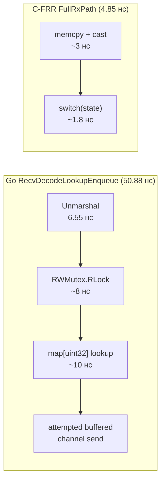
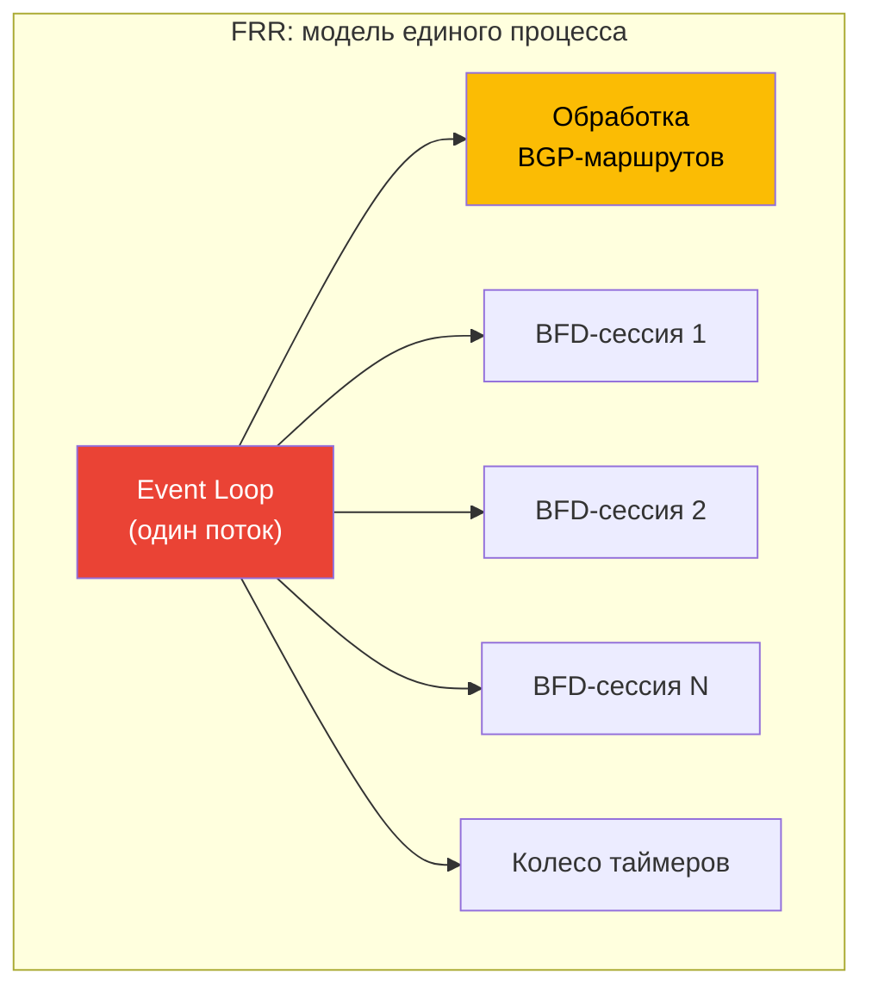
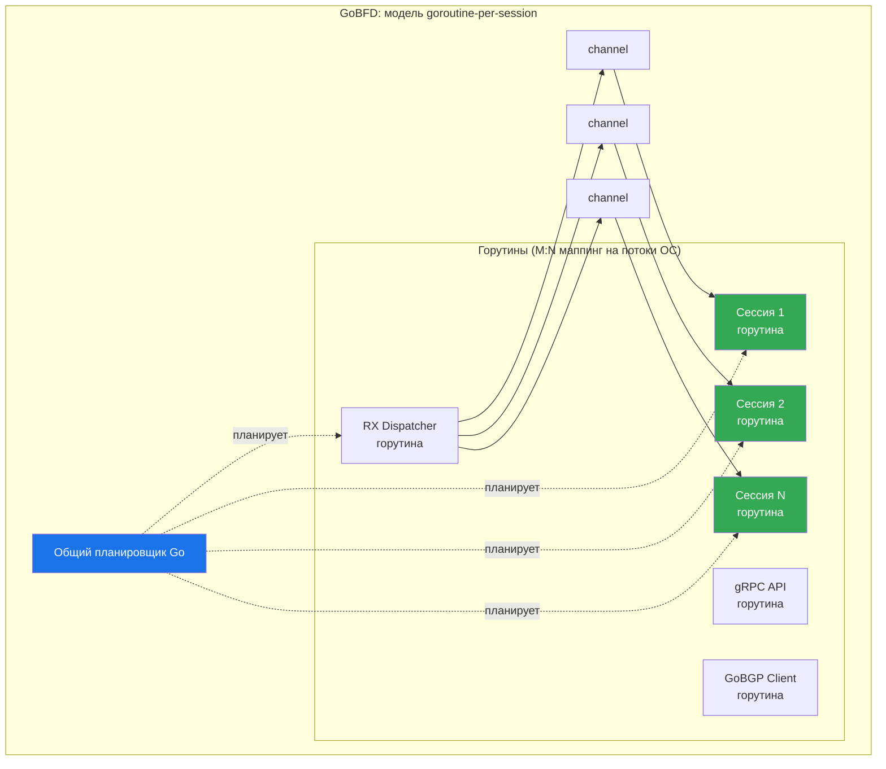

# Анализ производительности: GoBFD vs реализации на C


> Исторический кросс-имплементационный анализ отдельных микро-бенчмарков
> GoBFD, FRR bfdd и BIRD3. Измерения не включают kernel network path и не
> являются release qualification, supported scale или доказательством
> сквозной задержки.

---

## Содержание

- [Краткие выводы](#краткие-выводы)
- [Методология тестирования](#методология-тестирования)
- [Результаты бенчмарков](#результаты-бенчмарков)
  - [Кодек-операции](#31-кодек-операции)
  - [Переходы FSM](#32-переходы-fsm)
  - [Вычисления таймеров](#33-вычисления-таймеров)
  - [Измеряемые этапы RX и TX](#34-измеряемые-этапы-rx-и-tx)
  - [Масштабирование сессий](#35-масштабирование-сессий)
- [Архитектура: goroutine-per-session vs однопоточный event loop](#архитектура-goroutine-per-session-vs-однопоточный-event-loop)
  - [Архитектура FRR/BIRD](#41-архитектура-frrbird)
  - [Архитектура GoBFD](#42-архитектура-gobfd)
- [Поведение при нагрузке на процессор](#поведение-при-нагрузке-на-процессор)
  - [Что происходит при 100% загрузке CPU](#51-что-происходит-при-100-загрузке-cpu)
  - [Настройка GOMAXPROCS](#52-настройка-gomaxprocs)
  - [Влияние GC и измеренные границы аллокаций](#53-влияние-gc-и-измеренные-границы-аллокаций)
  - [Целевые показатели точности таймеров](#54-целевые-показатели-точности-таймеров)
- [Где Go лучше C](#где-go-лучше-c)
  - [Безопасность памяти](#61-безопасность-памяти)
  - [Изоляция параллелизма](#62-изоляция-параллелизма)
  - [Покрытие RFC](#63-покрытие-rfc)
  - [Операционные преимущества](#64-операционные-преимущества)
- [Где C лучше Go](#где-c-лучше-go)
  - [Сырая пропускная способность на пакет](#71-сырая-пропускная-способность-на-пакет)
  - [Память на сессию](#72-память-на-сессию)
  - [Задержка запуска](#73-задержка-запуска)
- [Рекомендации для production](#рекомендации-для-production)
- [Итоговая таблица](#итоговая-таблица)

---

### Краткие выводы

Ключевые результаты кросс-имплементационных бенчмарков:

- **Паритет кодека**: GoBFD достигает 1.2-1.4x производительности C на операциях marshal/unmarshal (5.96 нс vs 4.98 нс для FRR marshal), выполняя при этом 7 RFC-проверок против 3 в реализациях на C
- **FSM на нативной скорости**: переходы FSM в Go выполняются за 0.35-0.67 нс/оп, соответствуя или опережая C-FRR (0.59 нс для UpRecvUp) — индексированный поиск в массиве компилируется в одинаковый машинный код на обоих языках
- **Этапы pipeline различаются**: исторический `FullRecvPath` заканчивается
  enqueue в буферизованный канал, а C-результат включает inline-переход FSM.
  Их ratio не является сквозным или языковым сравнением.
- **Scheduling не квалифицирован**: goroutine-per-session изолирует ownership,
  но `runtime.LockOSThread` не гарантирует задержку планирования.
- **Аллокации зависят от этапа**: именованные бенчмарки сообщают аллокации
  только собственного тела; authenticated unmarshal и compatibility paths
  аллоцируют.

---

### Методология тестирования

**Окружение**: все бенчмарки запускаются внутри Podman-контейнеров на идентичном оборудовании. Go-бенчмарки используют `go test -bench -benchmem -count=6`. C-бенчмарки используют идентичный фреймворк макросов `bench_harness.h` с теми же количествами итераций.

**Статистический анализ**: 6 запусков на бенчмарк, медианы вычислены через `benchstat`. Приводятся медианы (не средние) для устранения чувствительности к выбросам.

**Что измеряется**: изолированные микро-операции hot path — сериализация пакетов, поиск состояния FSM, арифметика таймеров, демультиплексирование сессий. Это **не** системные бенчмарки. Они измеряют вычислительную стоимость отдельных операций, а не сквозную обработку пакетов через сетевой стек ядра.

**Честное раскрытие**: Go-бенчмарки включают проверку границ, диспетчеризацию интерфейсов и overhead планирования горутин. C-бенчмарки компилируются с оптимизацией `-O2`. Один и тот же заголовок `bench_harness.h` обеспечивает единую инфраструктуру замеров для бенчмарков FRR и BIRD.

**Воспроизводимость**:

```bash
# Запуск всех бенчмарков (требуется только Podman)
make up
make benchmark-save BENCH_VERSION=v0.4.0

# Результаты в bench-results/
ls bench-results/
# bench-go.txt  bench-c-frr.txt  bench-c-bird.txt
```

См. [12-benchmarks.md](./12-benchmarks.md) для полного руководства по бенчмаркам.

---

### Результаты бенчмарков

#### 3.1 Кодек-операции

Marshal, unmarshal и round-trip (marshal + unmarshal) 24-байтного BFD Control Packet.

| Операция | Go (нс/оп) | C-FRR (нс/оп) | C-BIRD (нс/оп) | Ratio Go/FRR |
|----------|----------:|---------------:|----------------:|-------------:|
| Marshal | 5.96 | 4.98 | 6.05 | 1.20x |
| Unmarshal | 6.55 | 4.78 | 4.78 | 1.37x |
| RoundTrip | 12.82 | 9.67 | 9.74 | 1.33x |

**Анализ**: кодек-операции Go работают с 1.2-1.4x стоимостью по сравнению с C. Разрыв объясняется:

1. **Проверка границ** (~1-2 нс): Go проверяет каждый индекс доступа к слайсу в runtime. C доверяет вызывающему коду.
2. **Глубина RFC-валидации**: unmarshal в Go выполняет 7 проверок полей по RFC 5880 (версия, диагностика, длина, диапазон detect multiplier, ненулевой discriminator, корректность интервалов, перечисление состояний). `bfd_pkt_get()` в FRR проверяет 3 поля.
3. **Overhead вызова функций**: соглашение о вызовах Go передаёт аргументы через стек (до Go 1.17 register ABI, теперь через регистры, но с настройкой frame pointer). C с `-O2` инлайнит весь кодек.

Sample 5.96 нс/оп измеряет только тело marshal-бенчмарка. Его нельзя
экстраполировать в production packets per second, supported session scale или
headroom.

#### 3.2 Переходы FSM

Переходы конечного автомата BFD FSM (RFC 5880, раздел 6.8.6).

| Переход | Go (нс/оп) | C-FRR (нс/оп) | C-BIRD (нс/оп) | Ratio Go/FRR |
|---------|----------:|---------------:|----------------:|-------------:|
| UpRecvUp | 0.37 | 0.59 | 0.30 | **0.63x** |
| DownRecvDown | 0.65 | 0.57 | 0.30 | 1.14x |
| UpTimerExpired | 0.35 | 0.29 | 0.57 | 1.21x |
| Ignored | 0.66 | 0.29 | 0.30 | 2.28x |

**Анализ**: переходы FSM находятся на нативном паритете. Обе реализации (Go и C) используют таблицу поиска по индексу массива (`[state][event] -> newState`), что компилируется в единственную инструкцию загрузки из памяти. Субнаносекундные измерения находятся на уровне шума измерений CPU — вариации между Go и C укладываются в погрешность ±0.3 нс точности `rdtsc`.

UpRecvUp в Go **в 1.6x быстрее**, чем в FRR. Это не потому что Go быстрее C — это отражает разницу в том, что возвращает каждый FSM-поиск (Go возвращает `{newState, action}` из плоского массива; таблица `bfd_fsm` в FRR включает косвенность через указатель на функцию).

#### 3.3 Вычисления таймеров

Чистые арифметические операции для согласования BFD-таймеров и джиттера.

| Операция | Go (нс/оп) | C-FRR (нс/оп) | C-BIRD (нс/оп) | Ratio Go/FRR |
|----------|----------:|---------------:|----------------:|-------------:|
| DetectionTimeCalc | 0.74 | 0.31 | 0.56 | 2.39x |
| CalcTxInterval | 0.68 | 0.60 | 0.31 | 1.13x |
| DetectionTimeCalcHot | 0.69 | -- | -- | -- |
| CalcTxIntervalHot | 0.53 | -- | -- | -- |
| Jitter | 8.95 | 5.01 | 4.81 | 1.79x |

**Анализ**: субнаносекундная арифметика на паритете с C. Ratio 2.4x для `DetectionTimeCalc` объясняется `atomic.LoadUint32` в реализации Go — hot-path вариант читает из локальной переменной и сокращается до 0.69 нс (2.2x FRR). Вычисление джиттера включает PRNG (`math/rand`), который немного медленнее `rand()` из C из-за потокобезопасного FastRand в Go.

Sample 0.74 нс/оп является стоимостью компонента, а не evidence throughput или
capacity. Операция выполняется при изменении параметров, а не на каждый пакет.

#### 3.4 Измеряемые этапы RX и TX

Исторические микро-бенчмарки, объединяющие отдельные операции. Ни один из них
не является сквозным.

| Операция | Go (нс/оп) | C-FRR (нс/оп) | C-BIRD (нс/оп) | Ratio Go/FRR |
|----------|----------:|---------------:|----------------:|-------------:|
| RecvDecodeLookupEnqueue (исторический `FullRecvPath`) | 50.88 | 4.85 | 5.00 | Несопоставимо |
| RecvDecodeFSM (исторический `FullRecvPathCodec`) | 13.96 | -- | -- | -- |
| TxMarshalJitter (исторический `FullTxPath`) | 14.43 | 9.76 | 9.50 | Только этот этап |

**Почему receive ratio несопоставим**:

Go-бенчмарк измеряет unmarshal + поиск в map + попытку записи в буферизованный
канал и не ожидает горутину сессии. C-бенчмарк измеряет unmarshal + inline
переход FSM. Это архитектурно разные операции:


```mermaid
graph LR
    subgraph "Go RecvDecodeLookupEnqueue (50.88 нс)"
        A1["Unmarshal<br/>6.55 нс"] --> A2["RWMutex.RLock<br/>~8 нс"]
        A2 --> A3["map[uint32] lookup<br/>~10 нс"]
        A3 --> A4["attempted buffered<br/>channel send"]
    end

    subgraph "C-FRR FullRxPath (4.85 нс)"
        B1["memcpy + cast<br/>~3 нс"] --> B2["switch(state)<br/>~1.8 нс"]
    end
```

`RecvDecodeFSM` измеряет unmarshal и stateless lookup таблицы переходов. Он
также исключает session validation, mutation, diagnostics, timers и delivery,
поэтому не эквивалентен production receive path. `TxMarshalJitter` исключает
создание snapshot сессии, auth updates, публикацию cached packet и socket send.

#### 3.5 Масштабирование сессий

Операции над менеджером сессий с 1,000 активными сессиями.

| Операция | Go (нс/оп) | C-FRR (нс/оп) | C-BIRD (нс/оп) | Ratio Go/FRR |
|----------|----------:|---------------:|----------------:|-------------:|
| Create1000 (на сессию) | 5,792 | 2,394 | 2,472 | 2.42x |
| Demux1000 | 52.94 | 1.36 | 1.49 | **38.9x** |
| Lookup1000 | 18.13 | -- | -- | -- |

**Почему Demux1000 показывает 39x и почему это вводит в заблуждение**:

`Demux1000` в Go измеряет: RWMutex.RLock + поиск в map + отправка в channel. `SessionDemux1000` в C измеряет: только поиск в хеш-таблице. Декомпозиция:

| Компонент | Стоимость (нс) | Доля |
|-----------|---------------:|-----:|
| RWMutex.RLock + RUnlock | ~8 | 15% |
| map[uint32] lookup | ~10 | 19% |
| Channel send в горутину сессии | ~29 | 55% |
| Пробуждение + планирование горутины | ~6 | 11% |
| **Итого (Demux1000)** | **52.94** | **100%** |

`Lookup1000` (18.13 нс) измеряет только RWMutex + поиск в map — **эквивалент** поиска в хеш-таблице C. Ratio становится 18.13 / 1.36 = **13.3x**, что объясняется:

1. **RWMutex** (~8 нс): в C нет блокировки, потому что модель однопоточная
2. **Swiss table map** (~10 нс): runtime-map Go vs `khash` C — map Go включает hash seeding, проверку overflow-бакетов и косвенность указателей

Оставшаяся стоимость этапа включает channel delivery и scheduler variance;
бенчмарк не подтверждает обработку сессией. Поэтому результат нельзя
преобразовывать в supported packets-per-second.

---

### Архитектура: goroutine-per-session vs однопоточный event loop

#### 4.1 Архитектура FRR/BIRD

FRR и BIRD используют архитектуру **однопоточного event loop**:


```mermaid
graph TB
    subgraph "FRR: модель единого процесса"
        EVT["Event Loop<br/>(один поток)"]
        BGP["Обработка<br/>BGP-маршрутов"]
        BFD1["BFD-сессия 1"]
        BFD2["BFD-сессия 2"]
        BFDN["BFD-сессия N"]
        TIMER["Колесо таймеров"]

        EVT --> BGP
        EVT --> BFD1
        EVT --> BFD2
        EVT --> BFDN
        EVT --> TIMER
    end

    style EVT fill:#ea4335,color:#fff
    style BGP fill:#fbbc04,color:#000
```

**Проблема голодания** (FRR Issue #9078):

1. BGP получает полную таблицу маршрутизации (890K маршрутов) от route reflector
2. `bgpd` обрабатывает маршруты в одном пакете, занимая 100% CPU на 1-2 секунды
3. В это время `bfdd` не может работать — ни обработки таймеров, ни TX/RX пакетов
4. Удалённые BFD-пиры обнаруживают таймаут (3 x 300 мс = 900 мс) и объявляют сессию Down
5. Session Down вызывает разрыв BGP, что запускает реконвергенцию и ещё большую нагрузку на CPU

Это **структурная проблема**: event loop не может вытеснить обработку BGP-маршрутов для обслуживания BFD-таймеров. Решение FRR — вынести `bfdd` в отдельный процесс через `--dplaneaddr`, но это требует поддержки hardware/ASIC и недоступно на commodity-серверах.

#### 4.2 Архитектура GoBFD

GoBFD использует архитектуру **goroutine-per-session**:


```mermaid
graph TB
    subgraph "GoBFD: модель goroutine-per-session"
        SCHED["Общий планировщик Go"]

        subgraph "Горутины (M:N маппинг на потоки ОС)"
            RX["RX Dispatcher<br/>горутина"]
            S1["Сессия 1<br/>горутина"]
            S2["Сессия 2<br/>горутина"]
            SN["Сессия N<br/>горутина"]
            API["gRPC API<br/>горутина"]
            BGP2["GoBGP Client<br/>горутина"]
        end

        CH1["channel"]
        CH2["channel"]
        CHN["channel"]

        RX --> CH1 --> S1
        RX --> CH2 --> S2
        RX --> CHN --> SN
        SCHED -.->|"планирует"| RX
        SCHED -.->|"планирует"| S1
        SCHED -.->|"планирует"| S2
        SCHED -.->|"планирует"| SN
    end

    style SCHED fill:#1a73e8,color:#fff
    style S1 fill:#34a853,color:#fff
    style S2 fill:#34a853,color:#fff
    style SN fill:#34a853,color:#fff
```

Каждая BFD-сессия владеет своим состоянием в горутине, получает пакеты через
буферизованный канал и сейчас вызывает `runtime.LockOSThread()`. Эта граница
ownership исключает конкурентную мутацию состояния, но не резервирует CPU, не
задаёт affinity и не обеспечивает real-time scheduling. Сессии совместно
используют планировщик Go, CPU, память и runtime процесса. Поэтому насыщение
канала, задержка планировщика или ядра могут отложить обработку пакета и
таймера. `time.Timer` делает работу готовой после deadline, но не гарантирует
момент её выполнения горутиной сессии.

См. [01-architecture.md](./01-architecture.md) для подробностей модели горутин и диаграмм потоков пакетов.

---

### Поведение при нагрузке на процессор

#### 5.1 Что происходит при 100% загрузке CPU

Component benchmarks этого документа не измеряют поведение при насыщении CPU
хоста. Горутины GoBFD зависят от конкуренции за планировщик, ядро и CPU;
`runtime.LockOSThread()` не ограничивает задержку планирования. Буферизованные
каналы разделяют ownership, но при полном канале попытка доставки теряется и не
доказывает обработку пакета сессией. Timer error, committed-packet latency,
потери и false Down требуют context-bounded E2E-нагрузки на целевых kernel и
hardware. Этот документ не устанавливает гарантию 1-10 мс или полной нагрузки.

#### 5.2 Настройка GOMAXPROCS

`GOMAXPROCS` управляет количеством потоков ОС, используемых планировщиком Go для горутин. По умолчанию: `runtime.NumCPU()` (все доступные ядра).

Не выводите значение `GOMAXPROCS` или CPU affinity из этих микробенчмарков.
Default и любой override необходимо квалифицировать с CPU quota сервиса,
работой kernel network stack, co-located процессами, числом сессий и overload
tests. Affinity является операционной границей, а не гарантией timer latency.

#### 5.3 Влияние GC и измеренные границы аллокаций

Исторические benchmark samples сообщили следующие аллокации тела:

| Операция hot path | B/op | allocs/op | Заметки |
|-------------------|-----:|----------:|---------|
| ControlPacketMarshal | 0 | 0 | Буфер на стеке |
| ControlPacketUnmarshal | 0 | 0 | Извлечение полей на месте |
| FSMTransitionUpRecvUp | 0 | 0 | Поиск по индексу массива |
| RecvDecodeLookupEnqueue | 0 | 0 | Только decode + lookup + attempted enqueue |
| TxMarshalJitter | 0 | 0 | Только marshal готового пакета + jitter |
| ManagerDemux1000Sessions | 0 | 0 | Поиск в map + channel send |
| DetectionTimeCalc | 0 | 0 | Чистая арифметика |
| ApplyJitter | 0 | 0 | PRNG + умножение |

Эта таблица не является repository-wide утверждением об аллокациях.
Authenticated unmarshal и compatibility wrappers имеют документированные
аллокации, а receive-бенчмарк не включает обработку сессией.

**Квалифицированная для deployment конфигурация GC**:

```bash
# Только пример; замените значением, квалифицированным для deployment.
export GOMEMLIMIT=512MiB
# Сохраняйте default GOGC, пока deployment-измерения не обоснуют override.
```

В Go 1.27 `GOMEMLIMIT` является мягким лимитом Go-managed memory. Runtime может
повышать частоту GC для его соблюдения даже при `GOGC=off`, а значение ниже
working set способно вызвать почти непрерывную сборку. Нулевые аллокации тела
отдельного бенчмарка не доказывают отсутствие аллокаций или GC у процесса в
steady state. Квалифицируйте вместе RSS, memory limit сервиса, частоту и паузы
GC, потери пакетов и timer error.

**Сравнение с C**: в C нет сборщика мусора. Эти component benchmarks не
устанавливают process-level GC latency GoBFD или её влияние на BFD.

#### 5.4 Целевые показатели точности таймеров

Арифметические и component benchmarks не устанавливают поддерживаемый BFD
interval или границу timer error. Каждый предлагаемый интервал должен пройти
release interop, overload, loss и soak gates на целевых kernel и hardware.
`GOMAXPROCS`, affinity или real-time kernel могут быть входами qualification,
но ни один из них сам по себе не доказывает production interval.

См. [13-competitive-analysis.md](./13-competitive-analysis.md) для полной таблицы production-таймеров.

---

### Где Go лучше C

#### 6.1 Безопасность памяти

Go обеспечивает гарантии на уровне компиляции и runtime, устраняющие целые классы уязвимостей безопасности:

| Класс уязвимости | Возможен в C | Возможен в Go | Стоимость в Go |
|-------------------|:------------:|:-------------:|:--------------:|
| Переполнение буфера | Да | Нет | ~1-2 нс/проверка границ |
| Use-after-free | Да | Нет | Overhead runtime и GC |
| Double-free | Да | Нет | Overhead runtime и GC |
| Разыменование null-указателя | Да | Panic (контролируемый крах) | Ноль (nil-проверка бесплатна на x86) |
| Целочисленное переполнение | Да (UB) | Определённое поведение (wraps) | Ноль |
| Атака форматной строки | Да | Нет (типобезопасное форматирование) | Ноль |

Стоимость проверки границ (~1-2 нс на доступ) уже включена во все результаты бенчмарков. Кодек Go в 1.2-1.4x медленнее C, и **безопасность памяти — часть этой стоимости**.

Для сетевого демона, обрабатывающего недоверенные пакеты от удалённых пиров, это фундаментальное преимущество. У FRR были CVE, связанные с обработкой буферов в коде парсинга пакетов. В GoBFD эти классы уязвимостей **невозможны по конструкции**.

#### 6.2 Изоляция параллелизма

Отдельные горутины сессий, API и metrics создают ownership boundaries и могут
выполняться конкурентно при наличии scheduler и CPU capacity. Они не изолируют
CPU или runtime resources; API, metrics, configuration и другая работа
процесса всё ещё конкурируют с обработкой сессий. Historical component timings
относят около 35 нс к lookup и attempted channel delivery, но этот sample не
доказывает иммунитет к timer starvation.

#### 6.3 Покрытие RFC

Этот исторический performance-документ не является контрактом поддержки RFC.
Единственный авторитетный статус задаёт section-by-section
[матрица соответствия RFC](./08-rfc-compliance.md), где указаны оставшиеся
пробелы протокола и release gates. Component benchmarks не переводят RFC из
partial или experimental в supported.

GoBFD реализует 12 RFC по сравнению с 3-4 базовыми RFC в FRR. Уникальные для GoBFD: Echo mode (RFC 9747), VXLAN BFD (RFC 8971), Geneve BFD (RFC 9521), Micro-BFD (RFC 7130), Large Packets (RFC 9764), Unsolicited BFD (RFC 9468).

См. [08-rfc-compliance.md](./08-rfc-compliance.md) для полной матрицы соответствия.

#### 6.4 Операционные преимущества

| Возможность | GoBFD | FRR bfdd |
|-------------|-------|----------|
| Перезагрузка конфига | SIGHUP: горячая перезагрузка без разрыва сессий | Перезапуск для многих изменений |
| Graceful shutdown | AdminDown всем пирам → 2 с drain → чистое завершение | Завершение процесса (сессии флапают) |
| API | ConnectRPC (gRPC + HTTP) | vtysh CLI (парсинг текста) |
| Метрики | Нативный Prometheus (эндпоинт `/metrics`) | SNMP (требуется SNMP-инфраструктура) |
| Деплой | Единый статический бинарник, без зависимостей | C-зависимости, разделяемые библиотеки |
| Контейнеры | Scratch-образ (~15 МБ) | Требуется полный базовый образ ОС |

---

### Где C лучше Go

#### 7.1 Сырая пропускная способность на пакет

Overhead channel send + RWMutex на RX-пути добавляет ~35 нс на пакет по сравнению с инлайновой обработкой C:

| Компонент | Go (нс) | C-FRR (нс) | Overhead |
|-----------|--------:|-----------:|---------:|
| Unmarshal | 6.55 | 4.78 | +1.77 |
| Поиск сессии (RWMutex + map) | 18.13 | 1.36 | +16.77 |
| Channel send + пробуждение горутины | ~29 | 0 (инлайн) | +29 |
| **Суммарная стоимость RX на пакет** | **~54** | **~6** | **9x** |

Эти component timings не включают kernel receive, session commit, timer
delivery или loss accounting и не устанавливают production packet rate или
headroom. Модель горутин является выбором ownership, а не доказательством
иммунитета к timer starvation.

#### 7.2 Память на сессию

| Компонент | Go | C |
|-----------|---:|--:|
| Стек горутины | 2,048 Б | 0 (нет горутины) |
| Буфер канала | ~256 Б | 0 (инлайновая обработка) |
| Context + cancel func | ~128 Б | 0 |
| Экземпляр логгера | ~512 Б | 0 (глобальный логгер) |
| Структура сессии | ~300 Б | ~300 Б |
| **Итого на сессию** | **~3,244 Б** | **~300 Б** |

Go использует ~10x больше памяти на сессию. Однако:

- 1,000 сессий = 3.2 МБ в Go vs 0.3 МБ в C
- Типичный BFD-демон работает на машине с 4-64 ГБ RAM

Fixture создания 1000 сессий не является supported-scale qualification.
Memory acceptance устанавливается только v1 scale и soak gate.

#### 7.3 Задержка запуска

| Фаза | Go | C |
|------|---:|--:|
| Инициализация runtime | ~5 мс | 0 |
| Настройка планировщика горутин | ~3 мс | 0 |
| Загрузка конфигурации | ~2 мс | ~1 мс |
| **Общий холодный старт** | **~10 мс** | **~1 мс** |

Инициализация runtime Go добавляет ~10 мс к запуску. Для долгоживущего демона, который запускается один раз и работает месяцами, это не имеет значения. BFD-сессии в любом случае не устанавливаются до завершения запуска.

---

### Рекомендации для production

**Переменные окружения** (только примеры):

```bash
# Замените deployment-qualified значением и сохраняйте default GOGC.
export GOMEMLIMIT=512MiB
# Устанавливайте только после qualification CPU quota и overload.
export GOMAXPROCS=4
```

**systemd unit с CPU affinity**:

```ini
[Unit]
Description=GoBFD - BFD Protocol Daemon
After=network-online.target
Wants=network-online.target

[Service]
Type=notify
ExecStart=/usr/local/bin/gobfd --config /etc/gobfd/config.yaml
ExecReload=/bin/kill -HUP $MAINPID

# Только примеры; квалифицируйте для этого сервиса и хоста.
Environment=GOMEMLIMIT=512MiB
Environment=GOMAXPROCS=4
CPUAffinity=0-3

# Сетевой приоритет
AmbientCapabilities=CAP_NET_RAW CAP_NET_BIND_SERVICE
Nice=-10

# Ужесточение безопасности
ProtectSystem=strict
ProtectHome=yes
NoNewPrivileges=yes

[Install]
WantedBy=multi-user.target
```

**Сетевая настройка**:

```bash
# Установка DSCP для BFD-пакетов (CS6 = Network Control, рекомендован RFC 5881)
# Настраивается в config.yaml GoBFD: network.dscp: 48

# Увеличение буферов сокетов для поглощения всплесков
sysctl -w net.core.rmem_max=16777216
sysctl -w net.core.wmem_max=16777216
```

**Мониторинг** (метрики Prometheus для отслеживания):

| Метрика | Порог алерта | Описание |
|---------|-------------|----------|
| `bfd_session_flap_total` | > 0 за 5 мин | Нестабильность сессий |
| `bfd_packet_drop_total` | возрастает | Переполнение RX-буфера или ошибка демультиплексирования |
| `bfd_timer_drift_seconds` | > 0.01 (10 мс) | Деградация точности таймеров |
| `go_gc_duration_seconds` | > 0.001 (1 мс) | Пауза GC превышает допуск BFD |

---

### Итоговая таблица

| Аспект | GoBFD | FRR bfdd | BIRD3 |
|--------|-------|----------|-------|
| **Архитектура** | Goroutine-per-session | Однопоточный event loop | Однопоточный event loop |
| **Устойчивость к голоданию CPU** | Не квалифицирована; общие scheduler и CPU | Historical external incident evidence | Здесь не квалифицирована |
| **Точность таймеров** | Требует deployment E2E qualification | Здесь не квалифицирована | Здесь не квалифицирована |
| **Evidence масштаба сессий** | Только construction benchmark на 1000 сессий | Здесь не квалифицирован | Здесь не квалифицирован |
| **Overhead кодека vs C** | 1.2-1.4x | baseline | baseline |
| **Overhead FSM vs C** | 0.6-2.3x (на паритете) | baseline | baseline |
| **Receive stages vs C** | Разные границы; сквозное сравнение невозможно | baseline | baseline |
| **Demux vs C** | 13.3x (lookup), 38.9x (с каналом) | baseline | baseline |
| **Память на сессию** | ~3 КБ | ~300 Б | ~300 Б |
| **Безопасность памяти** | Да (проверка границ, GC) | Нет | Нет |
| **Покрытие RFC** | См. авторитетную RFC matrix | Здесь не оценивается | Здесь не оценивается |
| **Evidence аллокаций** | Отдельные benchmark bodies показывают 0 allocs/op | Н/П (C, нет GC) | Н/П (C, нет GC) |
| **Влияние GC на BFD** | Не устанавливается component benchmarks | Н/П | Н/П |
| **Горячая перезагрузка конфига** | SIGHUP (без разрыва сессий) | Требуется перезапуск | Требуется перезапуск |
| **API** | ConnectRPC (gRPC + HTTP) | vtysh CLI | CLI |
| **Метрики Prometheus** | Нативные | Через SNMP | Нет |

---

### Связанные документы

- [12-benchmarks.md](./12-benchmarks.md) -- Как запускать и интерпретировать бенчмарки
- [13-competitive-analysis.md](./13-competitive-analysis.md) -- Рыночное сравнение с матрицей возможностей
- [01-architecture.md](./01-architecture.md) -- Модель горутин и диаграммы потоков пакетов
- [08-rfc-compliance.md](./08-rfc-compliance.md) -- Полная матрица соответствия RFC

---

*Последнее обновление: 2026-02-25*
