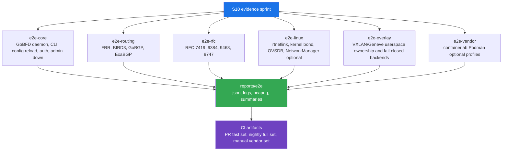

# План S10 Extended E2E и Interoperability

Каноничный план evidence sprint S10.

---

## 1. Решение

| Поле | Значение |
|---|---|
| Sprint | S10 |
| Основная цель | Расширенная end-to-end и interoperability evidence для существующего набора функций GoBFD. |
| Предпочтительное направление | Расширить E2E/interop coverage до добавления новых protocol backends. |
| Release impact | Для planning-only изменения релиз не требуется; последующая реализация test harness публикуется как patch или minor prerelease только при изменении пользовательского поведения. |
| Обязательный runtime | Podman. |
| Обязательная evidence | Go test JSON, container logs, BFD packet captures, control-plane snapshots и CI artifacts. |
| Non-goal | Нет default enablement для kernel, OVS, OVN, Cilium, Calico, NSX, VXLAN или Geneve owner-specific backends. |

## 2. Проверка источников

| Источник | Значение | Ограничение S10 |
|---|---|---|
| [RFC 5880](https://datatracker.ietf.org/doc/html/rfc5880) | Базовые BFD state machine, timers, control packets, authentication. | Core E2E assertions должны мапить packet/state behavior на semantics RFC 5880. |
| [RFC 7130](https://www.rfc-editor.org/rfc/rfc7130) | Micro-BFD для LAG member links. | Micro-BFD tests моделируют independent per-member sessions и не заявляют echo coverage для RFC 7130. |
| [RFC 8971](https://www.rfc-editor.org/rfc/rfc8971.html) | BFD for VXLAN. | VXLAN tests проверяют overlay packet ownership и не overclaim kernel/OVS/CNI dataplane. |
| [RFC 9521](https://www.ietf.org/rfc/rfc9521.html) | BFD for Geneve. | Geneve tests остаются explicit к ownership Geneve tunnel. |
| [RFC 9747](https://www.rfc-editor.org/rfc/rfc9747) | Unaffiliated BFD Echo. | Echo tests сохраняют UDP 3785 packet evidence и failure/recovery checks. |
| [FRRouting BFD documentation](https://docs.frrouting.org/en/latest/bfd.html) | `bfdd` configuration, peer model, JSON show commands, echo constraints. | FRR остаётся основным standards-oriented interop peer для routing и RFC checks. |
| [containerlab node runtime documentation](https://containerlab.dev/manual/nodes/) | Docker default, Podman runtime support, per-node/global runtime selection. | Vendor NOS interop остаётся optional/manual, так как Podman support задокументирован как experimental. |
| [containerlab deploy documentation](https://containerlab.dev/cmd/deploy/) | Runtime selection через `--runtime`. | `containerlab --runtime podman` остаётся единственным документированным S10 vendor-lab path. |
| [netlab module reference](https://netlab.tools/module-reference/) | Наличие BFD module в topology-generated labs. | Netlab является будущим кандидатом topology generator, не зависимостью S10. |
| [Open vSwitch OVSDB documentation](https://docs.openvswitch.org/en/stable/ref/ovsdb.7/) | JSON-RPC state/config database для OVS и OVN integration. | OVS checks должны предпочитать OVSDB API evidence вместо shell-only assumptions. |
| [Linux rtnetlink manual](https://man7.org/linux/man-pages/man7/rtnetlink.7.html) | NETLINK_ROUTE API для link/address/route notifications. | Linux link-state E2E валидирует rtnetlink через namespace/interface events. |
| [Linux bonding documentation](https://www.kernel.org/doc/html/v6.7/networking/bonding.html) | Kernel bond monitoring and member behavior. | Kernel-bond tests требуют explicit ownership и не выполняют destructive host operations. |
| [NetworkManager D-Bus settings](https://networkmanager.pages.freedesktop.org/NetworkManager/NetworkManager/nm-settings-dbus.html) | NetworkManager profile API surface. | NetworkManager backend tests остаются isolated и optional, если нет NM test container. |
| [cilium/ebpf README](https://github.com/cilium/ebpf/blob/main/README.md) | Platform requirements для Go eBPF library. | eBPF остаётся optional future work; S10 может добавить capability checks только без privileged default. |
| [Arista EOS BFD documentation](https://www.arista.com/en/um-eos/eos-bidirectional-forwarding-detection) | EOS BFD operational model. | Arista vendor validation является optional/manual и фиксирует EOS image/version constraints. |
| [Arista EOS `bfd vtep evpn` command](https://www.arista.com/en/um-eos/eos-evpn-and-vcs-commands) | VXLAN VTEP BFD command surface. | Arista VXLAN BFD coverage является vendor profile, не generic Linux proof. |

## 3. Текущий baseline

| Область | Существующая цель | Текущая роль |
|---|---|---|
| Unit и race tests | `make test` | Routine package evidence. |
| Integration tests | `make test-integration` | Local daemon, CLI и server behavior. |
| Four-peer BFD interop | `make interop` | GoBFD против FRR, BIRD3, aiobfd и Thoro/bfd. |
| BGP+BFD interop | `make interop-bgp` | GoBFD и GoBGP failover против FRR, BIRD3 и ExaBGP scenarios. |
| RFC-specific interop | `make interop-rfc` | RFC 7419, RFC 9384, RFC 9468 и RFC 9747 behavior. |
| Vendor NOS lab | `make interop-clab` | Optional containerlab profile для primary Arista cEOS, Nokia SR Linux, SONiC-VS, VyOS, baseline FRR и deferred Cisco XRd. |
| Example integrations | `make int-bgp-failover`, `make int-haproxy`, `make int-observability`, `make int-exabgp-anycast`, `make int-k8s` | Scenario-level deployment evidence. |
| Benchmark comparison | GitHub Actions `Benchmark comparison` | Hot-path regression guard; расширение не требуется для docs-only изменений. |

## 4. Test foundation decision

| Область | Решение |
|---|---|
| Stack lifecycle | Сохранить существующую модель shell и `podman-compose` для lifecycle multi-container topology. |
| Assertion layer | Сохранить Go tests как protocol assertion layer. |
| Podman control | Добавить общий Go helper для Podman REST API operations до расширения E2E assertions. |
| Artifact model | Стандартизировать каждый S10 target на `reports/e2e/<target>/<timestamp>/`. |
| Human report model | Добавить автономный HTML report для каждого E2E run с общим JavaScript renderer, styling в духе repository, target status summary, artifact links, packet evidence tables, container state и collapsible logs. |
| Worktree safety | Требовать проверку, что dev/test container смонтирован к active checkout, до принятия evidence. |
| Host Go | Не использовать host `go test` в S10 gates. |
| `testcontainers-go` | Не используется в S10.2. Compose topology остается для packet capture, static addressing и artifact parity с existing interop targets. |

## 5. Целевая evidence architecture

## 6. Sprint breakdown

### S10.1 -- Harness Inventory and Contract

| Поле | Значение |
|---|---|
| Output | Unified E2E contract и artifact layout. |
| Files | `Makefile`, `test/e2e/README.md`, `test/e2e/targets.md`, `docs/en/19-s10-s1-harness-contract-plan.md`, `docs/ru/19-s10-s1-harness-contract-plan.md`. |
| Required target | `make e2e-help`. |
| Acceptance | Все существующие interop targets задокументированы с owner, runtime, inputs, outputs, cleanup и artifact paths. |
| Commit | `test(interop): define extended evidence harness` |

### S10.2 -- Core Daemon E2E

| Поле | Значение |
|---|---|
| Output | Deterministic GoBFD-to-GoBFD E2E suite. |
| Files | `test/e2e/core/`, `test/e2e/core/compose.yml`, `test/e2e/core/core_test.go`, `test/e2e/core/run.sh`. |
| Scenarios | Session `Up`, graceful `AdminDown`, config reload, static auth, CLI list/show/events, metrics availability, packet capture. |
| Required target | `make e2e-core`. |
| Acceptance | Suite проходит из clean Podman state и пишет `go-test.json`, `go-test.log`, `containers.json`, `containers.log`, `environment.json`, `summary.md`, `packets.pcapng` и `packets.csv`. |
| Status | Implemented. |
| Commit | `test(interop): add core daemon scenarios` |

### S10.3 -- Routing Interop Aggregate

| Поле | Значение |
|---|---|
| Output | Single routing interop aggregate поверх текущих FRR, BIRD3, GoBGP и ExaBGP stacks. |
| Files | `test/e2e/routing/`, existing `test/interop/`, `test/interop-bgp/`. |
| Scenarios | Session establishment, BGP route withdrawal, BGP route recovery, peer-specific state snapshots. |
| Required target | `make e2e-routing`. |
| Acceptance | Existing `test/interop` и `test/interop-bgp` evidence normalized into `go-test.json`, `go-test.log`, `containers.json`, `containers.log`, `environment.json`, `summary.md`, `packets.pcapng`, `packets.csv`, `interop/` и `interop-bgp/` без weakening current targets. |
| Status | Implemented. |
| Commit | `test(interop): aggregate routing interop evidence` |

### S10.4 -- RFC and Overlay Ownership

| Поле | Значение |
|---|---|
| Output | RFC-specific checks и overlay backend boundary checks. |
| Files | `test/e2e/rfc/`, `test/e2e/overlay/`, existing `test/interop-rfc/`. |
| Scenarios | RFC 7419 timer alignment, RFC 9384 BGP Cease/BFD Down coupling, RFC 9468 unsolicited BFD, RFC 9747 Echo failure/recovery, VXLAN userspace packet ownership, Geneve userspace packet ownership, reserved backend fail-closed behavior. |
| Required targets | `make e2e-rfc`, `make e2e-overlay`. |
| Acceptance | `make e2e-rfc` пишет RFC interop `go-test.json`, `go-test.log`, `containers.json`, `containers.log`, `environment.json`, `summary.md`, `packets.pcapng` и `packets.csv`; `make e2e-overlay` пишет overlay `go-test.json`, `go-test.log`, `containers.json`, `containers.log`, `environment.json`, `summary.md` и `packets.csv`; reserved `kernel`, `ovs`, `ovn`, `cilium`, `calico` и `nsx` backend names fail closed. |
| Status | Implemented. |
| Commit | `test(interop): verify rfc and overlay boundaries` |

### S10.5 -- Linux Dataplane Ownership

| Поле | Значение |
|---|---|
| Output | Linux netns/veth и owned-backend dataplane checks. |
| Files | `test/e2e/linux/`, `internal/netio` tests as needed. |
| Scenarios | rtnetlink veth link-down event, link-up recovery, kernel-bond fake sysfs remove/add, OVS owner-policy guard, NetworkManager D-Bus owner-policy guard. |
| Required target | `make e2e-linux`. |
| Acceptance | `make e2e-linux` пишет `go-test.json`, `go-test.log`, `containers.json`, `containers.log`, `environment.json`, `summary.md`, `link-events.json` и `lag-backends.json`; host interface не изменяется; destructive operations ограничены disposable `--network none` Podman namespace или fake sysfs tree. |
| Status | Implemented. |
| Commit | `test(netio): add linux dataplane ownership checks` |

### S10.6 -- Vendor Optional Profiles

| Поле | Значение |
|---|---|
| Output | Optional vendor NOS test profiles с explicit skip rules. |
| Files | `test/interop-clab/`, `test/e2e/vendor/`. |
| Scenarios | Primary Arista cEOS VXLAN BFD profile, Nokia SR Linux BFD profile, SONiC-VS profile, VyOS profile, baseline FRR profile, deferred Cisco XRd profile. |
| Required target | `make e2e-vendor`. |
| Acceptance | `make e2e-vendor` пишет `go-test.json`, `go-test.log`, `containers.json`, `containers.log`, `environment.json`, `summary.md`, `vendor-profiles.json`, `vendor-images.json` и `skip-summary.json`; missing licensed/vendor images дают documented skips, не false failures; Podman и containerlab runtimes explicit. |
| Status | Implemented. |
| Commit | `test(interop): document vendor interop profiles` |

### S10.7 -- CI, Reports, and Benchmark Policy

| Поле | Значение |
|---|---|
| Output | CI split между PR-safe, nightly и manual evidence gates. |
| Files | `.github/workflows/ci.yml`, `.github/workflows/e2e.yml`, `scripts/e2e-report/`, `docs/en/12-benchmarks.md`, `docs/ru/12-benchmarks.md`. |
| PR gate | `make e2e-core` плюс fast overlay fail-closed checks. |
| Nightly gate | `make e2e-routing`, `make e2e-rfc`, `make e2e-linux`, benchmark comparison. |
| Manual gate | `make e2e-vendor`. |
| HTML report backlog | `reports/e2e/<target>/<timestamp>/index.html` генерируется из standard JSON, CSV, PCAP metadata, summary и container artifacts. Renderer общий для всех S10 targets и использует consistent repository visual style. |
| Benchmark rule | Existing hot-path benchmark comparison остаётся stable; S10 добавляет E2E artifacts, не noisy interop microbenchmarks. |
| Status | Implemented. |
| Commit | `ci(interop): publish extended evidence artifacts` |

#### S10.7 CI Contract

| Gate | Trigger | Commands | Artifact |
|---|---|---|---|
| PR-safe E2E | `pull_request`, manual `profile=pr-safe` | `make up`, `make e2e-core`, `make e2e-overlay`, `make down` | `e2e-pr-safe` |
| Nightly E2E | `schedule`, manual `profile=nightly` | `make up`, `make e2e-routing`, `make e2e-rfc`, `make e2e-linux`, `make down` | `e2e-nightly` |
| Vendor E2E | manual `profile=vendor` | `make up`, `make e2e-vendor`, `make down` | `e2e-vendor` |

| Property | Requirement |
|---|---|
| Runtime | GitHub-hosted Ubuntu runner с Podman и `podman-compose`. |
| Podman API | `/run/podman/podman.sock` обязателен по dev container contract. |
| Upload condition | Artifacts публикуются с `if: always()`. |
| Retention | 30 days. |
| Missing artifacts | `if-no-files-found: warn`. |
| Permissions | `contents: read` by default. |
| Concurrency | One active workflow per ref and selected profile. |

## 7. Acceptance matrix

| Gate | Required before S10 close | Notes |
|---|---|---|
| `make lint-docs` | Да | Documentation changes. |
| `make test` | Да | Только code changes; предпочтительно перед implementation commits. |
| `make lint` | Да | Только code changes. |
| `make gopls-check` | Да | Только code changes. |
| `make e2e-core` | Да | Required S10 implementation gate. |
| `make e2e-routing` | Да | Required S10 implementation gate или documented environment blocker. |
| `make e2e-rfc` | Да | Required S10 implementation gate. |
| `make e2e-overlay` | Да | Required S10 implementation gate. |
| `make e2e-linux` | Да | Required при доступных Podman и kernel capabilities; skip только с recorded host capability gap. |
| `make e2e-vendor` | Optional | Manual/vendor-image profile. |

## 8. Feature decision после S10

| Candidate | Решение S10 | Причина |
|---|---|---|
| Native kernel overlay backend | Defer до E2E-доказательства текущих userspace boundaries. | Kernel/OVS/CNI ownership требует explicit actuator contracts. |
| OVS/OVN backend expansion | Candidate after S10. | OVSDB является корректным API path; существующий OVSDB Micro-BFD backend можно расширять только после interop evidence. |
| Cilium backend | Candidate after S10. | `cilium/ebpf` полезен для optional eBPF telemetry/fast-path work, но добавляет kernel, capability и architecture constraints. |
| Calico backend | Candidate after S10. | Calico должен моделироваться как отдельный CNI owner, не generic Linux backend. |
| NSX backend | Defer. | NSX требует product API ownership и внешнего lab access. |
| Expanded vendor profiles | Candidate after S10. | Ценность vendor profile зависит от repeatable containerlab Podman evidence. |

## 9. Risk register

| ID | Risk | Impact | Mitigation |
|---|---|---|---|
| S10-R1 | Podman networking capability gap на CI runner. | False red E2E gate. | Разделить PR-safe и nightly/manual gates; записывать capability diagnostics. |
| S10-R2 | Vendor images unavailable. | Vendor profile не запускается в public CI. | Vendor NOS является manual optional profile со skip records. |
| S10-R3 | Timer-based BFD tests flaky under load. | Нестабильный CI. | Bounded intervals, explicit retry windows, packet evidence и per-scenario timeouts. |
| S10-R4 | OVSDB и NetworkManager tests меняют host state. | Host disruption. | Запуск только внутри disposable containers или namespaces; fail при отсутствии isolation. |
| S10-R5 | Benchmark comparison становится noisy. | False performance regression signal. | Hot-path benchmarks остаются stable; E2E timing собирается как artifacts, не gating microbenchmarks. |
| S10-R6 | Documentation overclaims feature readiness. | Неверные ожидания pkg.go.dev и README. | Backend status остаётся implemented, partial, optional или future во всех S10 artifacts. |

## 10. Close criteria

1. S10 plan существует в `docs/en/` и `docs/ru/`.
2. `docs/en/README.md`, `docs/ru/README.md` и `docs/README.md` содержат S10 plan.
3. `docs/en/implementation-plan.md` и `docs/ru/implementation-plan.md` содержат S10.
4. `CHANGELOG.md` и `CHANGELOG.ru.md` фиксируют planning update в Unreleased.
5. Documentation lint проходит в Podman.
6. Реализация S10 начинается только после принятия этой evidence matrix.

---

*Последнее обновление: 2026-05-01*
