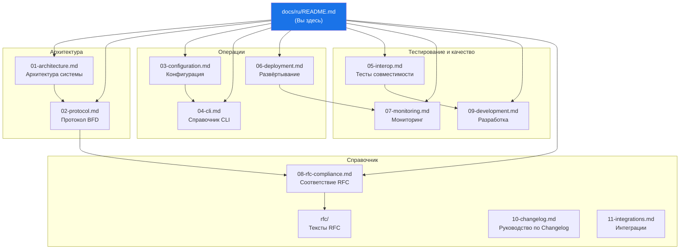

# Документация GoBFD


> Полная техническая документация **GoBFD** -- production-ready демона протокола BFD (RFC 5880/5881) на Go 1.26.

---

## Карта документации



---

## Содержание

### Архитектура

| # | Документ | Описание |
|---|---|---|
| 01 | [**Архитектура**](./01-architecture.md) | Архитектура системы, диаграмма пакетов, путь пакета, дизайн FSM |
| 02 | [**Протокол BFD**](./02-protocol.md) | FSM, таймеры, джиттер, формат пакета, аутентификация (RFC 5880) |

### Операции

| # | Документ | Описание |
|---|---|---|
| 03 | [**Конфигурация**](./03-configuration.md) | Справочник YAML-конфига, переменные окружения, горячая перезагрузка |
| 04 | [**Справочник CLI**](./04-cli.md) | Команды gobfdctl, интерактивная оболочка, форматы вывода |
| 05 | [**Тесты совместимости**](./05-interop.md) | 4-пировая топология: FRR, BIRD3, aiobfd, Thoro |
| 06 | [**Развёртывание**](./06-deployment.md) | systemd, Podman Compose, контейнерный образ, production |
| 07 | [**Мониторинг**](./07-monitoring.md) | Метрики Prometheus, дашборд Grafana, алертинг |

### Справочник

| # | Документ | Описание |
|---|---|---|
| 08 | [**Соответствие RFC**](./08-rfc-compliance.md) | Матрица соответствия RFC, заметки по реализации |
| 09 | [**Разработка**](./09-development.md) | Рабочий процесс, Make-цели, тестирование, линтинг |
| 10 | [**Руководство по Changelog**](./10-changelog.md) | Ведение CHANGELOG.md, процесс релиза, семантическое версионирование |
| 11 | [**Интеграции**](./11-integrations.md) | BGP failover, HAProxy, наблюдаемость, ExaBGP, Kubernetes |

### Исходные тексты RFC

| Файл | RFC | Название |
|---|---|---|
| [rfc5880.txt](../rfc/rfc5880.txt) | RFC 5880 | Bidirectional Forwarding Detection (BFD) |
| [rfc5881.txt](../rfc/rfc5881.txt) | RFC 5881 | BFD for IPv4 and IPv6 (Single Hop) |
| [rfc5882.txt](../rfc/rfc5882.txt) | RFC 5882 | Generic Application of BFD |
| [rfc5883.txt](../rfc/rfc5883.txt) | RFC 5883 | BFD for Multihop Paths |
| [rfc5884.txt](../rfc/rfc5884.txt) | RFC 5884 | BFD for MPLS Label Switched Paths |
| [rfc5885.txt](../rfc/rfc5885.txt) | RFC 5885 | BFD for PW VCCV |
| [rfc7130.txt](../rfc/rfc7130.txt) | RFC 7130 | Bidirectional Forwarding Detection (BFD) on LAG |

---

## Быстрый старт

```bash
# Клонирование и сборка
git clone https://github.com/dantte-lp/gobfd.git && cd gobfd
make build

# Запуск тестов
make test

# Запуск среды разработки
make up
```

См. [06-deployment.md](./06-deployment.md) для развёртывания в production и [09-development.md](./09-development.md) для полного рабочего процесса разработки.

---

*Последнее обновление: 2026-02-21*
