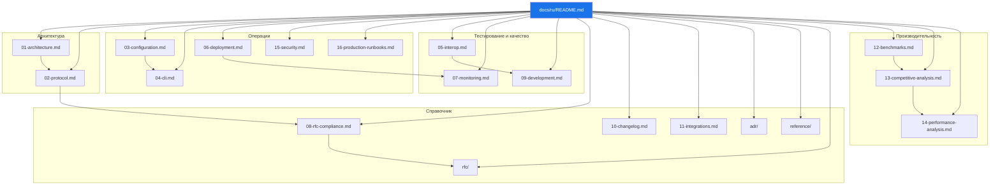

# Документация GoBFD


> Русский перевод каноничной технической документации **GoBFD** -- production-oriented демона протокола BFD (RFC 5880/5881) на Go 1.26.

---

## Карта документации


```mermaid
graph TD
    IDX["docs/ru/README.md"]

    subgraph "Архитектура"
        A1["01-architecture.md"]
        A2["02-protocol.md"]
    end

    subgraph "Операции"
        B1["03-configuration.md"]
        B2["04-cli.md"]
        B3["06-deployment.md"]
        B4["15-security.md"]
        B5["16-production-runbooks.md"]
    end

    subgraph "Тестирование и качество"
        C1["05-interop.md"]
        C2["07-monitoring.md"]
        C3["09-development.md"]
    end

    subgraph "Производительность"
        E1["12-benchmarks.md"]
        E2["13-competitive-analysis.md"]
        E3["14-performance-analysis.md"]
    end

    subgraph "Справочник"
        D1["08-rfc-compliance.md"]
        D2["10-changelog.md"]
        D3["11-integrations.md"]
        D4["adr/"]
        D5["reference/"]
        D6["rfc/"]
    end

    IDX --> A1
    IDX --> A2
    IDX --> B1
    IDX --> B2
    IDX --> B3
    IDX --> B4
    IDX --> B5
    IDX --> C1
    IDX --> C2
    IDX --> C3
    IDX --> D1
    IDX --> D2
    IDX --> D3
    IDX --> D4
    IDX --> D5
    IDX --> D6
    IDX --> E1
    IDX --> E2
    IDX --> E3

    A1 --> A2
    A2 --> D1
    B1 --> B2
    B3 --> C2
    C1 --> C3
    D1 --> D6
    E1 --> E2
    E2 --> E3

    style IDX fill:#1a73e8,color:#fff
```

---

## Содержание

### Архитектура

| # | Документ | Описание |
|---|---|---|
| 01 | [**Архитектура**](./01-architecture.md) | Архитектура системы, диаграмма пакетов, путь пакета, дизайн FSM |
| 02 | [**Протокол BFD**](./02-protocol.md) | FSM, таймеры, джиттер, формат пакета, аутентификация (RFC 5880) |

### Операции

| # | Документ | Описание |
|---|---|---|
| 03 | [**Конфигурация**](./03-configuration.md) | Справочник YAML-конфига, переменные окружения, горячая перезагрузка |
| 04 | [**Справочник CLI**](./04-cli.md) | Команды `gobfdctl`, интерактивная оболочка, форматы вывода |
| 05 | [**Тесты совместимости**](./05-interop.md) | Наборы тестов: 4-пировый, BGP+BFD, RFC-специфичный, вендорные NOS |
| 06 | [**Развёртывание**](./06-deployment.md) | systemd, Podman Compose, контейнерный образ, production |
| 07 | [**Мониторинг**](./07-monitoring.md) | Метрики Prometheus, дашборд Grafana, алертинг |
| 15 | [**Политика безопасности**](./15-security.md) | API, GoBGP, BFD auth, контейнеры, vulnerability gate |
| 16 | [**Production Runbooks**](./16-production-runbooks.md) | Kubernetes, BGP, Prometheus, packet verification, failure drills |

### Справочник

| # | Документ | Описание |
|---|---|---|
| 08 | [**Соответствие RFC**](./08-rfc-compliance.md) | Матрица соответствия RFC, заметки по реализации |
| 09 | [**Разработка**](./09-development.md) | Рабочий процесс, Make-цели, тестирование, линтинг |
| 10 | [**Руководство по Changelog**](./10-changelog.md) | Ведение CHANGELOG.md, процесс релиза, семантическое версионирование |
| 11 | [**Интеграции**](./11-integrations.md) | BGP failover, HAProxy, наблюдаемость, ExaBGP, Kubernetes |

### Производительность

| # | Документ | Описание |
|---|---|---|
| 12 | [**Бенчмарки**](./12-benchmarks.md) | Как запускать, читать и интерпретировать результаты бенчмарков |
| 13 | [**Конкурентный анализ**](./13-competitive-analysis.md) | Сравнение с FRR, BIRD, aiobfd, аппаратными платформами |
| 14 | [**Анализ производительности**](./14-performance-analysis.md) | GoBFD vs реализации на C: бенчмарки, архитектура, поведение при нагрузке |

### Architecture Decision Records

Живые decision-записи под [`adr/`](./adr/README.md). Каждая запись фиксирует
контекст, решение и последствия. Запись несёт неизменяемую дату и
переходит в статус `Superseded` при замене.

### Справочные материалы

Живые технические справочники под [`reference/`](./reference/README.md):
реестр рисков зависимостей и прочие вспомогательные материалы.

### Исходные тексты RFC

| Файл | RFC | Название |
|---|---|---|
| [rfc5880.txt](../rfc/rfc5880.txt) | RFC 5880 | Bidirectional Forwarding Detection (BFD) |
| [rfc5881.txt](../rfc/rfc5881.txt) | RFC 5881 | BFD for IPv4 and IPv6 (Single Hop) |
| [rfc5882.txt](../rfc/rfc5882.txt) | RFC 5882 | Generic Application of BFD |
| [rfc5883.txt](../rfc/rfc5883.txt) | RFC 5883 | BFD for Multihop Paths |
| [rfc5884.txt](../rfc/rfc5884.txt) | RFC 5884 | BFD for MPLS Label Switched Paths |
| [rfc5885.txt](../rfc/rfc5885.txt) | RFC 5885 | BFD for PW VCCV |
| [rfc7130.txt](../rfc/rfc7130.txt) | RFC 7130 | Bidirectional Forwarding Detection (BFD) on LAG |
| [rfc7419.txt](../rfc/rfc7419.txt) | RFC 7419 | Common Interval Support |
| [rfc9384.txt](../rfc/rfc9384.txt) | RFC 9384 | BGP Cease Notification Subcode for BFD |
| [rfc9468.txt](../rfc/rfc9468.txt) | RFC 9468 | Unsolicited BFD for Sessionless Applications |
| [rfc9747.txt](../rfc/rfc9747.txt) | RFC 9747 | Unaffiliated BFD Echo |
| [rfc8971.txt](../rfc/rfc8971.txt) | RFC 8971 | BFD for VXLAN |
| [rfc9521.txt](../rfc/rfc9521.txt) | RFC 9521 | BFD for Geneve |
| [rfc9764.txt](../rfc/rfc9764.txt) | RFC 9764 | BFD Encapsulated in Large Packets |

---

## Быстрый старт

```bash
git clone https://github.com/dantte-lp/gobfd.git && cd gobfd
make build
make test
make up
```

См. [06-deployment.md](./06-deployment.md) для развёртывания в production и
[09-development.md](./09-development.md) для полного рабочего процесса разработки.
