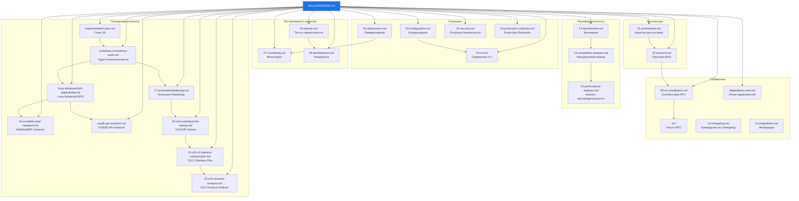

# Документация GoBFD


> Русский перевод каноничной технической документации **GoBFD** -- production-oriented демона протокола BFD (RFC 5880/5881) на Go 1.26.

---

## Карта документации


```mermaid
graph TD
    IDX["docs/ru/README.md<br/>"]

    subgraph "Архитектура"
        A1["01-architecture.md<br/>Архитектура системы"]
        A2["02-protocol.md<br/>Протокол BFD"]
    end

    subgraph "Операции"
        B1["03-configuration.md<br/>Конфигурация"]
        B2["04-cli.md<br/>Справочник CLI"]
        B3["06-deployment.md<br/>Развёртывание"]
        B4["15-security.md<br/>Политика безопасности"]
        B5["16-production-runbooks.md<br/>Production Runbooks"]
    end

    subgraph "Тестирование и качество"
        C1["05-interop.md<br/>Тесты совместимости"]
        C2["07-monitoring.md<br/>Мониторинг"]
        C3["09-development.md<br/>Разработка"]
    end

    subgraph "Производительность"
        E1["12-benchmarks.md<br/>Бенчмарки"]
        E2["13-competitive-analysis.md<br/>Конкурентный анализ"]
        E3["14-performance-analysis.md<br/>Анализ производительности"]
    end

    subgraph "Справочник"
        D1["08-rfc-compliance.md<br/>Соответствие RFC"]
        D2["rfc/<br/>Тексты RFC"]
        D3["10-changelog.md<br/>Руководство по Changelog"]
        D4["11-integrations.md<br/>Интеграции"]
        D5["dependency-risk.md<br/>Риски зависимостей"]
    end

    subgraph "Планирование релиза"
        F1["implementation-plan.md<br/>План S8"]
        F2["codebase-consistency-audit.md<br/>Аудит консистентности"]
        F3["linux-advanced-bfd-applicability.md<br/>Linux Advanced BFD"]
        F4["linux-netlink-ebpf-research.md<br/>Netlink/eBPF research"]
        F5["ovsdb-api-research.md<br/>OVSDB API research"]
        F6["17-scorecard-hardening.md<br/>Scorecard Hardening"]
        F7["18-s10-extended-e2e-interop.md<br/>S10 E2E Interop"]
        F8["19-s10-s1-harness-contract-plan.md<br/>S10.1 Harness Plan"]
        F9["20-s10-closeout-analysis.md<br/>S10 Closeout Analysis"]
    end

    IDX --> A1
    IDX --> A2
    IDX --> B1
    IDX --> B2
    IDX --> B3
    IDX --> B4
    IDX --> B5
    IDX --> C1
    IDX --> C2
    IDX --> C3
    IDX --> D1
    IDX --> D5
    IDX --> E1
    IDX --> F1
    IDX --> F2
    IDX --> F3
    IDX --> F4
    IDX --> F5
    IDX --> F6
    IDX --> F7
    IDX --> F8
    IDX --> F9

    A1 --> A2
    A2 --> D1
    B1 --> B2
    B3 --> C2
    C1 --> C3
    D1 --> D2
    E1 --> E2
    E2 --> E3
    F1 --> F2
    F2 --> F3
    F3 --> F4
    F3 --> F5
    F2 --> F6
    F6 --> F7
    F7 --> F8
    F8 --> F9

    style IDX fill:#1a73e8,color:#fff
```

---

## Содержание

### Архитектура

| # | Документ | Описание |
|---|---|---|
| 01 | [**Архитектура**](./01-architecture.md) | Архитектура системы, диаграмма пакетов, путь пакета, дизайн FSM |
| 02 | [**Протокол BFD**](./02-protocol.md) | FSM, таймеры, джиттер, формат пакета, аутентификация (RFC 5880) |

### Операции

| # | Документ | Описание |
|---|---|---|
| 03 | [**Конфигурация**](./03-configuration.md) | Справочник YAML-конфига, переменные окружения, горячая перезагрузка |
| 04 | [**Справочник CLI**](./04-cli.md) | Команды gobfdctl, интерактивная оболочка, форматы вывода |
| 05 | [**Тесты совместимости**](./05-interop.md) | Наборы тестов: 4-пировый, BGP+BFD, RFC-специфичный, вендорные NOS |
| 06 | [**Развёртывание**](./06-deployment.md) | systemd, Podman Compose, контейнерный образ, production |
| 07 | [**Мониторинг**](./07-monitoring.md) | Метрики Prometheus, дашборд Grafana, алертинг |
| 15 | [**Политика безопасности**](./15-security.md) | Production policy для API, GoBGP, BFD auth, контейнеров и vulnerability gate |
| 16 | [**Production Runbooks**](./16-production-runbooks.md) | Kubernetes, BGP, Prometheus, packet verification и failure drills |

### Справочник

| # | Документ | Описание |
|---|---|---|
| 08 | [**Соответствие RFC**](./08-rfc-compliance.md) | Матрица соответствия RFC, заметки по реализации |
| 09 | [**Разработка**](./09-development.md) | Рабочий процесс, Make-цели, тестирование, линтинг |
| 10 | [**Руководство по Changelog**](./10-changelog.md) | Ведение CHANGELOG.md, процесс релиза, семантическое версионирование |
| 11 | [**Интеграции**](./11-integrations.md) | BGP failover, HAProxy, наблюдаемость, ExaBGP, Kubernetes |
| -- | [**Риски зависимостей**](./dependency-risk.md) | Текущие риски зависимостей и меры снижения |

### Производительность

| # | Документ | Описание |
|---|---|---|
| 12 | [**Бенчмарки**](./12-benchmarks.md) | Как запускать, читать и интерпретировать результаты бенчмарков |
| 13 | [**Конкурентный анализ**](./13-competitive-analysis.md) | Сравнение с FRR, BIRD, aiobfd, аппаратными платформами |
| 14 | [**Анализ производительности**](./14-performance-analysis.md) | GoBFD vs реализации на C: бенчмарки, архитектура, поведение при нагрузке |

### Планирование релиза и исследования

| Документ | Описание |
|---|---|
| [**План реализации**](./implementation-plan.md) | Каноничный поэтапный план спринтов до `v0.5.2` |
| [**Аудит консистентности кодовой базы**](./codebase-consistency-audit.md) | Аудит кода, API, CLI, конфигурации, документации и production-применимости |
| [**Применимость Linux Advanced BFD**](./linux-advanced-bfd-applicability.md) | Применимость Micro-BFD, VXLAN BFD и Geneve BFD в Linux |
| [**Исследование Linux Netlink/eBPF**](./linux-netlink-ebpf-research.md) | Decision record S4 по rtnetlink и eBPF для мониторинга состояния интерфейсов |
| [**Исследование OVSDB API**](./ovsdb-api-research.md) | Заметки по OVSDB JSON-RPC и backend на `libovsdb` |
| [**OpenSSF Scorecard Hardening**](./17-scorecard-hardening.md) | План S9 по повышению Scorecard с одним maintainer |
| [**S10 Extended E2E и Interoperability**](./18-s10-extended-e2e-interop.md) | План S10 для E2E, interop, Linux dataplane, overlay и vendor profiles |
| [**S10.1 Harness Inventory and Contract Plan**](./19-s10-s1-harness-contract-plan.md) | Подробный план S10.1 для E2E harness contract |
| [**S10 Closeout Analysis**](./20-s10-closeout-analysis.md) | Завершение S10, оставшаяся работа и backlog кандидатов следующего спринта |

### Исходные тексты RFC

| Файл | RFC | Название |
|---|---|---|
| [rfc5880.txt](../rfc/rfc5880.txt) | RFC 5880 | Bidirectional Forwarding Detection (BFD) |
| [rfc5881.txt](../rfc/rfc5881.txt) | RFC 5881 | BFD for IPv4 and IPv6 (Single Hop) |
| [rfc5882.txt](../rfc/rfc5882.txt) | RFC 5882 | Generic Application of BFD |
| [rfc5883.txt](../rfc/rfc5883.txt) | RFC 5883 | BFD for Multihop Paths |
| [rfc5884.txt](../rfc/rfc5884.txt) | RFC 5884 | BFD for MPLS Label Switched Paths |
| [rfc5885.txt](../rfc/rfc5885.txt) | RFC 5885 | BFD for PW VCCV |
| [rfc7130.txt](../rfc/rfc7130.txt) | RFC 7130 | Bidirectional Forwarding Detection (BFD) on LAG |
| [rfc7419.txt](../rfc/rfc7419.txt) | RFC 7419 | Common Interval Support |
| [rfc9384.txt](../rfc/rfc9384.txt) | RFC 9384 | BGP Cease Notification Subcode for BFD |
| [rfc9468.txt](../rfc/rfc9468.txt) | RFC 9468 | Unsolicited BFD for Sessionless Applications |
| [rfc9747.txt](../rfc/rfc9747.txt) | RFC 9747 | Unaffiliated BFD Echo |
| [rfc8971.txt](../rfc/rfc8971.txt) | RFC 8971 | BFD for VXLAN |
| [rfc9521.txt](../rfc/rfc9521.txt) | RFC 9521 | BFD for Geneve |
| [rfc9764.txt](../rfc/rfc9764.txt) | RFC 9764 | BFD Encapsulated in Large Packets |

---

## Быстрый старт

```bash
# Клонирование и сборка
git clone https://github.com/dantte-lp/gobfd.git && cd gobfd
make build

# Запуск тестов
make test

# Запуск среды разработки
make up
```

См. [06-deployment.md](./06-deployment.md) для развёртывания в production и [09-development.md](./09-development.md) для полного рабочего процесса разработки.

---

*Последнее обновление: 2026-05-01*
