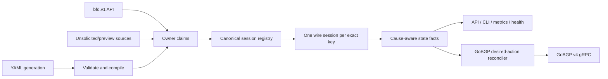

# GoBFD v1.0 Production Contract Design

**Status:** Approved direction; implementation not started

**Compatibility decision:** preserve `bfd.v1` and the current YAML schema;
evolve them additively

**GoBGP target:** prereleases develop against v4.8.0; stable v1 uses the first
compatible v4 release that fixes `GO-2026-4736`

## Product contract

GoBFD v1 is a standalone BFD daemon with a stable asynchronous BFD core,
secure local-first management, ownership-safe desired-state reconciliation,
observable external actuation, and reproducible interop evidence. It is not a
BGP speaker, CNI, Kubernetes controller, RIB, FIB, or route owner.

The v1 release does not treat existing code as proof of protocol compliance.
Every stable capability needs normative packet tests and current FRR/BIRD
interop. Features that do not meet their gate remain explicitly preview and
default-off even if their API messages already exist.

## Compatibility rules

- Existing `bfd.v1` messages and field numbers remain decodable.
- Existing YAML keys remain recognized. Deprecated unsafe values return a
  precise validation error instead of failing later at runtime.
- New fields and RPCs are additive. Older clients continue to use Add, Delete,
  Get, List, and Watch.
- `withdraw-routes` remains recognized for migration diagnostics but is
  rejected as unsupported. It does not become part of the v1 contract.
- GoBGP integration moves to the v4 API. Prereleases use v4.8.0; stable v1 uses
  the selected fixed compatible v4. Users requiring GoBGP v3.37.0 remain on
  the maintained v0.6.x line; the v1 binary does not carry two generated
  GoBGP APIs.
- Operational defaults may become safer: management binds to loopback, remote
  plaintext management fails closed, and incomplete extensions are preview.

## Stable and preview capabilities

| Capability | v1 status | Release condition |
|---|---|---|
| RFC 5880 asynchronous core | stable | Poll/Final, timers, auth, diagnostics, demux, and AdminDown gates pass |
| RFC 5881 numbered multiaccess single-hop | stable | IPv4/IPv6, ports, source binding, and TTL tests pass |
| RFC 7419 common intervals | stable | existing unit tests plus FRR/BIRD timer interop pass |
| RFC 5883 multihop | stable, scoped | configurable hop/security policy and 1/2/5-hop tests pass |
| Passive configured role | stable vendor mode for multihop only | active/passive FRR/BIRD tests pass; excluded from RFC 5881 claims |
| RFC 9764 large packets | stable only with cross-feature gate | authenticated and unauthenticated padded packets pass |
| RFC 9468 unsolicited BFD | preview until graduated | real interface-subnet validation and cleanup gates pass |
| RFC 9747 unaffiliated echo | preview until graduated | RFC 5880 FSM/demux/auth model and packet tests pass |
| RFC 7130 Micro-BFD | experimental | member-interface and L2 multicast requirements pass |
| RFC 8971 VXLAN BFD | experimental | mandatory inner packet and VNI demux validation passes |
| RFC 9521 Geneve BFD | experimental | VAP/VNI/inner validation and multi-VNI runtime pass |
| RFC 9384 Cease/10 | not implemented | upstream GoBGP exposes the required wire subcode |

Local Demand mode, affiliated echo, S-BFD, P2MP BFD, MPLS/PW BFD, and generic
graceful-restart automation are outside the v1 stable contract.

## Architecture



The design separates desired ownership, wire-session execution, observed
facts, and external actions. A reload cannot delete an API-created session;
a dropped event cannot permanently lose a required GoBGP action.

## Canonical identity and ownership

The current key `(peer, local, interface)` is insufficient. The v1 canonical
key contains:

```text
SessionKey{type, address_family, peer, local, interface, network_scope,
transport_scope}
```

`network_scope` identifies the process network namespace in v1. Multi-VRF
management inside one process is deferred. Two processes in different
namespaces may use the same addresses independently.

`transport_scope` is an exact typed value: empty for base BFD, the member
interface for Micro-BFD, or the encapsulation owner/backend plus VNI/VAP tuple
for VXLAN and Geneve. It is never a wildcard. Sessions with identical outer
addresses but different backend, VNI, or VAP are distinct.

Session sources create owner claims rather than physical sessions. Owner IDs
include `config`, `api:<principal>`, `unsolicited`, `micro:<group>`,
`vxlan:<name>`, and `geneve:<name>`. Matching claims with identical effective
parameters share one discriminator and wire session. Conflicting parameters
return a deterministic error; “first requester wins” is forbidden. Releasing
the last claim sends AdminDown and destroys the wire session.

Status exposes configured values, effective values, owner sources, desired
generation, applied generation, and pending or failed state. User-supplied API
owner strings are not trusted as authorization identities. The server derives
a stable transport principal: the shared `api:local` trust domain for default
unauthenticated loopback TCP, peer UID for a Unix socket, or configured
SAN/SPIFFE identity for mTLS. Claims survive a reconnect by the same principal;
a connection instance is never an owner and one principal cannot release
another principal's claims.

## Configuration and reconciliation

Reload has two phases:

1. Parse, validate, resolve profiles, and compile the complete candidate with
   no runtime mutation.
2. Publish a desired generation and reconcile only claims owned by that
   source.

An empty `sessions` set releases all `config` claims and nothing else. Missing
interfaces produce `pending`, followed by automatic activation when the
resource appears. Invalid candidates leave the previous desired generation
unchanged.

Global socket and kernel operations cannot be made transactionally atomic.
The contract is therefore explicit: validation is atomic, claim reconciliation
is deterministic, running last-known-good sessions remain active where safe,
and every apply returns a receipt with `created`, `updated`, `released`,
`pending`, and `failed`. A partial apply is visible as stale readiness and is
never logged as success.

Named profiles are additive YAML/API objects with presence-aware fields.
Explicit `false`, zero-like defaults, and inheritance remain distinguishable.
Change handling is field-specific:

- desired TX and required RX intervals use Poll/Final and preserve the wire
  session;
- minimum TTL applies in place at a defined received-packet boundary. Detect
  multiplier does so outside remote Demand mode; while remote Demand is active,
  it changes through a Poll Sequence because the next Control packet changes;
- receive-key overlap and selected transmit key use a dedicated keychain
  transition;
- authentication enable or disable requires an explicit synchronized
  transition and is rejected as an ordinary hot reload;
- role, address, interface, type, network scope, and transport scope replace
  the claim through controlled session teardown and creation.

Only Poll-class changes promise an unchanged discriminator and uninterrupted
Up state.

## RFC core corrections

The stable core requires these corrections before v1:

- initiate Poll sequences for local timer changes and the slow-to-fast
  transition; when Poll sequences cross, suspend the local Poll response,
  transmit only `P=0,F=1`, then resume queued local changes; no packet may set
  both `P=1` and `F=1`;
- recalculate the TX timer when remote `Required Min RX` changes and send an
  immediate control packet when the RFC requires it;
- order diagnostic updates before logs, notifications, metrics, and immediate
  packets so consumers receive the causal diagnostic;
- reset `RemoteDiscr` and authentication receive state on every required
  timeout path;
- preserve a pending Final until transmission succeeds or the session ends;
- keep the stable RFC 5881 scope explicitly limited to numbered multiaccess
  interfaces; point-to-point source-independent initial demux is deferred;
- verify authenticated RFC 9764 padding over the correct BFD PDU length;
- retry AdminDown transmission until it succeeds or the shutdown deadline
  expires, then keep the socket available for
  `min(Detection Time, remaining shutdown deadline)` before closing it;
- when both systems are Up and the peer sets Demand mode, suppress periodic
  control packets and perform the required Poll behavior; GoBFD never sets its
  local Demand bit, and local Demand mode remains unsupported.

RFC source files under `docs/rfc/` match the RFC Editor byte-for-byte. The
compliance matrix is generated from passing capability gates, not from file or
type presence.

## Bounded routing dampening

Existing dampening YAML keys remain recognized, but dampening never hides BFD
facts or the first qualifying Down action. Every state transition is published
immediately, and a first Down immediately disables a managed peer. After the
configured `suppress_threshold` is crossed, dampening may hold only a recovery
enable and redundant actuator calls while the peer remains disabled. Penalty
decays using `half_life`; recovery is released below `reuse_threshold` or at
`max_suppress_time`, at which point the reconciler applies the current desired
state regardless of the remaining penalty. A new Down while recovery is held
cancels that recovery and retains the disabled state.

This is bounded routing-action hysteresis, not RFC 5882 packet suppression.
Status and metrics expose the penalty, suppression state, held desired action,
and deadline. Invalid or zero bounds fail candidate validation rather than
creating indefinite suppression.

## Cause-aware events and routing consumers

`StateChange` gains additive observed fields:

- remote state and diagnostic;
- local and remote C-bit;
- cause: `remote_admin_down`, `remote_down`, `detection_timeout`,
  `local_admin`, `path_down`, or `configuration`;
- desired and applied generation.

The default GoBGP policy is:

| Cause | BFD result | GoBGP action |
|---|---|---|
| remote AdminDown | Down | none |
| local AdminDown | AdminDown | none |
| detection timeout | Down | disable managed peer |
| remote ordinary Down | Down | disable managed peer |
| local path down | Down | disable managed peer |
| recovery to Up | Up | enable only if GoBFD owns the matching disable |

This matches the independently verified FRR and BIRD distinction between
remote administrative shutdown and forwarding failure. Full C-bit/graceful-
restart policy remains deferred; v1 stores and reports both C-bits and declares
the default `hard-fail` capability.

## GoBGP v4 actuator

The GoBGP client initially builds against v4.8.0. Because the public API does
not expose a reliable semantic version and the server does not enable gRPC
reflection, startup performs side-effect-free calls to every required v4 RPC
and rejects `Unimplemented` or incompatible responses. Configuration carries
an operator-declared expected major version. Immutable interop environments
assert the exact GoBGP binary version independently. Outbound TLS supports CA,
server name, client certificate, and client key.

The actuator reconciles per-peer desired and applied state. RPC failures retry
with bounded exponential backoff and jitter. Duplicate or out-of-order BFD
events are harmless because current desired state wins. A successful disable
creates an ownership receipt valid only in the current process epoch. GoBFD
never enables a peer that it did not disable. After restart, it does not
auto-enable any disabled peer because GoBGP cannot prove who last changed that
state. An optional one-shot adoption operation is explicit, authenticated,
audited, and disabled by default; persisted receipts alone grant no authority.
Every actuation request carries one validated, non-empty canonical peer address;
GoBFD never uses GoBGP's empty-address all-peers behavior.

GoBGP native BFD and external GoBFD must not own the same peer or UDP/3784 in
one network namespace. Startup preflight rejects a managed peer with native
BFD enabled and rejects unavailable BFD port ownership with an actionable
error.

GoBGP v4.8.0 is affected by `GO-2026-4736` and upstream publishes no fixed
release at the design date. Alpha, beta, and RC validation may carry the same
exact time-bounded exception as v0.6.2. Stable v1.0.0 is blocked until a
compatible GoBGP v4 release no longer reports the advisory. Renewing or
broadening the exception requires a separate explicit maintainer decision.

## Companion binaries

All four shipped binaries remain in the v1 release. `gobfdctl` is a stable
management client for the additive `bfd.v1` API. `gobfd-haproxy-agent` remains
a stable HAProxy agent-check adapter and must preserve its TCP response and
fail-closed disconnect behavior. `gobfd-exabgp-bridge` remains a stable ExaBGP
process-API adapter and must preserve announce/withdraw output while consuming
the additive state stream. Neither adapter receives independent session or
route ownership; both are projections of daemon facts. Each has unit tests,
version/help smoke tests, a lost-Watch/reconnect test using generation gaps,
and its existing pinned integration topology as a v1 release gate.

## Management security

- The control API defaults to loopback TCP. Anonymous reads are allowed there;
  mutations share the explicit `api:local` trust domain unless stronger
  authentication is configured. Unix sockets map mutation ownership to peer
  UID for same-host deployments.
- Non-loopback management requires TLS and authenticated mutation; mTLS maps
  configured SAN/SPIFFE identities to read-only or mutating roles and stable
  owner principals.
- Debug and flight-recorder endpoints are disabled by default and share the
  authenticated management boundary when enabled.
- CLI and YAML support protected secret files. Passing authentication secrets
  in argv is deprecated and produces a warning during the v1 transition.
- Logs, status, traces, metrics, and apply receipts never expose key material.
- Kubernetes packaging mounts configuration read-only and uses only the
  capabilities demonstrated by tests.

## Status, metrics, and health

API, CLI, Prometheus, and logs derive from the same operational snapshot.
Existing fields such as dropped packets and authentication failures are either
populated or explicitly unavailable; zero values are never fabricated.

The v1 status model includes current state, local/remote diagnostics, role,
session type, minimum TTL, configured/effective timers, discriminators, C-bits,
owners, last transition, current desired/applied GoBGP action, retry state,
config generation, and stale or pending reason.

Liveness means that the process event loop and listeners are responsive; it
does not depend on peers. Default readiness means listeners are active and the
latest configuration generation has no failed reconciliation. Optional
policies may require any, all, or named critical sessions to be Up.

Metrics include current session state, transitions, packet and validation
drops, authentication failures, config generation/staleness, reconciliation
results, action retries/failures, and dropped subscriber events. Labels use
bounded dimensions; free-form errors and secrets never become labels.

## Execution and scale contract

Permanent `runtime.LockOSThread` per control or echo session is removed. v1
retains goroutine-per-session scheduling unless measurements require a sharded
timer loop. This is smaller and safer than rewriting the engine around an FRR
or BIRD-style C event loop.

The supported v1 envelope is qualified on a reference runner with 8 vCPU,
8 GiB RAM, `GOMAXPROCS=8`, and Go 1.26.6. It runs 1,000 mixed IPv4/IPv6 Up
sessions for 24 hours at 100 ms TX/RX and multiplier 3, with background CPU
load held at 80%, deterministic 0.1% random packet loss, and one intentional
one-second blackhole every 30 minutes. Only intentional blackholes may cause a
Down transition.

The pass thresholds are p99 TX lateness at most 25 ms, p99.9 at most 50 ms,
p99 detection no later than negotiated Detection Time plus 25 ms, and p99.9 no
later than plus 50 ms. Resource bounds, measured against the settled baseline,
are OS threads no more than `2*GOMAXPROCS+32`, file descriptors no more than
`2*sessions+256`, goroutines no more than `3*sessions+256`, RSS no more than
512 MiB, and less than 5% RSS growth between the first and final six-hour
windows. No authoritative session or actuator event may be lost; a slow Watch
subscriber receives an explicit generation-gap signal.

A 5,000-session, 300 ms, 30-minute test with the same observability is an
engineering gate, not a support promise. No 10,000-session claim is published
without separate evidence.

## Independent RFC, FRR, and BIRD cross-check

| Reference | Independent finding | v1 decision |
|---|---|---|
| RFC 5880 | Poll initiation and several timer/discriminator paths are incomplete | stable core gate before operational work |
| RFC 5881 | p2p initial demux cannot rely on source address | stable scope is numbered multiaccess; p2p remains deferred |
| RFC 5882 | dampening may suppress failure indefinitely; AdminDown is not failure | replace suppression with bounded hysteresis and cause-aware actions |
| RFC 5883 | `TTL >= 254` is not a protocol requirement | add configurable hop/security policy |
| RFC 9384 | communication text is not wire Cease/10 | mark not implemented |
| RFC 9468 | allowed-prefix ACL is not interface-subnet validation | keep preview until validated |
| RFC 9747 | current two-state echo FSM conflicts with the required base FSM | keep preview until replaced |
| RFC 7130 | member interface and multicast L2 requirements are incomplete | experimental |
| RFC 8971/9521 | mandatory inner validation and VNI/VAP demux are incomplete | experimental |
| RFC 9764 | authenticated padding uses inconsistent hashed length | fix before stable graduation |
| FRR 10.7.0 | shared sessions, owner refcounts, profiles, cause-aware BGP, status | adopt concepts, not FRR wildcard keys or JSON schema |
| BIRD 3.3.2 | request-owned shared sessions, Poll sequencing, bounded event loop | adopt concepts, not first-requester parameters or broad jitter |

## Release sequence

### v1.0.0-alpha.1 — contract and RFC core

- Correct public compliance and performance claims.
- Introduce canonical keys, owner claims, additive status fields, and config
  generations.
- Fix Poll/Final, timer updates, diagnostic ordering, and core demux paths.
- Remove permanent OS-thread pinning.

### v1.0.0-beta.1 — operations and GoBGP v4

- Add owner-scoped reconciliation, profiles, pending resources, and apply
  receipts.
- Migrate to the GoBGP v4 API, initially v4.8.0, with mTLS, retries, ownership
  receipts, and native BFD conflict checks.
- Secure management defaults and secret-file inputs.

### v1.0.0-rc.1 — evidence and packaging

- Complete status, metrics, health, shutdown, and Kubernetes packaging.
- Run the pinned FRR 10.7.0, BIRD 3.3.2, selected fixed GoBGP v4, and v4.8.0
  regression matrices.
- Complete the 24-hour scale qualification, failure drills, upgrade/rollback
  documentation, signed artifacts, provenance, and SBOM.

`v1.0.0` contains no known release-blocking RFC, ownership, security, or
actuation defect from these gates and uses a compatible GoBGP v4 release that
does not report `GO-2026-4736`.

## Acceptance gates

### Protocol

- Packet tests cover every stable RFC MUST/SHOULD decision and verified RFC
  5880 authentication errata.
- Poll/Final tests cover 300→100 ms and 100→500 ms, crossed Poll sequences,
  queued local changes, loss and retry, non-responsive peers, unchanged
  discriminator, and no Up-state flap. Every crossed-Poll response is
  `P=0,F=1`, no packet is `P=1,F=1`, and the local Poll resumes and completes.
- Detect-multiplier changes outside remote Demand apply at the defined packet
  boundary; the same change under remote Demand completes through Poll/Final.
- Negative tests cover wrong TTL, source, interface, discriminator, port,
  length, auth type, key, digest, replay window, and padded auth.
- SIGTERM retries AdminDown until a confirmed send or deadline and keeps the
  socket open for the specified bounded drain; SIGKILL produces a detection
  timeout.

### Ownership and reload

- Config and two API owners share one matching wire session.
- Releasing one owner preserves the session; releasing the last sends
  AdminDown and removes it.
- Empty YAML removes only config-owned sessions.
- Invalid candidates mutate nothing; unavailable resources become pending;
  conflicts return deterministic errors.
- Reconnect by the same API principal preserves its claims; a different
  principal cannot modify them. Default loopback mutations share only the
  documented `api:local` trust domain.
- Equal outer addresses with different backend, VNI, or VAP create distinct
  sessions and never alias in lookup or cleanup.
- Timer-only profile changes preserve the discriminator and Up state. Identity
  or role changes replace the session. Authentication enable/disable requires
  the explicit synchronized operation, while overlapping receive keys and a
  selected transmit-key roll complete without a flap.

### Routing

- FRR 10.7.0 and BIRD 3.3.2 remote AdminDown leave BGP Established and retain
  routes; real loss disables the managed GoBGP peer within the detection bound.
- GoBGP v4 RPC outage recovers through reconciliation without a new BFD event.
- Mock servers returning `Unimplemented` or incompatible responses make
  preflight fail before actuator workers start. Against a populated v4.8
  regression server, failed preflight leaves every peer byte-for-byte in its
  prior administrative state; no empty-address or bulk actuation RPC is sent.
- Operator-disabled peers are never enabled by GoBFD.
- Disable by GoBFD, followed by an operator disable and process restart,
  remains disabled until an explicit authorized action; a stale receipt cannot
  enable it.
- Native GoBGP BFD conflict is rejected before actuation.
- A short flap publishes every fact and immediately disables on Down. Repeated
  flaps hold only recovery, a sustained Down is never suppressed, and recovery
  is reconciled by the reuse threshold or `max_suppress_time` deadline.

### Security

- Non-loopback plaintext management is rejected before serving an RPC; valid
  mTLS read-only and mutating identities receive only their configured roles.
- Unix-socket peer UID and mTLS SAN/SPIFFE identities produce stable, isolated
  owner principals across reconnects; unauthorized mutations and cross-owner
  release attempts fail closed and are audited.
- Loopback `api:local` behavior is explicit in status and cannot be confused
  with an authenticated identity.
- Test secrets and authentication keys never appear in logs, status, traces,
  metrics, error details, apply receipts, crash reports, or debug captures.
- Debug and flight-recorder endpoints are unreachable by default. When
  enabled, unauthenticated and read-only identities are denied while the
  configured debug role succeeds over the protected management boundary.
- Protected secret files load successfully with required ownership and mode;
  permissive files fail closed. An argv secret emits the documented migration
  warning without echoing the value.
- Shipped Kubernetes manifests mount configuration and secrets read-only, run
  as non-root where the socket model permits, drop all capabilities, and add
  only the individually tested network capabilities required by `gobfd`.

### Interop and scale

- Mandatory peers are FRR 10.7.0, BIRD 3.3.2, and the selected fixed GoBGP v4,
  pinned immutably and asserted from the binary inside the interop environment.
  FRR 10.2.5 and GoBGP v4.8.0 remain regression lanes.
- IPv4/IPv6 active single-hop and authenticated cases pass as the RFC 5881
  lane. Passive is tested only as a labelled multihop vendor mode, alongside
  active 1/2/5-hop cases, with preserved pcaps, logs, status, and metrics.
- `gobfdctl`, the HAProxy agent, and the ExaBGP bridge pass unit, version/help,
  generation-gap reconnect, and pinned integration compatibility gates.
- The 1,000-session qualification meets every numeric latency, loss, and
  resource threshold in the execution contract; the 5,000-session engineering
  gate completes without false flaps, event loss, or unbounded growth.
- `go test ./... -race -count=1`, lint, vulnerability, Buf breaking, benchmark,
  and documentation gates pass.

## Explicit deferrals

- CNI, IPAM, Kubernetes operator, CRDs, and native Cilium integration.
- BGP speaker, route reflector, RIB/FIB programming, and route ownership.
- Generic route withdrawal/restoration and `withdraw-routes`.
- GoBGP v3 support in the v1 binary.
- Full RFC 9384 Cease/10 until GoBGP exposes it.
- Generic graceful-restart or C-bit policy automation.
- Local Demand mode, affiliated echo, S-BFD, P2MP, MPLS/PW BFD.
- Stable Micro-BFD, VXLAN, and Geneve ownership until their RFC gates pass.
- Multi-VRF in one process, distributed dataplane, hardware offload,
  active/active clustering, and a 10,000-session support claim.
- OSPF, IS-IS, static-route, or arbitrary RIB actuation.

## Alternatives considered

1. **Additive `bfd.v1` and YAML evolution — selected.** Existing consumers keep
   decoding messages while new operational fields and RPCs are added. Safer
   defaults and fail-closed validation prevent compatibility from preserving
   known-bad behavior.
2. **Clean `bfd.v2` and YAML v2.** This gives a smaller schema but forces every
   current client and deployment to migrate before receiving v1 fixes.
3. **Parallel v1/v2 services.** This reduces immediate migration pressure but
   duplicates generated APIs, authorization, documentation, and tests without
   solving wire-session ownership.

## Primary references

- [RFC 5880 and verified errata](https://www.rfc-editor.org/errata/rfc5880)
- [RFC 5881](https://datatracker.ietf.org/doc/html/rfc5881)
- [RFC 5882](https://datatracker.ietf.org/doc/html/rfc5882)
- [RFC 5883](https://datatracker.ietf.org/doc/html/rfc5883)
- [RFC 9384](https://datatracker.ietf.org/doc/html/rfc9384)
- [RFC 9468](https://datatracker.ietf.org/doc/html/rfc9468)
- [RFC 9747](https://datatracker.ietf.org/doc/html/rfc9747)
- [FRR 10.7.0 BFD documentation](https://github.com/FRRouting/frr/blob/frr-10.7.0/doc/user/bfd.rst)
- [BIRD 3.3.2 BFD implementation](https://github.com/CZ-NIC/bird/tree/v3.3.2/proto/bfd)
- [GoBGP v4.8.0 BFD documentation](https://github.com/osrg/gobgp/blob/v4.8.0/docs/sources/bfd.md)
- [Cilium open-source BFD proposal](https://github.com/cilium/cilium/issues/22394)
