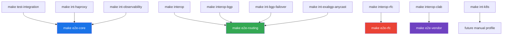

# S10 E2E Target Inventory

Current test and integration targets mapped to the S10 E2E evidence model.

---

## Inventory

| Current Target | S10 Target | Owner | Runtime | Network | Inputs | Outputs | Cleanup | Current Gap |
|---|---|---|---|---|---|---|---|---|
| `make test-integration` | `e2e-core` input | Go integration tests | Dev container | In-process HTTP/test server | Go test package `./test/integration` | Verbose Go test output | Go test cleanup | No daemon-to-daemon packet evidence. |
| `make interop` | `e2e-routing` input | BFD interop stack | Podman Compose | `172.20.0.0/24` | GoBFD, FRR, BIRD3, aiobfd, Thoro/bfd, tshark | Go test output, pcap in capture container | `down --volumes --remove-orphans` | Artifact export is not standardized. |
| `make interop-bgp` | `e2e-routing` input | BGP+BFD interop stack | Podman Compose | `172.21.0.0/24` | GoBFD, GoBGP, FRR, BIRD3, ExaBGP, tshark | Go test output, BGP/BFD state | `down --volumes --remove-orphans` | Duplicated Podman API helpers. |
| `make interop-rfc` | `e2e-rfc` input | RFC interop stack | Podman Compose | `172.22.0.0/24` | RFC 7419, 9384, 9468, 9747 scenarios | Go test output, pcap in capture container | `down --volumes --remove-orphans` | Runner invokes host `go test`. |
| `make interop-clab` | `e2e-vendor` input | Vendor NOS profile | Podman and containerlab | Containerlab topology | cEOS, SR Linux, XRd, SONiC-VS, VyOS, FRR where images exist | Go test output and vendor command output | containerlab destroy and Podman cleanup | Optional image/license skips need a standard summary. |
| `make int-bgp-failover` | `e2e-routing` optional input | Integration example | Podman Compose | Example-local network | GoBFD, GoBGP, FRR, tshark | CLI/BGP output, pcap | `down --volumes --remove-orphans` | Not aggregated into S10 reports. |
| `make int-haproxy` | `e2e-core` optional input | Integration example | Podman Compose | Example-local network | GoBFD, HAProxy, tshark | HAProxy and BFD output, pcap | `down --volumes --remove-orphans` | Not aggregated into S10 reports. |
| `make int-observability` | `e2e-core` optional input | Integration example | Podman Compose | Example-local network | GoBFD, Prometheus, Grafana, FRR, tshark | Metrics and pcap | `down --volumes --remove-orphans` | Not aggregated into S10 reports. |
| `make int-exabgp-anycast` | `e2e-routing` optional input | Integration example | Podman Compose | Example-local network | GoBFD, GoBGP, ExaBGP, tshark | RIB output and pcap | `down --volumes --remove-orphans` | Not aggregated into S10 reports. |
| `make int-k8s` | Future manual profile | Kubernetes integration | Podman image build and Kubernetes | Cluster-owned | GoBFD image and Kubernetes manifests | Kubernetes resources and logs | Cluster teardown script | Requires operator-owned cluster tooling. |

## S10 Mapping

## S10.1 Required Changes

| Item | Status |
|---|---|
| Worktree-safe dev Compose project | Required. |
| Fixed dev `container_name` removed | Required. |
| `make e2e-help` | Required. |
| Planned S10 targets fail closed | Required. |
| Standard artifact directory contract | Required. |
| Podman API helper extraction | Planned after S10.1. |
| Host `go test` removal from full-cycle runners | Planned after S10.1. |

---

*Last updated: 2026-05-01*
