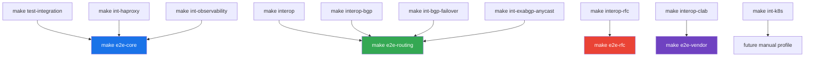

# S10 E2E Target Inventory

Current test and integration targets mapped to the S10 E2E evidence model.

---

## Inventory

| Current Target | S10 Target | Owner | Runtime | Network | Inputs | Outputs | Cleanup | Current Gap |
|---|---|---|---|---|---|---|---|---|
| `make e2e-core` | `e2e-core` | Core E2E stack | Podman Compose plus dev container Go test | `172.30.10.0/24` | GoBFD A/B, static simple-password auth, tshark | Go test JSON/log, container logs/state, metrics checks, pcapng, packet CSV, summary | `down --volumes --remove-orphans` | Implemented for core daemon. |
| `make test-integration` | `e2e-core` input | Go integration tests | Dev container | In-process HTTP/test server | Go test package `./test/integration` | Verbose Go test output | Go test cleanup | No daemon-to-daemon packet evidence. |
| `make e2e-routing` | `e2e-routing` | Routing E2E aggregate | Podman Compose plus dev container Go test | `172.20.0.0/24`, `172.21.0.0/24` | `test/interop`, `test/interop-bgp`, tshark | Aggregate Go test JSON/log, container logs/state, merged pcapng, packet CSV, suite artifacts | `down --volumes --remove-orphans` per suite | Implemented for existing routing interop suites; shared Podman API helper extraction remains planned. |
| `make interop` | `e2e-routing` input | BFD interop stack | Podman Compose | `172.20.0.0/24` | GoBFD, FRR, BIRD3, aiobfd, Thoro/bfd, tshark | Go test output, pcap in capture container | `down --volumes --remove-orphans` | Normalized by `make e2e-routing`. |
| `make interop-bgp` | `e2e-routing` input | BGP+BFD interop stack | Podman Compose | `172.21.0.0/24` | GoBFD, GoBGP, FRR, BIRD3, ExaBGP, tshark | Go test output, BGP/BFD state | `down --volumes --remove-orphans` | Normalized by `make e2e-routing`; duplicated Podman API helpers remain. |
| `make e2e-rfc` | `e2e-rfc` | RFC E2E aggregate | Podman Compose plus dev container Go test | `172.22.0.0/24` | RFC 7419, 9384, 9468, 9747 scenarios | Go test JSON/log, container logs/state, pcapng, packet CSV, summary | `down --volumes --remove-orphans` | Implemented for current RFC interop suite. |
| `make e2e-overlay` | `e2e-overlay` | Overlay boundary E2E | Dev container Go test | In-process packet builders | VXLAN, Geneve, reserved backend matrix | Go test JSON/log, container logs/state, packet evidence CSV, summary | Go test cleanup | Implemented for userspace packet shape and fail-closed backend validation. |
| `make e2e-linux` | `e2e-linux` | Linux dataplane ownership E2E | Compiled Go test binary in isolated Podman `--network none` container | Disposable container netns and fake sysfs | rtnetlink veth up/down, kernel-bond fake sysfs, OVS owner-policy guard, NetworkManager D-Bus owner-policy guard | Go test JSON/log, container logs/state, link event JSON, LAG backend JSON, summary | Container removal by runner cleanup | Implemented for isolated Linux ownership boundaries. |
| `make interop-rfc` | `e2e-rfc` input | RFC interop stack | Podman Compose | `172.22.0.0/24` | RFC 7419, 9384, 9468, 9747 scenarios | Go test output, pcap in capture container | `down --volumes --remove-orphans` | Normalized by `make e2e-rfc`. |
| `make interop-clab` | `e2e-vendor` input | Vendor NOS profile | Podman and containerlab | Containerlab topology | Primary cEOS, SR Linux, SONiC-VS, VyOS; baseline FRR; deferred XRd where images exist | Go test output and vendor command output | containerlab destroy and Podman cleanup | Manual topology execution remains image/license dependent. |
| `make e2e-vendor` | `e2e-vendor` | Vendor profile evidence | Podman Compose plus dev container Go test | Profile manifest and image cache | Primary Arista cEOS, Nokia SR Linux, SONiC-VS, VyOS; baseline FRR; deferred Cisco XRd | Go test JSON/log, container logs/state, vendor profiles, image availability, skip summary | Go test cleanup | Implemented as skip-aware evidence; licensed or missing images are not false failures. |
| `make int-bgp-failover` | `e2e-routing` optional input | Integration example | Podman Compose | Example-local network | GoBFD, GoBGP, FRR, tshark | CLI/BGP output, pcap | `down --volumes --remove-orphans` | Not aggregated into S10 reports. |
| `make int-haproxy` | `e2e-core` optional input | Integration example | Podman Compose | Example-local network | GoBFD, HAProxy, tshark | HAProxy and BFD output, pcap | `down --volumes --remove-orphans` | Not aggregated into S10 reports. |
| `make int-observability` | `e2e-core` optional input | Integration example | Podman Compose | Example-local network | GoBFD, Prometheus, Grafana, FRR, tshark | Metrics and pcap | `down --volumes --remove-orphans` | Not aggregated into S10 reports. |
| `make int-exabgp-anycast` | `e2e-routing` optional input | Integration example | Podman Compose | Example-local network | GoBFD, GoBGP, ExaBGP, tshark | RIB output and pcap | `down --volumes --remove-orphans` | Not aggregated into S10 reports. |
| `make int-k8s` | Future manual profile | Kubernetes integration | Podman image build and Kubernetes | Cluster-owned | GoBFD image and Kubernetes manifests | Kubernetes resources and logs | Cluster teardown script | Requires operator-owned cluster tooling. |

## S10 Mapping

## S10 Status

| Item | Status |
|---|---|
| Worktree-safe dev Compose project | Implemented in S10.1. |
| Fixed dev `container_name` removed | Implemented in S10.1. |
| `make e2e-help` | Implemented in S10.1. |
| Non-implemented S10 targets fail closed | Implemented in S10.1; no S10.6 aggregate placeholder remains. |
| Standard artifact directory contract | Implemented in S10.1 and applied by `make e2e-core` in S10.2. |
| Core daemon E2E | Implemented in S10.2. |
| Routing interop aggregate | Implemented in S10.3. |
| RFC interop aggregate | Implemented in S10.4. |
| Overlay backend boundary checks | Implemented in S10.4. |
| Linux dataplane ownership checks | Implemented in S10.5. |
| Vendor optional profiles | Implemented in S10.6. |
| Podman API helper extraction | Planned after S10.3. |
| Host `go test` removal from full-cycle runners | Implemented for `e2e-core`, `e2e-routing`, `e2e-rfc`, `e2e-overlay`, `e2e-linux`, and `e2e-vendor`. |

---

*Last updated: 2026-05-01*
